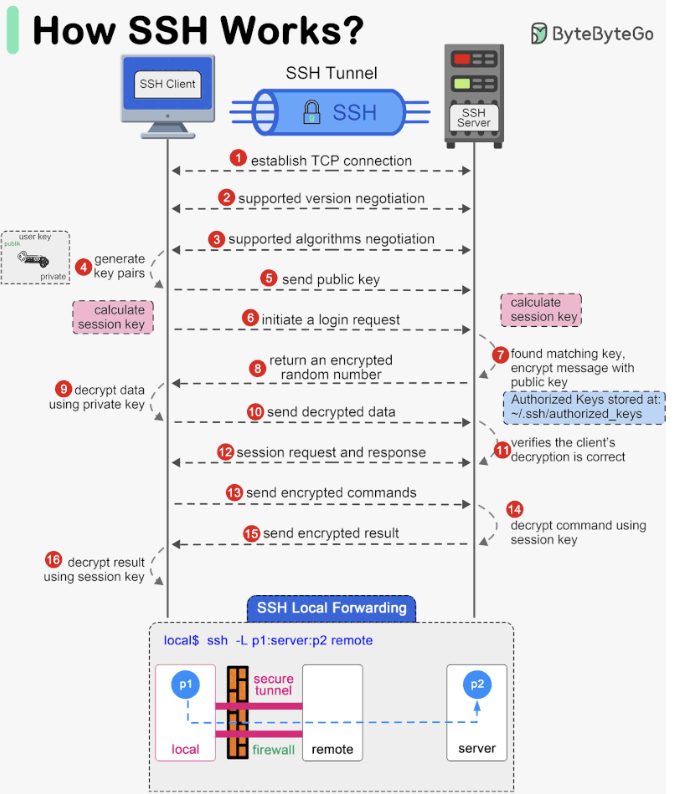

Hey everyone, and welcome back to the blog! In today's digitally connected world, the ability to securely access and manage remote servers is absolutely fundamental. Whether you're a developer deploying code, a system administrator troubleshooting an issue, or a data scientist running jobs on a powerful remote machine, you need a way to do so without prying eyes intercepting your commands or data.

The bedrock technology that enables this secure remote interaction is **SSH (Secure Shell)**. It's the unsung hero that replaced older, insecure protocols and has become the standard for encrypted network services. Let's take a closer look at what SSH is and the magic behind its secure tunnel.

## What is SSH (Secure Shell)? Your Encrypted Gateway

**SSH (Secure Shell)** is a cryptographic network protocol designed for operating network services securely over an unsecured network, such as the internet. Its primary purpose is to provide a **secure channel** for various operations, most notably:

* Remote command-line login (getting a shell on a remote machine).
* Remote command execution.
* Secure file transfer (via protocols like SFTP and SCP that run over SSH).

SSH operates on a **client-server architecture**. An SSH client application on your local machine connects to an SSH server program running on the remote machine, typically listening on **TCP port 22**.

The crucial problem SSH solved was the insecurity of older remote login protocols like Telnet, which transmitted all information, including passwords, in plaintext, making them highly vulnerable to eavesdropping. SSH ensures the **confidentiality and integrity** of data exchanged between the client and server.

## The Magic Behind the Secure Tunnel: How an SSH Connection is Established

Establishing a secure SSH session involves a sophisticated handshake and negotiation process between the client and the server. Here’s a step-by-step breakdown:

1. **Client Initiates Connection:**

   * You, using an SSH client (e.g., `ssh` command on Linux/macOS, PuTTY on Windows), initiate a connection to an SSH server by specifying its IP address or hostname. The client attempts to connect to the server on TCP port 22 by default.
2. **Version Exchange (Protocol Negotiation):**

   * Once the TCP connection is established, the client and server immediately exchange information about the SSH protocol versions they support (e.g., SSH-2.0). They agree on a common version to use for the session.
3. **Algorithm Negotiation (Agreeing on the "Cipher Suite"):**

   * This is a critical step where the client and server decide on the specific cryptographic algorithms they will use for the session. They exchange lists of supported algorithms for:
     * **Key Exchange Algorithms:** Methods for securely establishing a shared secret key (e.g., Diffie-Hellman variants like `diffie-hellman-group-exchange-sha256`).
     * **Public Key Algorithms (for Server Host Key):** The type of the server's long-term host key (e.g., RSA, ECDSA, EdDSA).
     * **Symmetric Encryption Ciphers:** Algorithms for encrypting the bulk data of the session once the shared secret is established (e.g., `aes256-ctr`, `chacha20-poly1305@openssh.com`).
     * **Message Authentication Code (MAC) Algorithms:** Algorithms for ensuring data integrity (e.g., `hmac-sha2-256`).
   * They negotiate and select a mutually supported algorithm for each category.
4. **Key Exchange (Establishing a Shared Secret Session Key):**

   * This phase uses the agreed-upon key exchange algorithm (typically a Diffie-Hellman variant) to allow the client and server to independently compute a shared secret key. This shared secret is then used to derive the symmetric encryption keys and MAC keys for the session. The beauty of Diffie-Hellman is that the shared secret is established without actually transmitting it over the network, making it secure against eavesdroppers.
   * **Server Host Key Verification:** As part of this process, the **server sends its host public key** to the client.
     * The SSH client checks this received host key against its local `known_hosts` file (usually in `~/.ssh/known_hosts`).
     * If the server's host key is already in `known_hosts` and matches, the server is considered authentic.
     * If it's the first time connecting to this server, or if the host key has changed (which could indicate a man-in-the-middle attack or a legitimate server re-key), the client will typically warn the user. The user must then manually verify the key's fingerprint before accepting and saving it. This step is crucial for preventing Man-in-the-Middle (MitM) attacks.
   * Once the host is verified (if needed) and the key exchange algorithm completes, both the client and server possess the same shared secret, which forms the basis for the session's encryption keys.
5. **User Authentication:**

   * Now that a secure, encrypted channel has been established using the session keys, the client needs to authenticate itself to the server to prove the user's identity. Common methods include:
     * **Password Authentication:** The user provides their password, which is sent over the now-encrypted channel to the server for verification.
     * **Public Key Authentication (Key-Based Authentication):** This is generally considered more secure. The user has an SSH key pair (a private key stored securely on their client machine and a corresponding public key that has been previously placed in an `authorized_keys` file on the server). The server sends a challenge to the client, which the client signs with its private key. The server then verifies this signature using the client's authorized public key.
     * Other methods like host-based authentication, GSSAPI/Kerberos, or keyboard-interactive can also be used.
6. **Secure Session Established:**

   * Once the user is successfully authenticated, the SSH session is fully established. All further communication (commands, output, file transfers) is encrypted using the agreed-upon symmetric cipher and protected for integrity using the MAC algorithm, both keyed with the session keys derived during the key exchange.

## Core Components of the SSH Protocol Suite

The SSH protocol is actually a suite of protocols, typically structured in layers:

1. **Transport Layer Protocol (SSH-TRANS):**
   * This layer provides initial server authentication, confidentiality (encryption for the data stream), and integrity (using MACs). It handles the version negotiation, algorithm negotiation, and the secure key exchange to establish session keys.
2. **User Authentication Protocol (SSH-AUTH):**
   * This protocol runs on top of the secure transport layer and is responsible for authenticating the client (user) to the server, using one of the methods described above (password, public key, etc.).
3. **Connection Protocol (SSH-CONN):**
   * This protocol runs over the authenticated transport layer. It defines how the single encrypted SSH tunnel can be multiplexed into multiple logical **channels**. Each channel represents a separate communication stream. This allows SSH to support various services concurrently over the one secure connection, such as:
     * An interactive shell session.
     * X11 forwarding (for running GUI applications remotely).
     * Port forwarding or tunneling (for securely tunneling other TCP/IP connections, like database access, through the SSH link).
     * SFTP sessions.

## Key Security Features of SSH

SSH provides a robust set of security features:

* **Confidentiality (Encryption):** All data transmitted during an SSH session (including passwords if used, commands, and output) is encrypted using strong symmetric encryption algorithms (like AES) with keys established during the secure handshake. This prevents eavesdroppers from reading the communication.
  * **Symmetric Encryption:** Uses the same key for both encryption and decryption. It's fast and suitable for bulk data. The session key in SSH is symmetric.
  * **Asymmetric Encryption (Public-Key Cryptography):** Uses a pair of keys (public and private). Used during the SSH handshake for server authentication (host key) and potentially for client authentication (user's key pair), and in the Diffie-Hellman key exchange to establish the shared symmetric session key.
* **Integrity (MACs):** Message Authentication Codes (MACs) are used to ensure that the data transmitted has not been accidentally or maliciously tampered with while in transit. Each message is sent with a MAC, which the receiver verifies.
* **Authentication:** SSH provides strong authentication mechanisms:
  * **Server Authentication:** The client authenticates the server using the server's host key to prevent connecting to an imposter (MitM attack).
  * **Client Authentication:** The server authenticates the client using methods like passwords or, more securely, public key cryptography.

## Common Use Cases for SSH

SSH is a versatile protocol with many applications:

* **Remote Command-Line Login:** This is the most well-known use case – securely accessing a shell (command-line interface) on a remote server.
* **Secure File Transfer:** Protocols like **SFTP (SSH File Transfer Protocol)** and **SCP (Secure Copy Protocol)** run over SSH to enable encrypted file transfers between machines.
* **Remote Command Execution:** Executing single commands on a remote server without initiating a full interactive shell session (e.g., `ssh user@host 'ls -l'`).
* **Port Forwarding (SSH Tunneling):** A powerful feature that allows you to securely tunnel TCP connections. For example:
  * **Local Port Forwarding:** Accessing a service on a remote private network (e.g., a database) as if it were running locally.
  * **Remote Port Forwarding:** Allowing a service on your local machine to be accessible from a remote server.
* **Git Operations:** Many developers interact with Git repositories (like GitHub or GitLab) securely using SSH keys for authentication (`git push`, `git pull`).
* **Automated Tasks:** Used in scripts and automation tools for secure interaction with remote systems.

## Key Takeaways

* SSH (Secure Shell) is a cryptographic network protocol essential for secure remote login, command execution, and data transfer over unsecured networks.
* It uses a client-server model, typically operating over TCP port 22.
* The connection setup involves version and algorithm negotiation, a secure key exchange (often Diffie-Hellman) to establish shared session keys, server host key verification to prevent MitM attacks, and robust user authentication.
* SSH provides confidentiality through strong symmetric encryption, integrity via MACs, and strong authentication for both server and client.
* Its layered protocol (Transport, Authentication, Connection) allows for multiplexing various services like shells, file transfers, and port forwarding over a single secure tunnel.

SSH is truly a cornerstone of modern network security and system administration, enabling us to manage and interact with remote systems with confidence.
