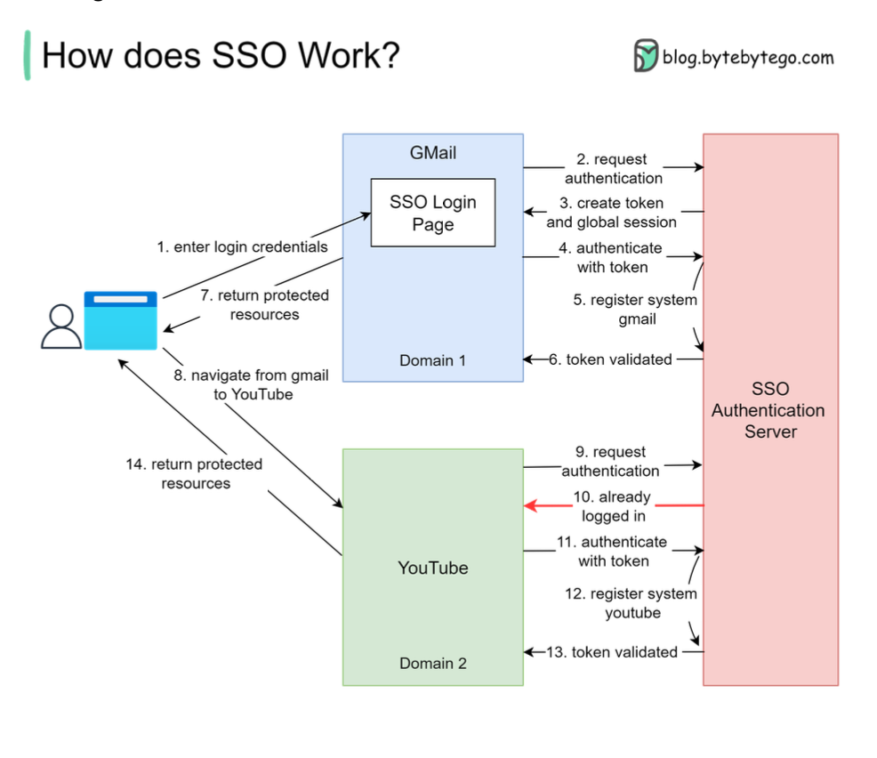

Hey everyone, and welcome back to the blog! How many passwords do you think you manage daily? Between work apps, social media, email, and various online services, it often feels like we need a dedicated password manager for our password managers! This "password fatigue" isn't just annoying; it can lead to weak password practices and security vulnerabilities. But what if I told you there's a way to unlock multiple doors with a single, well-guarded key? Enter **Single Sign-On (SSO)**!

A friend recently shared an irksome experience of being signed out from a number of daily-use websites, a tedious process familiar to many of us involving forgotten passwords and security questions. SSO is designed to remove this very inconvenience and streamline our digital lives. Let's explore what SSO is and how this piece of authentication magic works.

## What is Single Sign-On (SSO)?

At its core, Single Sign-On (SSO) is an authentication scheme. It allows a user to log in with a single ID and password to gain access to multiple independent software systems or applications without needing to re-enter credentials for each one. By using SSO, you can sign on only once and log in to multiple websites. It often uses a Central Authentication Service (CAS) to maintain this cross-site information.

Think of it as having an all-access pass at a theme park. You get authenticated once at the main gate, and then you can access all the rides and attractions without showing your ticket every single time.

## How Does SSO Actually Work? A Step-by-Step Journey

The magic of SSO typically involves a trusted third-party system known as an Identity Provider (IdP) that handles the authentication process, and Service Providers (SPs), which are the applications the user wants to access. Let's walk through a common scenario, similar to how you might access Gmail and then seamlessly navigate to YouTube, both Google services.

1. **The Initial Login Attempt (e.g., Accessing Gmail):**

   * Our user, let's call her Priya, tries to visit Gmail.
   * Gmail checks if Priya is already logged in. If not, Gmail redirects her to the SSO authentication server (the Identity Provider).
   * The SSO server also finds Priya isn't logged in, so it presents her with an SSO login page.
   * Priya enters her single set of login credentials (username and password).
2. **Authentication by the SSO Server & Token Generation:**

   * The SSO authentication server validates Priya's credentials.
   * Upon successful validation, the SSO server creates a global session for Priya and generates an authentication token (a piece of data that proves she's authenticated).
3. **Accessing the First Service (Gmail):**

   * The SSO server redirects Priya back to Gmail, along with the generated token.
   * Gmail then validates this token by communicating with the SSO authentication server.
   * The SSO server confirms the token's validity and registers that the "Gmail system" is now part of Priya's active session.
   * Gmail, now confident of Priya's identity, grants her access to her inbox.
4. **Navigating to Another Service (e.g., YouTube):**

   * Now, from within Gmail, Priya decides to navigate to YouTube.
   * YouTube, being another service federated with the same SSO system, checks if Priya is logged in.
   * Finding no local YouTube session, it redirects Priya to the SSO authentication server for authentication.
5. **Seamless Access to the Second Service:**

   * This time, the SSO authentication server sees that Priya *already has an active global session* (from her Gmail login).
   * It doesn't need to ask for her credentials again. It simply returns the existing authentication token (or a new one based on the existing session) to YouTube.
   * YouTube validates this token with the SSO server, just like Gmail did.
   * The SSO server confirms the token and registers the "YouTube system" as part of Priya's session.
   * YouTube grants Priya access, and she can start watching videos without having to log in again.

And voila! Priya has accessed two different applications using her credentials only once. The process is now complete for these services.

## Key Components in an SSO System

* **User:** The individual trying to access applications.
* **Service Provider (SP):** The application or website the user wants to access (e.g., Gmail, Salesforce, a company intranet).
* **Identity Provider (IdP):** The trusted system that manages user identities, authenticates users, and provides authentication assertions (like tokens) to Service Providers. This is the SSO authentication server in our example.
* **Authentication Token:** A piece of digital information that carries proof of authentication from the IdP to the SP.

## The Sweet Benefits of SSO

Why go through the trouble of setting up SSO? The advantages are quite compelling:

* **Improved User Experience:** This is a big one! Users only need to remember one strong password to access multiple applications, leading to faster logins and less frustration.
* **Enhanced Security:**
  * Reduces "password fatigue," which often leads users to create weak or reused passwords.
  * Allows for centralized implementation of stronger authentication policies (like multi-factor authentication, MFA) at the IdP level.
  * Simplifies the process of revoking access when an employee leaves.
* **Simplified Administration:** User access management becomes more streamlined as administrators can manage identities and permissions from a central point.
* **Increased Productivity:** Less time wasted by users trying to remember passwords or going through multiple login processes means more time for actual work.

## SSO and Related Technologies

SSO often works in conjunction with other standards and technologies like:

* **SAML (Security Assertion Markup Language):** A common XML-based standard for exchanging authentication and authorization data between an IdP and SPs.
* **OAuth 2.0:** While primarily an authorization framework (determining what an application can do on behalf of a user), OAuth 2.0 is frequently used in conjunction with SSO systems, especially for third-party application access. It can help facilitate Single Sign-On experiences.

## Key Takeaways

* SSO allows users to access multiple applications with a single set of credentials, enhancing convenience and security.
* It typically involves a user, service providers (the apps), and an identity provider (the SSO server) that handles authentication and issues tokens.
* The benefits include a better user experience, stronger security posture, and simplified user administration.

In our increasingly interconnected digital world, SSO is no longer a luxury but a fundamental component for efficient and secure access management.
