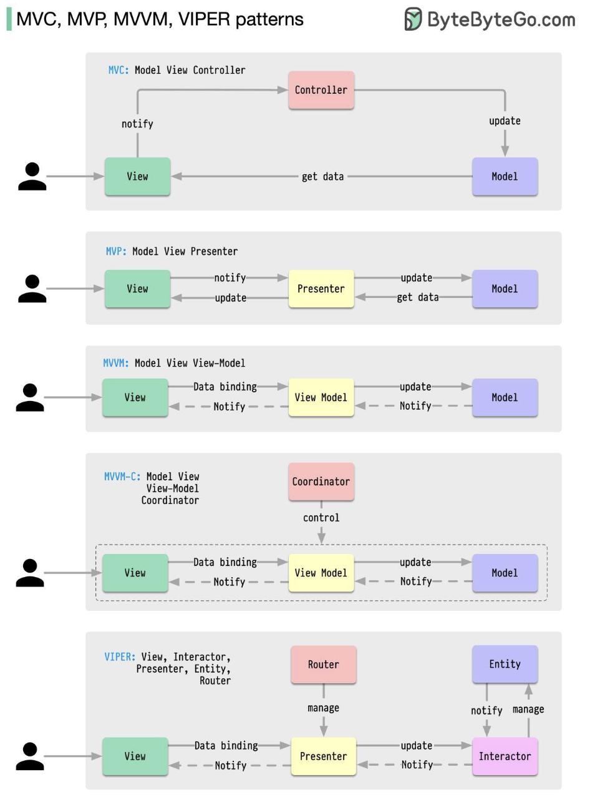

Hey everyone, and welcome back to the blog! If you've ever dived into application development, especially for mobile apps or for complex web frontends, you know that building a user interface (UI) that is both rich in features and easy to maintain can be a significant challenge. Without a good structure, UI code can quickly devolve into "spaghetti code"—a tangled mess where business logic, UI display, and user input handling are all mixed up. This makes testing a nightmare and adding new features a perilous journey.

To combat this, developers have introduced various **UI architectural patterns**. These patterns aim to bring order to the chaos by promoting a crucial principle: **Separation of Concerns (SoC)**. The idea is to divide the application's UI-related code into distinct components with clear responsibilities. Today, let's explore some of the most common and influential UI architectural patterns: MVC, MVP, MVVM, and VIPER.

## Why UI Architectural Patterns? The Quest for Order

The primary goal of UI architectural patterns is to make software easier to develop, test, and maintain. Developers introduced these patterns to overcome the limitations of earlier, less structured approaches and to make the "translator" components (those mediating between data and display) more maintainable.

At a high level, almost every pattern involves at least these core ideas:

* **Model (M):** Manages the application's data and business logic. It's the source of truth.
* **View (V):** Responsible for displaying the data from the Model to the user and for receiving user input. It's what the user sees and interacts with.

The differences largely lie in how these core components interact and what additional "translator" or intermediary components are introduced to manage that interaction.

---
## Exploring Key UI Architectural Patterns

Let's look at how each of these patterns approaches the separation of concerns.

### 1. MVC (Model-View-Controller): The Classic

* **Origin:** MVC is the oldest of these patterns, with its roots going back almost 50 years. It's a foundational pattern that has influenced many others.
* **Core Idea:** To separate the application's concerns into three interconnected components.
* **Components & Responsibilities:**
  * **Model:** Represents the application's data and core business logic. It's independent of the UI. When the Model's data changes, it might notify observers (often the View, sometimes via the Controller).
  * **View:** Responsible for rendering the Model's data into a user interface. It presents data to the user and sends user commands (like button clicks) to the Controller. In some classic MVC implementations, the View might directly observe the Model for changes.
  * **Controller:** Acts as an intermediary between the Model and the View. It receives user input from the View, processes it (which might involve updating the Model or retrieving data from it), and then selects an appropriate View to display the results.
* **Interactions (Typical Flow):**
  1. User interacts with the View.
  2. View notifies the Controller of the user action.
  3. Controller interacts with the Model (e.g., updates data, fetches data).
  4. Model might update (if state changes) and can notify interested Views (directly or via Controller).
  5. Controller selects the appropriate View and passes it the necessary data from the Model for display.
* **Pros:**
  * Good initial separation of concerns.
  * Multiple views can often be used with the same model.
* **Cons:**
  * The Controller can become a "Massive View Controller" or a "god object," taking on too many responsibilities and becoming bloated, especially in complex UIs.
  * The View might still have some direct awareness of the Model in certain MVC variants, leading to tighter coupling than desired.
  * Testability of the Controller can sometimes be challenging due to its ties with the UI framework.
* **Use Cases:** Web application frameworks (e.g., Ruby on Rails, Django, Spring MVC), desktop applications.

### 2. MVP (Model-View-Presenter): Enhancing Testability

MVP evolved from MVC to address some of its shortcomings, particularly regarding testability and the View-Model coupling. The image provided ("software-architectures.jpg") aptly describes MVP as a "derivative of the Model-View-Controller (MVC) pattern, which aims to separate the concerns of data management, user interface, and control flow".

* **Core Idea:** To make the View as passive as possible and move UI logic to the Presenter, decoupling the View from the Model.
* **Components & Responsibilities:**
  * **Model:** Same as in MVC – manages application data and business logic.
  * **View:** A passive interface that displays data passed to it by the Presenter and forwards user input events to the Presenter. The View typically holds a reference to its Presenter, often through an interface contract.
  * **Presenter:** Acts as the direct intermediary between the Model and the View. It retrieves data from the Model, formats it for display (ViewModel-like responsibilities), and then updates the View by calling methods on the View's interface. It also handles user input from the View. There is typically a one-to-one mapping between a View and its Presenter.
* **Interactions (Typical Flow):**
  1. User interacts with the View.
  2. View delegates the user action to its Presenter.
  3. Presenter interacts with the Model.
  4. Model returns data to the Presenter.
  5. Presenter formats the data and calls methods on the View interface to update the UI. The View simply updates itself as instructed.
* **Pros:**
  * **Excellent Testability:** The Presenter has no direct dependency on UI framework components (it interacts with the View via an interface), making it easy to unit test. The Model is also independently testable.
  * **Clearer Separation:** The View is very passive and dumb, containing minimal logic.
* **Cons:**
  * Can lead to more boilerplate code due to the interface contracts between View and Presenter.
  * The Presenter can sometimes become a large class if it handles too much presentation logic for a complex View.
* **Use Cases:** Android application development, Windows Forms, applications where high testability of UI logic is desired.

### 3. MVVM (Model-View-ViewModel): Leveraging Data Binding

MVVM is another popular pattern, especially in frameworks that support data binding.

* **Core Idea:** To separate the UI (View) from its presentation logic and data (ViewModel) using data binding.
* **Components & Responsibilities:**
  * **Model:** Represents the application data and business logic.
  * **View:** The UI (e.g., XML layout, HTML). It is responsible for defining the structure, layout, and appearance of what the user sees. It observes the ViewModel for property changes and updates itself, often through a declarative data binding mechanism. It also forwards user input (e.g., button clicks) to the ViewModel via command binding.
  * **ViewModel:** Acts as an abstraction of the View. It prepares and provides data from the Model in a View-friendly format (e.g., as observable properties and commands). The ViewModel is typically unaware of the specific View implementation; it just exposes state and behavior.
* **Interactions (Typical Flow):**
  1. User interacts with the View.
  2. The View, through data binding, invokes commands on the ViewModel.
  3. ViewModel interacts with the Model to fetch or update data.
  4. Model returns data to the ViewModel.
  5. ViewModel updates its properties (which represent the state of the View).
  6. The View, thanks to data binding, automatically updates itself when the ViewModel's properties change.
* **Pros:**
  * **Excellent Testability:** The ViewModel has no reference to the View and can be unit tested easily.
  * **Reduced Glue Code:** Data binding significantly reduces the amount of boilerplate code needed to sync the View and ViewModel.
  * Good for complex UIs where state management is key.
* **Cons:**
  * Data binding mechanisms can sometimes feel like "magic" and can be complex to debug if issues arise.
  * Can be overkill for very simple UIs.
  * Managing complex state within a large ViewModel can still be challenging.
* **Use Cases:** WPF, UWP, Xamarin, Angular, Vue.js, Android (with Jetpack Data Binding).

### 4. VIPER (View-Interactor-Presenter-Entity-Router): Maximum Separation for iOS

VIPER is an architectural pattern often used in iOS development (with Swift or Objective-C) that takes Separation of Concerns to a very granular level. It's designed for building complex applications by dividing responsibilities into distinct objects.

* **Core Idea:** To create clearly defined roles for different objects involved in a single screen or module, promoting high cohesion and low coupling.
* **Components & Responsibilities:**
  * **View:** Responsible for displaying what the Presenter tells it and relaying user input back to the Presenter. It should be as passive as possible and owns the Presenter.
  * **Interactor:** Contains the business logic related to a specific use case. It manipulates Entities but is independent of the UI. It's responsible for fetching data from services or data managers.
  * **Presenter:** Contains the UI-related business logic (View logic). It receives data from the Interactor (after a request from the View via the Presenter), formats it for display, and then tells the View what to show. It also reacts to user inputs from the View (by invoking methods on the Interactor).
  * **Entity:** Plain data objects (like the Model in MVC/MVP/MVVM ) that are manipulated by the Interactor. These are simple data structures.
  * **Router (or Wireframe):** Responsible for the navigation logic between different screens or modules of the application. It handles segueing from one VIPER module to another.
* **Interactions (Typical Flow):**
  1. User interacts with the View.
  2. View informs the Presenter about the user action.
  3. Presenter asks the Interactor to perform the relevant business logic.
  4. Interactor works with Entities and any external services (e.g., network calls, database access).
  5. Interactor returns results (or errors) to the Presenter.
  6. Presenter formats the data received from the Interactor and tells the View what to display.
  7. For navigation, the Presenter will ask the Router to navigate to another screen.
* **Pros:**
  * **Extremely High Separation of Concerns:** Each component has a very single, well-defined responsibility.
  * **Very High Testability:** Each component (View, Interactor, Presenter, Router) can be unit tested in isolation due to clear boundaries and dependencies often managed via protocols/interfaces.
  * Good for large teams working on complex modules, as different developers can work on different components simultaneously.
* **Cons:**
  * **Significant Boilerplate Code:** Can lead to a lot of files and setup code even for relatively simple screens, making it feel like over-engineering for small projects.
  * **Increased Complexity:** Managing the dependencies and communication paths between these five distinct components can be complex.
  * Steeper learning curve.
* **Use Cases:** Primarily iOS application development, especially for large, complex applications where testability and clear separation are paramount.

*(It's also worth noting that variations like **MVVM-C** exist, which typically adds a **Coordinator (C)** to an MVVM setup to handle navigation logic, similar to VIPER's Router.)*

## Choosing the Right Pattern (The Eternal "It Depends!")

There's no single "best" UI architectural pattern. The choice depends on many factors:

* **Project Complexity:** Simple UIs might not need the heavy separation of VIPER.
* **Team Size & Expertise:** Familiarity with a pattern and team structure can influence the choice.
* **Platform & Framework:** Some platforms or UI frameworks lend themselves better to certain patterns (e.g., MVVM with data-binding frameworks).
* **Testability Requirements:** If very high unit test coverage for UI logic is a top priority, MVP or VIPER might be strong contenders.
* **Maintainability Goals:** How easy should it be to change or extend the UI and its logic?

Other notable patterns like **Flux** and **Redux**  are also very popular, especially in web frontend development (e.g., with React), for managing application state in a predictable way.

## Key Takeaways

* UI architectural patterns like MVC, MVP, MVVM, and VIPER are crucial for managing complexity and promoting Separation of Concerns in application development.
* They provide structured ways to organize code related to data (Model), display (View), and the logic that connects them (Controller, Presenter, ViewModel, etc.).
* Each pattern offers different trade-offs in terms of testability, boilerplate, complexity, and how components interact.
* The primary goal is to create UIs that are more maintainable, testable, and easier for teams to collaborate on.

Understanding these patterns gives developers a powerful toolkit for building high-quality user interfaces that can evolve gracefully over time.
