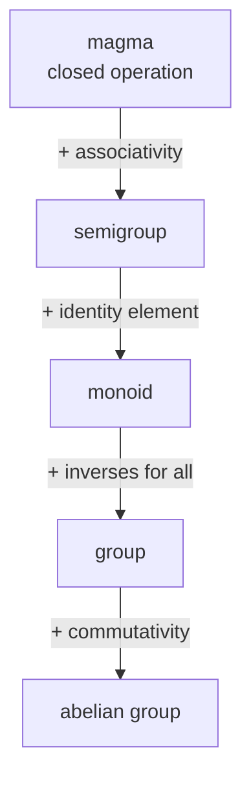

The integers under addition, the rotations and flips of a square, the non-zero rationals under multiplication, and the ways to shuffle a deck of cards look like four unrelated things. They are not. Each is a set with one operation that combines two elements into a third, an identity element that changes nothing, and an inverse for every element that undoes it — and every general fact you can prove from *just those properties* holds for all four at once, and for every other system built the same way.

That is the deal abstract algebra offers: prove a theorem once from a short list of axioms, and collect it in every structure that satisfies them — rotation groups, modular arithmetic, permutations, elliptic-curve points, symmetries of a molecule. This post climbs the hierarchy of one-operation structures (magma, semigroup, monoid, group, abelian group), works through the group theory that pays off — subgroups, cosets, Lagrange's theorem, normal subgroups and quotients, homomorphisms — using the eight symmetries of a square as a concrete companion throughout, and finishes with the two-operation structures, **rings** and **fields**. It follows on from [logic](/citadel/maths/logic) as the other pillar of discrete mathematics.

---
## A running example: the symmetries of a square

Before any axioms, hold one object in mind. A square has eight symmetries — rigid motions that leave it looking unchanged: the identity $e$, rotations by $90°$, $180°$, $270°$ (call them $r, r^2, r^3$), and four reflections (call them $s$ across the vertical axis, and $sr, sr^2, sr^3$ across the other three). "Combine" two symmetries by doing one then the other. Do a $90°$ rotation then another and you have $r^2$. Do a reflection twice and you are back to $e$. This set, with "then," is the **dihedral group** $D_4$, and it will illustrate every idea below — including the ones where commutativity fails, since $rs \neq sr$ for this group.

---
## The hierarchy: one axiom at a time

Take a set $S$ and a binary operation $*$ that sends each pair $(a, b)$ to an element $a * b$ of $S$ (that closure is already an assumption). Now add properties:

- **Magma** — just closure. Subtraction on $\mathbb{Z}$ is a magma and nothing more: $(a - b) - c \neq a - (b - c)$ in general.
- **Semigroup** — $*$ is **associative**: $(a * b) * c = a * (b * c)$, so parenthesisation is irrelevant and $a * b * c * d$ is unambiguous. Example: positive integers under addition; non-empty strings under concatenation.
- **Monoid** — a semigroup with an **identity** $e$ satisfying $e * a = a * e = a$ for all $a$. Example: non-negative integers under addition ($e = 0$); all strings under concatenation ($e$ = the empty string); $n \times n$ matrices under multiplication ($e = I$).
- **Group** — a monoid in which every $a$ has an **inverse** $a^{-1}$ with $a * a^{-1} = a^{-1} * a = e$. The four axioms in full: **closure, associativity, identity, inverse**. Example: $(\mathbb{Z}, +)$; the non-zero rationals under $\times$; $D_4$ under composition.
- **Abelian group** — a group whose operation also **commutes**, $a * b = b * a$. $(\mathbb{Z}, +)$ is abelian; $D_4$ is not.

Each step up buys more arithmetic. In a monoid you can solve nothing; in a group, $a * x = b$ always has the unique solution $x = a^{-1} * b$.

---
## Facts that come free from the axioms

You never have to re-prove these for a specific group:

- **The identity is unique.** If $e$ and $e'$ both act as identities, $e = e * e' = e'$.
- **Inverses are unique.** If $b$ and $c$ both invert $a$: $b = b * e = b * (a * c) = (b * a) * c = e * c = c$. Every step is one axiom.
- **Cancellation holds.** $a * x = a * y \implies x = y$ (left-multiply by $a^{-1}$).
- **$(a * b)^{-1} = b^{-1} * a^{-1}$** — order reverses, which is exactly why you take socks off before shoes.

---
## Inside a group: subgroups and cyclic groups

A **subgroup** $H \le G$ is a subset that is itself a group under $G$'s operation — it must contain $e$, be closed under $*$, and be closed under inverses. In $D_4$, the four rotations $\{e, r, r^2, r^3\}$ form a subgroup; so does $\{e, s\}$ (a reflection and the identity); so does $\{e, r^2\}$.

A group is **cyclic** if a single element generates it: $G = \langle a \rangle$ means every element is a power $a^k$ (or, additively, a multiple $ka$). $(\mathbb{Z}, +) = \langle 1 \rangle$; the integers mod $n$ under addition are cyclic of order $n$; the rotation subgroup $\{e, r, r^2, r^3\} = \langle r \rangle$ is cyclic of order $4$. The full group $D_4$ is *not* cyclic — no single symmetry generates all eight.

---
## Cosets and Lagrange's theorem

This is the first theorem where the abstraction visibly earns its keep. Fix a subgroup $H \le G$. For each $g \in G$, the **left coset** $gH = \{g * h : h \in H\}$ is the set you get by sliding $H$ over by $g$.

**Three facts about cosets, each provable from the axioms alone:**

1. **Every coset has the same size as $H$.** The map $h \mapsto g * h$ from $H$ to $gH$ is a bijection (cancellation makes it injective; it is surjective by definition).
2. **Two cosets are either identical or disjoint.** If $gH$ and $g'H$ share an element, then $g^{-1} g' \in H$, and it follows that $gH = g'H$.
3. **The cosets cover $G$**, since $g \in gH$ (take $h = e$).

Put together: the left cosets of $H$ **partition** $G$ into blocks all of size $|H|$. Therefore

$$ |G| = [G : H] \cdot |H|, $$

where the **index** $[G : H]$ is the number of cosets. This is **Lagrange's theorem**: *the order of any subgroup divides the order of the group.*

**Worked in $D_4$.** Take $H = \{e, s\}$, so $|H| = 2$. The left cosets:

- $eH = \{e, s\}$
- $rH = \{r, rs\}$
- $r^2 H = \{r^2, r^2 s\}$
- $r^3 H = \{r^3, r^3 s\}$

Four disjoint cosets of size $2$, covering all $8$ elements: $8 = 4 \cdot 2$. The index $[D_4 : H] = 4$.

**Consequences you get immediately:** the order of every element divides $|G|$ (an element's powers form a cyclic subgroup); a group of prime order $p$ has no subgroups except $\{e\}$ and itself, so it must be cyclic and is essentially the only group of that order; and Fermat's little theorem, $a^{p-1} \equiv 1 \pmod p$, is just Lagrange applied to the multiplicative group mod $p$.

---
## Normal subgroups and quotient groups

You would like to make a group *out of the cosets themselves*, defining $(aH)(bH) = (ab)H$. This is only well-defined when the answer does not depend on which representatives $a, b$ you picked — and that requires $H$ to be **normal**, written $H \trianglelefteq G$: $gH = Hg$ for every $g$ (left and right cosets coincide). Equivalently, $gHg^{-1} = H$ for all $g$.

When $H$ is normal, the cosets form the **quotient group** $G / H$. Examples:

- $n\mathbb{Z} \trianglelefteq \mathbb{Z}$, and $\mathbb{Z} / n\mathbb{Z}$ is exactly modular arithmetic — the integers collapsed onto their residues mod $n$.
- In $D_4$, the rotation subgroup $\{e, r, r^2, r^3\}$ is normal (index $2$ subgroups always are), and $D_4 / \{e,r,r^2,r^3\}$ has two elements: "a rotation" and "a reflection," multiplying like $\{+1, -1\}$.
- The subgroup $\{e, s\}$ from the Lagrange example is **not** normal: $r \{e, s\} = \{r, rs\}$ but $\{e, s\} r = \{r, sr\}$, and $rs \neq sr$.

Quotienting is how you deliberately forget structure — throw away the distinction between elements that differ by something in $H$ — and it is the group-theory engine behind modular arithmetic, homology, and Galois theory.

---
## Homomorphisms: maps that respect the operation

A **homomorphism** is a map $\varphi : G \to G'$ with $\varphi(a * b) = \varphi(a) \star \varphi(b)$ — it carries the operation across. An **isomorphism** is a bijective homomorphism; isomorphic groups are the same group with the elements renamed. Examples:

- $\varphi(x) = e^x$ is an isomorphism $(\mathbb{R}, +) \to (\mathbb{R}^+, \times)$ — it turns addition into multiplication, which is precisely what a logarithm table exploits.
- $\varphi(n) = n \bmod 12$ is a homomorphism $(\mathbb{Z}, +) \to (\mathbb{Z}/12\mathbb{Z}, +)$.
- $\det : GL_n(\mathbb{R}) \to (\mathbb{R}^\times, \times)$ — the determinant carries matrix multiplication to number multiplication.

The **kernel** $\ker\varphi = \{g : \varphi(g) = e'\}$ is always a normal subgroup, and the **first isomorphism theorem** says $G / \ker\varphi \cong \operatorname{im}\varphi$ — every homomorphic image of $G$ is a quotient of $G$ in disguise. Groups are, in the end, the mathematics of **symmetry**: the structure-preserving invertible transformations of any object form a group, its subgroups are that object's partial symmetries, and homomorphisms compare one object's symmetry to another's.

---
## Two operations: rings and fields

A **ring** $(R, +, \cdot)$ carries addition and multiplication with:

1. $(R, +)$ an abelian group;
2. multiplication associative;
3. the distributive laws $a(b + c) = ab + ac$ and $(b + c)a = ba + ca$ linking the two.

$(\mathbb{Z}, +, \cdot)$ is the prototype. Also rings: polynomials $\mathbb{Z}[x]$, $n \times n$ matrices (non-commutative), and $\mathbb{Z}/n\mathbb{Z}$.

An **integral domain** is a commutative ring with $1 \neq 0$ and **no zero-divisors**: $ab = 0$ forces $a = 0$ or $b = 0$. $\mathbb{Z}$ qualifies. $\mathbb{Z}/6\mathbb{Z}$ does not — $2 \cdot 3 \equiv 0$ with neither factor zero — which is exactly why you cannot cancel freely in modular arithmetic unless the modulus is prime.

A **field** $(F, +, \cdot)$ is a commutative ring with $1 \neq 0$ in which **every non-zero element has a multiplicative inverse**. So $F$ is an abelian group under $+$, its non-zero elements form an abelian group under $\cdot$, and distribution links them. $\mathbb{Q}$, $\mathbb{R}$, $\mathbb{C}$ are fields. $\mathbb{Z}$ is not — only $\pm 1$ have integer inverses. $\mathbb{Z}/p\mathbb{Z}$ *is* a field exactly when $p$ is prime (every non-zero residue is coprime to $p$, so has an inverse by Bézout). A field is the setting where all four arithmetic operations behave, which is why [linear algebra](/citadel/maths/linear-algebra) is always done over one.

---
## The one idea to keep

The hierarchy — magma to semigroup to monoid to group to abelian group, then ring to integral domain to field — is a ladder of how much arithmetic a structure supports, and locating a system on it tells you which theorems apply for free. Lagrange's theorem, proved once from four axioms by partitioning a group into equal-size cosets, simultaneously bounds subgroup orders, forces prime-order groups to be cyclic, and gives Fermat's little theorem. Normal subgroups let you quotient — deliberately forget structure — and modular arithmetic is the first instance. The modular examples that populate the finite end of all this are developed in [number theory](/citadel/maths/number-theory).
