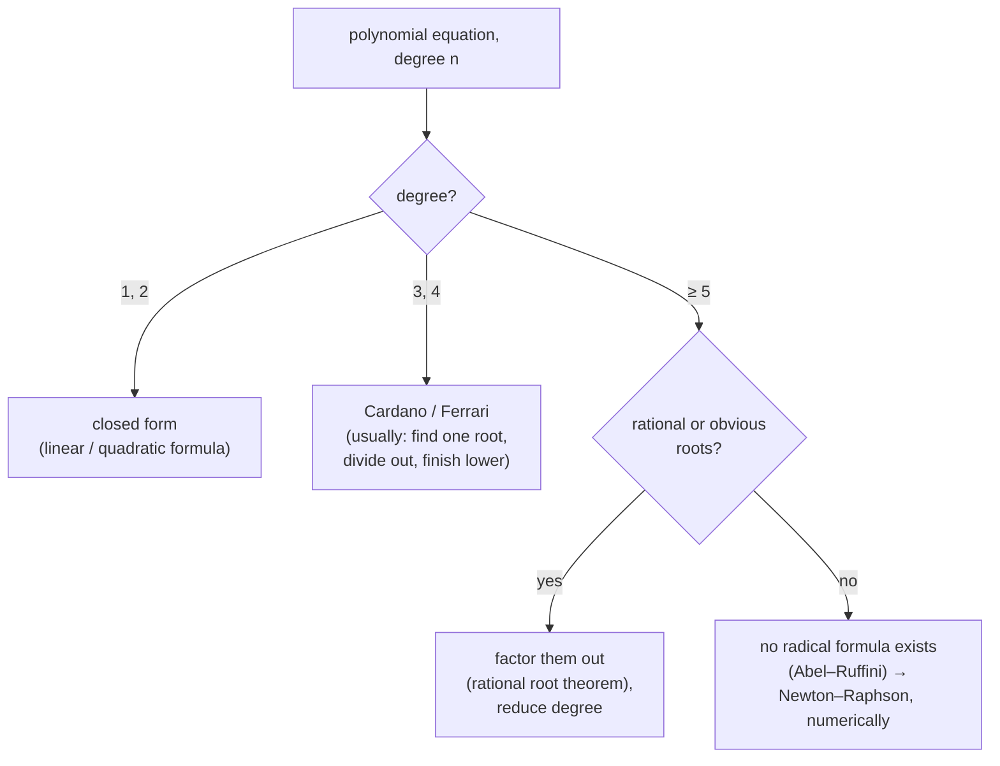

There is a formula for the roots of any quadratic, one for any cubic (Cardano's, 1545), and one for any quartic (Ferrari's, the same year). Then it stops. There is no formula for the general quintic — not "none has been found yet," but a *proof*, from Abel, Ruffini, and Galois, that no expression in $+, -, \times, \div$, and $n$th roots can give the roots of every degree-five polynomial. The roots exist; they are just not reachable that way.

That wall is the destination of this post. To get there we cover the mechanics of solving — a controlled sequence of reversible steps, with inequalities carrying one extra rule that trips almost everyone — and then the theory of polynomial equations: how many roots to expect (the Fundamental Theorem of Algebra), how to find them (the remainder and factor theorems, the rational root theorem), how the roots connect to the coefficients (the discriminant, Vieta's relations), and finally why the clean formulas run out. It is the companion to [number systems and number theory](/citadel/maths/number-theory).

---
## Solving as reversible steps

To "solve" is to replace an equation with a simpler equation that has the *same* solution set, repeatedly, until the variable stands alone. Every step must be reversible — if it can create or destroy solutions, you must check for that afterwards. Squaring both sides is the usual offender: from $\sqrt{x} = -2$ (no solution) squaring gives $x = 4$ (a spurious one), so any solution obtained after squaring must be substituted back.

**Inequalities carry one extra rule.** The relations are $<, >, \le, \ge$, and what preserves them:

- **Add or subtract** any real number — direction unchanged.
- **Multiply or divide by a positive** number — direction unchanged.
- **Multiply or divide by a negative** number — direction **reverses**. $a < b$ with $c < 0$ gives $ac > bc$.
- **Reciprocate** two same-sign quantities — direction reverses: $0 < a < b \implies 1/a > 1/b$.
- **Square** — safe only when both sides are known non-negative: $0 \le a < b \implies a^2 < b^2$, but $-3 < -2$ while $9 > 4$.

The negative-multiplication flip is the single most common error in the subject. Dividing $-2x < 6$ by $-2$ gives $x > -3$, not $x < -3$ — and if you ever multiply an inequality by an expression whose sign you do not know (like $x$ itself), you must split into cases.

---
## Classical inequalities

Three bounds do most of the work in analysis and optimisation:

- **AM–GM.** For non-negative $x_1, \ldots, x_n$,
  $$ \frac{x_1 + \cdots + x_n}{n} \ge \sqrt[n]{x_1 \cdots x_n}, $$
  with equality exactly when all the $x_i$ are equal. It bounds a product by a sum, which is why a rectangle of fixed perimeter has the most area when it is a square: $\sqrt{xy} \le (x + y)/2$ is maximised, for fixed $x + y$, at $x = y$.
- **Cauchy–Schwarz.** $\left(\sum a_i b_i\right)^2 \le \left(\sum a_i^2\right)\left(\sum b_i^2\right)$, equality iff the sequences are proportional. In vectors, $|\vec a \cdot \vec b| \le |\vec a|\, |\vec b|$ — the dot-product definition of angle only makes sense because of this bound.
- **Triangle inequality.** $|a + b| \le |a| + |b|$ — no detour is shorter than the direct path.

The [power-mean chain](/citadel/maths/progression) $A \ge G \ge H$ (arithmetic $\ge$ geometric $\ge$ harmonic) sits alongside these.

---
## Polynomials and how many roots to expect

A **polynomial** is $P(x) = a_n x^n + \cdots + a_1 x + a_0$, with **degree** $n$ the highest power whose coefficient is non-zero. Setting $P(x) = 0$ gives a **polynomial equation**; its solutions are the **roots** of $P$.

**Fundamental Theorem of Algebra.** Every non-constant polynomial with complex coefficients has at least one complex root. By peeling off one root at a time with the factor theorem, a degree-$n$ polynomial has *exactly* $n$ complex roots counted with multiplicity. If the coefficients are real, non-real roots occur in **conjugate pairs** $a \pm bi$ — so an odd-degree real polynomial has an odd number of real roots, hence at least one.

**Remainder theorem.** Dividing $P(x)$ by $(x - c)$ leaves remainder $P(c)$. Proof: write $P(x) = (x - c)Q(x) + R$ with $R$ a constant, then set $x = c$.

**Factor theorem.** $(x - c)$ divides $P(x)$ exactly when $P(c) = 0$. This is the workhorse: guess or compute a root, divide it out, and continue with a polynomial one degree smaller.

---
## Quadratics, in full

For $ax^2 + bx + c = 0$ with $a \neq 0$, complete the square. Divide by $a$, move the constant, add $(b/2a)^2$ to both sides:

$$ x^2 + \frac{b}{a}x = -\frac{c}{a} \ \implies\ \left(x + \frac{b}{2a}\right)^2 = \frac{b^2 - 4ac}{4a^2} \ \implies\ x = \frac{-b \pm \sqrt{b^2 - 4ac}}{2a}. $$

The **discriminant** $\Delta = b^2 - 4ac$ (real coefficients) decides the roots' nature: $\Delta > 0$ gives two distinct reals, $\Delta = 0$ one repeated real, $\Delta < 0$ a conjugate pair.

**Vieta's relations.** If $\alpha, \beta$ are the roots, expanding $a(x - \alpha)(x - \beta) = ax^2 + bx + c$ and matching coefficients gives

$$ \alpha + \beta = -\frac{b}{a}, \qquad \alpha\beta = \frac{c}{a}. $$

So a monic quadratic with prescribed roots is $x^2 - (\alpha + \beta)x + \alpha\beta = 0$ — and you can often read roots straight off: $x^2 - 5x + 6$ needs two numbers summing to $5$ and multiplying to $6$, namely $2$ and $3$.

The graph $y = ax^2 + bx + c$ is a **parabola**, opening up for $a > 0$, with vertex at $x = -b/2a$ (the average of the roots) and $x$-intercepts at the real roots.

---
## Cubics and beyond

For $ax^3 + bx^2 + cx + d = 0$, real coefficients force at least one real root; the other two are both real or a conjugate pair. Vieta extends by the same matching:

$$ \alpha + \beta + \gamma = -\frac{b}{a}, \qquad \alpha\beta + \beta\gamma + \gamma\alpha = \frac{c}{a}, \qquad \alpha\beta\gamma = -\frac{d}{a}. $$

**Cardano's formula** solves any cubic in radicals but is unwieldy, and famously routes through complex numbers even when all three roots are real (the *casus irreducibilis*). In practice: find one root — often a small integer via the factor theorem — divide it out, and finish with the quadratic formula.

**Worked example.** $x^3 - 6x^2 + 11x - 6 = 0$. The rational root theorem (below) offers $\pm 1, \pm 2, \pm 3, \pm 6$. Testing $x = 1$: $1 - 6 + 11 - 6 = 0$, a root. Divide out $(x - 1)$: $x^2 - 5x + 6 = 0$, giving $x = 2, 3$. Roots $1, 2, 3$ — and indeed $1 + 2 + 3 = 6 = -(-6)/1$, Vieta checks.

A general second-degree equation in *two* variables, $ax^2 + 2hxy + by^2 + 2gx + 2fy + c = 0$, is not solved for isolated roots but describes a curve — a **conic section** (circle, ellipse, parabola, hyperbola) or a degenerate case — with the type read from the sign of $h^2 - ab$; the full classification is in [conic sections](/citadel/maths/conic-section).

For degree $n \ge 4$, tools to locate roots:

- **Rational root theorem** — any rational root $p/q$ in lowest terms of an integer-coefficient polynomial has $p \mid a_0$ and $q \mid a_n$. A finite candidate list to test.
- **Descartes' rule of signs** — the count of positive real roots equals the number of sign changes in the coefficient sequence, or is less by an even number; apply to $P(-x)$ for the negatives.

There is a quartic formula (Ferrari), uglier still. But the **Abel–Ruffini theorem**, made precise by Galois, proves there is *no* general formula in radicals for degree $5$ and up. Galois's insight: attach to each polynomial a group of symmetries of its roots, and a radical formula exists exactly when that group can be built up from abelian pieces (it is *solvable*). The symmetric group $S_5$ is not solvable — it contains the simple group $A_5$ — so the general quintic has no such formula. For a specific high-degree equation you factor what you can and send the rest to a **numerical method** like Newton–Raphson, which converges on each root without any closed form.

---
## The one idea to keep

Solving is a chain of steps that preserve the solution set, run until the variable is alone — and inequalities add exactly one rule to that chain: flip the relation whenever you multiply or divide by something negative, and split into cases when you do not know the sign. For polynomials, the Fundamental Theorem fixes the root count at the degree, the factor theorem and Vieta's relations help pin the roots to the coefficients, and Galois theory explains the hard boundary: radical formulas exist through degree four and provably cannot exist from degree five on, because the relevant symmetry group stops being solvable. Past that wall, the roots are still there — you reach them with Newton's method, not a formula. The number systems these roots inhabit are in [number systems and number theory](/citadel/maths/number-theory); the numerical side is in [numerical analysis](/citadel/maths/numerical-analysis).
