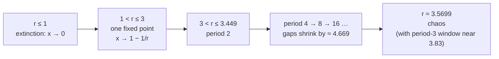

Pure mathematics chases structure for its own sake. Applied mathematics starts from a job — steer this rocket, price this auction, predict this weather — and builds the smallest tool that does it. This post surveys three tools for **systems that evolve**, and each one contains a genuine surprise about what "solving" the system can even mean.

Game theory asks what a rational agent should do when the payoff depends on what *other* rational agents do — and finds that everyone playing optimally can leave everyone worse off. Control theory steers a physical system using only its own measured output fed back into its input — and gets remarkably far with a three-term formula you can write on a napkin. Chaos theory studies systems with fixed, deterministic rules and no randomness anywhere — and shows that some of them are still unpredictable in principle, not just in practice. Each section gives the core vocabulary, the central result, and one example carried all the way through.

---
## Game theory: when individual and collective optima diverge

A **game** has three parts: **players** (rational deciders), **strategies** (the actions available to each), and **payoffs** (the outcome to every player for each combination of strategies, often laid out in a **payoff matrix**). Games are sorted by whether they are zero-sum (one player's gain is exactly another's loss), cooperative (binding agreements allowed), and simultaneous or sequential.

Two solution concepts:

- **Dominant strategy** — one that yields a better payoff than every alternative *no matter what the other players do*.
- **Nash equilibrium** — a strategy for each player such that no one gains by unilaterally switching. Everyone is already playing a best response to everyone else's choice.

### The Prisoner's Dilemma, worked

Two suspects are held separately. Each chooses to stay silent (*cooperate*) or confess (*defect*). Sentences in years, written as (Prisoner 1, Prisoner 2):

| | P2 cooperates | P2 defects |
| :--- | :--- | :--- |
| **P1 cooperates** | $(-1, -1)$ | $(-5, 0)$ |
| **P1 defects** | $(0, -5)$ | $(-3, -3)$ |

Reason as Prisoner 1, one column at a time. If P2 cooperates, your options are $-1$ (cooperate) or $0$ (defect) — defect. If P2 defects, your options are $-5$ (cooperate) or $-3$ (defect) — defect. Defection wins in *both* columns, so it is a dominant strategy, and by the symmetry of the matrix it is dominant for P2 as well. The unique Nash equilibrium is therefore (defect, defect) at $(-3, -3)$.

The surprise is in the comparison: (cooperate, cooperate) gives $(-1, -1)$, strictly better for **both** players. Rational individual play lands on an outcome that rational collective play would reject. That gap — not a quirk of these numbers but a structural feature of the payoff ordering — is why the Prisoner's Dilemma keeps reappearing in arms races, cartel pricing, vaccination, overfishing, and the evolution of cooperation. Repeat the game indefinitely and cooperation can become sustainable (strategies like tit-for-tat punish defection next round), which is the mathematical case for why institutions and reputations exist.

---
## Control theory: steering with feedback

Control theory designs a **controller** that drives a system's output to a target and holds it there despite disturbances, using measurements of the output itself.

**System models.** In the frequency domain, a linear time-invariant system is a **transfer function** — the ratio of the Laplace transforms of output and input, with zero initial conditions:

$$ G(s) = \frac{Y(s)}{U(s)}. $$

In the time domain, the **state-space** form packs everything into first-order vector equations:

$$ \dot{\mathbf{x}} = A\mathbf{x} + B\mathbf{u}, \qquad \mathbf{y} = C\mathbf{x} + D\mathbf{u}, $$

with $\mathbf{x}$ the internal state, $\mathbf{u}$ the input, $\mathbf{y}$ the output.

**Why feedback.** Run a system *open-loop* — compute the input you think will produce the target and apply it blind — and any modelling error or disturbance accumulates uncorrected. Instead, measure the output $y$, subtract it from the reference $r$ to get the error $e = r - y$, and drive the input from that error. With controller $C(s)$ and plant $G(s)$: $U = CE$ and $Y = GU$, so $Y = GC(R - Y)$, and

$$ T(s) = \frac{Y(s)}{R(s)} = \frac{G(s)C(s)}{1 + G(s)C(s)}. $$

The term $1 + GC$ in the denominator is where stability is decided: its roots are the closed-loop poles, and the whole system is stable exactly when they all sit in the left half-plane. Feedback can stabilise a plant that is unstable on its own — which is how you balance an inverted pendulum, or a rocket standing on its thrust.

**The PID controller** is the near-universal choice. From $e(t) = r(t) - y(t)$ it forms

$$ u(t) = K_p\, e(t) + K_i \int_0^t e(\tau)\, d\tau + K_d\, \frac{de(t)}{dt}. $$

Read each term by the question it answers:

- **Proportional** — *how wrong am I right now?* Larger $K_p$ means a faster, harder push, but also more overshoot and, past a point, oscillation.
- **Integral** — *how wrong have I been, added up?* A constant offset the proportional term tolerates gets integrated into a growing correction, so steady-state error is driven to zero — at the cost of sluggishness and a tendency to overshoot (integral windup).
- **Derivative** — *which way is the error heading?* It pushes back against fast changes, damping oscillation and adding anticipation — but it amplifies measurement noise, so it is often filtered or dropped.

Tuning $K_p, K_i, K_d$ for a given plant is most of practical control engineering; methods range from the Ziegler–Nichols rules to model-based pole placement.

---
## Chaos theory: deterministic and still unpredictable

A **chaotic** system has fixed rules and no random terms, yet cannot be predicted far ahead, because arbitrarily small differences in the starting state grow exponentially until the prediction is worthless. Its formal signatures:

1. **Deterministic** — the future is a function of the present, no noise.
2. **Sensitive dependence on initial conditions** (the butterfly effect) — nearby trajectories separate exponentially, at a rate set by the **Lyapunov exponent**; positive exponent means chaos.
3. **Topological mixing** — any patch of state space eventually spreads to overlap any other.
4. **Dense periodic orbits** — infinitely many, every one unstable.

### The logistic map, value by value

One recurrence models a population capped by its environment, as a fraction $x_n \in [0, 1]$ of the maximum:

$$ x_{n+1} = r\, x_n (1 - x_n). $$

The growth parameter $r$ is the only dial. Turn it up and the long-run behaviour changes qualitatively at sharp thresholds:

- $0 < r \le 1$: $x_n \to 0$. Extinction.
- $1 < r \le 3$: $x_n \to 1 - 1/r$, a single stable value. At $r = 2$ it settles on $0.5$ from any start.
- $3 < r \le 1 + \sqrt{6} \approx 3.449$: the fixed point goes unstable and $x_n$ ends up **alternating between two values** — a *period-doubling bifurcation*. At $r = 3.2$ the cycle is roughly $0.513 \leftrightarrow 0.799$.
- higher $r$: period $4$, then $8$, then $16$, … , and the intervals between successive doublings shrink by a factor approaching **4.669** (Feigenbaum's constant, the same for a huge class of systems).
- $r \approx 3.5699$: the doublings have accumulated and the sequence settles into **no cycle at all**. Chaos. Within it sit narrow windows of order — a clear period-$3$ band near $r = 3.83$, itself period-doubling as $r$ rises.

Plot the long-run values of $x_n$ against $r$ and you get the **bifurcation diagram**, which draws this entire "period-doubling route to chaos" in one image — a single stable branch splitting into two, four, eight, then dissolving into a speckled cloud shot through with pale vertical windows.

### Strange attractors

An **attractor** is the set of states a dissipative system settles onto. A **strange attractor** has fractal structure: the trajectory looks random but stays confined to an intricate geometric object of non-integer dimension, never repeating and never leaving. The **Lorenz attractor**, from a three-variable caricature of atmospheric convection,

$$ \dot x = \sigma(y - x), \qquad \dot y = x(\rho - z) - y, \qquad \dot z = xy - \beta z, $$

is chaotic at $\sigma = 10$, $\rho = 28$, $\beta = 8/3$, its path tracing the two-lobed butterfly — a bounded [system of differential equations](/citadel/maths/differential-equations) with no periodic solution and no fixed point it can rest at. Lorenz found it in 1963 when a truncated printout of initial conditions produced a wildly divergent forecast, and modern weather prediction copes with exactly this by running *ensembles* of slightly perturbed forecasts rather than one.

---
## The one idea to keep

Each tool redefines what "solving the system" means. Game theory: the solution is an equilibrium, and the equilibrium can be collectively bad — the Prisoner's Dilemma is not a paradox, it is what happens when dominant strategies point away from the joint optimum. Control theory: you cannot compute the right input in advance, so you close the loop and let the error drive the correction, and $K_p e + K_i \int e + K_d \dot e$ — present, accumulated, and projected error — handles a startling range of plants. Chaos theory: some deterministic systems have no long-range solution at all, only statistics, because sensitive dependence turns any measurement uncertainty into total uncertainty within a finite time. The continuous dynamical systems underneath control and chaos are developed in [differential equations](/citadel/maths/differential-equations); the game-theory thread continues in the [dedicated treatment](/citadel/miscs/game-theory).
