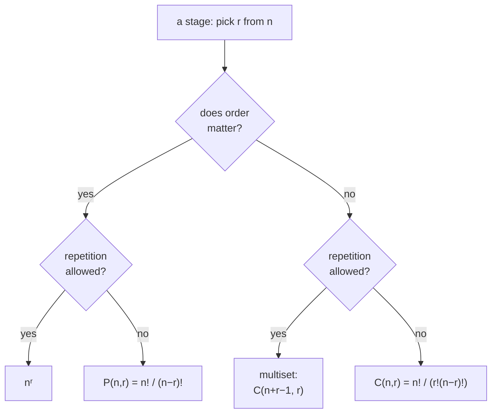

How many four-digit PINs are there? You will not list them, but you can count them: four slots, ten digits each, independent — $10^4 = 10{,}000$. Change the question to "four-digit PINs with no repeated digit" and it becomes $10 \times 9 \times 8 \times 7$. Change it to "how many *sets* of four distinct digits" and you divide that by $4!$ because the order stopped mattering.

That is the whole subject: break a count into stages, decide at each stage whether order matters and whether repetition is allowed, then multiply. This post lays out the rules and the standard shapes they produce — arrangements, selections, arrangements round a table, distributing identical objects into boxes — plus two results that count without a formula: the pigeonhole principle and inclusion–exclusion.

---
## The two rules

**Multiplication rule.** If a first choice can be made $n_1$ ways, and *then* a second $n_2$ ways, and so on through $k$ stages, the whole sequence can be made $n_1 n_2 \cdots n_k$ ways. Use it for "and then".

**Addition rule.** If one option can be taken $m$ ways and a second, *mutually exclusive* option $n$ ways, then "one or the other" happens $m + n$ ways. Use it for "or", when the cases can't overlap.

Every formula below is these two, applied carefully. Once a stage is isolated, two questions fix which shape it takes:

---
## Factorials

$$ n! = n(n-1)(n-2)\cdots 2 \cdot 1, \qquad 0! = 1 $$
$n!$ is the number of ways to order $n$ distinct objects: $n$ choices for the first slot, $n-1$ for the next, down to $1$.

**Legendre's formula** gives the exponent of a prime $p$ in $n!$:
$$ E_p(n!) = \sum_{k \ge 1} \left\lfloor \frac{n}{p^k} \right\rfloor = \left\lfloor \frac{n}{p} \right\rfloor + \left\lfloor \frac{n}{p^2} \right\rfloor + \cdots $$
Each term counts the multiples of $p^k$ up to $n$; the sum stops once $p^k > n$. It answers questions like "how many trailing zeros does $100!$ have?" — count the factors of $5$: $\lfloor 100/5 \rfloor + \lfloor 100/25 \rfloor = 24$.

---
## Permutations — order matters

The number of ways to arrange $r$ of $n$ distinct objects in order:
$$ P(n, r) = \frac{n!}{(n - r)!} = n(n-1)\cdots(n - r + 1) $$
— $n$ ways for the first position, $n - 1$ for the second, $r$ factors in all. Taking all of them, $P(n, n) = n!$.

Two variations:

- **Repeated objects.** If the $n$ objects include $p_1$ of one kind, $p_2$ of another, ..., then the $n!$ orderings overcount by $p_1!\,p_2!\cdots$ (permuting identical items changes nothing), so the distinct arrangements number $\dfrac{n!}{p_1!\,p_2!\cdots p_k!}$.
- **Repetition allowed.** Filling $r$ ordered slots from $n$ types with reuse: $n$ choices each time, $n^r$ total.

---
## Combinations — order doesn't matter

Choosing $r$ of $n$ distinct objects when the arrangement is irrelevant. Each such choice can be ordered $r!$ ways, so $P(n, r) = C(n, r) \cdot r!$, giving
$$ C(n, r) = \binom{n}{r} = \frac{n!}{r!\,(n - r)!} $$
Key properties: $\binom{n}{0} = \binom{n}{n} = 1$, the symmetry $\binom{n}{r} = \binom{n}{n-r}$ (choosing what to take = choosing what to leave), and Pascal's rule $\binom{n}{r-1} + \binom{n}{r} = \binom{n+1}{r}$. These are the [binomial coefficients](/citadel/maths/binomial-theory), and the same numbers.

**Repetition allowed** — choosing $r$ items from $n$ *types* with reuse, order irrelevant. Encode a choice as $r$ stars split into $n$ groups by $n - 1$ bars; each arrangement of $r$ stars and $n - 1$ bars is one multiset:
$$ \binom{n + r - 1}{r} $$

---
## Circular arrangements

Around a table, an arrangement and its rotations look the same. Nail one object down to kill the rotational freedom; the other $n - 1$ arrange in
$$ (n - 1)! $$
ways. If a reflection also counts as identical — a necklace you can flip — halve it to $\dfrac{(n - 1)!}{2}$ for $n \ge 3$.

---
## Selecting any number

**From $n$ distinct objects, at least one.** Each object is in or out: $2^n$ subsets, minus the empty one:
$$ 2^n - 1 = \binom{n}{1} + \binom{n}{2} + \cdots + \binom{n}{n} $$

**From a collection with repeats** — $p$ alike of one kind, $q$ of another, and so on. From the first kind take $0$ to $p$ ($p + 1$ options), independently for each kind, then drop the take-nothing case:
$$ (p + 1)(q + 1)(r + 1)\cdots - 1 $$

---
## Divisions and distributions

**Distinct objects into labelled groups of fixed sizes** $n_1, \ldots, n_k$ (with $\sum n_i = n$): choose the first group $\binom{n}{n_1}$ ways, the next $\binom{n - n_1}{n_2}$, and so on, telescoping to
$$ \frac{n!}{n_1!\,n_2!\cdots n_k!} $$
Handing $n$ distinct objects to $k$ distinct people with prescribed counts is the same problem.

**Distinct objects into $k$ equal groups of size $m$** ($n = km$): the formula above gives $\dfrac{n!}{(m!)^k}$ when the groups are *labelled*; if the groups are indistinguishable, divide by the $k!$ ways to relabel them: $\dfrac{n!}{k!\,(m!)^k}$.

**Identical objects into $r$ distinct boxes** — the number of non-negative integer solutions of $x_1 + \cdots + x_r = n$. By stars and bars:
$$ \binom{n + r - 1}{r - 1} \quad (\text{empty boxes allowed}) $$
If every box must be non-empty, put one object in each first, then distribute the remaining $n - r$ freely: $\binom{n - 1}{r - 1}$.

---
## The multinomial theorem

The division count $\dfrac{n!}{n_1!\cdots n_k!}$ is exactly the coefficient in
$$ (x_1 + x_2 + \cdots + x_k)^n = \sum_{n_1 + \cdots + n_k = n} \frac{n!}{n_1!\,n_2!\cdots n_k!}\, x_1^{n_1}\cdots x_k^{n_k} $$
— expanding the power means choosing which $x_i$ each of the $n$ factors contributes, which is sorting $n$ labelled things into $k$ bins. Setting every $x_i = 1$ gives $k^n$ (every function from $n$ factors to $k$ variables).

---
## The pigeonhole principle

If $n + 1$ objects go into $n$ boxes, some box holds at least two. The proof is one line: if every box held at most one, there would be at most $n$ objects. It sounds trivial and settles things that look hard — among any 13 people, two share a birth month; among any 5 points in a unit square, two are within $\tfrac{\sqrt 2}{2}$ of each other.

**Generalised:** $N$ objects in $k$ boxes force some box to hold at least $\left\lceil N/k \right\rceil$. Among 100 people, some month has at least $\lceil 100/12 \rceil = 9$ birthdays.

---
## Inclusion–exclusion

To count a union without double-counting the overlaps, add the sets, subtract the pairwise intersections, add back the triples, and so on:
$$ |A \cup B| = |A| + |B| - |A \cap B| $$
$$ |A \cup B \cup C| = |A| + |B| + |C| - |A \cap B| - |A \cap C| - |B \cap C| + |A \cap B \cap C| $$
$$ \left| \bigcup_{i=1}^{n} A_i \right| = \sum_{\emptyset \neq I \subseteq \{1,\dots,n\}} (-1)^{|I| - 1}\left| \bigcap_{i \in I} A_i \right| $$
An element in exactly $m$ of the sets is counted $\binom{m}{1} - \binom{m}{2} + \binom{m}{3} - \cdots = 1$ time — the alternating binomial sum collapses to one, which is why the formula is exact. To count elements in *none* of the sets, subtract the union from the universe: this is how you count derangements (permutations fixing nothing) and integers coprime to a given number.

---
## The one idea to keep

The discipline is to name the stages and, at each, ask the two questions — ordered or not, repeats or not — before reaching for a formula. Get those right and $2^n$, $n!$, $\binom{n}{r}$, and stars-and-bars are the only shapes you need. From here, counting feeds directly into [probability](/citadel/maths/probablity-statistics), where a probability is often just a favourable count over a total count, and into the [binomial theorem](/citadel/maths/binomial-theory), which is these coefficients doing algebra.
