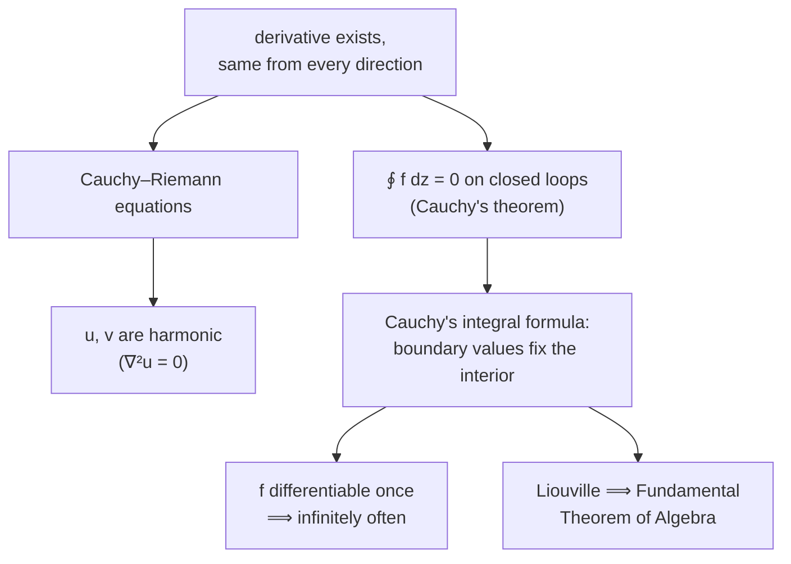

In real calculus, a function can be differentiable once and never again, or differentiable everywhere but full of wild behaviour. Complex calculus is different, and the reason is a single strengthened definition. To differentiate $f(z)$ at a point, the difference quotient must approach one limit *no matter which direction* $\Delta z \to 0$ comes from — a two-dimensional constraint. Functions that pass it, called **analytic**, turn out to be infinitely differentiable, rigidly determined by their values on any enclosing boundary, and angle-preserving as maps.

This post develops that: the Cauchy–Riemann equations that a real and imaginary part must satisfy, Cauchy's integral theorem and formula and their consequences (Liouville, Morera), conformal mapping, and the connection to potential theory. The series side — Taylor, Laurent, and the residue calculus that evaluates real integrals — is in [residue calculus](/citadel/maths/residue-calculus). A [complex-number refresher](/citadel/maths/complex-numbers) covers the algebra this assumes.

One hypothesis drives the entire chain of results, each forcing the next:

---
## The complex derivative

Write $z = x + iy$ and $f(z) = u(x, y) + i\,v(x, y)$. The derivative is
$$ f'(z_0) = \lim_{\Delta z \to 0} \frac{f(z_0 + \Delta z) - f(z_0)}{\Delta z} $$
$\Delta z$ is a point in a plane, so it can shrink to zero along the real axis, along the imaginary axis, or spiralling in — and every route must give the same limit. A function analytic (**holomorphic**) in a domain is one differentiable at every point of it.

---
## The Cauchy–Riemann equations

Approach along the two axes and demand the answers match.

**Along the real axis** ($\Delta z = \Delta x$):
$$ f'(z_0) = \frac{\partial u}{\partial x} + i\frac{\partial v}{\partial x} $$

**Along the imaginary axis** ($\Delta z = i\,\Delta y$, using $1/i = -i$):
$$ f'(z_0) = \frac{\partial v}{\partial y} - i\frac{\partial u}{\partial y} $$

Equating real and imaginary parts gives the **Cauchy–Riemann equations**:
$$ \frac{\partial u}{\partial x} = \frac{\partial v}{\partial y}, \qquad \frac{\partial u}{\partial y} = -\frac{\partial v}{\partial x} $$
They are necessary for differentiability, and — if the partials are also continuous — sufficient. Differentiate the first in $x$, the second in $y$, and add: the mixed terms cancel, leaving
$$ \frac{\partial^2 u}{\partial x^2} + \frac{\partial^2 u}{\partial y^2} = 0 $$
and likewise for $v$. So the real and imaginary parts of any analytic function satisfy **Laplace's equation** — they are **harmonic functions**, which is what ties this subject to physics.

---
## Complex integration

The integral of $f$ along a path $C$ parametrised by $z(t)$, $a \le t \le b$:
$$ \int_C f(z)\,dz = \int_a^b f(z(t))\,z'(t)\,dt $$
It is linear, additive over concatenated paths, and reverses sign when $C$ is traversed backwards.

**Cauchy's integral theorem.** If $f$ is analytic throughout a simply connected domain $D$, then for every simple closed contour $C$ in $D$,
$$ \oint_C f(z)\,dz = 0 $$
Two immediate corollaries: the integral between two points is **path independent** in $D$, and a contour can be **deformed** freely through the region of analyticity without changing the integral.

**Cauchy's integral formula.** For $f$ analytic inside and on a simple closed contour $C$, and $z_0$ any interior point,
$$ f(z_0) = \frac{1}{2\pi i}\oint_C \frac{f(z)}{z - z_0}\,dz $$
The value at an interior point is fixed entirely by the boundary values. Sketch: $\frac{f(z)}{z - z_0}$ is analytic inside $C$ except at $z_0$, so deform $C$ to a tiny circle $z = z_0 + \varepsilon e^{i\theta}$; the integral becomes $\int_0^{2\pi} f(z_0 + \varepsilon e^{i\theta})\,i\,d\theta$, and letting $\varepsilon \to 0$ gives $2\pi i\,f(z_0)$.

**Derivatives as integrals.** Differentiate the formula under the integral sign:
$$ f^{(n)}(z_0) = \frac{n!}{2\pi i}\oint_C \frac{f(z)}{(z - z_0)^{n+1}}\,dz $$
This exists for every $n$ — so *analytic once implies analytic infinitely often*, a fact with no real-variable analogue.

**Worked example.** Evaluate $\displaystyle\oint_C \frac{e^z}{z - 1}\,dz$ where $C$ is the circle $|z| = 2$ traversed once counterclockwise. Here $f(z) = e^z$ is entire, and $z_0 = 1$ sits inside $C$. Cauchy's integral formula gives the answer with no antiderivative and no parametrisation: $\oint_C \frac{e^z}{z - 1}\,dz = 2\pi i\, f(1) = 2\pi i\, e$. Move $C$ to $|z| = \tfrac12$ instead, so $z_0 = 1$ is *outside*, and the integrand is analytic inside — Cauchy's theorem makes the integral $0$. The entire value of the loop integral hinges on whether one point is enclosed.

---
## Consequences

**Cauchy's inequality.** If $|f(z)| \le M$ on a circle $C$ of radius $R$ about $z_0$, then bounding the derivative integral with the ML-inequality ($|\oint g\,dz| \le \max|g|\cdot\text{length}$):
$$ |f^{(n)}(z_0)| \le \frac{n!\,M}{R^n} $$

**Liouville's theorem.** An **entire** function (analytic on all of $\mathbb{C}$) that is bounded is constant. Proof: apply Cauchy's inequality with $n = 1$ — $|f'(z_0)| \le M/R$ — for a circle of *any* radius. Let $R \to \infty$; the bound goes to $0$, so $f'(z_0) = 0$ everywhere, so $f$ is constant. (This one line proves the Fundamental Theorem of Algebra: if a non-constant polynomial had no root, $1/p(z)$ would be bounded and entire.)

**Morera's theorem** is the partial converse of Cauchy's theorem: if $f$ is continuous on a simply connected $D$ and $\oint_C f\,dz = 0$ for every closed contour, then $f$ is analytic. The zero-integral condition makes $F(z) = \int_{z_0}^z f\,d\zeta$ well defined; $F$ turns out analytic with $F' = f$, and the derivative of an analytic function is analytic.

---
## Conformal mapping

Away from points where $f'(z) = 0$, an analytic map $w = f(z)$ is **conformal** — it preserves the angle between any two crossing curves, in size and in sense. Locally it acts as "rotate by $\arg f'(z)$ and scale by $|f'(z)|$", which is exactly why angles survive.

**Möbius (linear fractional) transformations**
$$ w = \frac{az + b}{cz + d}, \qquad ad - bc \neq 0 $$
are conformal everywhere and map the family of circles-and-lines onto itself (a circle can become a line and vice versa). Every Möbius transformation is a composition of the four basics: translation $w = z + b$, rotation $w = e^{i\alpha}z$, magnification $w = az$, and inversion $w = 1/z$.

Other analytic functions map regions usefully too: $w = z^2$ doubles angles at the origin (where $f' = 0$, so conformality fails there) and opens a quarter-plane into a half-plane; $w = e^z$ sends horizontal strips to sectors; $w = \sin z = \sin x\cosh y + i\cos x\sinh y$ carries a half-strip to a half-plane. Choosing a map that turns an awkward region into a disk or a half-plane is a standard trick for solving Laplace's equation with boundary conditions.

**Riemann surfaces** handle multi-valued functions like $\sqrt z$ and $\ln z$. Instead of a flat plane, picture the domain as several sheets stitched along a cut through a **branch point** (the origin, here); circling the branch point moves you to the next sheet, and on this layered surface the function is single-valued and continuous.

---
## Potential theory

Because the real and imaginary parts of an analytic function are harmonic — and, conversely, every harmonic function on a simply connected domain is the real part of some analytic function — complex analysis is a machine for solving Laplace's equation in the plane. That equation governs the [electrostatic potential](/citadel/physics/electromag), steady-state temperature, and the velocity potential of an ideal fluid.

Two structural facts for a harmonic $\phi$ on a bounded region $R$ with boundary $C$:

- **Maximum principle** — a non-constant $\phi$ attains its maximum and minimum only on $C$, never in the interior.
- **Dirichlet problem and uniqueness** — the problem of finding a harmonic function in $R$ with prescribed boundary values on $C$ has, if it has a solution at all, exactly *one*. So finding any harmonic function that matches the boundary data (fixed voltages on conductors, say) means you have found *the* solution.

---
## The one idea to keep

The whole subject turns on how much one strong hypothesis buys. Requiring the derivative to be direction-independent forces the Cauchy–Riemann equations, which force the parts to be harmonic, which — through Cauchy's integral formula — force infinite differentiability and boundary-determines-interior rigidity. The payoff is practical: conformal maps that simplify a region, and a guarantee that a boundary-value problem for Laplace's equation has a unique answer. The [residue calculus](/citadel/maths/residue-calculus) turns the same integral theorems into a tool for computing.
