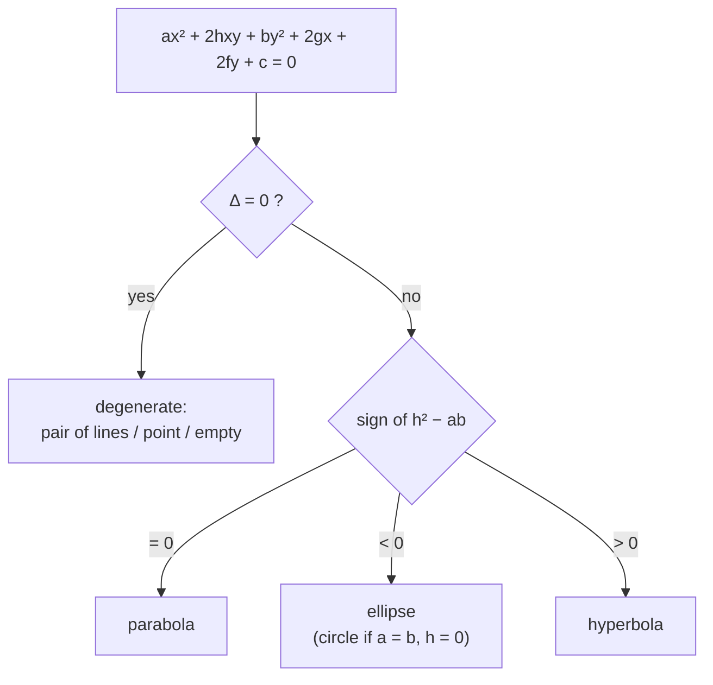
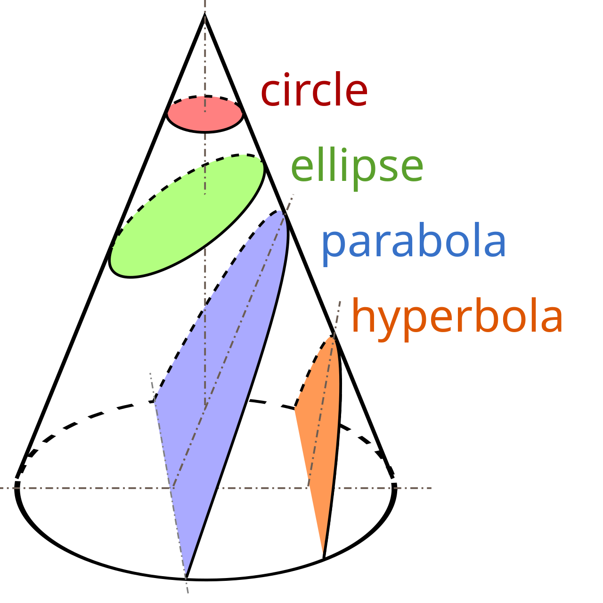

Slice a cone with a plane. Tilt the plane a little and the cut is an ellipse; tilt it until it runs parallel to the cone's side and the ellipse stretches open into a parabola; tilt further and the plane catches both nappes of the cone, giving the two branches of a hyperbola. Three curves, one solid, one continuous knob to turn.

Coordinate geometry gives that knob a number. Every one of these curves is the set of points whose distance from a fixed **focus** stands in a fixed ratio $e$ — the **eccentricity** — to its distance from a fixed line, the **directrix**. Set $e = 1$ and you have a parabola; $e < 1$ an ellipse; $e > 1$ a hyperbola. This post derives the standard equation of each from that single definition, then works through the tangent and normal in point, slope, and parametric form, the focal-chord and asymptote facts, and the reflection property that puts conics in telescopes, headlights, and Kepler's laws.

---
## The unifying definition

A **conic section** is the locus of a point $P$ with
$$ \frac{PS}{PM} = e $$
where $S$ is the focus, $PM$ the perpendicular distance from $P$ to the directrix, and $e > 0$ a constant. Squaring, with focus $S(h, k)$ and directrix $Ax + By + C = 0$:
$$ (x - h)^2 + (y - k)^2 = \frac{e^2 (Ax + By + C)^2}{A^2 + B^2} $$
Expand and every term is degree two or lower, so a conic is exactly a **general second-degree equation**
$$ ax^2 + 2hxy + by^2 + 2gx + 2fy + c = 0 $$

---
## Which conic

Two readings tell you the type.

**From the eccentricity:** $e = 1$ parabola, $0 < e < 1$ ellipse, $e > 1$ hyperbola, $e = 0$ circle (an ellipse whose foci have merged at the centre).

**From the general equation**, using $\Delta = abc + 2fgh - af^2 - bg^2 - ch^2$ and the quantity $h^2 - ab$:

$\Delta$ separates the honest curves from the degenerate cases (two lines, a single point, nothing); $h^2 - ab$ then picks the family, matching the discriminant of the quadratic part.

---
## The parabola ($e = 1$)

**Standard equation.** Put the focus at $S(a, 0)$ and the directrix at $x = -a$. Then $PS = PM$ reads
$$ (x - a)^2 + y^2 = (x + a)^2 \;\Longrightarrow\; y^2 = 4ax $$
the parabola opening rightward, vertex at the origin.

**Anatomy of $y^2 = 4ax$:**

- **axis** — the line of symmetry through the focus, here $y = 0$;
- **vertex** — where the curve meets its axis, here $(0, 0)$;
- **focus** $(a, 0)$, **directrix** $x = -a$;
- **latus rectum** — the focal chord perpendicular to the axis. Setting $x = a$ gives $y = \pm 2a$, so its length is $4a$;
- **parametric point** $(at^2, 2at)$; at that point $\text{d}y/\text{d}x = 2a/y = 1/t$, so the tangent's slope is $1/t$.

The other three orientations are sign-and-axis swaps: $y^2 = -4ax$ (opens left), $x^2 = 4ay$ (up), $x^2 = -4ay$ (down). A vertex shifted to $(h, k)$ with axis parallel to $Ox$ gives $(y - k)^2 = 4a(x - h)$, parametrised by $x = h + at^2$, $y = k + 2at$.

**Tangent.** Implicit differentiation of $y^2 = 4ax$ gives slope $2a/y_1$ at $(x_1, y_1)$, and using $y_1^2 = 4ax_1$ the point-form tangent tidies to
$$ yy_1 = 2a(x + x_1) $$
The same expression with $(x_1, y_1)$ an *external* point is the **chord of contact**; the **pair of tangents** from an external point is $S S_1 = T^2$ in the usual $S$/$S_1$/$T$ notation. In slope form, and for all four orientations:

| Parabola | Point of contact | Tangent, slope $m$ | Tangency condition |
| --- | --- | --- | --- |
| $y^2 = 4ax$ | $(a/m^2,\; 2a/m)$ | $y = mx + a/m$ | $c = a/m$ |
| $y^2 = -4ax$ | $(-a/m^2,\; -2a/m)$ | $y = mx - a/m$ | $c = -a/m$ |
| $x^2 = 4ay$ | $(2am,\; am^2)$ | $y = mx - am^2$ | $c = -am^2$ |
| $x^2 = -4ay$ | $(-2am,\; -am^2)$ | $y = mx + am^2$ | $c = am^2$ |

**Normal** (perpendicular to the tangent, slope $-y_1/2a$ at $(x_1, y_1)$):
$$ y - y_1 = -\frac{y_1}{2a}(x - x_1) $$

| Parabola | Point of contact | Normal, slope $m$ |
| --- | --- | --- |
| $y^2 = 4ax$ | $(am^2,\; -2am)$ | $y = mx - 2am - am^3$ |
| $y^2 = -4ax$ | $(-am^2,\; 2am)$ | $y = mx + 2am + am^3$ |
| $x^2 = 4ay$ | $(-2a/m,\; a/m^2)$ | $y = mx + 2a + a/m^2$ |
| $x^2 = -4ay$ | $(2a/m,\; -a/m^2)$ | $y = mx - 2a - a/m^2$ |

**In the parameter $t$** for $y^2 = 4ax$: tangent $ty = x + at^2$, normal $y + tx = 2at + at^3$ (the analogous rows for the other three orientations differ only by the sign pattern above).

**Focal-chord facts.** For a chord through the focus joining parameters $t_1, t_2$: $t_1 t_2 = -1$. Its length is $a(t + 1/t)^2$ where the chord passes through $(at^2, 2at)$, equivalently $4a\csc^2\theta$ for a chord at angle $\theta$ to the axis. The semi-latus rectum is the harmonic mean of the two focal radii $SP$, $SQ$. The tangents at the two ends of a focal chord are perpendicular and meet on the directrix.

**Co-normal points.** From a general point $(h, k)$ three normals reach the parabola. The feet have ordinates summing to zero, their centroid lies on the axis, and all three normals are real only if $h > 2a$. The circle through the three feet is $x^2 + y^2 - (2a + h)x - \tfrac{k}{2}y = 0$.

**Reflection.** A ray parallel to the axis reflects through the focus (and vice versa). Parabolic dishes, headlight mirrors, and reflecting telescopes are this one line of geometry.

---
## The ellipse ($0 < e < 1$)

**Two equivalent definitions:** focus–directrix with $PS = e\,PM$, $e < 1$; or two foci with $PS_1 + PS_2 = 2a$ constant.

**Standard equation** from the two-foci form. With foci $(\pm c, 0)$:
$$ \sqrt{(x + c)^2 + y^2} + \sqrt{(x - c)^2 + y^2} = 2a $$
Isolate one radical and square twice; the result is $\dfrac{x^2}{a^2} + \dfrac{y^2}{a^2 - c^2} = 1$. Since $a > c$, the quantity $a^2 - c^2$ is positive — name it $b^2$:
$$ \frac{x^2}{a^2} + \frac{y^2}{b^2} = 1, \qquad a > b $$

**Anatomy:**

- **centre** $(0, 0)$; **major axis** length $2a$ along $Ox$, **minor axis** $2b$ along $Oy$;
- **vertices** $(\pm a, 0)$; **foci** $(\pm c, 0)$;
- **eccentricity** $e = c/a$, giving $b^2 = a^2(1 - e^2)$;
- **directrices** $x = \pm a/e$;
- **latus rectum** length $2b^2/a$ (set $x = ae$: $y^2 = b^2(1 - e^2) = b^4/a^2$);
- **area** $\pi ab$.

**Auxiliary circle and eccentric angle.** The circle $x^2 + y^2 = a^2$ on the major axis is the *auxiliary circle*; a point of the ellipse is $(a\cos\phi, b\sin\phi)$, where $\phi$ — the **eccentric angle** — is the angle at the centre to the matching point on that circle. A chord/triangle on the ellipse has $b/a$ times the area of its auxiliary-circle counterpart, because the ellipse is the auxiliary circle scaled by $b/a$ in $y$.

**Tangent** at $(x_1, y_1)$: $\dfrac{x x_1}{a^2} + \dfrac{y y_1}{b^2} = 1$. Slope form $y = mx \pm \sqrt{a^2 m^2 + b^2}$, tangency condition $c^2 = a^2 m^2 + b^2$, contact point $\left(\mp \dfrac{a^2 m}{\sqrt{a^2 m^2 + b^2}}, \pm \dfrac{b^2}{\sqrt{a^2 m^2 + b^2}}\right)$. Parametric form at eccentric angle $\phi$: $\dfrac{x\cos\phi}{a} + \dfrac{y\sin\phi}{b} = 1$. Pair of tangents from an external point: $S S_1 = T^2$.

Two clean tangent properties: the product of the perpendiculars from the two foci onto any tangent equals $b^2$; and the tangents at parameters $\alpha, \beta$ meet at $\left(a\dfrac{\cos\frac{\alpha+\beta}{2}}{\cos\frac{\alpha-\beta}{2}},\; b\dfrac{\sin\frac{\alpha+\beta}{2}}{\cos\frac{\alpha-\beta}{2}}\right)$.

**Normal** at $(x_1, y_1)$: $\dfrac{a^2 x}{x_1} - \dfrac{b^2 y}{y_1} = a^2 - b^2$.

From a point, in general **four normals** reach the ellipse; their eccentric angles satisfy $\alpha + \beta + \gamma + \delta = (2n + 1)\pi$. Where an ellipse meets a circle, the four **concyclic** intersection points have $\alpha + \beta + \gamma + \delta = 2n\pi$.

**Reflection.** A ray from one focus reflects off the ellipse through the *other* focus — the acoustics of a whispering gallery.

---
## The hyperbola ($e > 1$)

**Two definitions:** focus–directrix with $PS = e\,PM$, $e > 1$; or two foci with $|PS_1 - PS_2| = 2a$.

**Standard equation.** The two-foci derivation runs exactly as for the ellipse but with a difference of radicals; with foci $(\pm c, 0)$ and $b^2 = c^2 - a^2$ (positive now, since $c > a$):
$$ \frac{x^2}{a^2} - \frac{y^2}{b^2} = 1 $$

**Anatomy:**

- **centre** $(0, 0)$; **transverse axis** $2a$ (between the vertices), **conjugate axis** $2b$ perpendicular to it;
- **vertices** $(\pm a, 0)$; **foci** $(\pm ae, 0)$;
- **eccentricity** $e = c/a > 1$, giving $b^2 = a^2(e^2 - 1)$;
- **directrices** $x = \pm a/e$; **latus rectum** $2b^2/a$;
- **asymptotes** $y = \pm \dfrac{b}{a}x$ — the lines the branches approach at infinity (drop the "$= 1$" and factor $\frac{x^2}{a^2} - \frac{y^2}{b^2} = 0$).

**Special cases.** A **rectangular hyperbola** has perpendicular asymptotes, forcing $a = b$: equation $x^2 - y^2 = a^2$, eccentricity $\sqrt 2$, and after a $45°$ rotation simply $xy = k$. The **conjugate hyperbola** $\dfrac{y^2}{b^2} - \dfrac{x^2}{a^2} = 1$ shares the centre and asymptotes but opens along $Oy$.

**Auxiliary circle** $x^2 + y^2 = a^2$; parametric point $(a\sec\phi, b\tan\phi)$.

**Tangent** at $(x_1, y_1)$: $\dfrac{x x_1}{a^2} - \dfrac{y y_1}{b^2} = 1$. Slope form $y = mx \pm \sqrt{a^2 m^2 - b^2}$, condition $c^2 = a^2 m^2 - b^2$. Parametric: $\dfrac{x\sec\phi}{a} - \dfrac{y\tan\phi}{b} = 1$.

**Normal** at $(x_1, y_1)$: $\dfrac{a^2 x}{x_1} + \dfrac{b^2 y}{y_1} = a^2 + b^2 = a^2 e^2$. Co-normal and concyclic conditions mirror the ellipse.

**Reflection.** A ray aimed at one focus reflects as though it came from the other — used the other way around in Cassegrain telescopes and in hyperbolic navigation (LORAN).

---
## Where they show up

The reason conics are everywhere in physics is one theorem: a body under an inverse-square force moves on a conic with the force centre at a focus. Bound orbits are **ellipses** (planets, the ISS), the escape boundary is a **parabola**, and a fly-by or an unbound comet traces a **hyperbola** — the eccentricity of the trajectory *is* the eccentricity of the orbit. A thrown ball is a parabola in the flat-ground approximation (really a slice of a very eccentric ellipse). The reflection properties do the rest: parabolic dishes gather parallel signal to a focus, elliptical rooms carry a whisper focus to focus, hyperbolic mirrors fold a telescope's light path.

## The one idea to keep

"Type of conic" is not five separate objects but one dial, $e$, swept from $0$ upward — and every formula above, messy as the tables look, is that continuity showing through. The next step is watching the ellipse become a physical orbit in [orbital mechanics](/citadel/physics/astrodynamics); the setup rests on [coordinate geometry](/citadel/maths/2d-geometry) and the [circle](/citadel/maths/circles), the conic with $e = 0$.
