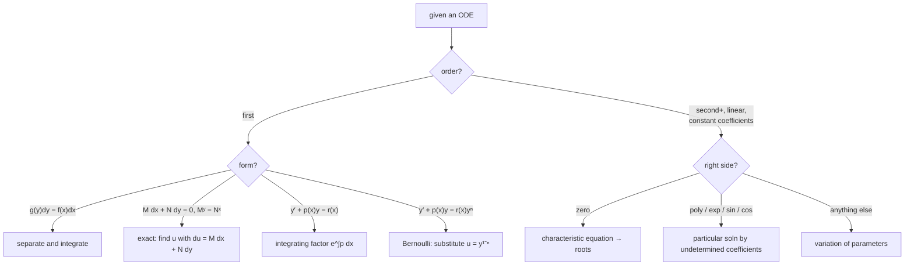

Newton's second law is usually written $F = ma$, but $a$ is $x''(t)$, so for a mass on a spring it is really $m\,x'' = -kx$ — an equation whose unknown is the *function* $x(t)$, and which ties that function to its own second derivative. Solving it doesn't give a number; it gives the trajectory $x(t) = A\cos\omega t + B\sin\omega t$, a whole family until the starting position and velocity pin down $A$ and $B$.

That is what a differential equation is: a relation between an unknown function and its derivatives. This post covers how to classify one (which decides the method), the first-order toolkit, the characteristic-equation method for linear equations with constant coefficients, systems of ODEs and their phase-plane behaviour, and the physical models these equations come from.

---
## What a differential equation is

An **ordinary differential equation** (ODE) involves a function of one variable and its derivatives. Its **order** is the highest derivative present; its **degree** is the power that highest derivative is raised to, once radicals and fractions in the derivatives are cleared. A **solution** is a function satisfying the equation: the **general solution** carries as many arbitrary constants as the order and names the whole family; a **particular solution** fixes those constants from initial or boundary data.

Run it backwards and you can *form* an ODE: take a family of curves with $n$ arbitrary constants, differentiate $n$ times, and eliminate the constants. The family $y = c_1 e^x + c_2 e^{-x}$ gives $y'' - y = 0$.

---
## Reading an ODE before solving it

- **Linear** — the unknown and its derivatives appear only to the first power, with no products among them: $a(x)y'' + b(x)y' + c(x)y = g(x)$. Anything else is **nonlinear**.
- **Homogeneous** — the term free of $y$ (the $g(x)$ above) is zero. Otherwise **non-homogeneous**.
- **IVP vs BVP** — an **initial value problem** fixes $y$ and its derivatives all at one point; a **boundary value problem** fixes conditions at two or more points.

The **Picard–Lindelöf theorem** covers when to expect a solution: for $y' = f(x, y)$, $y(x_0) = y_0$, if $f$ and $\partial f/\partial y$ are continuous near $(x_0, y_0)$, a unique solution exists on some interval around $x_0$.

---
## First-order: the picture, and a step

$y' = f(x, y)$ assigns a slope to every point of the plane. Drawing short segments at that slope across a grid gives a **slope field**, and a solution is any curve that stays tangent to it everywhere. **Euler's method** turns that into arithmetic: from $(x_n, y_n)$, follow the local slope one step $h$,
$$ y_{n+1} = y_n + h\,f(x_n, y_n) $$
It is crude — the error accumulates linearly in $h$ — but it is the seed of every numerical ODE solver.

---
## First-order: exact solutions

**Separable.** If it rearranges to $g(y)\,dy = f(x)\,dx$, integrate each side. Recognising exact differentials speeds this up: $x\,dy + y\,dx = d(xy)$, $\dfrac{x\,dy - y\,dx}{x^2} = d\!\left(\dfrac{y}{x}\right)$, $\dfrac{x\,dy - y\,dx}{x^2 + y^2} = d\!\left(\tan^{-1}\dfrac{y}{x}\right)$, $\dfrac{x\,dx + y\,dy}{\sqrt{x^2 + y^2}} = d\big(\sqrt{x^2 + y^2}\big)$.

**Exact.** $M(x, y)\,dx + N(x, y)\,dy = 0$ is **exact** when $\dfrac{\partial M}{\partial y} = \dfrac{\partial N}{\partial x}$ — then it is $du = 0$ for some potential $u$, and the solution is $u(x, y) = C$. Recover $u$ by integrating $M$ in $x$, adding an unknown $h(y)$, then differentiating in $y$ and matching $N$ to find $h$.

**Linear, first-order.** For
$$ y' + p(x)\,y = r(x) $$
multiply by $I(x) = e^{\int p\,dx}$. The point of that factor: it forces the left side to be $(I y)'$ exactly. Requiring $I' = Ip$ is itself separable, giving $I = e^{\int p\,dx}$; then integrating $(Iy)' = Ir$ gives
$$ y(x) = \frac{1}{I(x)}\left(\int I(x)\,r(x)\,dx + C\right) $$

**Bernoulli.** $y' + p(x)y = r(x)y^n$ ($n \neq 0, 1$): divide by $y^n$ and substitute $u = y^{1-n}$, which turns it into a linear equation in $u$.

---
## Second-order linear, constant coefficients

For $ay'' + by' + cy = 0$, try $y = e^{\lambda x}$; substituting gives the **characteristic equation**
$$ a\lambda^2 + b\lambda + c = 0 $$
and its roots set the form of the general solution:

| Roots | General solution |
| --- | --- |
| distinct real $\lambda_1, \lambda_2$ | $c_1 e^{\lambda_1 x} + c_2 e^{\lambda_2 x}$ |
| repeated real $\lambda$ | $(c_1 + c_2 x)e^{\lambda x}$ |
| complex $\alpha \pm i\beta$ | $e^{\alpha x}(c_1\cos\beta x + c_2\sin\beta x)$ |

*Worked:* the spring from the lede, $x'' + 4x = 0$ with $x(0) = 1$, $x'(0) = 0$. Characteristic equation $\lambda^2 + 4 = 0$, roots $\lambda = \pm 2i$ — complex with $\alpha = 0$, $\beta = 2$ — so $x(t) = c_1\cos 2t + c_2\sin 2t$. Apply $x(0) = 1$: $c_1 = 1$. Differentiate and apply $x'(0) = 0$: $-2c_1\sin 0 + 2c_2\cos 0 = 2c_2 = 0$, so $c_2 = 0$. The particular solution is $x(t) = \cos 2t$ — undamped oscillation at angular frequency $2$, exactly what "no friction term" predicts.

**Euler–Cauchy** equations $x^2 y'' + axy' + by = 0$ take $y = x^m$, giving $m(m-1) + am + b = 0$; the same three cases apply with $x^m$, $(c_1 + c_2\ln x)x^m$, and $x^\alpha(c_1\cos(\beta\ln x) + c_2\sin(\beta\ln x))$.

Two solutions $y_1, y_2$ are a valid basis iff they are linearly independent, tested by the **Wronskian**
$$ W(y_1, y_2) = y_1 y_2' - y_2 y_1' $$
being nonzero somewhere on the interval. An $n$th-order equation works the same way: a degree-$n$ characteristic polynomial and $n$ independent solutions.

---
## Second-order linear, non-homogeneous

For $y'' + p y' + q y = r(x)$ the general solution is $y_h + y_p$: the homogeneous solution plus any one particular solution.

**Undetermined coefficients** (constant coefficients, $r$ a polynomial / exponential / sine / cosine): guess $y_p$ of the same shape with unknown constants and match.

| $r(x)$ | guess $y_p$ |
| --- | --- |
| polynomial, degree $n$ | $A_n x^n + \cdots + A_0$ |
| $Ae^{kx}$ | $Be^{kx}$ |
| $A\sin kx + B\cos kx$ | $C\sin kx + D\cos kx$ |
| $e^{\alpha x}(A\sin\beta x + B\cos\beta x)$ | $e^{\alpha x}(C\sin\beta x + D\cos\beta x)$ |

If the guess already solves the homogeneous equation, multiply it by $x$ (or $x^2$) — this is the mathematics of resonance.

**Variation of parameters** handles any $r(x)$. With $y_h = c_1 y_1 + c_2 y_2$, seek $y_p = u(x)y_1 + v(x)y_2$ subject to
$$ u'y_1 + v'y_2 = 0, \qquad u'y_1' + v'y_2' = r(x) $$
Solve this linear pair for $u', v'$, then integrate.

---
## Systems

Coupled quantities give a first-order system, in matrix form $\vec{y}\,' = A(t)\vec{y} + \vec{g}(t)$. For the constant-coefficient homogeneous case $\vec{y}\,' = A\vec{y}$, try $\vec{y} = \vec{x}\,e^{\lambda t}$; substituting gives the [eigenvalue problem](/citadel/maths/linear-algebra)
$$ A\vec{x} = \lambda\vec{x} $$
and the general solution superposes $\vec{x}_i\,e^{\lambda_i t}$ over the eigenpairs.

For a 2D autonomous system, the **phase plane** plots $y_2$ against $y_1$; **critical points** are where $\vec{y}\,' = \vec{0}$, and the eigenvalues of $A$ classify them. Writing $p = \lambda_1 + \lambda_2$ (the trace), $q = \lambda_1\lambda_2$ (the determinant), $\Delta = p^2 - 4q$:

| Type | Conditions | Stability |
| --- | --- | --- |
| node | $q > 0$, $\Delta > 0$ | stable if $p < 0$, else unstable |
| saddle | $q < 0$ | unstable |
| spiral | $q > 0$, $\Delta < 0$ | stable if $p < 0$, else unstable |
| centre | $p = 0$, $q > 0$ | neutrally stable |

A nonlinear system is analysed near a critical point by **linearising** — replacing it with its Jacobian matrix $J = \big[\partial f_i/\partial y_j\big]$ there — and reading off the eigenvalues of $J$: all real parts negative means stable, any positive means unstable.

---
## Where the models come from

- **Population** — the logistic equation $P' = kP(1 - P/K)$: exponential growth throttled by a carrying capacity $K$.
- **Orthogonal trajectories** — the family cutting a given family of curves at right angles, found by replacing the slope $y'$ with $-1/y'$ and re-solving.
- **Mass on a spring** — free motion $my'' + cy' + ky = 0$ (damped), driven motion $my'' + cy' + ky = F_0\cos\omega t$ (forced, with resonance near $\omega = \sqrt{k/m}$).
- **RLC circuit** — the charge obeys $Lq'' + Rq' + \tfrac{1}{C}q = E(t)$, the *same* equation as the driven damped oscillator with $L \leftrightarrow m$, $R \leftrightarrow c$, $1/C \leftrightarrow k$.

That last correspondence is why solving one linear second-order ODE well pays off everywhere — see it play out physically in [oscillations and circuits](/citadel/physics/oscillations).

---
## The one idea to keep

Classifying the equation is most of the battle: order, linear or not, homogeneous or not, constant coefficients or not — those four answers point at the method. When none of the elementary methods reach it — a variable-coefficient equation, a non-elementary forcing term, a PDE — the tools are power series, Laplace transforms, and Fourier analysis, in [advanced differential equations](/citadel/maths/differential-equations-2). All of it rests on [differentiation](/citadel/maths/limits-derivatives) and [integration](/citadel/maths/integral-calculus).
