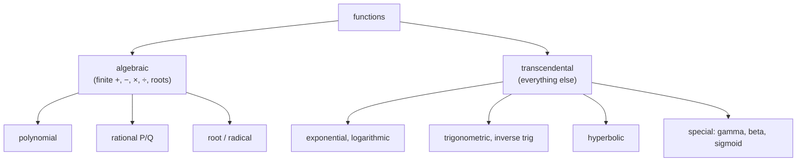

A [relation](/citadel/maths/set-theory) pairs elements of one set with elements of another. A **function** is the disciplined case: every input is paired with *exactly one* output. That single restriction — no input left out, no input sent two places — is what makes a function a reliable rule, a machine you can feed a value and get a definite answer.

This post is the working knowledge of functions: the standard families (polynomial, rational, exponential, trigonometric, and the rest), the three ways a function can map its domain onto its codomain and why one of them is required for an inverse to exist, how composition and inversion behave, how shifting and scaling a formula moves its graph, and how to solve a **recurrence relation** — a function defined in terms of its own earlier values.

---
## What a function is

A function $f: A \to B$ assigns to each $a$ in the **domain** $A$ a single $b$ in the **codomain** $B$, written $f(a) = b$. As a set of ordered pairs, it is a relation in which each first coordinate appears exactly once. The **range** (or image) is the set of outputs actually hit, $\{f(a) \mid a \in A\}$ — a subset of the codomain, not necessarily all of it.

The **vertical line test**: a curve in the plane is the graph of a function $y = f(x)$ iff no vertical line meets it more than once — one $x$, one $y$.

---
## Families of function

**Algebraic** functions are built from finitely many additions, multiplications, divisions, and roots: **polynomials** $a_n x^n + \cdots + a_0$ (linear, quadratic, cubic as low-degree cases), **rational** functions $P(x)/Q(x)$ with $Q \neq 0$, and **radical** functions like $\sqrt{x}$.

**Transcendental** functions are the rest:

- **exponential** $b^x$ (domain $\mathbb{R}$, range $(0, \infty)$) and its inverse the **logarithm** $\log_b x$ — see [exponents and logarithms](/citadel/maths/logarithms);
- **trigonometric** $\sin, \cos, \tan$ and reciprocals, all periodic, and the **inverse trigonometric** functions with domains restricted to principal ranges — see [trigonometry](/citadel/maths/trigonometry);
- **hyperbolic** $\sinh x = \tfrac{e^x - e^{-x}}{2}$, $\cosh x = \tfrac{e^x + e^{-x}}{2}$, $\tanh x$, analogues of the circular functions built on the hyperbola;
- **special** functions: the **gamma** function $\Gamma(n) = \int_0^\infty t^{n-1}e^{-t}\,dt$ extending the factorial ($\Gamma(n) = (n-1)!$ for integers), the **beta** function $B(x, y) = \int_0^1 t^{x-1}(1-t)^{y-1}\,dt$, and the **logistic** (sigmoid) $\dfrac{1}{1 + e^{-x}}$, an S-curve bounded in $(0, 1)$ used all over statistics and neural networks.

And functions defined by cases: **piecewise** functions use different formulas on different intervals; **step** functions are piecewise constant, chiefly the **floor** $\lfloor x \rfloor$ (largest integer $\le x$; $\lfloor 3.7\rfloor = 3$, $\lfloor -2.3\rfloor = -3$) and **ceiling** $\lceil x \rceil$; the **sign** function $\operatorname{sgn}(x) \in \{-1, 0, 1\}$; and the **absolute value** $|x|$, equal to $x$ for $x \ge 0$ and $-x$ otherwise. A **permutation** of a finite set is a bijection from the set to itself — a rearrangement.

---
## Injective, surjective, bijective

How a function maps domain to codomain:

- **injective** (one-to-one) — distinct inputs give distinct outputs: $f(a_1) = f(a_2) \Rightarrow a_1 = a_2$. Graphically, no horizontal line meets the graph twice.
- **surjective** (onto) — every element of the codomain is hit: range = codomain.
- **bijective** — both. Every output comes from exactly one input; the function is a perfect pairing.

**Even and odd.** $f$ is **even** if $f(-x) = f(x)$ (graph symmetric across the $y$-axis: $x^2$, $\cos x$); **odd** if $f(-x) = -f(x)$ (symmetric under a $180°$ turn: $x^3$, $\sin x$). Most functions are neither. A function given only for $x \ge 0$ can be pushed to all of $\mathbb{R}$ by an **even extension** ($f_e(-x) = f(x)$) or **odd extension** ($f_o(-x) = -f(x)$, with $f_o(0) = 0$) — the move that underlies half-range Fourier series.

---
## Composition, inverses, identity

**Composition** applies one function to another's output: $(f \circ g)(x) = f(g(x))$, defined where $g(x)$ lands in the domain of $f$. It is **associative**, $(f \circ g) \circ h = f \circ (g \circ h)$, but **not commutative** — $f \circ g \neq g \circ f$ in general.

The **identity function** $I_A(x) = x$ does nothing, and is the neutral element for composition: $f \circ I_A = f = I_B \circ f$.

An **inverse** $f^{-1}$ undoes $f$: if $f(a) = b$ then $f^{-1}(b) = a$. It exists (as a function on the whole codomain) iff $f$ is **bijective** — injectivity so each output traces back to one input, surjectivity so every codomain element has something to map back. To find it: write $y = f(x)$, swap $x$ and $y$, solve for $y$. Then $f^{-1} \circ f = I$ and $f \circ f^{-1} = I$, and the graph of $f^{-1}$ is the graph of $f$ reflected across the line $y = x$.

---
## Transforming a graph

Starting from $y = f(x)$ with a constant $c > 0$:

| New function | Effect on the graph |
| --- | --- |
| $f(x) + c$ / $f(x) - c$ | shift up / down by $c$ |
| $f(x - c)$ / $f(x + c)$ | shift right / left by $c$ |
| $c\,f(x)$ | vertical stretch ($c > 1$) or squeeze ($c < 1$) |
| $f(cx)$ | horizontal squeeze ($c > 1$) or stretch ($c < 1$) |
| $-f(x)$ / $f(-x)$ | reflect across the $x$-axis / $y$-axis |

Horizontal transformations run counter to intuition — $f(x - c)$ moves *right* — because the input has to be $c$ larger to produce the same output.

---
## Periodic functions

$f$ is **periodic** if $f(x + T) = f(x)$ for some $T > 0$ and all $x$; the smallest such $T$ is the **fundamental period**. $\sin x$ and $\cos x$ have period $2\pi$, $\tan x$ has period $\pi$. Any integer multiple of a period is again a period.

---
## Recurrence relations

A **recurrence relation** defines a sequence by expressing each term through earlier ones — a function whose argument is its own history. A **linear recurrence with constant coefficients** has the form
$$ a_n = c_1 a_{n-1} + c_2 a_{n-2} + \cdots + c_k a_{n-k} + F(n) $$
homogeneous if $F(n) = 0$. Solve the homogeneous case exactly as for a [linear differential equation](/citadel/maths/differential-equations): substitute $a_n = r^n$ to get the **characteristic equation**
$$ r^k - c_1 r^{k-1} - c_2 r^{k-2} - \cdots - c_k = 0 $$
Then:

- **distinct roots** $r_1, \ldots, r_k$: $\;a_n = \alpha_1 r_1^n + \cdots + \alpha_k r_k^n$;
- **a root $r$ of multiplicity $m$** contributes $(\alpha_0 + \alpha_1 n + \cdots + \alpha_{m-1} n^{m-1})\,r^n$.

The constants $\alpha_i$ come from the initial values. The Fibonacci recurrence $a_n = a_{n-1} + a_{n-2}$ has characteristic equation $r^2 - r - 1 = 0$, roots $\varphi = \tfrac{1 + \sqrt5}{2}$ and $\psi = \tfrac{1 - \sqrt5}{2}$, and closed form $a_n = \tfrac{\varphi^n - \psi^n}{\sqrt5}$.

A second method uses a **generating function** — encode the whole sequence as the coefficients of a formal power series,
$$ G(x) = \sum_{n=0}^{\infty} a_n x^n $$
Multiply the recurrence by $x^n$, sum over $n$, rewrite everything in terms of $G(x)$ and the initial values, solve the resulting algebraic equation for $G(x)$, then expand (usually by partial fractions) to read off $a_n$. Generating functions turn a recurrence into an algebra problem and also prove combinatorial identities.

---
## The one idea to keep

The load-bearing ideas: a function is a single-valued rule, and whether it can be run backwards is exactly the question of whether it is a bijection; composition builds complex behaviour from simple pieces with the identity as the do-nothing element; and a recurrence is a self-referential function solved by the same characteristic-root machinery that solves differential equations. From here, functions get their calculus — limits, continuity, derivatives — in [limits and derivatives](/citadel/maths/limits-derivatives), and their series behaviour in [sequences and progressions](/citadel/maths/progression).
