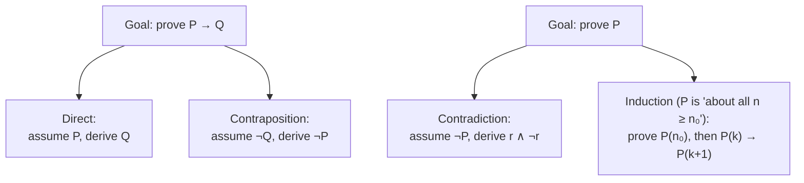

Here is a proof that all horses are the same colour. Claim: in any group of $n$ horses, every horse has the same colour. Base case $n = 1$: one horse, trivially one colour. Inductive step: assume it holds for $n = k$. Take $k + 1$ horses. The first $k$ are all one colour by the hypothesis; the last $k$ are all one colour too; the two groups overlap, so all $k + 1$ match. By induction, the claim holds for every $n$.

Something is wrong — horses are not all one colour — but every individual sentence in that argument sounds fine. Finding the broken step is not a matter of taste or of knowing about horses. It is a matter of knowing exactly what "assume it holds for $k$" licenses and what it does not. That is what logic is for.

**Logic** is the study of the rules that make an argument gapless: what a valid inference looks like, how to state a claim precisely enough to prove, and which of a small fixed set of proof shapes fits which claim. This post covers propositional logic and its inference rules, predicates and quantifiers, the three standard proof strategies each worked in full, induction and strong induction, the broken horse proof taken apart, and a closing look at why the same machinery underlies algorithms and type checkers. The [algebraic structures](/citadel/maths/abstract-algebra) that discrete mathematics studies alongside logic are a separate post.

---
## The surprising economy of proof

Mathematics covers number theory, geometry, analysis, topology — subjects that share almost no vocabulary. Yet every proof in every one of them is built from the same short list of inference moves, and closes with one of only a few overall strategies. There is no proof technique special to graph theory that analysis lacks. Learn the handful of moves once and you can read a proof in any field, and — more to the point — you can tell a real one from the horse argument.

The moves operate on **propositions**: declarative statements that are definitely true or definitely false, never both, never neither. "$7$ is prime" is a proposition. "$x > 3$" is not, until you say what $x$ is. "Is this prime?" is not a proposition at all.

---
## Propositional logic

Compound propositions are built from simpler ones with five **connectives**:

| Connective | Symbol | True exactly when |
| --- | --- | --- |
| negation | $\neg P$ | $P$ is false |
| conjunction | $P \land Q$ | both $P$ and $Q$ are true |
| disjunction | $P \lor Q$ | at least one of $P$, $Q$ is true |
| implication | $P \to Q$ | it is **not** the case that $P$ is true and $Q$ false |
| biconditional | $P \leftrightarrow Q$ | $P$ and $Q$ have the same truth value |

The implication row is the one that trips people. $P \to Q$ is a promise: "if $P$, then $Q$." The promise is broken only in one situation — $P$ happened and $Q$ did not. In every other case the promise stands, including when $P$ is false. "If it rains, I bring an umbrella" is not a lie on a dry day; it simply is not tested. So $P \to Q$ is true whenever $P$ is false, a fact called **vacuous truth**, and it is the reason the horse proof's base case matters so much.

Two compound statements are **logically equivalent**, written $\equiv$, if they have the same truth value under every possible assignment to their variables. You check by building a **truth table** — one row per combination. Take De Morgan's law, $\neg(P \land Q) \equiv \neg P \lor \neg Q$:

| $P$ | $Q$ | $P \land Q$ | $\neg(P \land Q)$ | $\neg P$ | $\neg Q$ | $\neg P \lor \neg Q$ |
| --- | --- | --- | --- | --- | --- | --- |
| T | T | T | F | F | F | F |
| T | F | F | T | F | T | T |
| F | T | F | T | T | F | T |
| F | F | F | T | T | T | T |

Columns four and seven agree in every row, so the equivalence holds — no cleverness required, just eight cells. This is the one place in mathematics where brute force is a complete and rigorous method: with $n$ variables the table has $2^n$ rows, and checking all of them settles the question for good.

**Rules of inference** are argument templates that carry truth from premises to conclusion. The three you use constantly:

- **modus ponens** — from $P$ and $P \to Q$, conclude $Q$. ("It rained; if it rains the match is off; so the match is off.")
- **modus tollens** — from $\neg Q$ and $P \to Q$, conclude $\neg P$. ("The match is on; if it had rained it would be off; so it did not rain.")
- **hypothetical syllogism** — from $P \to Q$ and $Q \to R$, conclude $P \to R$ — chaining implications.

A rule is **valid** if, whenever its premises are all true, its conclusion cannot be false — which you verify with a truth table, exactly as above. The **converse** $Q \to P$ and the **inverse** $\neg P \to \neg Q$ are *not* equivalent to $P \to Q$; only the **contrapositive** $\neg Q \to \neg P$ is. Confusing an implication with its converse is the single most common informal-reasoning error, and the next section's proof strategy is built directly on the contrapositive being safe.

---
## Predicates and quantifiers

Propositional logic cannot express "every integer has a successor" — it has no way to say "every." A **predicate** $P(x)$ is a statement with a free variable, like "$x > 3$" or "$x$ is prime." It has no truth value until $x$ is pinned down, either by substituting a value or by attaching a **quantifier**:

- **universal**, $\forall x\, P(x)$ — $P(x)$ is true for *every* $x$ in the domain;
- **existential**, $\exists x\, P(x)$ — $P(x)$ is true for *at least one* $x$.

Negation flips a quantifier and pushes inside: $\neg \forall x\, P(x) \equiv \exists x\, \neg P(x)$ ("not everyone passed" means "someone failed"), and $\neg \exists x\, P(x) \equiv \forall x\, \neg P(x)$. These are De Morgan's laws again, stretched over a whole domain.

**Order matters when quantifiers nest, and the difference is not subtle.** Over the integers:

$$ \forall x\, \exists y\, (x + y = 0) $$

is true — given any $x$, the choice $y = -x$ works, and $y$ is allowed to depend on $x$. But

$$ \exists y\, \forall x\, (x + y = 0) $$

is false — it demands *one fixed* $y$ that zeroes out every $x$ at once, and no integer does that. Swapping $\forall x\, \exists y$ to $\exists y\, \forall x$ turns a true statement into a false one. In analysis this is precisely the gap between "continuous" ($\delta$ may depend on the point) and "uniformly continuous" (one $\delta$ for all points), and getting the order wrong there is how a proof silently breaks.

---
## Three proof strategies

Almost every proof of an implication $P \to Q$ takes one of two shapes, and almost every proof of a bare statement $P$ takes one of two others:

### Direct proof

Assume $P$, apply definitions and inference rules, arrive at $Q$.

> **Claim.** If $m$ and $n$ are even, so is $m + n$.
>
> **Proof.** By definition, $m = 2a$ and $n = 2b$ for integers $a, b$. Then $m + n = 2a + 2b = 2(a + b)$. Since $a + b$ is an integer, $m + n$ is twice an integer, hence even. $\blacksquare$

The whole proof is: unfold the definition of "even," do one line of algebra, fold the definition back up.

### Proof by contraposition

To prove $P \to Q$, prove the equivalent $\neg Q \to \neg P$. Use it when $\neg Q$ is a more concrete thing to grab hold of than $P$.

> **Claim.** If $n^2$ is even, then $n$ is even.
>
> **Proof (contrapositive).** Suppose $n$ is *odd*, so $n = 2k + 1$. Then $n^2 = 4k^2 + 4k + 1 = 2(2k^2 + 2k) + 1$, which is odd. So $n$ odd forces $n^2$ odd; contrapositively, $n^2$ even forces $n$ even. $\blacksquare$

A direct proof here would have to start from "$n^2 = 2a$" and try to extract a factor of $2$ from $n$ — awkward, because square roots do not respect integers. Assuming $n$ is odd hands you a clean formula immediately.

### Proof by contradiction

To prove $P$, assume $\neg P$ and derive something impossible — a proposition of the form $r \land \neg r$.

> **Claim.** $\sqrt{2}$ is irrational.
>
> **Proof.** Suppose not: $\sqrt{2} = p/q$ with $p, q$ integers sharing no common factor (any common factor can be cancelled first). Squaring, $2q^2 = p^2$, so $p^2$ is even, so $p$ is even (by the previous claim), say $p = 2r$. Then $2q^2 = 4r^2$, i.e. $q^2 = 2r^2$, so $q^2$ is even and $q$ is even too. But now $p$ and $q$ are both even, contradicting "no common factor." The assumption is impossible, so $\sqrt{2}$ is irrational. $\blacksquare$

Notice this proof *reuses* the contraposition result as a lemma. Real proofs are layered: small established facts become one-word steps in bigger ones.

---
## Mathematical induction, in full

To prove $P(n)$ for every integer $n \ge n_0$:

1. **Basis** — prove $P(n_0)$ outright.
2. **Inductive step** — prove that $P(k) \to P(k+1)$ for every $k \ge n_0$. The assumed $P(k)$ is the **inductive hypothesis**.

The two together are a chain of dominoes: the basis tips the first, the step guarantees each tips the next, so all of them fall. Here is a complete example with the algebra shown, not skipped:

> **Claim.** $1 + 2 + \cdots + n = \dfrac{n(n+1)}{2}$ for all $n \ge 1$.
>
> **Basis** ($n = 1$). Left side $= 1$. Right side $= \dfrac{1 \cdot 2}{2} = 1$. They match.
>
> **Step.** Assume $1 + 2 + \cdots + k = \dfrac{k(k+1)}{2}$. Add $k + 1$ to both sides:
> $$ 1 + 2 + \cdots + k + (k+1) = \frac{k(k+1)}{2} + (k+1). $$
> Factor $(k+1)$ out of the right side:
> $$ = (k+1)\left(\frac{k}{2} + 1\right) = (k+1) \cdot \frac{k + 2}{2} = \frac{(k+1)(k+2)}{2}. $$
> That is exactly the formula with $k+1$ in place of $n$. So $P(k) \to P(k+1)$, and by induction the formula holds for all $n \ge 1$. $\blacksquare$

The load-bearing move is "add $k+1$ to both sides": it converts the hypothesis about $k$ into a statement about $k+1$ by doing to the sum exactly what going from $k$ to $k+1$ does.

**Strong induction** widens the hypothesis: to prove $P(k+1)$ you may assume $P(j)$ for *all* $j$ from $n_0$ up to $k$, not just $j = k$. Some claims need the extra reach.

> **Claim.** Every integer $n > 1$ has a prime factor.
>
> **Proof (strong induction).** Basis $n = 2$: $2$ is prime, and is its own prime factor. Step: assume every integer from $2$ to $k$ has a prime factor, and consider $k + 1$. Either $k + 1$ is prime — done — or $k + 1 = ab$ with $2 \le a, b \le k$. By the strong hypothesis $a$ has a prime factor $p$, and $p \mid a \mid (k+1)$, so $p$ is a prime factor of $k + 1$. $\blacksquare$

Ordinary induction would be stuck here: knowing $P(k)$ tells you nothing about the factor $a$, which could be anything below $k+1$. Induction is equivalent to the **well-ordering principle** — every non-empty set of positive integers has a least element — and either can be taken as the axiom and the other proved from it.

---
## Where the horse proof breaks

Now the argument from the top. Base case $n = 1$: fine, one horse is one colour. Inductive step: assume any $k$ horses match; take $k + 1$ horses; the first $k$ match, the last $k$ match, and *if the two overlapping blocks share a horse*, all $k + 1$ match.

That "if" is the bug. The two blocks — horses $1 \ldots k$ and horses $2 \ldots k+1$ — overlap only when $k \ge 2$. For $k = 1$, the step is trying to prove $P(2)$ from $P(1)$, and the blocks are $\{$horse $1\}$ and $\{$horse $2\}$, which do not overlap at all. So the chain of implications $P(1) \to P(2)$ is exactly the link that fails. Every later link $P(k) \to P(k+1)$ for $k \ge 2$ is actually valid — but a chain with its first link cut carries nothing.

The lesson generalises: an inductive step that quietly assumes $k$ is "big enough" for some construction has not proved $P(k) \to P(k+1)$ for *all* $k \ge n_0$, only for large $k$. You then need enough separately-checked base cases to reach the point where the step becomes honest. Here, no finite number of base cases would help, because the step never works for $k = 1$.

---
## Complexity: induction wearing an algorithm's clothes

An **algorithm** is a finite sequence of unambiguous, mechanically executable steps. Its **time complexity** measures step count as a function of input size $n$, and **big-O** bounds the growth: $f(n)$ is $O(g(n))$ if there are constants $C, k$ with $|f(n)| \le C\,|g(n)|$ for all $n \ge k$ — "eventually, up to a constant, no bigger than $g$."

A **recursive** algorithm calls itself on smaller inputs and stops at a base case. Its structure is induction with the arrows reversed: the base case is the induction basis, and "the recursive calls are correct, therefore this call is correct" is the inductive step. Proving a recursion correct is almost always induction on the input size, and analysing its running time is usually induction on the recursion depth. Merge sort's $O(n \log n)$ comes out of the recurrence $T(n) = 2T(n/2) + O(n)$ by exactly this kind of argument.

---
## Coda: information as a measurable quantity

Claude Shannon's 1948 work turned "information" into a number. For a discrete random variable $X$ with outcome probabilities $p(x_i)$, the **entropy**

$$ H(X) = -\sum_i p(x_i)\,\log_b p(x_i) $$

is the average surprise per outcome — bits when $b = 2$, nats when $b = e$. A fair coin has $H = 1$ bit; a two-headed coin has $H = 0$ (no surprise, no information). **Mutual information** $I(X; Y) = H(X) - H(X \mid Y)$ measures how much observing $Y$ cuts the uncertainty about $X$. Shannon's **noisy-channel coding theorem** then says reliable communication is possible at any rate below the channel's **capacity** (the largest achievable $I(X;Y)$) and impossible above it. The [dedicated post](/citadel/miscs/information-theory) develops all of this.

---
## The one idea to keep

A claim is proved only when a gapless chain of inferences reaches it, and the chain is built from a small fixed toolkit: five connectives, a few inference rules, two quantifiers whose order you must respect, and four proof shapes — direct, contrapositive, contradiction, induction. Most errors are not arithmetic slips; they are a converse mistaken for an implication, a quantifier swap, or an inductive step that only works once $k$ is large. The horse proof fails at exactly one link, $P(1) \to P(2)$, and one broken link is enough. The same discipline, applied to sets with operations instead of statements with connectives, produces the theory of [groups, rings, and fields](/citadel/maths/abstract-algebra); applied to programs, it is what a type checker enforces and what a correctness proof establishes.
