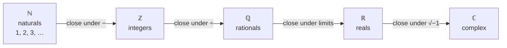

Try to solve $x + 3 = 1$ using only the counting numbers $1, 2, 3, \ldots$ and you cannot: there is no positive whole number three-less-than-one. The honest response is to invent one. Call it $-2$, insist it obey the same arithmetic laws as everything else, and check that nothing breaks. Do this systematically and each unsolvable equation forces a new kind of number: $2x = 1$ forces fractions, $x^2 = 2$ forces irrationals, $x^2 = -1$ forces the complex numbers. Then something remarkable stops the process — once you have $\mathbb{C}$, *every* polynomial equation has a root, and no further invention is needed.

That is the first half of this post: the number systems as a ladder where each rung is added to close a gap. The second half zooms in on one rung — the integers — which turn out to hide enough structure for an entire field. We cover divisibility and unique factorisation, the Euclidean algorithm and the Bézout identity it produces, modular arithmetic, the Chinese Remainder Theorem worked step by step, and the Fermat–Euler–Wilson theorems that govern powers and factorials mod $n$ — ending with how two of them make RSA encryption work. Solving the polynomial equations that built the ladder is the companion post on [equations and inequalities](/citadel/maths/equations-inequalities).

---
## The ladder of number systems

Each arrow adds exactly what the previous system was missing:

- **Naturals** $\mathbb{N}$: $1, 2, 3, \ldots$ — closed under $+$ and $\times$, but not subtraction. (Include $0$ and you have the **whole numbers**.)
- **Integers** $\mathbb{Z}$: naturals, their negatives, and zero — now closed under subtraction.
- **Rationals** $\mathbb{Q}$: quotients $p/q$ with $q \neq 0$ — closed under division by anything non-zero. Equivalently, the decimals that terminate or eventually repeat.
- **Irrationals**: decimals that never terminate and never repeat — $\sqrt{2}$, $\pi$, $e$. Not the ratio of any two integers.
- **Reals** $\mathbb{R}$: rationals and irrationals together — closed under limits, so every convergent sequence has its limit in the set (the property $\mathbb{Q}$ lacks, which is why $\sqrt{2}$ has no rational value).
- **Complex** $\mathbb{C}$: numbers $a + bi$ with $i^2 = -1$ — closed under taking roots of polynomials. The **Fundamental Theorem of Algebra** says every non-constant polynomial with complex coefficients factors completely over $\mathbb{C}$, so the ladder terminates here. The [algebra of $i$](/citadel/maths/complex-numbers) is its own post.

The pattern — spot an operation that escapes the set, then enlarge the set minimally to contain it — is called taking a **closure**, and it recurs throughout mathematics.

---
## Divisibility and the atoms of multiplication

Write $a \mid b$ ("$a$ divides $b$") when $b = ak$ for some integer $k$. A **prime** is an integer greater than $1$ whose only positive divisors are $1$ and itself; every other integer above $1$ is **composite**.

The **Fundamental Theorem of Arithmetic**: every integer $n > 1$ factors into primes, and that factorisation is unique apart from the order of the factors. So $360 = 2^3 \cdot 3^2 \cdot 5$ and there is no other way to do it. Primes are "the atoms of multiplication" — the irreducible pieces every integer is assembled from — and the uniqueness is what makes that phrase more than a slogan: it lets you read off every divisor of $n$ from its prime signature, count them, and compare two numbers' factorisations to get their gcd and lcm directly.

Euclid's proof that the primes never run out is worth carrying: suppose $p_1, \ldots, p_k$ were all of them; then $N = p_1 p_2 \cdots p_k + 1$ leaves remainder $1$ on division by each $p_i$, so none of them divides $N$, so $N$'s prime factor (it has one) is a new prime. Contradiction.

---
## The Euclidean algorithm and Bézout's identity

$\gcd(a, b)$ is the largest integer dividing both $a$ and $b$; $\operatorname{lcm}(a, b)$ is the smallest positive integer both divide. They satisfy

$$ a \cdot b = \gcd(a, b) \cdot \operatorname{lcm}(a, b). $$

You *could* compute $\gcd(a,b)$ by factorising both numbers — but factorisation is slow, and there is a far faster route that never factorises anything. It rests on one identity: **any common divisor of $a$ and $b$ is also a common divisor of $b$ and $a \bmod b$, and vice versa**, so

$$ \gcd(a, b) = \gcd(b,\ a \bmod b). $$

Each step shrinks the numbers; the last non-zero remainder is the gcd. For $\gcd(1071, 462)$:

$$
\begin{aligned}
1071 &= 2 \cdot 462 + 147, \\
462 &= 3 \cdot 147 + 21, \\
147 &= 7 \cdot 21 + 0.
\end{aligned}
$$

The last non-zero remainder is $21$, so $\gcd(1071, 462) = 21$. Three divisions, no factorising — and the number of steps is provably $O(\log \min(a, b))$, which is why this 2300-year-old algorithm is still the one every computer-algebra system uses.

Now run it **backwards**. Solve each line for its remainder and substitute upward:

$$
\begin{aligned}
21 &= 462 - 3 \cdot 147 \\
   &= 462 - 3\,(1071 - 2 \cdot 462) \\
   &= 7 \cdot 462 - 3 \cdot 1071.
\end{aligned}
$$

So $21 = (-3)\cdot 1071 + 7 \cdot 462$. This is **Bézout's identity**: for any $a, b$ there are integers $x, y$ with $ax + by = \gcd(a, b)$, and the **extended Euclidean algorithm** produces them as a by-product. Bézout is the workhorse behind modular inverses, the Chinese Remainder Theorem, and RSA key generation — everything below leans on it.

---
## Modular arithmetic

**Modular arithmetic** does arithmetic on remainders: numbers wrap around at the **modulus** $n$, like hours on a 12-hour clock. Write $a \equiv b \pmod n$ when $n \mid (a - b)$ — equivalently, when $a$ and $b$ leave the same remainder on division by $n$. So $38 \equiv 14 \pmod{12}$ because $38 - 14 = 24$ is a multiple of $12$.

Congruences add and multiply just like equations: if $a \equiv b$ and $c \equiv d \pmod n$, then $a + c \equiv b + d$ and $ac \equiv bd \pmod n$. This is what lets you reduce early and often — to find $7^{100} \bmod 5$ you note $7 \equiv 2$, then $2^4 = 16 \equiv 1$, so $7^{100} \equiv 2^{100} = (2^4)^{25} \equiv 1$.

**Division is the subtle operation.** You can divide by $a$ mod $n$ only when $a$ has a **multiplicative inverse** — some $a^{-1}$ with $a \cdot a^{-1} \equiv 1 \pmod n$ — and that happens exactly when $\gcd(a, n) = 1$. When it does, Bézout gives the inverse for free: $ax + ny = 1$ means $ax \equiv 1 \pmod n$, so $x$ is $a^{-1}$. The residues $\{0, 1, \ldots, n-1\}$ under $+$ and $\times$ form the ring $\mathbb{Z}/n\mathbb{Z}$ — the first non-trivial example studied in [abstract algebra](/citadel/maths/abstract-algebra), and a field exactly when $n$ is prime.

---
## The Chinese Remainder Theorem, step by step

**Claim.** If the moduli $n_1, \ldots, n_k$ are **pairwise coprime** ($\gcd(n_i, n_j) = 1$ for $i \neq j$), then the system

$$ x \equiv a_1 \pmod{n_1}, \quad \ldots, \quad x \equiv a_k \pmod{n_k} $$

has a solution, unique modulo $N = n_1 n_2 \cdots n_k$.

The construction: let $N_i = N / n_i$ (the product of all the *other* moduli). Since $\gcd(N_i, n_i) = 1$, let $M_i \equiv N_i^{-1} \pmod{n_i}$ (via Bézout). Then

$$ x = \sum_{i} a_i\, N_i\, M_i \pmod N. $$

Why it works: modulo $n_j$, every term with $i \neq j$ contains the factor $n_j$ (it is inside $N_i$), so it vanishes; the surviving term is $a_j N_j M_j \equiv a_j \cdot 1 = a_j$. Each congruence is satisfied by design.

**Worked example.** Solve $x \equiv 2 \pmod 3$, $\ x \equiv 3 \pmod 5$, $\ x \equiv 2 \pmod 7$.

Here $N = 105$, and $N_1 = 35$, $N_2 = 21$, $N_3 = 15$. Find each inverse:

- $35 \equiv 2 \pmod 3$, and $2 \cdot 2 = 4 \equiv 1$, so $M_1 = 2$.
- $21 \equiv 1 \pmod 5$, so $M_2 = 1$.
- $15 \equiv 1 \pmod 7$, so $M_3 = 1$.

Then $x = 2\cdot 35 \cdot 2 + 3 \cdot 21 \cdot 1 + 2 \cdot 15 \cdot 1 = 140 + 63 + 30 = 233 \equiv 233 - 2\cdot 105 = 23 \pmod{105}$. Check: $23 = 7\cdot 3 + 2$, $\ 23 = 4 \cdot 5 + 3$, $\ 23 = 3 \cdot 7 + 2$. All three hold.

The CRT is why a computation modulo a large $N$ can be broken into independent, smaller computations modulo each prime power of $N$ and reassembled — the trick behind fast big-integer arithmetic and behind the speed-up RSA implementations get by working mod $p$ and mod $q$ separately.

---
## Fermat, Euler, Wilson

**Fermat's little theorem.** For a prime $p$ and any $a$ not divisible by $p$,

$$ a^{p-1} \equiv 1 \pmod p, $$

equivalently $a^p \equiv a \pmod p$ for *all* $a$. Concretely, $2^{6} = 64 = 9 \cdot 7 + 1 \equiv 1 \pmod 7$. The theorem makes exponentiation mod $p$ periodic with period dividing $p - 1$, so exponents can be reduced mod $p - 1$ before you compute anything.

**Euler's theorem** lifts this to any modulus. Euler's **totient** $\varphi(n)$ counts the integers in $\{1, \ldots, n\}$ coprime to $n$. It is **multiplicative** — $\varphi(mn) = \varphi(m)\varphi(n)$ when $\gcd(m, n) = 1$ — and $\varphi(p) = p - 1$ for prime $p$, so for $n = pq$ a product of two primes, $\varphi(n) = (p-1)(q-1)$. Then for any $a$ with $\gcd(a, n) = 1$,

$$ a^{\varphi(n)} \equiv 1 \pmod n. $$

Fermat's theorem is the special case $n = p$.

**How RSA uses it.** Pick primes $p, q$, set $n = pq$ and $\varphi = (p-1)(q-1)$. Choose a public exponent $e$ coprime to $\varphi$, and let $d \equiv e^{-1} \pmod{\varphi}$ (Bézout again). Encryption is $c = m^e \bmod n$; decryption is $c^d \bmod n$. It inverts because $ed \equiv 1 \pmod \varphi$, so $ed = 1 + k\varphi$, and

$$ c^d = m^{ed} = m^{1 + k\varphi} = m \cdot (m^{\varphi})^{k} \equiv m \cdot 1^k = m \pmod n. $$

The security rests on the gap between the two directions: computing $\varphi$ (hence $d$) requires factoring $n$ into $p$ and $q$, and no fast general factoring algorithm is known, while encrypting and decrypting are just fast modular exponentiations.

**Wilson's theorem.** An integer $p > 1$ is prime **if and only if**

$$ (p - 1)! \equiv -1 \pmod p. $$

Proof sketch: mod a prime, pair each residue in $\{2, \ldots, p-2\}$ with its inverse, distinct from itself; each pair multiplies to $1$, so the whole product collapses to $1 \cdot (p - 1) \equiv -1$. It is a clean characterisation of primality — but computing $(p-1)!$ takes $p - 2$ multiplications, so it is useless as an actual test.

---
## The one idea to keep

Two structures carry the post. The number systems are a ladder of closures — subtraction builds $\mathbb{Z}$, division builds $\mathbb{Q}$, limits build $\mathbb{R}$, $\sqrt{-1}$ builds $\mathbb{C}$ — and it stops at $\mathbb{C}$ because every polynomial already factors there. The integers, under divisibility and congruence, carry an arithmetic of their own: primes are the unique building blocks, the Euclidean algorithm is the fast workhorse and it hands you Bézout's $ax + by = \gcd(a,b)$ for free, and Bézout in turn powers modular inverses, the Chinese Remainder Theorem, and RSA. Fermat and Euler make modular powers periodic; Wilson characterises primes but too slowly to use. The polynomial equations that motivated the ladder are solved in [equations and inequalities](/citadel/maths/equations-inequalities), and the ring structure of $\mathbb{Z}/n\mathbb{Z}$ is developed in [abstract algebra](/citadel/maths/abstract-algebra).
