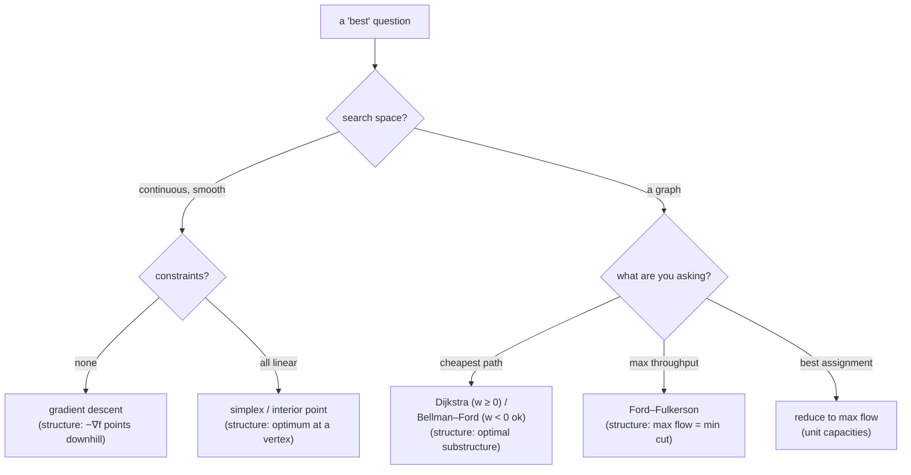

"What is the answer?" has one shape. "What is the *best* answer?" has another: it asks for the input that maximises or minimises some quantity, often while obeying constraints, over a space that can be astronomically large. Checking every candidate is almost never an option — a linear program with $50$ constraints can have more vertices than there are atoms in the room, and a road network has too many paths to enumerate.

What makes these problems solvable anyway is that a well-posed "best" question always comes with **structure you can exploit**: a gradient that reliably points downhill, an optimum that is forced onto a polytope vertex, subpaths of shortest paths that are themselves shortest, a flow throttled by one identifiable set of edges. This post covers the continuous side — **gradient descent** and the **simplex method** — and the graph side — **shortest paths**, **maximum flow**, and **matching** — with the emphasis on which structural fact each algorithm is standing on. It is the companion to [numerical analysis](/citadel/maths/numerical-analysis); together they cover the algorithmic core of applied mathematics.

---
## Smooth minimisation: follow the gradient down

To minimise a differentiable function $f(\mathbf{x})$ of many variables with no constraints, use the one fact calculus gives you: $-\nabla f(\mathbf{x})$ points in the direction $f$ decreases fastest. So step that way and repeat:

$$ \mathbf{x}_{n+1} = \mathbf{x}_n - \gamma_n\, \nabla f(\mathbf{x}_n). $$

The scalar $\gamma_n > 0$ is the **step size** (in machine learning, the **learning rate**), and it is where the method lives or dies. Too small and the iterates crawl; too large and they overshoot the valley floor and can diverge. On the quadratic $f(x) = \tfrac12 a x^2$ the update is $x_{n+1} = (1 - \gamma a) x_n$, which converges iff $|1 - \gamma a| < 1$, i.e. $0 < \gamma < 2/a$ — a concrete window, and a warning that the safe step size depends on the curvature $a$. When the curvature differs wildly between directions (an elongated valley), a single scalar $\gamma$ cannot suit all of them, and plain descent zig-zags; this is what momentum, AdaGrad, and Adam are built to fix.

Descent halts where $\nabla f = \mathbf{0}$ — a **stationary point**. For a **convex** $f$ (one whose graph never bulges above a chord) that point is the global minimum. Otherwise it is only local, and where you start decides which basin you fall into. This single update, scaled to billions of parameters, is how essentially every neural network is trained.

---
## Linear programming and the simplex method

A **linear program** optimises a linear objective subject to linear equality and inequality constraints — the standard model for resource allocation, blending, scheduling, and logistics. Two facts about its geometry make it tractable:

- The **feasible set** — all points satisfying the constraints — is a **convex polytope**, an intersection of half-spaces.
- A linear objective, having no curvature, attains its optimum at a **vertex** of that polytope (or along an edge, if it is flat there — but then a vertex is still optimal).

So you never need to search the interior; you only need to search vertices. The **simplex method** (Dantzig, 1947) does this without listing them all: start at a vertex, look along each outgoing edge, step to whichever adjacent vertex most improves the objective, and stop when no adjacent vertex is better — which, by convexity, means you are globally optimal. In practice it is remarkably fast, typically a small multiple of the number of constraints. In the worst case (the Klee–Minty cube) it can visit exponentially many vertices, and **degeneracy** — a pivot that does not actually improve the objective — can cause cycling, prevented by pivot rules like Bland's. Interior-point methods trade the vertex-walk for a path through the interior and give polynomial worst-case guarantees; they win on very large problems.

**Duality** is the structural payoff worth remembering: every LP (the *primal*) has a partner LP (the *dual*) built from the same data with rows and columns swapped, and at the optimum their objective values are equal. The dual variables are **shadow prices** — the marginal value of relaxing each constraint by one unit — and weak duality (any feasible dual value bounds any feasible primal value) gives you a certificate of optimality: exhibit a primal and a dual solution with matching values and you have *proved* both are optimal.

---
## Graphs

A **graph** $G = (V, E)$ is a set of **vertices** joined by **edges**; a **digraph** has directed edges. Put **weights** on the edges and structural questions ("is there a path from $A$ to $B$?") become quantitative ones ("what is the cheapest such path, and what limits the total flow?"). Algorithm cost is measured against $|V|$ and $|E|$.

---
## Shortest paths and the principle of optimality

Given a weighted graph, find the least-total-weight path between two vertices. The fact that makes this feasible is **Bellman's principle of optimality**: *any subpath of a shortest path is itself a shortest path.* If the cheapest route from $A$ to $C$ runs through $B$, its $A$-to-$B$ portion is the cheapest $A$-to-$B$ route — otherwise you could cut out that portion, splice in a cheaper one, and beat the supposedly-optimal $A$-to-$C$ route.

This is what lets you build long shortest paths out of short ones rather than searching path space:

- **Dijkstra's algorithm** (non-negative weights). Keep a tentative distance to every vertex; repeatedly finalise the unfinalised vertex with the smallest tentative distance, and **relax** its outgoing edges (if `dist[u] + w(u,v) < dist[v]`, lower `dist[v]`). Once a vertex is finalised its distance never changes — which is *only* valid when weights are non-negative, since a later detour can then never come back cheaper. With a binary heap it runs in $O((|V| + |E|) \log |V|)$.
- **Bellman–Ford** (negative weights allowed). Relax *every* edge, $|V| - 1$ times over. After $k$ rounds, every shortest path using at most $k$ edges is correct; since a shortest path is simple it has at most $|V| - 1$ edges. A further round that still improves something proves a **negative cycle** exists and no shortest path is defined. Cost $O(|V|\,|E|)$.

The split is entirely about the structural assumption: Dijkstra's greedy "finalise the nearest" step is a theorem when weights are non-negative and simply false when they are not.

---
## Flows in networks, and min-cut

A **flow network** is a digraph with a **capacity** $c(u,v) \ge 0$ on each edge, a **source** $s$, and a **sink** $t$. A **flow** assigns each edge a value in $[0, c(u,v)]$ so that at every vertex except $s$ and $t$, inflow equals outflow. The **maximum-flow** problem asks for the greatest total rate from $s$ to $t$.

A **cut** is a partition of $V$ into a side containing $s$ and a side containing $t$; its **capacity** is the total capacity of edges crossing from the $s$-side to the $t$-side. Every unit of flow must cross every cut, so *any* cut's capacity is an upper bound on the max flow. The **Max-Flow Min-Cut theorem** says the bound is tight: the maximum flow value **equals** the minimum cut capacity. The bottleneck is not a vague notion — it is a specific set of saturated edges, and the Ford–Fulkerson method finds a max flow and a min cut together by repeatedly pushing flow along an augmenting path in the *residual* graph until none remains; the reachable set from $s$ in the final residual graph is one side of a min cut.

**Small worked network.** Vertices $s, a, b, t$; capacities $s\to a = 3$, $s \to b = 2$, $a \to b = 1$, $a \to t = 2$, $b \to t = 3$. Push $2$ along $s \to a \to t$, then $2$ along $s \to b \to t$, then $1$ along $s \to a \to b \to t$ — total $5$, and now $s \to a$ ($3$) and $s \to b$ ($2$) are both saturated. The cut $\{s\} \mid \{a, b, t\}$ has capacity $3 + 2 = 5$. Flow meets cut; both are optimal.

---
## Bipartite matching is a flow problem

A graph is **bipartite** if its vertices split into two sets $U$ and $V$ with every edge running between them — the model for assignments: workers to jobs, students to projects, medical residents to hospitals. A **matching** is a set of edges with no shared endpoint; a **maximum matching** pairs up as many vertices as possible.

Two classical theorems: **Hall's marriage theorem** — a matching saturating all of $U$ exists iff every subset $S \subseteq U$ has at least $|S|$ neighbours in $V$ (no group of $k$ workers collectively qualified for fewer than $k$ jobs); **König's theorem** — in a bipartite graph, the maximum matching size equals the minimum **vertex cover** size.

And the reduction that ties this section to the last: add a source $s$ with a capacity-$1$ edge to every vertex of $U$, a sink $t$ with a capacity-$1$ edge from every vertex of $V$, and give every original edge capacity $1$. An integer max flow of value $k$ is exactly a matching of size $k$ — the unit capacities force each $U$-vertex and each $V$-vertex to be used at most once. König's theorem then falls straight out of max-flow/min-cut. One structural insight, reused.

---
## The one idea to keep

A "best" question is only tractable because it hides structure, and choosing the algorithm *is* recognising which structure applies. A gradient gives a guaranteed descent direction but only convexity makes the stationary point global. A linear objective is forced to a polytope vertex, so the simplex method walks vertices and duality certifies the answer. Subpaths of shortest paths are shortest, so shortest paths compose — greedily when weights are non-negative, by full relaxation when they are not. And a flow is capped by its minimum cut, exactly, which turns bipartite matching into a flow computation. The continuous-approximation methods behind gradient steps and simplex tableaux — root-finding, quadrature, ODE solvers — are in [numerical analysis](/citadel/maths/numerical-analysis), and the matrix machinery underneath is in [linear algebra](/citadel/maths/linear-algebra).
