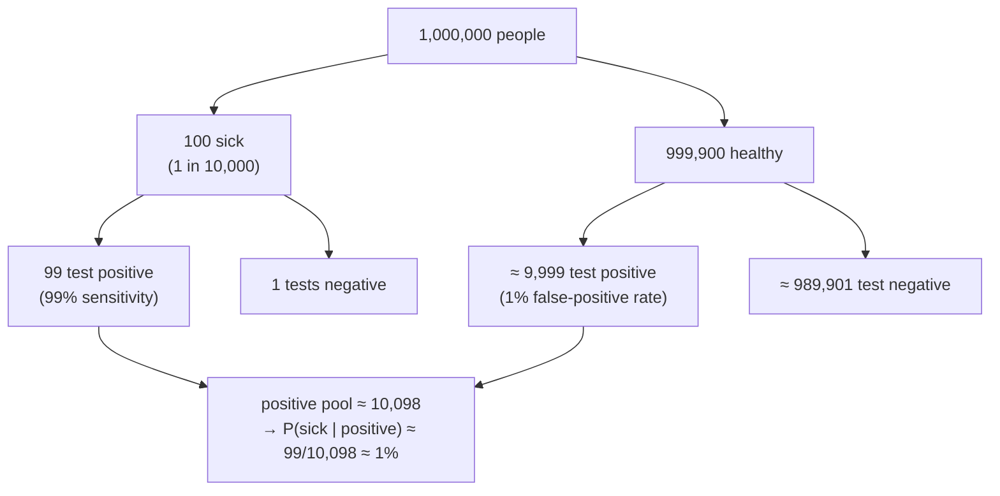

A test for a disease is 99% accurate — 99% of sick people test positive, 99% of healthy people test negative. The disease affects 1 in 10,000 people. You test positive. What is the chance you actually have it?

The intuitive answer is "about 99%." The correct answer is **under 1%**. Out of a million people, about 100 are sick and (at 99% sensitivity) 99 test positive; of the ~999,900 healthy people, 1% — nearly 10,000 — also test positive. Your positive result puts you in a pool of ~10,100 people of whom only 99 are sick: roughly $99 / 10{,}100 \approx 0.98\%$. The test is good; the disease is just rarer than the test's error rate, and that prior dominates.

This is not a trick. It is what the arithmetic of conditional probability says, and getting it wrong has real consequences in medicine, law, and spam filtering. Probability is the discipline that makes "how likely?" computable, and it all comes from three short axioms — probabilities are non-negative, the certain event has probability $1$, disjoint events add. This post builds the calculus on top of them: the addition and multiplication rules, conditional probability and independence, **Bayes' theorem** (which is exactly the disease calculation, formalised), random variables, and the standard distributions — binomial, Poisson, normal, exponential, uniform — with their means and variances. Going the other way, from data back to a distribution, is the companion post on [statistics](/citadel/maths/statistics).

---
## The language of chance

- **Random experiment** — a process whose outcome is not known in advance, though the set of possible outcomes is.
- **Sample space** $S$ — the set of all distinct outcomes. A die roll has $S = \{1, 2, 3, 4, 5, 6\}$.
- **Event** — any subset of $S$. *Simple* if it is one outcome, *compound* if more ("even" $= \{2, 4, 6\}$).
- **Trial** — one run of the experiment.

Events combine like sets: **complement** $A'$ ("$A$ does not occur"), **union** $A \cup B$ ("$A$ or $B$ or both"), **intersection** $A \cap B$ ("both"). Two events are **mutually exclusive** if $A \cap B = \emptyset$, and a collection is **exhaustive** if its union is all of $S$.

---
## The three axioms and what falls out of them

Kolmogorov's axioms for a probability $P$ on $S$:

1. **non-negativity** — $P(A) \ge 0$;
2. **normalisation** — $P(S) = 1$;
3. **countable additivity** — for pairwise disjoint $A_1, A_2, \ldots$, $\ P\!\left(\bigcup_i A_i\right) = \sum_i P(A_i)$.

That is the entire foundation. Everything else is derived. $P(\emptyset) = 0$ (from axiom 3 with all $A_i = \emptyset$). $P(A') = 1 - P(A)$ (since $A$ and $A'$ are disjoint and union to $S$). $0 \le P(A) \le 1$ (non-negativity plus the complement rule). And when $S$ has $N$ equally likely outcomes, $N_A$ of them in $A$, additivity gives the **classical formula**

$$ P(A) = \frac{N_A}{N}, $$

which is why so many probability questions reduce to [a counting problem](/citadel/maths/permutation-combination) — enumerate the favourable outcomes, divide by the total.

---
## Combining events

**Addition rule.** For any $A, B$,

$$ P(A \cup B) = P(A) + P(B) - P(A \cap B). $$

You subtract the overlap because $P(A) + P(B)$ counts it twice. For three events it is inclusion–exclusion: add the singles, subtract the three pairwise intersections, add the triple intersection back.

**Conditional probability.** The probability of $A$ *given* that $B$ has occurred:

$$ P(A \mid B) = \frac{P(A \cap B)}{P(B)}, \qquad P(B) \neq 0. $$

Geometrically, you have shrunk the sample space to $B$ and are asking what fraction of that smaller world is also in $A$. Rearranged, this is the **multiplication rule**:

$$ P(A \cap B) = P(B)\, P(A \mid B) = P(A)\, P(B \mid A). $$

**Independence.** $A$ and $B$ are independent when learning one tells you nothing about the other:

$$ P(A \cap B) = P(A)\, P(B) \iff P(A \mid B) = P(A). $$

Independence is an *assumption you justify*, not a default. Two draws from a deck without replacement are not independent; two coin flips are.

---
## Bayes' theorem: the disease test, formalised

Let $E_1, \ldots, E_n$ **partition** $S$ — mutually exclusive and exhaustive. The **law of total probability** rebuilds $P(A)$ from the pieces:

$$ P(A) = \sum_{i=1}^{n} P(A \mid E_i)\, P(E_i). $$

**Bayes' theorem** then runs the conditioning backwards, converting $P(A \mid E_i)$ into $P(E_i \mid A)$:

$$ P(E_i \mid A) = \frac{P(A \mid E_i)\, P(E_i)}{\sum_{j} P(A \mid E_j)\, P(E_j)}. $$

The names: $P(E_i)$ is the **prior** (what you believed before), $P(A \mid E_i)$ the **likelihood** (how well each hypothesis predicts the evidence), $P(E_i \mid A)$ the **posterior** (your revised belief).

Now the disease. Think of a million people flowing down a tree:

Let $E_1$ = "sick," $E_2$ = "healthy," $A$ = "tests positive." Given: $P(E_1) = 0.0001$, $P(E_2) = 0.9999$, $P(A \mid E_1) = 0.99$, $P(A \mid E_2) = 0.01$.

$$
P(E_1 \mid A) = \frac{0.99 \times 0.0001}{0.99 \times 0.0001 + 0.01 \times 0.9999}
= \frac{0.000099}{0.000099 + 0.009999}
\approx 0.0098.
$$

Under 1%, matching the head-count argument. The denominator — the total probability of a positive test — is swamped by the false-positive term $0.01 \times 0.9999$ because there are so many more healthy people. Retest an already-positive patient and the prior is now ~1%, not 0.01%, and a second positive pushes the posterior to about 50%; that is why screening protocols confirm.

---
## Random variables

A **random variable** $X$ assigns a number to each outcome. A **discrete** $X$ has a probability mass function $P(X = x_i) = p_i$ with $\sum p_i = 1$; a **continuous** $X$ has a density $f(x) \ge 0$ with $\int_{-\infty}^{\infty} f = 1$ and $P(a \le X \le b) = \int_a^b f\, dx$ (so for a continuous variable, $P(X = x) = 0$ for every single point).

Two summary numbers:

$$ \mu = E[X] = \sum x_i\, p_i \ \text{ or } \int x\, f(x)\, dx, \qquad \sigma^2 = E[(X - \mu)^2] = E[X^2] - \mu^2. $$

The mean is the balance point of the distribution; the variance is the average squared distance from it, and $\sigma = \sqrt{\sigma^2}$ brings it back to the variable's own units. **Linearity of expectation**, $E[X + Y] = E[X] + E[Y]$, holds *even when $X$ and $Y$ are dependent* — an unreasonably useful fact. Variance is not linear: $\operatorname{Var}(X + Y) = \operatorname{Var}(X) + \operatorname{Var}(Y) + 2\operatorname{Cov}(X, Y)$, and only when $X, Y$ are independent (so $\operatorname{Cov} = 0$) do variances simply add. The **correlation** $\rho = \operatorname{Cov}(X, Y) / (\sigma_X \sigma_Y) \in [-1, 1]$ normalises covariance to a unitless strength of *linear* association — $\rho = 0$ rules out a linear trend, not any relationship at all.

---
## Discrete distributions

| Distribution | Models | PMF | Mean | Variance |
| --- | --- | --- | --- | --- |
| **Bernoulli($p$)** | one success/failure trial | $p^x (1-p)^{1-x}$, $x \in \{0,1\}$ | $p$ | $p(1-p)$ |
| **Binomial($n, p$)** | successes in $n$ independent trials | $\binom{n}{k} p^k (1-p)^{n-k}$ | $np$ | $np(1-p)$ |
| **Negative binomial($r, p$)** | failures before the $r$th success | $\binom{k+r-1}{r-1} p^r (1-p)^k$ | $\frac{r(1-p)}{p}$ | $\frac{r(1-p)}{p^2}$ |
| **Poisson($\lambda$)** | events in an interval at mean rate $\lambda$ | $\frac{e^{-\lambda} \lambda^k}{k!}$ | $\lambda$ | $\lambda$ |
| **Hypergeometric($N, K, n$)** | successes in $n$ draws *without* replacement | $\frac{\binom{K}{k}\binom{N-K}{n-k}}{\binom{N}{n}}$ | $n\frac{K}{N}$ | $n\frac{K}{N}\big(1-\frac{K}{N}\big)\frac{N-n}{N-1}$ |

The three are related. The $\binom{n}{k}$ in the binomial PMF is the [count](/citadel/maths/binomial-theory) of *which* $k$ trials succeeded. Poisson is the limit of Binomial($n, p$) as $n \to \infty$, $p \to 0$ with $np = \lambda$ fixed — which is why it models rare events over a continuum (radioactive decays per second, typos per page). Hypergeometric is the binomial's finite-population cousin; as $N \to \infty$ with $K/N$ fixed, sampling without replacement becomes indistinguishable from sampling with it, and it converges to the binomial.

---
## Continuous distributions

**Normal $N(\mu, \sigma^2)$** — the bell curve,

$$ f(x) = \frac{1}{\sigma\sqrt{2\pi}}\, \exp\!\left(-\frac{(x - \mu)^2}{2\sigma^2}\right). $$

Standardising with $Z = (X - \mu)/\sigma$ turns any normal into the **standard normal** $N(0, 1)$, so one table serves all. Its dominance in practice is not an accident of nature — it is forced by the Central Limit Theorem, which makes sums and averages of *anything* tend to normal ([statistics](/citadel/maths/statistics) develops this).

**Exponential($\lambda$)** — the waiting time until the next Poisson event: $f(x) = \lambda e^{-\lambda x}$ for $x \ge 0$, mean $1/\lambda$, variance $1/\lambda^2$. It is **memoryless**: $P(X > s + t \mid X > s) = P(X > t)$ — a component that has already survived $s$ hours is, distributionally, as good as new. This is the property that makes it the standard model for radioactive decay and the *wrong* model for the lifetime of a wearing part.

**Uniform** — every value equally likely. On $[a, b]$: $f(x) = 1/(b - a)$, mean $(a + b)/2$, variance $(b - a)^2/12$. The discrete version puts $1/n$ on each of $n$ outcomes and is the model for a fair die.

---
## The one idea to keep

Three axioms generate every combining rule, so probability is not a bag of formulas — it is one short foundation and its consequences. Conditioning is a single definition, $P(A \mid B) = P(A \cap B)/P(B)$, and **Bayes' theorem is that definition run in both directions**: it takes a likelihood (how well each hypothesis predicts the data) and a prior (what you believed first) and returns a posterior. The rare-disease result is the case everyone should carry: when the base rate is smaller than the test's error rate, a positive test is more likely a false alarm than a true finding, and no amount of test accuracy alone fixes that — you need a better prior or a second test. The distributions are bookkeeping of probability across a random variable's values, each summarised by a mean and a variance. Turning a sample of data back into an estimate of the distribution is [statistics](/citadel/maths/statistics).
