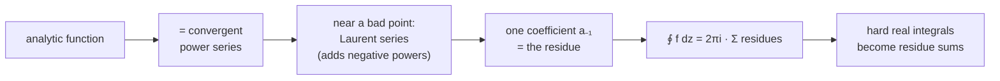

[Cauchy's integral theorem](/citadel/maths/complex-analysis) says the integral of an analytic function around a closed loop is zero. The **residue theorem** is what happens when the function *isn't* quite analytic — when it has a few isolated bad points inside the loop. Then the integral is $2\pi i$ times the sum of one number per bad point, the **residue**, read straight off a series expansion.

This post builds to that: convergence of complex series, power series and Taylor's theorem, the **Laurent series** that expands a function in an annulus around a singularity, the classification of singularities into removable, pole, and essential, and finally the residue theorem — including its surprising use for evaluating real integrals that ordinary calculus can't touch.

---
## Convergence in the complex plane

A sequence $z_n \to L$ if $|z_n - L| \to 0$, and this holds iff the real parts and imaginary parts converge separately. Likewise a series $\sum z_n = \sum x_n + i\sum y_n$ converges iff both real series do. The standard machinery carries over with $|\cdot|$ as distance:

- **divergence test** — if $\sum z_n$ converges then $z_n \to 0$; contrapositive kills many series on sight;
- **absolute convergence** — if $\sum |z_n|$ converges, so does $\sum z_n$, and unconditionally (reordering is safe);
- **ratio test** — $\lim |a_{n+1}/a_n| = L$: converges for $L < 1$, diverges for $L > 1$;
- **root test** — same verdicts with $L = \limsup |a_n|^{1/n}$;
- **comparison** — $|a_n| \le b_n$ with $\sum b_n$ convergent forces $\sum a_n$ to converge.

---
## Power series

$$ \sum_{n=0}^{\infty} a_n (z - z_0)^n $$
has a **radius of convergence** $R$: it converges absolutely for $|z - z_0| < R$ and diverges for $|z - z_0| > R$, with $R$ given by the **Cauchy–Hadamard** formula
$$ \frac{1}{R} = \limsup_{n \to \infty} |a_n|^{1/n} $$
Inside that disk the series is analytic, can be differentiated and integrated term by term (each operation keeping the same $R$), and its representation is **unique** — if two power series agree as functions, their coefficients agree.

---
## Taylor's theorem

The headline result of the [analytic-function theory](/citadel/maths/complex-analysis): a function analytic at $z_0$ *equals* its power series there, the **Taylor series**
$$ f(z) = \sum_{n=0}^{\infty} \frac{f^{(n)}(z_0)}{n!}\,(z - z_0)^n $$
(a **Maclaurin series** when $z_0 = 0$). If $f$ is analytic on the closed disk $|z - z_0| \le r$ with $M = \max_{|w - z_0| = r}|f(w)|$, the error after $N$ terms is bounded:
$$ \left| f(z) - \sum_{n=0}^{N} a_n (z - z_0)^n \right| \le \frac{M}{r^{N+1}}\,|z - z_0|^{N+1} $$
The familiar expansions hold for complex $z$ unchanged: $\dfrac{1}{1 - z} = \sum z^n$ ($|z| < 1$), $e^z = \sum \dfrac{z^n}{n!}$, $\sin z = \sum (-1)^n \dfrac{z^{2n+1}}{(2n+1)!}$, $\cos z = \sum (-1)^n \dfrac{z^{2n}}{(2n)!}$, and $\ln(1 + z) = \sum (-1)^{n-1}\dfrac{z^n}{n}$ ($|z| < 1$).

---
## Uniform convergence

$\sum f_n(z) \to s(z)$ **uniformly** on a region $G$ if the same $N$ works for every $z$ in $G$: for all $\varepsilon > 0$ there is an $N(\varepsilon)$ — *not depending on $z$* — with $|s_n(z) - s(z)| < \varepsilon$ for $n > N$. It is the strength that lets you swap a limit with an integral or preserve continuity: a uniform limit of continuous functions is continuous. The **Weierstrass M-test** is the usual check — if $|f_n(z)| \le M_n$ on $G$ and $\sum M_n$ converges, then $\sum f_n$ converges uniformly. Every power series converges uniformly on any closed sub-disk $|z - z_0| \le r < R$.

---
## Laurent series

If $f$ fails to be analytic at $z_0$ but is analytic in a surrounding **annulus** $R_1 < |z - z_0| < R_2$, it still has a series — now with negative powers:
$$ f(z) = \sum_{n=-\infty}^{\infty} a_n (z - z_0)^n = \underbrace{\cdots + \frac{a_{-2}}{(z - z_0)^2} + \frac{a_{-1}}{z - z_0}}_{\text{principal part}} + a_0 + a_1(z - z_0) + \cdots $$
This is the **Laurent series**; the negative-power piece is the **principal part**. The non-negative powers converge for $|z - z_0| < R_2$, the negative powers for $|z - z_0| > R_1$, and both together inside the annulus. The coefficients are unique.

---
## Singularities and zeros

A **singularity** is a point where $f$ is not analytic; an **isolated** one has a singularity-free neighbourhood around it. The principal part of the Laurent series classifies it:

- **removable** — no principal part; $f$ can be redefined at $z_0$ to be analytic (e.g. $\sin z / z$ at $0$);
- **pole of order $m$** — finitely many principal-part terms, highest being $(z - z_0)^{-m}$; then $|f(z)| \to \infty$ as $z \to z_0$;
- **essential** — infinitely many principal-part terms. **Picard's theorem**: near such a point $f$ takes every complex value, with at most one exception, in every neighbourhood.

Zeros are the mirror image: the zeros of a non-zero analytic function are isolated, and if $f$ has a zero of order $n$ at $z_0$, then $1/f$ has a pole of order $n$ there. Behaviour "at infinity" is studied by substituting $z = 1/w$ and looking at $w = 0$.

---
## The residue theorem

The **residue** of $f$ at an isolated singularity $z_0$ is the single coefficient $a_{-1}$ of its Laurent series there, written $\operatorname{Res}(f, z_0)$. It is the only coefficient that survives integration around a small loop: $\oint (z - z_0)^k\,dz$ is $2\pi i$ for $k = -1$ and $0$ for every other integer $k$.

**Cauchy's residue theorem.** If $C$ is a positively oriented simple closed contour and $f$ is analytic inside and on $C$ except at isolated singularities $z_1, \ldots, z_k$ inside,
$$ \oint_C f(z)\,dz = 2\pi i \sum_{j=1}^{k} \operatorname{Res}(f, z_j) $$
Computing a residue without writing the whole series:
$$ \text{simple pole:}\quad \operatorname{Res}(f, z_0) = \lim_{z \to z_0} (z - z_0)\,f(z) $$
$$ \text{pole of order } m:\quad \operatorname{Res}(f, z_0) = \frac{1}{(m-1)!}\lim_{z \to z_0}\frac{d^{m-1}}{dz^{m-1}}\Big[(z - z_0)^m f(z)\Big] $$

---
## Evaluating real integrals

The unexpected payoff: hard real integrals become residue sums by closing the path into a contour in the complex plane.

- **Rational functions over $(-\infty, \infty)$** — integrate $f(z)$ around a large semicircle in the upper half-plane; the arc's contribution vanishes as the radius grows (if $f$ decays fast enough), leaving $\int_{-\infty}^{\infty} f(x)\,dx = 2\pi i \sum (\text{residues in the upper half-plane})$.
- **Trigonometric integrals over $[0, 2\pi]$** — substitute $z = e^{i\theta}$, so $\cos\theta = \tfrac12(z + z^{-1})$, $\sin\theta = \tfrac{1}{2i}(z - z^{-1})$, $d\theta = dz/(iz)$, turning the integral into a contour integral around the unit circle.
- **Fourier-type integrals** — for $\int_{-\infty}^{\infty} f(x)\,e^{isx}\,dx$, use the residues of $f(z)\,e^{isz}$ in the upper half-plane, which separates into the $\cos sx$ and $\sin sx$ integrals via real and imaginary parts.

**Worked end to end.** Evaluate $\displaystyle\int_{-\infty}^{\infty} \frac{dx}{x^2 + 1}$. Let $f(z) = 1/(z^2 + 1) = 1/[(z - i)(z + i)]$, with simple poles at $z = \pm i$. Close the path with a large semicircle of radius $R$ in the upper half-plane; only $z = i$ lies inside. On the arc, $|f(z)| \le 1/(R^2 - 1)$ and the arc length is $\pi R$, so the arc contributes at most $\pi R/(R^2 - 1) \to 0$. The residue at the simple pole:

$$ \operatorname{Res}(f, i) = \lim_{z \to i}(z - i)\,\frac{1}{(z - i)(z + i)} = \frac{1}{2i}. $$

So $\displaystyle\int_{-\infty}^{\infty} \frac{dx}{x^2 + 1} = 2\pi i \cdot \frac{1}{2i} = \pi$ — which matches $[\arctan x]_{-\infty}^{\infty}$, but the method did not need to know the antiderivative, and it works identically for $1/(x^2+1)^2$ or $1/(x^4 + 1)$ where no elementary antiderivative is anywhere near as convenient.

---
## The one idea to keep

The chain of ideas is short: an analytic function is a convergent power series; near a bad point it is a Laurent series with a few extra negative-power terms; the single coefficient $a_{-1}$ of $1/(z - z_0)$ is all that a loop integral sees; so integrating is adding residues. That last step reaches back into real analysis to compute [integrals](/citadel/maths/integral-calculus) that resist every real-variable technique. The foundation is the [analytic-function theory](/citadel/maths/complex-analysis) and the [algebra of complex numbers](/citadel/maths/complex-numbers).
