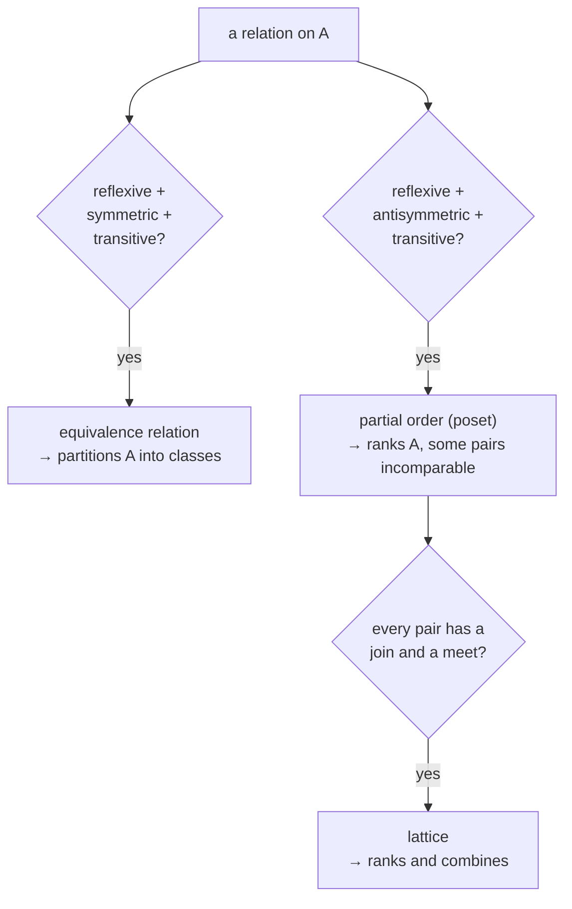

Almost everything in mathematics is built from one idea: a **set**, a collection of distinct objects. An ordered pair is a set; a **relation** is a set of ordered pairs; a **function** is a relation where each input has exactly one output; a number can be coded as a set. Get comfortable with sets and the ways to combine and compare them, and the rest of the subject has a common substrate.

This post covers sets and the operations on them (with the algebra those operations obey), the power set, and then relations — the four structural properties a relation can have, the equivalence relations that carve a set into classes, and the partial orders and lattices that formalise "ordering". Functions, the most important kind of relation, get [their own post](/citadel/maths/functions).

---
## Sets

A set is written in **roster form** by listing elements, $A = \{1, 2, 3, 4, 5\}$ — order and repetition don't matter — or in **set-builder form** by a defining property, $A = \{x \mid x \in \mathbb{N},\ x < 6\}$ ("all $x$ such that…"). A **Venn diagram** draws them as regions inside a rectangle.

Core vocabulary:

- **empty set** $\emptyset$ — no elements;
- **universal set** $U$ — everything under discussion in the current context;
- **subset** $A \subseteq B$ — every element of $A$ is in $B$; **proper subset** $A \subset B$ adds $A \neq B$;
- **equality** — $A = B$ means the same elements, i.e. $A \subseteq B$ and $B \subseteq A$;
- **cardinality** $|A|$ — the count of distinct elements (for a finite set).

---
## Set operations

For sets $A, B$ inside a universe $U$:

| Operation | Definition |
| --- | --- |
| union $A \cup B$ | in $A$, or $B$, or both |
| intersection $A \cap B$ | in both |
| complement $A'$ | in $U$ but not in $A$ |
| difference $A - B$ | in $A$ but not $B$ (equals $A \cap B'$) |
| symmetric difference $A \triangle B$ | in exactly one of them: $(A - B) \cup (B - A)$ |
| Cartesian product $A \times B$ | all ordered pairs $(a, b)$ with $a \in A$, $b \in B$ |

---
## The algebra of sets

These operations satisfy laws that mirror arithmetic and, more precisely, Boolean algebra:

- **commutative:** $A \cup B = B \cup A$, $A \cap B = B \cap A$;
- **associative:** $(A \cup B) \cup C = A \cup (B \cup C)$, and likewise for $\cap$;
- **distributive:** $A \cap (B \cup C) = (A \cap B) \cup (A \cap C)$, and the dual with $\cup, \cap$ swapped;
- **De Morgan:** $(A \cup B)' = A' \cap B'$, $(A \cap B)' = A' \cup B'$;
- **idempotent:** $A \cup A = A$, $A \cap A = A$;
- **identity:** $A \cup \emptyset = A$, $A \cap U = A$;
- **complement:** $A \cup A' = U$, $A \cap A' = \emptyset$, $(A')' = A$;
- **domination:** $A \cup U = U$, $A \cap \emptyset = \emptyset$.

The symmetry — every law has a dual with $\cup \leftrightarrow \cap$ and $\emptyset \leftrightarrow U$ — is the signature of a **Boolean algebra**, which sets, logic, and digital circuits all instantiate ([abstract algebra](/citadel/maths/abstract-algebra) makes this precise).

---
## Power set and counting

The **power set** $P(A)$ is the set of *all* subsets of $A$. Since each element is independently in or out of a given subset, $|P(A)| = 2^{|A|}$.

To count a union without double-counting overlaps, use **inclusion–exclusion**:
$$ |A \cup B| = |A| + |B| - |A \cap B| $$
$$ |A \cup B \cup C| = |A| + |B| + |C| - |A \cap B| - |A \cap C| - |B \cap C| + |A \cap B \cap C| $$
The general $n$-set version, and its combinatorial uses (derangements, Euler's totient), are in [permutations and combinations](/citadel/maths/permutation-combination).

---
## Relations

A **binary relation** $R$ from $A$ to $B$ is a subset of $A \times B$; $(a, b) \in R$ is written $aRb$ ("$a$ is related to $b$"). When $A = B$, it is a relation *on* $A$. An **$n$-ary relation** is a subset of $A_1 \times \cdots \times A_n$ — the model for a database table.

- **domain** — the set of first coordinates that appear;
- **range** — the set of second coordinates that appear.

Three representations of a relation on a finite set: the raw **set of pairs**; a **0–1 matrix** with $M_{ij} = 1$ iff $(a_i, a_j) \in R$; a **directed graph** with an arrow $a \to b$ for each pair.

---
## The four properties

A relation $R$ on $A$ may be:

- **reflexive** — $(a, a) \in R$ for every $a$;
- **symmetric** — $(a, b) \in R \Rightarrow (b, a) \in R$;
- **antisymmetric** — $(a, b) \in R$ and $(b, a) \in R \Rightarrow a = b$ (not the negation of symmetric);
- **transitive** — $(a, b) \in R$ and $(b, c) \in R \Rightarrow (a, c) \in R$.

The **closure** of $R$ under a property is the smallest relation containing $R$ that has it: the **reflexive closure** adds every $(a, a)$; the **symmetric closure** adds $R^{-1} = \{(b, a) \mid (a, b) \in R\}$; the **transitive closure** repeatedly adds the pairs transitivity forces (computed by Warshall's algorithm on the 0–1 matrix).

---
## Equivalence relations

Which combination of the four properties a relation has is what gives it a name and a use:

A relation that is **reflexive, symmetric, and transitive** is an **equivalence relation**. Its effect is to **partition** $A$: every element lands in exactly one **equivalence class** of things mutually related, and the classes are disjoint and cover $A$. "Has the same remainder mod $5$" splits the integers into $5$ classes; "is parallel to" splits lines by direction; "has the same birth month" splits people into $12$. Conversely, every partition of a set defines an equivalence relation. This is how mathematics builds new objects — the rationals are equivalence classes of integer pairs, and modular arithmetic is arithmetic on classes.

---
## Partial orders and lattices

A relation that is **reflexive, antisymmetric, and transitive** is a **partial order**, and the set with it is a **poset**. "Partial" because some pairs may be incomparable: under divisibility on the positive integers, $3 \mid 6$ and $3 \mid 9$, but neither of $6, 9$ divides the other. A finite poset is drawn as a **Hasse diagram** — elements as dots, an upward edge from $x$ to $y$ when $y$ covers $x$ (nothing strictly between), with reflexive loops and transitive edges left implicit.

A **lattice** is a poset in which every pair $\{x, y\}$ has a least upper bound (the **join** $x \vee y$) and a greatest lower bound (the **meet** $x \wedge y$). The subsets of a set under $\subseteq$ form a lattice with $\vee = \cup$ and $\wedge = \cap$; the divisors of $n$ under divisibility form one with $\vee = \operatorname{lcm}$ and $\wedge = \gcd$.

---
## The one idea to keep

The layering is the point: a set is a collection, a relation is a set of pairs with optional structure (reflexive, symmetric, transitive, antisymmetric), and the useful combinations of those properties have names — equivalence relations that partition, partial orders that rank, lattices that do both with joins and meets. The single most important relation, the one where every input has exactly one output, is a [function](/citadel/maths/functions).
