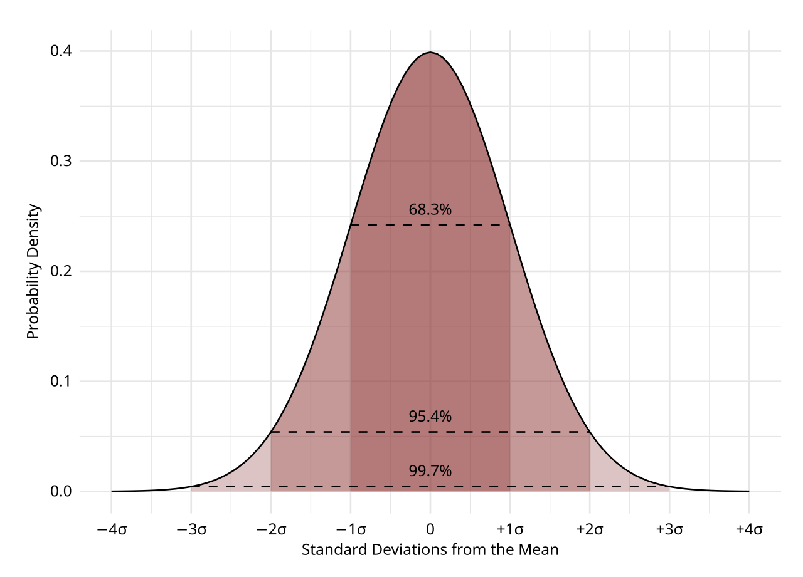

[Probability](/citadel/maths/probablity-statistics) starts from a known distribution and predicts what data it will produce. Statistics runs the arrow backwards: it starts from data and infers something about the distribution — or the population — behind it. And there is a permanent obstacle in the way: you never observe the whole population, only a sample, and a different sample would have given different numbers. Every honest statistical claim therefore carries a stated uncertainty, and most of the subject is machinery for computing that uncertainty.

Here is the surprising thing that makes the machinery possible. Take *any* population — incomes (wildly right-skewed), dice rolls (flat), heights (already bell-shaped) — draw samples of size $n$, and look at how the sample mean $\bar x$ varies from sample to sample. That distribution of $\bar x$ is approximately **normal**, centred on the true mean, with a spread that shrinks predictably as $n$ grows — regardless of the population's shape. This is the Central Limit Theorem, and it means one method (put a normal-based interval around a statistic) covers estimation and testing for a huge range of problems. This post covers the descriptive half — condensing data to a centre and a spread — and the inferential half — the CLT, confidence intervals, hypothesis tests, and the chi-squared test — with the key results derived and worked numerically.

---
## Central tendency: three kinds of "typical"

- **Mean** — $\bar x = \dfrac{\sum x_i}{N}$. The balance point. One extreme value drags it, so it misreports "typical" for skewed data (a room's mean net worth when one person is a billionaire).
- **Median** — the middle value of the ordered data (mean of the two middle values if $N$ is even). Unmoved by how extreme the extremes are; it only cares about order. For grouped data, interpolate within the median class: $L + \dfrac{N/2 - C_f}{f_m}\, h$.
- **Mode** — the most frequent value. The only one that works for categorical data, and a dataset can have zero, one, or several.

The rule of thumb: report the mean and standard deviation for roughly symmetric data, the median and interquartile range when outliers or skew are in play.

---
## Dispersion

- **Range** — max minus min. One number, entirely determined by the two least typical points.
- **Variance** — mean squared deviation from the mean. Population: $\sigma^2 = \dfrac{\sum (x_i - \mu)^2}{N}$. Sample: $s^2 = \dfrac{\sum (x_i - \bar x)^2}{n - 1}$.
- **Standard deviation** — $\sqrt{\text{variance}}$, back in the data's units.
- **Interquartile range** — $Q_3 - Q_1$, the span of the middle half; the box in a box plot.

**Why $n - 1$ and not $n$.** The sample deviations are taken from $\bar x$, not the true $\mu$, and $\bar x$ is by construction the point that *minimises* $\sum (x_i - \bar x)^2$. So the sample sum of squares is systematically a little too small as an estimate of the population's. Dividing by $n - 1$ instead of $n$ inflates it by exactly the right factor to make $s^2$ an **unbiased** estimator of $\sigma^2$ — its long-run average over many samples equals $\sigma^2$. The lost degree of freedom is the one spent estimating the mean.

---
## The distribution of the sample mean

A **statistic** (like $\bar x$) is computed from a sample; a **parameter** (like $\mu$) is the fixed, unknown population value it estimates. Inference needs a **random sample** — every population member equally likely to be drawn — so the sample is representative and the statistic's behaviour is predictable.

Draw many samples of size $n$; each yields its own $\bar x$; those values have their own distribution, the **sampling distribution of the mean**. The **Central Limit Theorem** pins it down: for $n$ large enough (a rough rule is $n \ge 30$, fewer if the population is already near-normal, more if it is heavily skewed), $\bar X$ is **approximately normal**, *whatever the population's shape*, with

$$ \text{mean } \mu, \qquad \text{standard deviation } \frac{\sigma}{\sqrt n} \quad \text{(the standard error)}. $$

Two consequences worth internalising. First, the normal approximation is a gift: you do not need to know the population distribution to reason about its mean. Second, the standard error falls as $\sqrt n$, not $n$ — to halve your uncertainty you must **quadruple** the sample, and to get one more decimal place of precision you need a hundred times the data. This is why large-scale measurement is expensive and why polls stall around a $\pm 3\%$ margin (that is roughly $1/\sqrt{1000}$).

For a normal distribution, about **68%** of values lie within $1\sigma$ of the mean, **95%** within $2\sigma$ (more precisely $1.96\sigma$), and **99.7%** within $3\sigma$ — the empirical rule, and the origin of "two-sigma" as a casual bar for "surprising" and "five-sigma" as the particle-physics bar for "discovery."

---
## Point estimation

A **point estimate** is a single statistic offered as a parameter's value — $\bar x$ for $\mu$, $\hat p$ for a proportion, $s^2$ for $\sigma^2$. Two general recipes:

- **Method of moments** — set sample moments (mean, mean square, …) equal to their population expressions and solve for the parameters.
- **Maximum likelihood** — pick the parameter values that make the observed data most probable, by maximising the likelihood function. For a normal population, MLE returns $\bar x$ for $\mu$; for a Poisson, it returns the sample mean for $\lambda$.

A point estimate with no interval around it is nearly useless — it hides how much a different sample might have moved it.

---
## Confidence intervals, derived

A **95% confidence interval** is a recipe that, over repeated sampling, produces an interval containing the true parameter 95% of the time. (Note the subtlety: the parameter is fixed; the interval is random. "95% confidence" is a property of the procedure, not a probability about this one interval.)

Derive it from the CLT. $Z = \dfrac{\bar X - \mu}{\sigma/\sqrt n}$ is standard normal, so with $z_{\alpha/2}$ the value cutting off tail area $\alpha/2$ (for 95%, $z_{0.025} = 1.96$):

$$ P\!\left(-z_{\alpha/2} \le \frac{\bar X - \mu}{\sigma/\sqrt n} \le z_{\alpha/2}\right) = 1 - \alpha. $$

Rearrange the inequality to isolate $\mu$:

$$ \bar x \pm z_{\alpha/2}\, \frac{\sigma}{\sqrt n}. $$

**Worked example.** A sample of $n = 100$ components has mean lifetime $\bar x = 1200$ hours; the population SD is known to be $\sigma = 150$ hours. The standard error is $150/\sqrt{100} = 15$. The 95% interval is $1200 \pm 1.96 \times 15 = 1200 \pm 29.4$, i.e. $(1170.6,\ 1229.4)$ hours. Want it half as wide? You need $n = 400$.

Use $s$ in place of $\sigma$ when the population SD is unknown and $n$ is large; use the **$t$-distribution** (fatter tails, converging to normal as $n$ grows) for small $n$. For a proportion, $\hat p \pm z_{\alpha/2}\sqrt{\hat p(1 - \hat p)/n}$. The interval widens with higher confidence, widens with more variable data, and narrows with more data — no free lunch among the three.

---
## Hypothesis testing, and what a p-value is

A procedure for choosing between two claims about a parameter:

1. **State hypotheses** — a **null** $H_0$ (no effect, the status quo) and an **alternative** $H_a$ (the claim on trial).
2. **Compute a test statistic** — how far the sample result sits from what $H_0$ predicts, measured in standard-error units.
3. **Find the $p$-value** — the probability, *assuming $H_0$ is true*, of a test statistic at least this extreme.
4. **Decide** — if $p < \alpha$ (a pre-set level, conventionally $0.05$), reject $H_0$; otherwise fail to reject it.

**What the $p$-value is not.** It is *not* the probability that $H_0$ is true, and $1 - p$ is *not* the probability that $H_a$ is true — those would require a prior and Bayes' theorem. It is not the probability your result was due to chance. A large $p$ is not evidence *for* $H_0$; it is just failure to find evidence against it. And $p < 0.05$ says nothing about whether the effect is large enough to matter — with a big enough sample, a trivial effect clears the bar. Report an effect size and a confidence interval alongside any $p$.

Two error types trade off: a **Type I error** rejects a true $H_0$ (rate $\alpha$); a **Type II error** fails to reject a false one (rate $\beta$); the **power** $1 - \beta$ is the chance of catching a real effect, and it rises with sample size and effect size.

A **one-sample $t$-test** compares a sample mean to a hypothesised value; a **two-sample $t$-test** compares two samples to ask whether their populations differ.

---
## The chi-squared goodness-of-fit test, worked

The **chi-squared test** asks whether observed category counts $O_i$ match the counts $E_i$ a hypothesised distribution predicts:

$$ \chi^2 = \sum_i \frac{(O_i - E_i)^2}{E_i}. $$

**Example.** Roll a die 120 times; a fair die predicts $E_i = 20$ for each face. Observed: $18, 21, 16, 25, 22, 18$. Then

$$ \chi^2 = \frac{4 + 1 + 16 + 25 + 4 + 4}{20} = \frac{54}{20} = 2.7. $$

Degrees of freedom $= 6 - 1 = 5$ (the counts must sum to 120, costing one). The 5% critical value for $\chi^2_5$ is $11.07$. Since $2.7 < 11.07$, the data are entirely consistent with a fair die — do not reject $H_0$. A $\chi^2$ near or above the critical value would have signalled a poor fit.

**Nonparametric tests** (Wilcoxon rank-sum and others) drop the assumption of a particular population shape, trading some power for robustness. **Simple linear regression** fits $y = a + bx$ by **least squares** — minimising the summed squared vertical residuals — via the [linear-algebra](/citadel/maths/linear-algebra) normal equations, and correlation reports the strength of the linear part of that relationship.

---
## The one idea to keep

Descriptive statistics is a choice of summary: centre and spread, with the median and IQR replacing the mean and SD whenever skew or outliers would make the mean lie. Inferential statistics rests almost entirely on the Central Limit Theorem — the sample mean is approximately normal no matter what the population looks like, with a standard error that falls only as $\sqrt n$. That single fact turns "estimate a parameter" into "put a $\pm 1.96\,\text{SE}$ band around a normal statistic" and "test a claim" into "how improbable is a result this extreme if $H_0$ holds?" — remembering that a small $p$-value flags *inconsistency with the null*, not the probability the null is false, and never on its own that an effect is big enough to care about. The distributions all of this stands on are in [probability](/citadel/maths/probablity-statistics).
