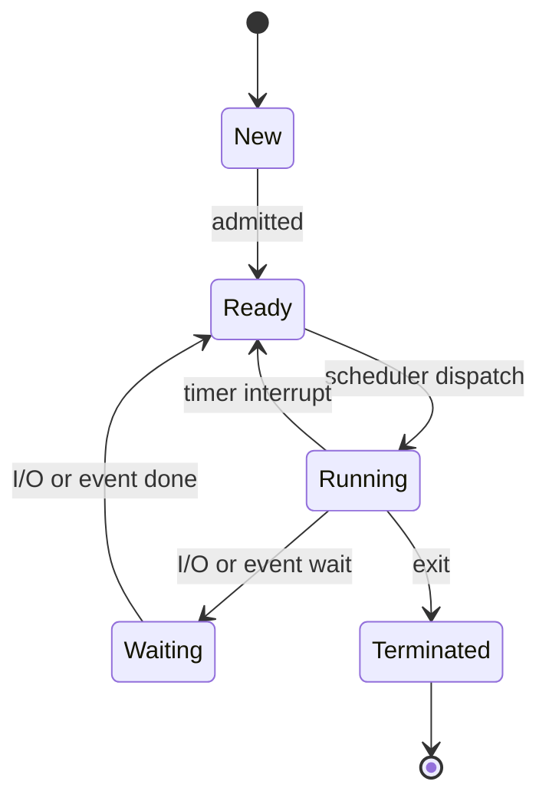

A program on disk is inert — a list of instructions. Load it, give it a program counter and some memory, and it becomes a **process**: the unit of work the [operating system](/citadel/operating-system/os) schedules, protects, and accounts for. Run several at once and they start competing for the same data, which is where the hard part begins.

This post covers what a process and a thread are, how the OS represents and switches them, and then the concurrency problem — why two processes updating one variable can lose an update, and the three tools that fix it.

## What a process is made of

More than its code (the **text section**), a process has:

- **Current activity** — the program counter and CPU registers.
- **Stack** — function parameters, return addresses, local variables; grows and shrinks with calls.
- **Data section** — global variables.
- **Heap** — memory allocated at runtime (`malloc`, `new`).

As it runs it moves through five **states**:



### The Process Control Block

The OS tracks each process with a **Process Control Block** (PCB): process state, a unique **process ID** (PID), the program counter, CPU registers, scheduling info (priority, queue pointers), memory-management info (base/limit registers, page tables), accounting info (CPU time used), I/O status (allocated devices, open files), and parent/child links.

A **context switch** moves the CPU from one process to another: save the running process's state into its PCB, load the next process's state from its PCB. No useful work happens during the switch, so it is pure overhead — which is why the switching mechanism is kept lean.

## Threads

A **thread** is a path of execution *inside* a process. Threads of one process share its code, data, heap, and open files, but each has its own program counter, registers, and stack. That makes them cheaper to create and switch than processes, and it lets one program use multiple cores.

- **User threads** are managed by a library with no kernel involvement — fast, but one blocking system call blocks every thread in the process, and they cannot spread across cores.
- **Kernel threads** are scheduled by the OS — slower to manage, but a block in one does not stop the others, and they run truly in parallel. Every modern general-purpose OS uses them.

**Multithreading models** map user threads to kernel threads: **many-to-one** (simple, but blocking and no parallelism), **one-to-one** (true parallelism, one kernel thread per user thread — Linux, Windows), **many-to-many** (multiplex many user threads onto fewer kernel threads), and the **two-level** variant that also allows binding a user thread to a dedicated kernel thread.

**Thread libraries** give the API: **POSIX Pthreads** (the UNIX-family standard), **Windows threads** (kernel-level), and **Java threads** (on top of the host OS's threads). **Implicit threading** shifts the work to compiler and runtime: **thread pools** reuse a fixed set of threads for short tasks; **OpenMP** parallelises annotated loop regions.

Recurring **threading issues**: whether `fork()` duplicates all threads or just the caller; which thread a signal is delivered to; **thread cancellation** — *asynchronous* (kill immediately, risky if it holds a lock) versus *deferred* (the target checks a flag and exits cleanly); and **thread-local storage** for per-thread private data. Linux creates threads with `clone()`, which controls exactly what the child shares, and calls them *tasks*; Windows uses one-to-one.

## The concurrency problem

**Concurrency** is multiple processes or threads making progress over the same period — an illusion from fast switching on one core, genuine parallelism on many.

It creates a hazard. Two processes update one bank balance: A reads $100, computes $150, and before it writes back, the OS switches to B. B reads the *original* $100, computes $80, writes $80. A resumes and writes $150. The $20 deposit is gone. This is a **race condition** — the result depends on the interleaving.

The stretch of code touching shared data is a **critical section**. The **critical-section problem** is finding a protocol so that when one process is in its critical section, no other is in a related one. A correct solution needs three properties:

1. **Mutual exclusion** — at most one process in the critical section at a time.
2. **Progress** — if the section is free and processes want in, one of them gets in without indefinite delay.
3. **Bounded waiting** — a limit on how many times others can enter ahead of a process that is already waiting, so no one **starves**.

### Peterson's solution

A software solution for two processes $P_i$ and $P_j$, assuming atomic loads and stores:

```c
// shared: int turn;  bool flag[2] = {false, false};
flag[i] = true;                       // I want in
turn = j;                             // but you go first
while (flag[j] && turn == j) ;        // busy-wait
// --- critical section ---
flag[i] = false;
```

It satisfies all three properties but does not generalise past two processes and relies on busy waiting.

### Hardware support

Modern CPUs give atomic instructions to build locks:

```c
bool test_and_set(bool *t) {          // atomic
    bool old = *t;
    *t = true;
    return old;
}
// spinlock:  while (test_and_set(&lock)) ;   /* CS */   lock = false;

int compare_and_swap(int *v, int expected, int new) {  // atomic
    int old = *v;
    if (*v == expected) *v = new;
    return old;
}
// spinlock:  while (compare_and_swap(&lock, 0, 1) != 0) ;   /* CS */   lock = 0;
```

Plain spinlocks give mutual exclusion and progress but not bounded waiting; adding a `waiting[]` array that passes the lock directly to the next waiter restores it.

## Semaphores

A **semaphore** (Dijkstra) is an integer accessed only through two atomic operations. To avoid busy waiting, a blocked process is put on the semaphore's queue:

```c
wait(S)   { S->value--; if (S->value <  0) block();  }   // was P
signal(S) { S->value++; if (S->value <= 0) wakeup(); }   // was V
```

A **counting semaphore** ranges freely and guards a resource with several instances; a **binary semaphore** is 0 or 1 and acts as a **mutex lock**. Semaphores are powerful and error-prone: a missing `wait`, a swapped `wait`/`signal`, or a lock-ordering mistake causes lost mutual exclusion, **deadlock** (each process waits for a signal only another waiter can send), or starvation.

### The classical problems

**Bounded buffer (producer-consumer).** A producer adds items to a fixed buffer, a consumer removes them; never add to a full buffer or take from an empty one. Three semaphores: `mutex = 1` (buffer access), `empty = N` (free slots), `full = 0` (used slots).

```c
// producer                    // consumer
wait(empty);                    wait(full);
wait(mutex);                    wait(mutex);
  buffer[in] = item;             item = buffer[out];
  in = (in + 1) % N;             out = (out + 1) % N;
signal(mutex);                  signal(mutex);
signal(full);                   signal(empty);
```

**Readers-writers.** Many readers may share the data; a writer needs exclusive access. The reader-priority version has the first reader lock out writers and the last reader release them, guarding the reader count with its own mutex — but a steady stream of readers can starve writers, which other variants rebalance.

**Dining philosophers.** Five philosophers, five chopsticks, each needs both neighbours' chopsticks to eat. The naive "pick up left, then right" deadlocks if all five pick up their left chopstick at once. Fixes: allow only four at the table; pick up both chopsticks only if both are free (an atomic check); or have odd philosophers reach left-first and even ones right-first.

## Monitors

Because raw semaphores are so easy to misuse, a **monitor** is a higher-level construct, usually built into the language. It is an abstract data type bundling shared data with the procedures on it, and it guarantees **mutual exclusion implicitly** — only one process runs inside the monitor at a time.

For waiting *inside* the monitor it provides **condition variables**: `x.wait()` suspends the caller and releases the monitor lock; `x.signal()` resumes one waiter, or does nothing if none is waiting. When a signaller and a signalled process both want to run, the rule is either **signal-and-wait** (signaller yields) or **signal-and-continue** (signalled waits). Dining philosophers is far cleaner as a monitor tracking each philosopher's state.

## IPC

Processes that do not share an address space communicate two ways:

- **Shared memory** — the OS sets up a shared region; processes read and write it directly. Fast, but they must synchronise access themselves (semaphores). The kernel is involved only in setup.
- **Message passing** — `send(message)` / `receive(message)` over a communication **link**. Slower, but synchronisation is built in (a receiver waits for a message) and it works across a network.

## Process lifecycle

A **parent** process creates a **child** via a system call, forming a process tree. Options: parent and child may share all, some, or no resources; may run concurrently or the parent may `wait`; the child may be a duplicate of the parent (UNIX `fork()`, using **copy-on-write** so pages are only copied on the first write) or load a new program (`exec()`).

A process **terminates** by finishing and calling `exit()`, by an error, by a fatal fault the OS traps, or by a parent killing it (`abort()`); some systems do **cascading termination**, killing all descendants when a parent dies. A terminated child whose parent has not yet called `wait()` is a **zombie** (its PCB lingers to hold the exit status); a child whose parent died first is an **orphan**, adopted by `init`, which reaps it.

## Scheduling, briefly

Ready processes wait in the **ready queue**; processes waiting on a device sit in **device queues**. The **long-term scheduler** admits processes from disk into memory and sets the degree of multiprogramming; the **short-term (CPU) scheduler** picks the next process to run and fires every few milliseconds; the **medium-term scheduler** swaps processes out to relieve memory pressure. Which ready process runs next — FCFS, round robin, priority, and the rest — is the subject of [CPU scheduling](/citadel/operating-system/process-scheduling).

## The one idea to keep

A process is an execution plus everything the OS must save to pause and resume it; a thread is the same idea with the memory shared. The moment two of them touch one piece of data, correctness depends on interleavings you do not control, and the fix is always to serialise the critical section — with a hardware atomic at the bottom, a semaphore in the middle, or a monitor when you want the language to stop you getting it wrong.
