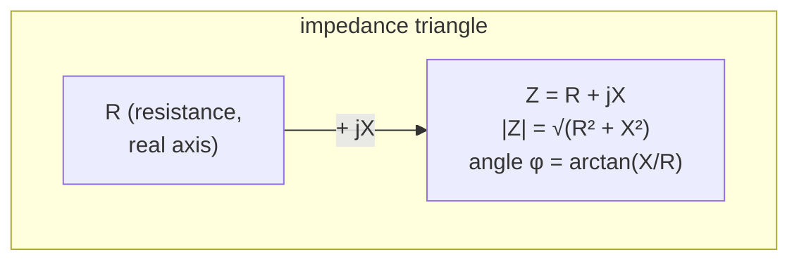
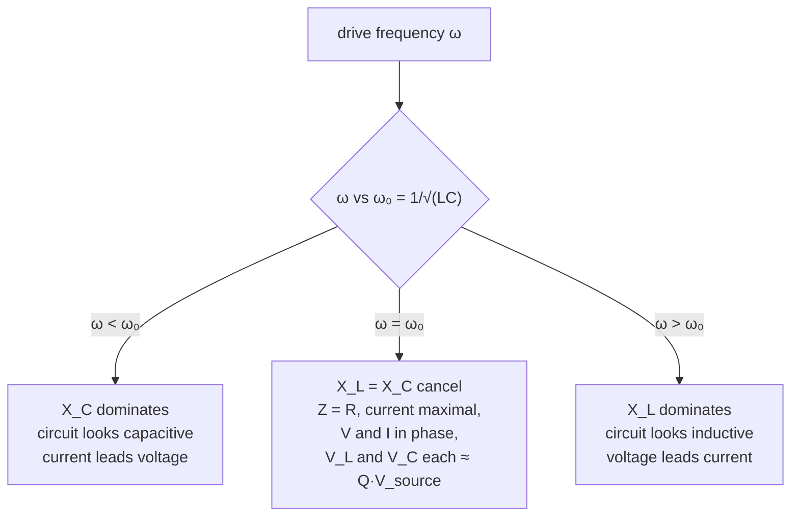

[DC circuit analysis](/citadel/physics/current) rests on one assumption: currents are steady. Mains power breaks it immediately — the voltage is a sine wave that reverses 50 or 60 times a second. That would be a minor complication if a circuit held only resistors, whose $V = IR$ holds at every instant regardless of frequency. But the moment a capacitor or an inductor is in the loop, the game changes, because those components respond to how fast the current is *changing*, not to its value. Their opposition to current now depends on frequency, and the voltage and current across them fall out of step.

This post builds the steady-state sinusoidal toolkit: effective (RMS) values, the frequency-dependent reactance of L and C, impedance as a single complex number, the phasor trick that reduces the circuit's differential equations to algebra, power that partly does no work, and the series resonance that lets a radio pick one station out of the air.

## The surprise: current that does no work

Connect an ideal capacitor straight across an AC source. Current flows — charge surges in as the voltage rises, back out as it falls, a real ammeter in the line reads a real current. The capacitor also has a real voltage across it. Multiply "real current" by "real voltage" and you would expect power to be delivered.

Average it over a cycle and the power is **exactly zero**. The same is true of an ideal inductor. Energy flows *into* the component for a quarter cycle (charging its field) and flows back *out* the next quarter cycle (as the field collapses), and the net over a full cycle cancels. The component stores and returns energy without consuming any.

So an AC circuit carries two kinds of current: the part in phase with the voltage, which does work and heats resistors, and the part $90°$ out of phase, which just shuttles energy back and forth. Keeping those two straight is what the machinery below is for.

## Sinusoids and why we quote RMS

An AC voltage is

$$ V(t) = V_0\sin(\omega t + \phi) $$

with $V_0$ the peak amplitude, $\omega = 2\pi f$ the angular frequency, and $\phi$ a phase offset. The current has the same shape, generally shifted in phase.

Because $V(t)$ spends as much time negative as positive, its plain average over a cycle is zero and tells you nothing about how much a load will heat. The useful measure is the **root-mean-square** value: the equivalent DC voltage that would dissipate the same average power in a resistor.

$$ V_{\text{rms}} = \sqrt{\frac{1}{T}\int_0^T V(t)^2\,dt} $$

Evaluate it using $\sin^2(\omega t) = \tfrac12(1 - \cos 2\omega t)$. The $\cos 2\omega t$ term integrates to zero over a whole cycle, leaving

$$ \frac{1}{T}\int_0^T V_0^2\sin^2(\omega t)\,dt = \frac{V_0^2}{2} \quad\Longrightarrow\quad V_{\text{rms}} = \frac{V_0}{\sqrt 2} $$

and likewise $I_{\text{rms}} = I_0/\sqrt 2$. Every quoted mains figure — 120 V, 230 V — is RMS; the actual peaks are $\sqrt 2$ times higher (325 V for a 230 V supply), which is what the insulation has to withstand. The **full-cycle mean** of a sine is zero; the **half-cycle mean** is $2V_0/\pi \approx 0.637\,V_0$, the number a rectifier's smoothed output tracks.

## Reactance: opposition that depends on frequency

**Inductor.** $V_L = L\,dI/dt$. Feed it $I = I_0\sin\omega t$:

$$ V_L = \omega L\,I_0\cos\omega t $$

Two things fall out. The voltage is a cosine where the current is a sine, so **voltage leads current by $90°$**. And the voltage amplitude is $\omega L$ times the current amplitude, so the effective opposition — the **inductive reactance** — is

$$ X_L = \omega L $$

It *grows* with frequency: a faster-changing current means a steeper $dI/dt$ and a larger back-EMF fighting it. At DC ($\omega = 0$) an inductor is a plain wire.

**Capacitor.** $I = C\,dV/dt$. By the same steps, **current leads voltage by $90°$**, and the **capacitive reactance** is

$$ X_C = \frac{1}{\omega C} $$

It *shrinks* with frequency: in each shorter half-cycle, less charge has time to accumulate, so less opposing voltage builds. At DC a capacitor is an open circuit; at very high frequency it is nearly a short.

| | at DC ($\omega \to 0$) | at high $\omega$ | phase of $V$ relative to $I$ |
|---|---|---|---|
| Resistor | $R$ | $R$ | in phase |
| Inductor | short ($X_L \to 0$) | open ($X_L \to \infty$) | $V$ leads by $90°$ |
| Capacitor | open ($X_C \to \infty$) | short ($X_C \to 0$) | $V$ lags by $90°$ |

A handy mnemonic for the phase: **ELI the ICE man** — in an invductor (L), voltage E leads current I; in a capacitor (C), current I leads voltage E.

## Impedance: one complex number for the whole opposition

The $90°$ phase shifts are exactly what a factor of $j = \sqrt{-1}$ encodes (multiplying a phasor by $j$ rotates it a quarter turn). So combine resistance and reactance into a single complex **impedance**:

$$ Z = R + jX, \qquad X = X_L - X_C = \omega L - \frac{1}{\omega C} $$

with magnitude and phase

$$ |Z| = \sqrt{R^2 + X^2}, \qquad \phi = \arctan\frac{X}{R} $$

Ohm's law generalises to $V_{\text{rms}} = I_{\text{rms}}\,|Z|$, with $\phi$ the angle by which the voltage leads the current. The real part is where power is dissipated; the imaginary part is where energy is merely stored and returned. $R$, $X$, and $|Z|$ form a right triangle:

The reciprocal, the **admittance** $Y = 1/Z = G + jB$, is the natural quantity for parallel branches: admittances add in parallel exactly as impedances add in series.

## Phasors: calculus becomes algebra

Carrying $\sin$ and $\cos$ and their derivatives through every loop equation is miserable. The **phasor** method replaces each sinusoid $A\cos(\omega t + \theta)$ with the complex number $A e^{j\theta}$ — a frozen snapshot of a vector rotating at $\omega$, keeping only its length and starting angle. Under this map, $d/dt$ becomes multiplication by $j\omega$:

$$ \frac{d}{dt}\big[A e^{j(\omega t + \theta)}\big] = j\omega\,A e^{j(\omega t + \theta)} $$

So every differential equation in the circuit turns into a linear algebraic one. The impedances above are exactly what the components look like in this representation: $Z_R = R$, $Z_L = j\omega L$, $Z_C = 1/j\omega C = -j/\omega C$. You then analyse the circuit with the *same* series/parallel rules and Kirchhoff's laws as DC — just with complex numbers — and convert the answer back to amplitude and phase at the end. This is the same complex-exponential trick used for [driven oscillations](/citadel/physics/oscillations) and [wave propagation](/citadel/physics/waves).

## Real, reactive, and apparent power

Instantaneous power $p(t) = V(t)\,I(t)$ pulses at $2\omega$. Averaged over a cycle, only the component of current *in phase* with the voltage does net work:

$$ P = V_{\text{rms}} I_{\text{rms}} \cos\phi \qquad [\text{watts}] $$

The factor $\cos\phi = R/|Z|$ is the **power factor**. The full accounting is the complex power

$$ S = P + jQ, \qquad |S| = V_{\text{rms}} I_{\text{rms}} $$

- $P$ (watts, W) — **active power**, genuinely dissipated in the resistive parts.
- $Q$ (volt-amps reactive, VAR) — **reactive power**, the energy sloshing in and out of the inductors and capacitors each cycle. Consumed by nothing, but it still flows as real current through the wires.
- $|S|$ (volt-amps, VA) — **apparent power**, the product of the RMS meters' readings, and what every transformer, cable, and generator in the path must be *sized* for.

A motor-heavy industrial site with $\cos\phi = 0.7$ draws $1/0.7 \approx 1.4\times$ more current than its useful load needs, filling the supply infrastructure with reactive current. Utilities penalise low power factor, and the fix is to bolt capacitor banks across the inductive load so their leading reactive current cancels the motors' lagging reactive current, pulling $\cos\phi$ back toward 1. That is **power-factor correction**.

## Series RLC resonance

In a series R–L–C circuit the two reactances have opposite sign, and at one frequency they cancel exactly:

$$ X_L = X_C \;\Longrightarrow\; \omega L = \frac{1}{\omega C} \;\Longrightarrow\; \omega_0 = \frac{1}{\sqrt{LC}} $$

At $\omega_0$ the impedance collapses to $Z = R$ — purely resistive and at its minimum — so for a fixed source voltage the current is at its **maximum**, and voltage and current are back in phase. This is the electrical twin of a [driven mechanical oscillator at resonance](/citadel/physics/oscillations), with $L$ as mass, $1/C$ as spring constant, $R$ as damping.

The striking part: at resonance the voltage across the inductor *alone* is $I \cdot X_L = (V/R)\cdot \omega_0 L$, which can be **many times the source voltage** if $R$ is small. The reactive voltages of L and C are large and equal and opposite, cancelling in the loop sum but each individually enormous. This voltage magnification is the **quality factor**:

$$ Q = \frac{\omega_0 L}{R} = \frac{1}{\omega_0 C R} = \frac{1}{R}\sqrt{\frac{L}{C}} $$

and it also sets how *sharp* the resonance is. The **bandwidth** between the half-power points (where the current has fallen to $1/\sqrt2$ of its peak) is

$$ \Delta\omega = \omega_2 - \omega_1 = \frac{\omega_0}{Q} = \frac{R}{L} $$

A high-$Q$ circuit responds only to a narrow band around $\omega_0$ and ignores everything else — which is precisely what selects one radio station's carrier frequency out of the forest of signals at the antenna. Turning the tuning knob changes $C$, sliding $\omega_0$ across the band.

## Beyond the clean case

- **Parallel resonance** (a "tank" circuit, L and C in parallel) does the opposite: impedance is *maximum* at $\omega_0$ and the line current is minimal, while a large current circulates between L and C. It is the load in an oscillator and the trap filter that blocks one frequency.
- **Non-sinusoidal drive** — a square wave, a rectifier's output, a distorted mains — is handled by [Fourier decomposition](/citadel/maths/differential-equations-2): break it into sinusoidal harmonics, apply the phasor method to each, superpose. Only valid because the circuit is linear.
- **Real components have parasitics** — an inductor has winding resistance and inter-turn capacitance (and a self-resonant frequency of its own); a capacitor has lead inductance and dielectric loss (quoted as its ESR). Above those parasitic resonances a component behaves as its opposite.
- **Skin effect** — at high frequency AC current crowds into the outer skin of a conductor, shrinking the effective cross-section and raising $R$ with $\sqrt\omega$. It is why RF conductors are hollow tubes or Litz wire.
- **Three-phase** — grid power is three sinusoids $120°$ apart; the instantaneous total power is *constant*, not pulsing, which is why large motors and the transmission system are three-phase.

## The one idea to keep

Sinusoidal steady state splits current into a working part in phase with the voltage and a non-working part $90°$ out of phase, and impedance $Z = R + jX$ is the single complex number that tracks both. The phasor trick turns the circuit's calculus into algebra by making $d/dt$ into $\times j\omega$. Resonance is where $X_L$ and $X_C$ cancel: minimum impedance, maximum current, and — if $R$ is small — component voltages many times larger than the source, sharp enough to tune a radio.
