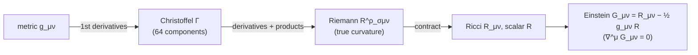

Newton's gravity is enough to fly a probe to Mars. It breaks in three regimes: very strong fields, speeds near light, and the universe treated as a whole. The clearest crack is [Mercury's orbit](/citadel/physics/astrodynamics) — a residual precession of 43 arcseconds per century that no Newtonian perturbation accounts for.

Fixing this is not a patch to the force law. General relativity replaces the idea that gravity is a force at all: mass tells spacetime how to curve, and spacetime tells matter how to move. The striking thing about that replacement is that it is not tuned to fit. Redo the orbit calculation in curved spacetime and the extra 43 arcseconds fall out with **no adjustable parameters** — and the same equations, applied elsewhere, predicted light bending by twice the Newtonian amount (confirmed 1919), black holes (confirmed by their shadows and mergers), and gravitational waves (confirmed 2015), each before it was seen.

## Spacetime

[Special relativity](/citadel/physics/relative-mech) already fused space and time into one four-dimensional structure. With no gravity around, that structure is flat, and the "distance" between two nearby events — the invariant interval — is
$$ ds^2 = -c^2dt^2 + dx^2 + dy^2 + dz^2 $$
or, with the Minkowski metric $\eta_{\mu\nu}$ and the summation convention,
$$ ds^2 = \eta_{\mu\nu}\,dx^{\mu}dx^{\nu}, \qquad \eta_{\mu\nu} = \begin{pmatrix} -1 & 0 & 0 & 0 \\ 0 & 1 & 0 & 0 \\ 0 & 0 & 1 & 0 \\ 0 & 0 & 0 & 1 \end{pmatrix} $$
where indices $\mu, \nu$ run 0–3 with 0 the time coordinate. (Some books use the opposite overall sign; nothing physical depends on the choice.)

General relativity's one move: **mass and energy curve spacetime, and that curvature is what we feel as gravity.** A freely falling object is not being pushed by a force; it is coasting along the straightest available path through a curved geometry.

 Source: Wikimedia Commons.")

## The field equations

The link between "how much matter and energy" and "how much curvature" is Einstein's field equations,
$$ G_{\mu\nu} + \Lambda g_{\mu\nu} = \frac{8\pi G}{c^4}T_{\mu\nu} $$
Term by term:

- $G_{\mu\nu}$ — the **Einstein tensor**, a particular measure of spacetime curvature.
- $g_{\mu\nu}$ — the **metric tensor**, which sets distances and angles in curved spacetime via $ds^2 = g_{\mu\nu}dx^\mu dx^\nu$; it is the curved-space generalisation of $\eta_{\mu\nu}$.
- $\Lambda$ — the **cosmological constant**, an energy density of the vacuum. Einstein added it to allow a static universe, then abandoned it after Hubble's expansion measurements (George Gamow reported that Einstein called it his "biggest blunder"). The 1998 discovery that cosmic expansion is *accelerating* brought it back, now read as "dark energy".
- $G$, $c$ — Newton's constant and the speed of light, setting the conversion factor.
- $T_{\mu\nu}$ — the **stress-energy tensor**, the distribution of mass, energy, momentum and pressure. This is the source term.

### The machinery inside the Einstein tensor

You do not need to manipulate any of the following to read the rest of the post. The point is that $G_{\mu\nu}$ is built from the metric in a fixed chain.

1. **Christoffel symbols** $\Gamma^{\lambda}_{\mu\nu}$ encode how the coordinate basis vectors twist from point to point, as first derivatives of the metric:
$$ \Gamma^{\lambda}_{\mu\nu} = \frac{1}{2}g^{\lambda\sigma}\left(\partial_{\mu}g_{\nu\sigma} + \partial_{\nu}g_{\mu\sigma} - \partial_{\sigma}g_{\mu\nu}\right) $$
with $g^{\lambda\sigma}$ the inverse metric. There are $4 \times 4 \times 4 = 64$ of them before symmetries.

2. **Riemann curvature tensor** $R^{\rho}_{\sigma\mu\nu}$ measures genuine curvature: parallel-transport a vector around a small closed loop and it comes back rotated by an amount this tensor sets.
$$ R^{\rho}_{\sigma\mu\nu} = \partial_{\mu}\Gamma^{\rho}_{\sigma\nu} - \partial_{\nu}\Gamma^{\rho}_{\sigma\mu} + \Gamma^{\rho}_{\lambda\mu}\Gamma^{\lambda}_{\sigma\nu} - \Gamma^{\rho}_{\lambda\nu}\Gamma^{\lambda}_{\sigma\mu} $$
It vanishes identically exactly when spacetime is flat.

3. **Ricci tensor and scalar** are contractions (index sums) of Riemann that keep only its average part: $R_{\mu\nu} = R^{\alpha}_{\mu\alpha\nu}$ and $R = g^{\mu\nu}R_{\mu\nu}$.

4. **Einstein tensor** combines them as
$$ G_{\mu\nu} = R_{\mu\nu} - \frac{1}{2}g_{\mu\nu}R. $$
This combination has zero divergence, $\nabla^{\mu}G_{\mu\nu} = 0$, which it must: the source $T_{\mu\nu}$ is conserved, $\nabla^{\mu}T_{\mu\nu} = 0$, and the two sides of the field equations have to match.

### Geodesics

In flat spacetime a free particle moves in a straight line. In curved spacetime it follows a **geodesic**, the straightest path available:
$$ \frac{d^2x^{\mu}}{d\tau^2} + \Gamma^{\mu}_{\nu\lambda}\,\frac{dx^{\nu}}{d\tau}\frac{dx^{\lambda}}{d\tau} = 0 $$
with $\tau$ the proper time for a massive particle (an affine parameter for light). The Christoffel symbols carry all the gravity: the metric determines them, and they bend the path.

## Exact solutions, and what they predict

The field equations are ten coupled non-linear partial differential equations, and general solutions are out of reach. Symmetric special cases are solvable, and each solved case made a prediction that was later checked.

### Mercury's perihelion precession

Redoing the orbit calculation with the relativistic equations adds a term that makes the ellipse's long axis rotate slightly each orbit:
$$ \Delta\omega_{\text{orbit}} = \frac{6\pi GM}{c^2 a (1 - e^2)}\ \text{radians per orbit} $$
Dividing by the orbital period $T$ gives the rate,
$$ \frac{d\omega_{GR}}{dt} \approx \frac{6\pi GM}{c^2 a (1 - e^2)\,T}. $$
For Mercury this works out to about 43 arcseconds per century — precisely the residual that was left over once every Newtonian perturbation from the other planets had been subtracted, matched with no adjustable parameters. Einstein published this result in November 1915, and it was general relativity's first hard confirmation.

### Schwarzschild: a non-rotating mass

Karl Schwarzschild solved the equations in 1916 for the spacetime outside a spherical, non-rotating, uncharged mass $M$ — he found it within months of the field equations' publication, while serving on the Eastern Front. The scale that drops out is the **Schwarzschild radius**
$$ r_s = \frac{2GM}{c^2} $$
which is about 3 km for the Sun and 9 mm for the Earth; a body collapses to a black hole only once it is compressed inside its own $r_s$. The line element is
$$ ds^2 = -\left(1 - \frac{r_s}{r}\right)c^2dt^2 + \left(1 - \frac{r_s}{r}\right)^{-1}dr^2 + r^2\left(d\theta^2 + \sin^2\theta\, d\phi^2\right). $$
Reading it off:

- **Event horizon** at $r = r_s$: a one-way surface. Nothing, light included, gets back out.
- **Singularity** at $r = 0$: curvature diverges and the theory stops describing anything.
- **Gravitational time dilation**: a clock deeper in the well ticks slower than one far away.
- **Gravitational redshift**: light climbing out of the well loses energy, its wavelength stretching toward the red.

### Kerr: a rotating mass

Roy Kerr solved the rotating case in 1963. With spin parameter $a = J/Mc$, and shorthand $\rho^2 = r^2 + a^2\cos^2\theta$ and $\Delta = r^2 - r_s r + a^2$,
$$ ds^2 = -\left(1 - \frac{r_s r}{\rho^2}\right)c^2dt^2 - \frac{2r_s r a \sin^2\theta}{\rho^2}c\,dt\,d\phi + \frac{\rho^2}{\Delta}dr^2 + \rho^2 d\theta^2 + \left(r^2 + a^2 + \frac{r_s r a^2 \sin^2\theta}{\rho^2}\right)\sin^2\theta\, d\phi^2. $$
What is new compared with Schwarzschild:

- **Two horizons** (for $a < M$ in units where $G = c = 1$), an outer and an inner one.
- **Ergosphere**: a region outside the outer horizon where the rotation drags spacetime around so hard that nothing can stay still relative to infinity — everything co-rotates. Energy can be extracted from it (the Penrose process).
- **Ring singularity**: the singularity is a ring, not a point.
- Adding electric charge $Q$ gives the **Kerr–Newman** solution, with $\Delta = r^2 - r_s r + a^2 + r_q^2$ where $r_q^2 = GQ^2/(4\pi\epsilon_0 c^4)$.

### FLRW: the universe as a whole

Assume the universe is homogeneous and isotropic — the same everywhere and in every direction on large scales — and the metric is forced into the Friedmann–Lemaître–Robertson–Walker form:
$$ ds^2 = -c^2dt^2 + a(t)^2\left(\frac{dr^2}{1 - kr^2} + r^2\left(d\theta^2 + \sin^2\theta\, d\phi^2\right)\right). $$

- $a(t)$ is the **scale factor**: all distances scale with it, so $a(t)$ increasing means the universe is expanding.
- $k$ is the **spatial curvature**: $+1$ closed (finite, sphere-like), $0$ flat, $-1$ open (saddle-like). Cosmic microwave background measurements put the real universe very close to $k = 0$.

Feeding this metric back into the field equations, with matter and radiation as the source, gives the Friedmann equations, which govern how fast the universe expands. This is the backbone of [Big Bang cosmology](/citadel/physics/big-bang).

## General relativity, tested

The predictions are not all exotic; several are now routine measurements.

- **Gravitational lensing.** A mass bends light passing it by
$$ \theta \approx \frac{4GM}{c^2 b} $$
for light grazing mass $M$ at impact parameter $b$ — twice what a Newtonian "light corpuscle" calculation gives. Arthur Eddington's 1919 eclipse expeditions measured the deflection of starlight passing the Sun and found the relativistic value, the result that made general relativity front-page news. Today, galaxy clusters smear background galaxies into arcs and Einstein rings, and the amount of bending maps the cluster's total mass, dark matter included.

- **Black holes.** A stationary black hole is fixed by exactly three numbers — mass $M$, angular momentum $J$, charge $Q$ — and nothing else about what fell in survives (the *no-hair* theorem). Their horizons obey a set of laws with the exact shape of thermodynamics:
  1. **Zeroth**: the surface gravity $\kappa$ is constant over the horizon of a stationary black hole (like uniform temperature at equilibrium).
  2. **First**: $\delta(Mc^2) = \dfrac{\kappa c^2}{8\pi G}\delta A + \Omega_H\,\delta J + \Phi_H\,\delta Q$, with $\Omega_H$ the horizon's angular velocity and $\Phi_H$ its electric potential (like $dU = T\,dS - P\,dV + \mu\,dN$).
  3. **Second**: the horizon area $A$ never decreases in classical general relativity, $\delta A \ge 0$ (like entropy).
  4. **Third**: $\kappa$ cannot be brought to zero in finitely many steps (like the unattainability of absolute zero).

  The analogy turns literal once quantum effects near the horizon are included: black holes emit thermal **Hawking radiation** at
$$ T_H = \frac{\hbar c^3}{8\pi G M k_B} $$
  and slowly evaporate, tying relativity, quantum mechanics and thermodynamics together in one formula.

- **Gravitational waves.** Masses in accelerated motion — two neutron stars spiralling together — radiate ripples in the metric that travel at $c$. To leading order the wave is set by the second time derivative of the source's mass quadrupole moment $Q_{ij}$:
$$ h_{ij}(t, \mathbf{x}) \approx \frac{2G}{c^4 r}\,\frac{d^2 Q_{ij}}{dt^2}\!\left(t - \frac{r}{c}\right) $$
  The prefactor $2G/c^4 \approx 1.7 \times 10^{-44}\ \text{s}^2/(\text{kg}\,\text{m})$ is why the strains are minuscule. LIGO's first detection, GW150914 in September 2015 — the merger of black holes of roughly 36 and 29 solar masses, around 1.3 billion light-years away — arrived as a peak strain near $10^{-21}$, stretching its 4 km arms by about $4 \times 10^{-18}$ m, a few thousandths of a proton's width.

- **Frame dragging.** A rotating mass drags spacetime around with it (the Lense–Thirring effect), at roughly
$$ \omega \approx \frac{2GJ}{c^2r^3} $$
  far from a body of angular momentum $J$ in its equatorial plane. Gravity Probe B measured it around the Earth.

## Where the theory still breaks

General relativity has passed every test above, and it still does not close. Dark matter and dark energy are named, not explained. The singularities at $r = 0$ in the black-hole solutions and at the start of the FLRW expansion are places where the theory predicts its own failure. Both point past general relativity to a quantum theory of gravity, which after decades of work does not yet exist. On the relativistic side, astrodynamics is an open problem, not a finished subject.

## The one idea to keep

Gravity is not a force but the curvature of spacetime, and the field equations $G_{\mu\nu} + \Lambda g_{\mu\nu} = 8\pi G\,T_{\mu\nu}/c^4$ tie the curvature (built from the metric through the Christoffel → Riemann → Ricci → Einstein chain) to the matter and energy that produce it. Free bodies follow geodesics, the straightest paths available. The handful of solvable cases each made a parameter-free prediction that held: Mercury's 43″/century, light bent double the Newtonian amount, the Schwarzschild and Kerr black holes with their horizons and thermodynamic laws, the expanding FLRW universe, and gravitational waves. The singularities it produces are where it admits it is incomplete.
