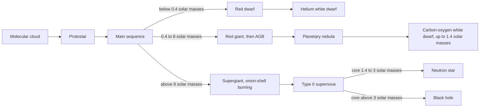

Almost everything about a star's life — how brightly it shines, how long it lasts, whether it dies quietly as a white dwarf or violently as a supernova, and whether it leaves behind a neutron star or a black hole — is fixed at birth by a single number: its mass. An O star sixteen times the Sun's mass burns through its fuel in a few million years and collapses; a red dwarf a tenth of the Sun's mass will still be shining long after the present universe is unrecognisable. Same physics, same fuel, outcomes separated by a factor of $10^{20}$ in lifetime.

After the [Big Bang](/citadel/physics/big-bang) left the universe as hydrogen and helium in the dark, gravity pulled the denser patches together until they lit up. This post covers how stars form, how they are classified, how mass sets their life and death, and the nuclear chains that turn hydrogen into every heavier element.

## Star formation

Stars condense from cold, dense **molecular clouds** of hydrogen, helium, and a trace of dust. A disturbance — a supernova shockwave, a galactic collision, a passing star — compresses a region until it satisfies the [Jeans instability](/citadel/physics/big-bang) and collapses under its own gravity. Dense clumps (**Bok globules**) contract, converting gravitational potential energy into heat, until the core is a **protostar**: glowing from contraction, not yet from fusion, wrapped in a disk of gas and dust and often firing bipolar jets (**Herbig–Haro objects**).

Most stars form in clusters of dozens to hundreds of thousands. The most massive members ionise the surrounding gas into glowing **H II regions**, and their radiation and winds eventually blow away the leftover cloud, ending star formation locally.

## Classification: MK classes and the HR diagram

Stars are sorted by their spectra into the **Morgan–Keenan** sequence **O B A F G K M**, hottest and most massive to coolest and least massive.

| Class | Temperature | Colour | Mass ($M_\odot$) | Fraction | Example |
|---|---|---|---|---|---|
| O | $\ge 33{,}000$ K | blue | $\ge 16$ | 0.00003% | Zeta Puppis |
| B | 10,000–33,000 K | blue-white | 2.1–16 | 0.12% | Rigel |
| A | 7,300–10,000 K | white | 1.4–2.1 | 0.6% | Sirius |
| F | 6,000–7,300 K | yellow-white | 1.04–1.4 | 3% | Procyon |
| G | 5,300–6,000 K | yellow | 0.8–1.04 | 7.6% | the Sun |
| K | 3,900–5,300 K | orange | 0.45–0.8 | 12% | Epsilon Eridani |
| M | $\le 3,900$ K | red | $\le 0.45$ | 76% | Proxima Centauri |

The **Hertzsprung–Russell diagram** plots luminosity against temperature. Most stars lie on a diagonal band, the **main sequence**, where they spend ~90% of their lives fusing hydrogen to helium with radiation pressure balancing gravity.

**Variable stars** do not shine steadily: **pulsating** variables physically expand and contract (Cepheids, whose period tracks luminosity, calibrate cosmic distances); **eruptive** variables flare or eject mass; **cataclysmic** variables are binaries in which one star dumps matter onto a compact companion, producing novae and Type Ia supernovae.

## Main-sequence life

Once the core reaches millions of kelvin, hydrogen fusion ignites and the star settles onto the main sequence. Lifetime depends steeply on mass through the **mass–luminosity relation**
$$ L \propto M^\alpha, \qquad \alpha \approx 3.5 $$
So an O star burns out in a few million years, the Sun (G, halfway through) lasts ~10 billion, and an M dwarf can outlive the present universe. Massive stars also shed significant mass through strong **stellar winds**.

A star's whole life story is set by its birth mass:

## Death of a low-mass star

**Red dwarfs** ($< 0.4\,M_\odot$) are fully convective, so they burn nearly all their hydrogen; after trillions of years they simply contract into a cooling helium white dwarf, with no giant phase.

**Sun-like stars** ($0.4$–$8\,M_\odot$):

1. **Red giant.** Core hydrogen exhausted, fusion moves to a shell around an inert helium core; the outer layers swell and cool. The Sun will do this in ~5 billion years, likely engulfing the inner planets.
2. **Helium flash and horizontal branch.** The helium core contracts and, below ~$2.25\,M_\odot$, becomes electron-degenerate. When it finally ignites helium via the **triple-alpha process**, the degenerate gas cannot expand to regulate, so ignition is a runaway **helium flash**. The star then settles onto the horizontal branch, fusing helium to carbon in its core.
3. **Asymptotic giant branch.** Helium-shell and hydrogen-shell burning around a carbon–oxygen core swell the star again; **thermal pulses** make it unstable and it sheds its envelope as a glowing **planetary nebula**.
4. **White dwarf.** The bare C–O core, Earth-sized but up to $1.4\,M_\odot$ (the **Chandrasekhar limit**), held up by electron degeneracy pressure. It cools for billions of years toward a (so-far hypothetical) black dwarf.

## Death of a massive star

Stars above ~$8\,M_\odot$:

1. **Supergiant.** They leave the main sequence as red or blue supergiants (Betelgeuse), igniting helium smoothly.
2. **Onion-shell burning.** Hot and dense enough to fuse past carbon: carbon → neon and magnesium, neon → oxygen, oxygen → silicon and sulfur, silicon → iron-peak elements, each in a nested shell around the last.
3. **Iron core collapse.** Fusing iron *absorbs* energy, so once a ~$1.4\,M_\odot$ iron core forms, its pressure support fails and it collapses from Earth-sized to ~10 km in under a second.
4. **Type II supernova.** The collapse rebounds as a shockwave that blows off the outer layers, briefly outshining the host galaxy and scattering the star's heavy elements into the interstellar medium.
5. **The remnant.** A core of $1.4$–$2$–$3\,M_\odot$ is halted by neutron degeneracy pressure as a city-sized **neutron star** (seen as a pulsar or X-ray burster if spinning or accreting); a heavier core collapses past that limit into a **black hole**, from which not even light escapes the [event horizon](/citadel/physics/astrodynamics-advanced).

**Wolf–Rayet stars** are very massive evolved stars ($>20\,M_\odot$) that have blown off their hydrogen envelopes, exposing hot helium- or carbon-rich cores; they are common supernova progenitors.

## Stellar structure

Energy leaves a star through nested zones set by mass:

- **Core** — the fusion region, hottest and densest.
- **Radiative zone** — energy carried outward by photons on a slow random walk (hundreds of thousands of years to cross the Sun's).
- **Convective zone** — energy carried by rising and sinking cells of plasma, like a boiling pot. Sun-like stars are radiative inside and convective outside; red dwarfs are convective throughout; massive stars are convective in the core.

## Nucleosynthesis: forging the elements

### Hydrogen burning

- **Proton–proton chain** — dominant in cooler stars like the Sun: four protons become one $^4$He, releasing energy, positrons, and neutrinos.

- **CNO cycle** — dominant above ~$1.3\,M_\odot$: carbon, nitrogen, and oxygen act as catalysts to fuse four protons into $^4$He; far more temperature-sensitive than the PP chain.

### Helium burning

- **Triple-alpha process** — at ~$10^8$ K, $^4$He + $^4$He $\leftrightarrow$ $^8$Be (unstable), then $^8$Be + $^4$He $\to$ $^{12}$C + $\gamma$. This is the only route to carbon, and its existence depends on a finely-placed nuclear resonance.
- **Alpha ladder** — further $\alpha$ captures build $^{16}$O, $^{20}$Ne, $^{24}$Mg, $^{28}$Si, and so on in steps of one helium nucleus.

### Heavy-element burning (massive stars only)

| Stage | Ignition | Density | Sample reactions |
|---|---|---|---|
| Carbon | $> 5\times10^8$ K | $> 3\times10^9$ kg/m³ | $^{12}$C + $^{12}$C $\to$ $^{20}$Ne + $^4$He; $\to$ $^{23}$Na + p |
| Neon | $> 1.2\times10^9$ K | $> 10^{10}$ kg/m³ | $^{20}$Ne + $\gamma$ $\to$ $^{16}$O + $^4$He; $^{20}$Ne + $^4$He $\to$ $^{24}$Mg + $\gamma$ |
| Oxygen | $> 1.5\times10^9$ K | $\sim 3$–$7\times10^{12}$ kg/m³ | $^{16}$O + $^{16}$O $\to$ $^{28}$Si + $^4$He; $\to$ $^{31}$P + p; $\to$ $^{31}$S + n |
| Silicon | $> 2.7\times10^9$ K | — | photodisintegration + $\alpha$ captures build up to $^{56}$Ni $\to$ $^{56}$Co $\to$ $^{56}$Fe |

Fusion stops releasing energy at **iron-56**, the most tightly bound nucleus. Building anything heavier costs energy, so an iron core is the end of the line — and the trigger for core collapse.

### Neutron capture: past iron

Elements heavier than iron are built by adding neutrons, then letting beta decay raise the proton number:

- **s-process** (slow) — in AGB stars, neutrons are captured one at a time, slowly enough that unstable nuclei beta-decay before the next capture. Builds up the stable isotopes to bismuth.
- **r-process** (rapid) — in core-collapse supernovae and neutron-star mergers, a neutron flux so intense that nuclei absorb many neutrons before decaying, jumping across instability gaps to make the heaviest, most neutron-rich isotopes: gold, platinum, uranium.

The gold in a ring was made in a neutron-star collision or a dying massive star.

## The one idea to keep

A star is a self-regulating balance between gravity pulling in and radiation pressure from fusion pushing out, and its birth mass sets everything downstream. Mass fixes the luminosity ($L \propto M^{3.5}$) and hence the lifetime; it decides whether the core ever gets hot enough to fuse past helium; and it dictates the endpoint — electron-degeneracy pressure holds up a white dwarf below $1.4\,M_\odot$, neutron-degeneracy pressure a neutron star up to ~$3\,M_\odot$, and above that nothing does and a black hole forms. Along the way, fusion climbs the binding-energy curve to iron and stops, and everything heavier is built by neutron capture (slow in dying giants, rapid in supernovae and neutron-star mergers) and scattered into the gas that forms the next generation.
