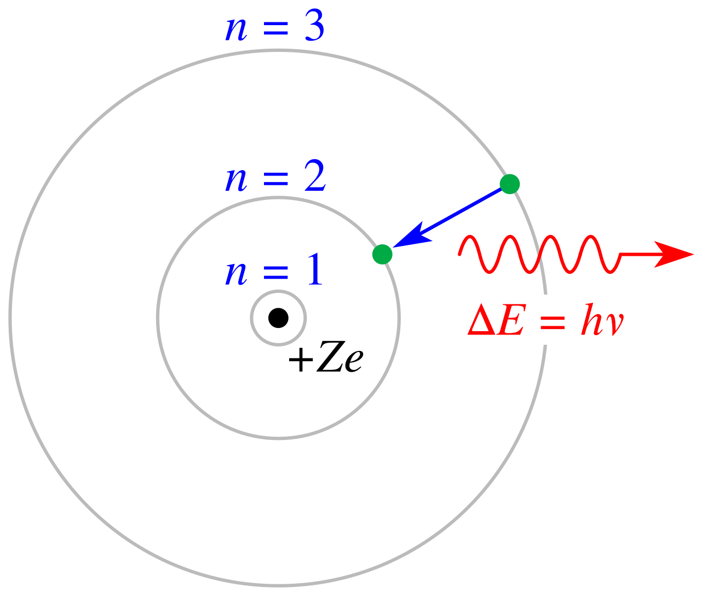

The idea of an atom is ancient; the picture of what one *is* changed three times in twenty years, and each change was forced by an experiment the previous picture could not survive.

The sharpest of those crises: once Rutherford established that an atom is a tiny nucleus with electrons around it, classical physics said the atom should not exist. An orbiting electron is an accelerating charge, an accelerating charge radiates, and a radiating electron spirals into the nucleus — the calculation gives about $10^{-11}$ seconds. Matter is stable; the theory said it could not be. This post traces the atom from indivisible spheres to the nuclear model, through that crisis, to Bohr's quantised orbits and the hydrogen spectrum they explain to three-digit precision — and to exactly where Bohr's model gives out. The nucleus itself is [nuclear physics](/citadel/physics/nuclear-physics); the wave-mechanical atom that superseded Bohr is [the quantum formalism](/citadel/physics/quantum-formalism).

## Early models

Democritus argued that repeated cutting must end at an uncuttable *atomos*. Dalton, around 1803, made it quantitative: elements are indivisible spheres of characteristic mass. Then in 1897 J. J. Thomson found that cathode rays are streams of a light, negatively charged particle — the **electron** — common to all elements, so the atom had parts. His **plum-pudding model** put the electrons in a diffuse ball of positive charge, like fruit in a pudding.

## Rutherford's gold-foil experiment

In 1909 Geiger and Marsden, under Rutherford, fired alpha particles (helium nuclei, fast and massive) at a gold foil a few hundred atoms thick. Plum pudding — positive charge spread thin — predicted small deflections only. Instead about 1 alpha in 20,000 turned through more than $90°$, and some came almost straight back. Rutherford: "It was almost as incredible as if you fired a 15-inch shell at a piece of tissue paper and it came back and hit you."

A large-angle bounce needs a small, massive, concentrated charge. The **nuclear model** followed: the atom is mostly empty space; nearly all its mass and all its positive charge sit in a tiny central **nucleus**; the electrons occupy the volume around it.

## The classical crisis

Rutherford's atom cannot be stable under classical physics:

1. An accelerating charge radiates electromagnetic energy (Maxwell).
2. An orbiting electron is always accelerating — centripetally.
3. So it must radiate continuously, lose energy, and spiral into the nucleus, in roughly $10^{-11}$ s.
4. Atoms plainly do not do this, and a spiralling electron would emit a continuous smear of frequencies, not the sharp discrete lines every element actually shows.

The structure was right and the mechanics were wrong.

## The Bohr model

Bohr (1913) kept the nuclear atom and imposed three quantum rules:

1. Electrons occupy certain **stationary orbits** in which, contrary to Maxwell, they do not radiate.
2. The energy of each such orbit is **quantized** — only discrete values are allowed.
3. An electron changes orbit only by a **quantum jump**, absorbing a photon of energy $h\nu$ equal to the gap to go up, emitting one to come down.

**Why those orbits.** De Broglie's matter wave gives the reason. For a photon, $E = h\nu$ and (from [special relativity](/citadel/physics/relative-mech) with $m_0 = 0$) $E = pc$; with $\nu = c/\lambda$ these give $p = h/\lambda$. De Broglie postulated the same relation for electrons. A stable orbit is then one whose circumference fits a whole number of electron wavelengths — a [standing wave](/citadel/physics/waves):
$$ 2\pi r_n = n\lambda = \frac{nh}{m_e v_n} \quad\Longrightarrow\quad m_e v_n r_n = n\hbar $$
Angular momentum is quantized in units of $\hbar$.

**The orbit.** Coulomb attraction supplies the centripetal force:
$$ \frac{m_e v_n^2}{r_n} = \frac{1}{4\pi\epsilon_0}\,\frac{Ze^2}{r_n^2} $$
Combining this with $m_e v_n r_n = n\hbar$ eliminates $v_n$ and gives the radius, then everything else:
$$ r_n = \frac{4\pi\epsilon_0\,n^2\hbar^2}{m_e Z e^2} = 0.529\,\frac{n^2}{Z}\ \text{Å}, \qquad v_n = \frac{Z e^2}{4\pi\epsilon_0\,n\hbar} \approx 2.18\times10^{6}\,\frac{Z}{n}\ \text{m/s} $$
The $n = 1$, $Z = 1$ radius is the **Bohr radius** $a_0 \approx 0.529$ Å.

**The energy.** With $K_n = \tfrac{1}{2}m_e v_n^2$ and $U_n = -Ze^2/4\pi\epsilon_0 r_n$:
$$ K_n \approx 13.6\,\frac{Z^2}{n^2}\ \text{eV}, \qquad U_n \approx -27.2\,\frac{Z^2}{n^2}\ \text{eV} = -2K_n $$
$$ E_n = K_n + U_n = -\frac{m_e Z^2 e^4}{8\epsilon_0^2 h^2 n^2} \approx -13.6\,\frac{Z^2}{n^2}\ \text{eV} $$
The negative total energy marks the electron as bound; $E \to 0$ is ionisation.

**The rest of the orbit.** The same two equations give, for hydrogen-like $Z$:

| Quantity | Formula | Value |
|---|---|---|
| Period | $t_n = 2\pi r_n/v_n$ | $\approx 1.52\times10^{-16}\,(n^3/Z^2)$ s |
| Orbital frequency | $f_n = 1/t_n$ | $\approx 6.58\times10^{15}\,(Z^2/n^3)$ Hz |
| Orbital current | $I_n = e f_n$ | $\approx 1.05\times10^{-3}\,(Z^2/n^3)$ A |
| Magnetic moment | $\mu_n = I_n\pi r_n^2 = eL_n/2m_e = n\mu_B$ | $\mu_B = e\hbar/2m_e$ per unit $n$ |
| Field at nucleus | $B_n = \mu_0 I_n/2r_n$ | $\approx 12.5\,(Z^3/n^5)$ T |

with $\mu_B = e\hbar/2m_e$ the **Bohr magneton**, the natural quantum of atomic magnetic moment.

## Hydrogen's line spectrum

A jump from level $n_i$ to a lower $n_f$ emits a photon of energy $\Delta E = E_i - E_f$, so
$$ \frac{1}{\lambda} = \frac{\Delta E}{hc} = R_H Z^2\left(\frac{1}{n_f^2} - \frac{1}{n_i^2}\right), \qquad R_H = \frac{m_e e^4}{8\epsilon_0^2 h^3 c} \approx 1.097\times10^{7}\ \text{m}^{-1} $$
the **Rydberg formula**, with $R_H$ the Rydberg constant (for infinite nuclear mass; a small reduced-mass correction applies). Grouping transitions by their final level gives the spectral series:

| Series | $n_f$ | Region |
|---|---|---|
| Lyman | 1 | ultraviolet |
| Balmer | 2 | visible (why a hydrogen discharge glows pink) |
| Paschen | 3 | infrared |
| Brackett | 4 | infrared |
| Pfund | 5 | far infrared |

## Bohr's hits and misses

It got the stability of atoms, the hydrogen (and He⁺, Li²⁺, …) energy levels and spectral lines, and the value of the Rydberg constant. It failed on everything with more than one electron, could not predict line *intensities* or the splitting of lines in a magnetic field (the Zeeman effect), and never justified *why* the allowed orbits were allowed — it simply forbade the radiation that classical physics demanded.

## Beyond Bohr: the electron cloud

The working atom is wave-mechanical. Electrons are not on orbits but in **orbitals** — three-dimensional probability distributions, $|\psi|^2$, solving the [Schrödinger equation](/citadel/physics/quantum-formalism) for the Coulomb potential. That treatment reproduces Bohr's energy levels for hydrogen, extends to multi-electron atoms through shells and subshells, and is the foundation of chemical bonding and the periodic table.

## The one idea to keep

Rutherford's scattering data put nearly all the atom's mass and all its positive charge in a nucleus $10^4$ times smaller than the atom — a structure classical electromagnetism says should collapse instantly. Bohr rescued it by decree: certain orbits do not radiate, and their angular momentum is quantised in units of $\hbar$ (equivalently, their circumference holds a whole number of de Broglie wavelengths). That one rule delivers the hydrogen energy levels $E_n = -13.6\,Z^2/n^2\ \text{eV}$, the Rydberg formula, and every spectral series — but only for one-electron atoms, and without ever explaining *why* the rule holds. The explanation is the full wave mechanics, where orbits become probability clouds.
