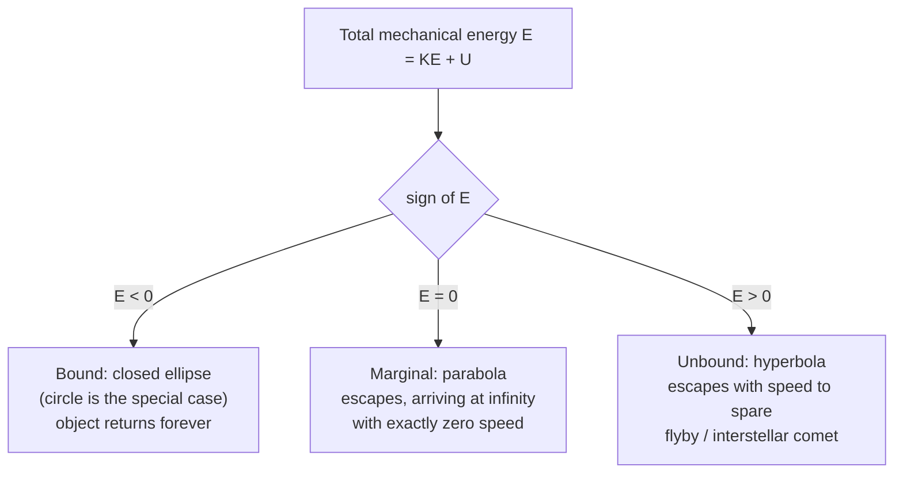

Before 1687, falling and orbiting were two different subjects. An apple dropping from a branch obeyed Galileo's rule — constant acceleration, about $9.8\ \text{m/s}^2$, straight down. The Moon circling the Earth obeyed Kepler's three laws, distilled from decades of Tycho Brahe's naked-eye astronomy. Nobody had a reason to think the two had anything to do with each other.

Newton's claim was that they are the *same phenomenon*: the Moon is falling toward the Earth exactly as the apple is, just fast enough sideways that it keeps missing. One force law, running from handheld objects to planets, with the strength of the pull set by a single number. This post follows that claim through its Newtonian consequences — the field around a mass, the energy budget of an orbit, the escape speed, the way $g$ shifts as you climb a mountain or descend a mineshaft — and marks the precise points where the picture stops working and [general relativity](/citadel/physics/astrodynamics-advanced) takes over.

## The problem: one law, or many?

Kepler's third law says $T^2 \propto a^3$: square the orbital period, and it tracks the cube of the orbit's size, for every planet. Newton asked what force law would *produce* that relationship. For a circular orbit of radius $r$, the centripetal acceleration is $v^2/r = 4\pi^2 r / T^2$. If this acceleration is caused by a force that falls off as $r^{-n}$, then $r^{-n} \propto r/T^2$, so $T^2 \propto r^{n+1}$. Kepler's $T^2 \propto r^3$ forces $n = 2$.

An inverse-square law. But is it the *same* inverse-square law that governs the apple? That is a question you can answer with arithmetic.

## The surprising part: the Moon test

Here is the check Newton ran, and it is worth doing yourself because the agreement is not vague — it is three significant figures.

If gravity is a single inverse-square force centred on the Earth, then the acceleration of the Moon and the acceleration of the apple should be in the ratio of the inverse squares of their distances from the Earth's centre. The apple is at $R_E \approx 6{,}370\ \text{km}$. The Moon is at $r_M \approx 384{,}000\ \text{km}$, about $60\,R_E$. So the Moon's acceleration toward the Earth should be

$$ a_M = \frac{g}{60^2} = \frac{9.8}{3600} \approx 2.7 \times 10^{-3}\ \text{m/s}^2 $$

Now compute the Moon's actual centripetal acceleration from its orbit, using nothing but the period $T = 27.3\ \text{days} = 2.36 \times 10^6\ \text{s}$ and the radius:

$$ a_M = \frac{4\pi^2 r_M}{T^2} = \frac{4\pi^2 (3.84 \times 10^8)}{(2.36 \times 10^6)^2} \approx 2.7 \times 10^{-3}\ \text{m/s}^2 $$

The same number, from two completely independent routes — one starting from a dropped object on Earth's surface, the other from the geometry of the Moon's monthly circuit. That coincidence is the entire content of "universal" gravitation. The apple and the Moon are pulled by one law.

## Newton's law of universal gravitation

Every particle attracts every other along the line joining them, with a force proportional to each mass and to the inverse square of the separation:

$$ F_g = G\,\frac{m_1 m_2}{r^2} $$

Two features are doing quiet work here. **Proportional to both masses**: this is what makes the acceleration $F/m_2 = Gm_1/r^2$ independent of the falling object's mass, so a feather and a hammer dropped on the airless Moon land together (as Apollo 15 demonstrated on television). The gravitational mass that appears in $F_g$ and the inertial mass that resists acceleration in $F = ma$ are, as far as any experiment has ever detected, the same quantity — a fact Newton had no explanation for and Einstein eventually built general relativity around.

**Inverse square**: picture the influence of a point mass spreading outward like paint sprayed from a nozzle. By distance $r$ it is smeared over a sphere of area $4\pi r^2$, so its intensity per unit area drops as $1/r^2$. Any conserved flux from a point source obeys this in three dimensions — it is the same geometry that gives light, sound, and the electric field their inverse-square falloff.

### Weighing G in a basement

$G$ is not something you can read off astronomy. Kepler's law gives you $GM_{\text{Sun}}$ as a package; the orbit of the Moon gives you $GM_E$; nowhere does the mass separate from $G$. To get $G$ alone you have to measure the gravitational pull between two objects of *known* laboratory mass, and that pull is absurdly weak.

Henry Cavendish did it in 1798 with a torsion balance: two small lead spheres on the ends of a horizontal rod, hung from a thin fibre, with two large lead spheres brought up alongside. The gravitational attraction twists the fibre through a tiny angle $\theta$; if you know the fibre's torsion constant $\kappa$ (from the period of the rod swinging freely), the force is $\kappa\theta / (L/2)$ and everything else in $F_g = Gm_1m_2/r^2$ is measured.

The modern value is

$$ G = 6.674 \times 10^{-11}\ \text{N}\,\text{m}^2/\text{kg}^2 $$

still, remarkably, the least precisely known of the fundamental constants — different careful experiments disagree in the fourth digit. That tiny magnitude is why you feel no pull toward a passing bus, and why gravity only runs the universe at the scale of moons and stars, where nothing else competes.

## A solid sphere acts like a point

Newton's law is stated for *particles*. The Earth is not a particle; it is $6 \times 10^{24}\ \text{kg}$ spread over a ball 12,700 km across. Why can we treat it as a point at its centre?

Because of the **shell theorem**, which Newton proved (and reportedly delayed publishing *Principia* for years while he nailed it down):

1. A uniform spherical shell attracts an external mass exactly as if the shell's entire mass were concentrated at its centre.
2. A uniform spherical shell exerts *zero* net force on a mass anywhere inside it — the pulls from the near wall and the far wall cancel, because the far wall, though more distant, subtends more solid angle.

Stack shells to build a solid sphere and the first result says the whole planet pulls, from outside, as a point at the centre. The second result has a striking consequence: dig a tunnel toward the centre, and only the mass in the sphere *below* your feet pulls on you — the shell of material above you contributes nothing.

## The gravitational field

Rather than think about the force on each specific object, attach a property to the space itself: the **gravitational field** $\vec g$ is the force per unit mass a small test mass would feel there.

$$ \vec g = -\frac{GM}{r^2}\,\hat r $$

The minus sign, with $\hat r$ pointing away from $M$, marks the field as attractive. At Earth's surface $|\vec g| = 9.8\ \text{m/s}^2$ — and this "field strength in newtons per kilogram" is numerically and dimensionally identical to "acceleration of a freely falling body in metres per second squared", which is not a coincidence but the equivalence of gravitational and inertial mass again.

**Gauss's law for gravity.** Because the field is inverse-square, the flux of $\vec g$ through any closed surface depends only on the mass enclosed, not on how it is arranged or where the surface is:

$$ \Phi_g = \oint_S \vec g \cdot d\vec A = -4\pi G\,M_{\text{enc}} $$

This is the exact analogue of Gauss's law in [electrostatics](/citadel/physics/static-em), and it is the fast route to the field of any spherically symmetric body: draw a spherical surface of radius $r$, exploit the symmetry to pull $|\vec g|$ out of the integral, and read off $|\vec g| \cdot 4\pi r^2 = 4\pi G M_{\text{enc}}$. Outside the Earth, $M_{\text{enc}}$ is the whole planet and you recover $GM/r^2$; inside, $M_{\text{enc}}$ is only the mass below you, and the shell theorem falls out for free.

## Potential energy, and why bound orbits are negative

Gravity is conservative — the work it does moving a mass between two points is path-independent — so it has a potential energy. Taking the zero at infinity (the natural choice, since the force vanishes there), the potential energy of a mass $m$ at separation $r$ from $M$ is the work you must do to haul it out to infinity, negated:

$$ U_g = -\int_\infty^r \left(-\frac{GMm}{r'^2}\right) dr' = -\frac{GMm}{r} $$

It is **negative everywhere**, approaching zero only as $r \to \infty$. The physical reading: the two masses sitting a finite distance apart are in an energy hole. To separate them completely you have to *add* energy $GMm/r$ to climb out to the rim.

The familiar near-surface formula $U = mgh$ is this same expression, linearised. Write $r = R_E + h$ and expand for $h \ll R_E$:

$$ -\frac{GMm}{R_E + h} \approx -\frac{GMm}{R_E} + \underbrace{\frac{GM}{R_E^2}}_{g}\,mh $$

The first term is a constant that cancels out of any energy *difference*, and the second is $mgh$ with $g = GM/R_E^2$. So $mgh$ was never a different law — it is the bottom of the well, seen from close up and flattened into a ramp.

## Escape velocity

The minimum speed to leave a body and never fall back is the one that arrives at $r = \infty$ with exactly zero speed to spare: total mechanical energy equal to zero, the top of the well. Conservation of energy from the surface (radius $R$) to infinity:

$$ \tfrac12 m v_{\text{esc}}^2 - \frac{GMm}{R} = 0 \quad\Longrightarrow\quad v_{\text{esc}} = \sqrt{\frac{2GM}{R}} $$

For Earth this is $11.2\ \text{km/s}$; for the Moon, $2.4\ \text{km/s}$; for the Sun's surface, $618\ \text{km/s}$. Three things about it:

- It does **not depend on the escaping object's mass** — the $m$ cancels — which is the same equivalence-principle signature as before.
- It does **not depend on launch direction** (ignoring the atmosphere and terrain). A shallow, near-horizontal launch trades a longer trajectory for the same total energy budget; energy is a scalar and does not care about the path.
- It is the speed needed for *ballistic* escape — engine off after launch. A rocket that keeps thrusting can leave at any speed, arbitrarily slowly.

Push the idea to its limit: set $v_{\text{esc}} = c$ and solve for the radius, $R = 2GM/c^2$. This is the **Schwarzschild radius** — the size to which you would have to compress a mass so that not even light escapes. The Newtonian derivation gets the right formula for the wrong reasons; the [general-relativistic treatment](/citadel/physics/astrodynamics-advanced) recovers it properly.

## Orbital velocity and the energy of an orbit

For a circular orbit of radius $r$, gravity supplies precisely the centripetal force needed and no more:

$$ \frac{GMm}{r^2} = \frac{mv_{\text{orb}}^2}{r} \quad\Longrightarrow\quad v_{\text{orb}} = \sqrt{\frac{GM}{r}} $$

Just above Earth's surface this is $7.9\ \text{km/s}$ — a low-orbit satellite crosses a continent in minutes — and note the clean relation $v_{\text{esc}} = \sqrt{2}\,v_{\text{orb}}$: escaping takes exactly twice the kinetic energy of orbiting at the same radius.

Add up the orbiting body's energy:

$$ KE = \tfrac12 m v_{\text{orb}}^2 = \frac{GMm}{2r}, \qquad U_g = -\frac{GMm}{r}, \qquad E = KE + U_g = -\frac{GMm}{2r} $$

The total is **negative**, half the magnitude of the potential energy, with the opposite sign (this 2:1 relationship between kinetic and potential energy is the *virial theorem* for an inverse-square force). Negative total energy is the definition of a **bound** orbit: the object is trapped in the well and would need an injection of $+GMm/2r$ to break free.

The sign of $E$ classifies every trajectory:

There is a counterintuitive corollary. Fire a thruster to *add* energy to a circular orbit and $E$ becomes less negative, which means $r$ gets **larger** and $v_{\text{orb}} = \sqrt{GM/r}$ gets **smaller**. A higher orbit is a slower orbit. To catch a spacecraft ahead of you in the same orbit, you have to slow down (drop lower, speed up, come around); to drop back to a rendezvous behind, you speed up. Orbital mechanics runs backwards from driving intuition, which is why it needs its own [dedicated treatment](/citadel/physics/astrodynamics).

## How g varies with height and depth

**Climbing.** Above the surface, $g_h = GM_E/(R_E + h)^2$. Factor out the surface value:

$$ g_h = g\left(1 + \frac{h}{R_E}\right)^{-2} \approx g\left(1 - \frac{2h}{R_E}\right) \qquad (h \ll R_E) $$

using the binomial approximation $(1+x)^n \approx 1 + nx$. At the top of Everest ($h \approx 8.8\ \text{km}$) this is a drop of about $0.28\%$; at the ISS altitude ($h \approx 410\ \text{km}$) $g$ is still $89\%$ of its surface value — the astronauts are not "beyond gravity", they are in continuous free fall, which is what weightlessness actually is.

**Descending.** Assume for a moment the Earth has uniform density $\rho$. By the shell theorem, at depth $d$ only the sphere of radius $R_E - d$ beneath you pulls, with mass $M' = \rho \cdot \tfrac43\pi (R_E - d)^3$:

$$ g_d = \frac{GM'}{(R_E - d)^2} = \tfrac43\pi G\rho\,(R_E - d) = g\left(1 - \frac{d}{R_E}\right) $$

So under the uniform-density assumption $g$ falls **linearly** with depth, reaching zero at the centre — where you would be pulled equally in all directions and float.

**The real Earth disagrees, and the reason is instructive.** The planet is strongly differentiated: a nickel-iron core roughly twice the density of the rocky mantle above it. As you descend through the mantle, you lose the thin low-density shell above you but the dense core still lies fully below — and for the first $\sim\!2{,}900\ \text{km}$ down, $g$ actually *rises*, peaking around $10.7\ \text{m/s}^2$ near the core-mantle boundary before finally falling to zero at the centre. The linear formula is a lesson in how much the "uniform density" assumption hides.

## Where the Newtonian picture breaks

Inverse-square gravity plus energy conservation is one of the most successful theories ever written — it flew Apollo to the Moon and steers spacecraft past the outer planets on trajectories planned decades ahead. But it is an approximation, and the seams show in specific places:

- **Mercury's perihelion.** Mercury's elliptical orbit slowly rotates. Newtonian gravity, accounting for the tugs of the other planets, predicts the rotation rate — and misses by $43$ arcseconds per century. That tiny discrepancy went unexplained for 60 years and was the first triumph of general relativity.
- **Light bends.** A Newtonian photon, having no mass, feels no force; $F_g = GMm/r^2$ gives zero for $m = 0$. Yet starlight grazing the Sun is deflected, by twice the amount a naive "photon with momentum" argument predicts. Gravity acts on energy, not just mass.
- **Time runs slow in a well.** Clocks deeper in a gravitational potential tick slower — a real effect that GPS satellites must correct for at the tens-of-microseconds-per-day level or navigation drifts by kilometres.
- **Strong fields.** Near a neutron star or black hole, $GM/rc^2$ approaches 1 and the Newtonian formulas are not slightly wrong but qualitatively wrong.

In every one of these cases the fix is the same conceptual move: gravity is not a force propagating instantly across flat space, but the [curvature of spacetime](/citadel/physics/astrodynamics-advanced) itself, with mass-energy as its source. The Newtonian law is what that curvature looks like when fields are weak and speeds are slow — which covers apples, Moons, and most of the Solar System, but not all of it.

## The one idea to keep

A single inverse-square attraction, with a strength set by one feebly small constant, accounts for weight, the tides, the Moon's orbit, the value of $g$ and how it shifts with altitude, the speed needed to leave a planet, and the fact that a bound orbit carries negative total energy. The Moon test — the apple's acceleration divided by $60^2$ equalling the Moon's centripetal acceleration to three digits — is the whole claim in one calculation. Where it fails, it fails because gravity is really geometry, and the force law is the low-energy shadow of that geometry.
