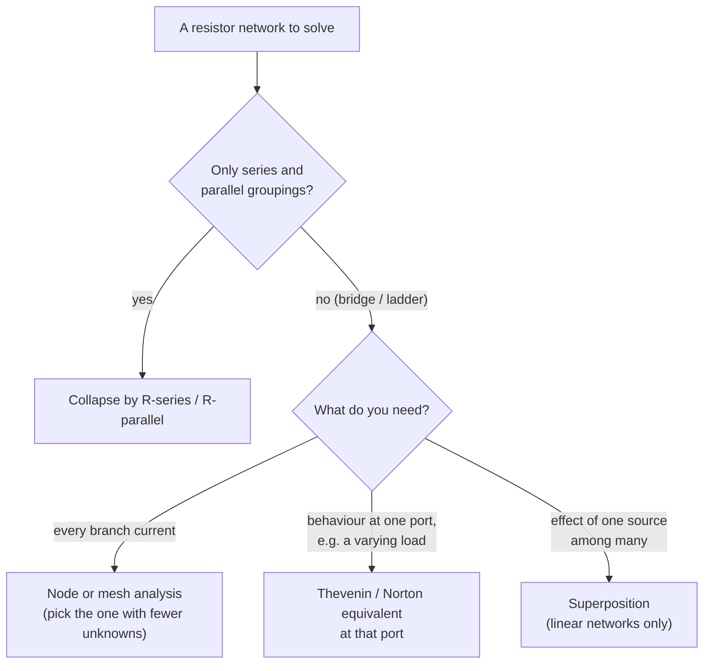

[Electrostatics](/citadel/physics/static-em) ends with a clean result: inside a conductor in equilibrium, the electric field is zero. Any field would push the free charges around, and they keep moving until their rearrangement cancels it. So a lump of copper sitting on a table has no field inside it and nothing flows.

Current electricity is what happens when you refuse to let the charges reach equilibrium. Wire the copper between the terminals of a battery, and the battery does chemical work to hold a potential difference across it — which means a sustained field *inside* the metal, which means the free electrons never stop being pushed. This post follows that flow: how fast the charge actually moves (much slower than you would guess), why a material resists it, where the dissipated energy ends up, and how to take a tangle of batteries and resistors and reduce it to something you can solve on paper. Sinusoidal drive, reactance, and resonance are the companion topic of [AC circuits](/citadel/physics/ac-circuits).

## The puzzle: fast light, slow charge

Flip a switch and the bulb lights with no perceptible delay, even if the bulb is 30 metres down the hall. It is tempting to conclude that electrons rush through the wire at nearly the speed of light.

They do not. As we will derive in a moment, the electrons in a wire carrying an ordinary household current drift along at roughly **0.1 millimetres per second** — you could out-walk them, out-crawl them. A single electron entering the wire at the switch would take hours to reach the bulb.

The resolution is that nothing has to travel the length of the wire for the bulb to light. The wire is *already full* of free electrons, everywhere along it, like a pipe already full of water. When the switch closes, the electric field that drives the electrons establishes itself along the whole wire at close to the speed of light, and every electron in the filament starts drifting almost at once — pushed by its local neighbours, not by an electron that set out from the battery. The signal is fast; the substance is slow. Keep that distinction; it is the source of most confusion about circuits.

## Electric current

**Current** is the rate at which charge crosses a section of the conductor:

$$ I = \frac{dQ}{dt} \qquad [\text{ampere} = \text{coulomb/second}] $$

By convention $I$ points the way *positive* charge would move: out of the battery's $+$ terminal, through the external circuit, back into the $-$ terminal. In a metal the actual carriers are electrons, moving the opposite way. The two pictures describe the same current — a rightward flow of positive charge and a leftward flow of negative charge deliver identical $dQ/dt$ through any cross-section — so the sign convention, fixed by Franklin before anyone knew about electrons, does no harm.

 and electron flow (green) run opposite ways around the same loop and describe the same physical current. Source: Wikimedia Commons.")

## Drift velocity: where the slow number comes from

The conduction electrons in a metal are already moving *fast* — the Fermi velocity in copper is about $1.6 \times 10^6\ \text{m/s}$ — but in random directions, reversing constantly as they scatter off lattice vibrations and impurities. Averaged over any instant, they carry no net charge anywhere.

Switch on a field $\vec E$ inside the metal and each electron gets a small, steady bias added to that thermal chaos. Between one collision and the next it accelerates:

$$ \vec a = \frac{q\vec E}{m_e} $$

and if $\tau$ is the mean time between collisions, it picks up an extra velocity $\vec a\tau$ before the next collision randomises its direction and it starts again from the drift-free thermal average. The net result of averaging over many such intervals is a constant **drift velocity** superimposed on the jitter:

$$ \vec v_d = \frac{q\tau}{m_e}\,\vec E $$

**Put numbers in.** For copper, $\tau \approx 2.5 \times 10^{-14}\ \text{s}$ and a field of a few volts per metre gives $v_d$ of order $10^{-4}\ \text{m/s}$ — the fraction-of-a-millimetre-per-second figure from the opening. It is small because $\tau$ is tiny: an electron travels only tens of nanometres before its next collision wipes out the progress.

**Current from drift.** In a time $dt$, every carrier within a distance $v_d\,dt$ of a cross-section of area $A$ will cross it. That slab of wire holds $n A v_d\,dt$ carriers, where $n$ is the carrier number density (for copper, $n \approx 8.5 \times 10^{28}\ \text{m}^{-3}$ — one free electron per atom). Each carries charge $q$, so $dQ = q\,nAv_d\,dt$ and

$$ I = nAqv_d $$

The current is large despite the glacial drift because $n$ is astronomical: there are so many carriers that even a crawl moves a coulomb per second.

## Current density and conductivity

Strip out the wire's geometry by working with **current density** $\vec J$, the current per unit area as a vector along the flow:

$$ \vec J = nq\vec v_d = \frac{nq^2\tau}{m_e}\,\vec E \;\equiv\; \sigma\vec E $$

This compact statement, $\vec J = \sigma\vec E$, is the **microscopic form of Ohm's law**, and it is genuinely a *derived* result: it came out of the collision picture, not an assumption. The **conductivity**

$$ \sigma = \frac{nq^2\tau}{m_e} $$

is a property of the material — set by how many carriers it has and how long they coast between collisions. Its reciprocal is the **resistivity** $\rho = 1/\sigma$. Copper's $\rho$ is $1.7 \times 10^{-8}\ \Omega\,\text{m}$; window glass is around $10^{12}\ \Omega\,\text{m}$, twenty orders of magnitude higher, essentially because it has no free carriers ($n \approx 0$).

## Ohm's law and resistance

For a uniform wire of length $L$ and cross-section $A$ with a uniform internal field, $E = V/L$ (field is potential drop per length) and $J = I/A$. Substitute into $J = \sigma E$:

$$ \frac{I}{A} = \sigma\,\frac{V}{L} \quad\Longrightarrow\quad V = I\,\frac{L}{\sigma A} = IR $$

which is **Ohm's law** in the form everyone memorises, $V = IR$, with the resistance

$$ R = \frac{\rho L}{A} \qquad [\Omega = \text{V/A}] $$

The geometry now makes physical sense rather than being a formula to recall:

- **$R \propto L$** — a longer wire is more lattice to push the same current through, more collisions per carrier per trip.
- **$R \propto 1/A$** — a fatter wire is more lanes in parallel; the current spreads out and each carrier meets the same resistance, but there are more carriers sharing the load.

A material is **ohmic** when $R$ stays constant as you vary $V$ — a straight line through the origin on an $I$-vs-$V$ plot. Metals at fixed temperature are ohmic over a wide range. Diodes, incandescent filaments, thermistors, and electrolyte solutions are **not**: their $I$-$V$ curves bend, because $\rho$, or $n$, or the temperature changes as you drive them harder. Ohm's law is a good empirical description of a large class of materials, not a law of nature like charge conservation.

### Temperature

Heating a metal makes the lattice vibrate harder, which means more scattering, a shorter $\tau$, and a higher $\rho$. Over a modest range the dependence is close to linear:

$$ R_T = R_0\,(1 + \alpha\,\Delta T) $$

with $\alpha$ the temperature coefficient of resistance (about $0.004\ \text{K}^{-1}$ for copper). This is why an incandescent bulb draws a large inrush current at switch-on — the cold filament has a fraction of its operating resistance — and why a filament usually fails at the instant you turn it on.

Semiconductors run the opposite way: heating them frees more carriers, $n$ climbs steeply, and resistance *falls* with temperature. That difference — $\rho$ rising with $T$ for metals, falling for semiconductors — is a fingerprint of the two conduction mechanisms, and the doorway to [band theory](/citadel/physics/quantum).

### EMF and internal resistance

A real source is not a pure voltage. It has its own resistance $r$ (electrolyte resistance in a battery, winding resistance in a generator), in series with its **electromotive force** $\mathcal E$ — the work per unit charge it can do. Driving a current $I$ through an external resistance $R$:

$$ \mathcal E = I(R + r), \qquad V_{\text{terminal}} = \mathcal E - Ir $$

The terminal voltage sags below $\mathcal E$ under load, which is why a car's headlights dim when the starter motor cranks — the starter's huge current drops a big $Ir$ across the battery's internal resistance. Differentiating the power delivered to the load, $P = I^2 R = \mathcal E^2 R/(R+r)^2$, shows it peaks at $R = r$: **maximum power transfer** happens when the load matches the source resistance (at the cost of dissipating equal power inside the source — efficient power delivery wants $R \gg r$ instead).

## Where the energy goes

Carrying charge $dQ$ across a potential drop $V$ releases energy $V\,dQ$. Divide by time:

$$ P = VI = I^2 R = \frac{V^2}{R} \qquad [\text{watt} = \text{joule/second}] $$

The three forms are algebraically identical (via $V = IR$) but you reach for different ones: $I^2R$ when the current is fixed (series elements), $V^2/R$ when the voltage is fixed (parallel elements).

In a resistor this energy becomes **heat**, and the mechanism is exactly the drift picture: each electron accelerates in the field, gains kinetic energy, then slams into the lattice and hands that energy over as vibration — which is temperature. The steady state is a conveyor belt carrying electrical energy from the field into the thermal motion of the metal. That is what a toaster, a kettle element, and an incandescent filament all run on.

The $I^2R$ form explains long-distance transmission. To deliver a fixed power $P = VI$ down a line of resistance $R_{\text{line}}$, the wasted power is $I^2 R_{\text{line}}$. Push the same $P$ at ten times the voltage and one tenth the current, and the loss drops by a factor of 100. That is the entire reason for high-voltage transmission lines and the transformers at each end.

## Reducing a network

### Series and parallel

**Series** — one path, so the same current $I$ through each element; the voltage drops add:

$$ IR_{\text{eq}} = IR_1 + IR_2 + \cdots \quad\Longrightarrow\quad R_{\text{eq}} = \sum_i R_i $$

**Parallel** — same voltage $V$ across each element; the currents add:

$$ \frac{V}{R_{\text{eq}}} = \frac{V}{R_1} + \frac{V}{R_2} + \cdots \quad\Longrightarrow\quad \frac{1}{R_{\text{eq}}} = \sum_i \frac{1}{R_i} $$

A parallel combination is always *smaller* than its smallest member — adding another path can only make it easier for current to get through. Two equal resistors in parallel give half; $R$ and $2R$ give $\tfrac23 R$.

### Kirchhoff's laws

Series/parallel reduction stalls on any circuit with a bridging element (a Wheatstone bridge, a ladder with rungs). For those, two conservation statements generate enough equations for any network:

1. **Junction rule (KCL)** — charge does not accumulate at a node, so current in equals current out: $\sum I_{\text{in}} = \sum I_{\text{out}}$. This is charge conservation.
2. **Loop rule (KVL)** — electric potential is single-valued, so the signed voltage changes around any closed loop sum to zero: $\sum_{\text{loop}} \Delta V = 0$. This is energy conservation per unit charge.

**Node analysis** writes KCL at every node in terms of unknown node potentials; **mesh analysis** writes KVL around every independent loop in terms of unknown loop currents. Either produces a linear system — $n$ equations in $n$ unknowns — that you solve directly. Pick whichever gives fewer unknowns: node analysis when there are few nodes, mesh analysis when there are few loops.

### The network theorems

For a *linear* network (every element's $V$-$I$ relation is a straight line), three shortcuts skip the full system when you only care about one part of the circuit:

- **Thevenin.** Everything on one side of a pair of terminals collapses to a single voltage source $V_{th}$ in series with a single resistor $R_{th}$. $V_{th}$ is the open-circuit voltage measured across the terminals; $R_{th}$ is the resistance seen looking into the terminals with every independent source *zeroed* — voltage sources replaced by wires, current sources by gaps.
- **Norton.** The same black box as a current source $I_N$ (the current the terminals deliver when shorted together) in parallel with $R_N = R_{th}$. Thevenin and Norton forms are interchangeable: $V_{th} = I_N R_{th}$.
- **Superposition.** With several independent sources, the current or voltage in any branch equals the sum of the contributions from each source acting alone, all other sources zeroed. It works *only* because the network is linear — superposition is the definition of linearity — and it fails the moment a diode or a saturating inductor enters the circuit.

## Where this picture stops

The free-electron collision model (the **Drude model**) is a semiclassical sketch, and it has known failures. It predicts the wrong temperature dependence for $\rho$ at low temperatures, cannot explain why some materials are insulators or semiconductors at all, and gets the electronic heat capacity of a metal badly wrong. Fixing it needs quantum mechanics — the electrons obey Fermi-Dirac statistics, only those near the Fermi surface participate, and "collisions" are really scattering off deviations from a perfect periodic lattice. And at low enough temperature some metals lose *all* resistance: in a superconductor, $\rho$ is exactly zero, a current once started circulates for years, and no amount of Drude tinkering explains it.

For everyday circuits at room temperature, though, the model earns its keep: it derives Ohm's law from mechanism, gets conductivity right to an order of magnitude, and makes the geometry of resistance and the origin of resistive heating physically obvious rather than memorised.

## The one idea to keep

A steady current is free charge being pushed through a lattice and losing, at every collision, the energy the field just gave it — which is why a resistor gets hot and why $\rho$ depends on temperature. Ohm's law is not fundamental; it is what that collision picture averages out to for a large class of materials. Everything about DC circuits above the device level — series and parallel, Kirchhoff, Thevenin — is bookkeeping on two conservation laws, charge at the nodes and energy around the loops.
