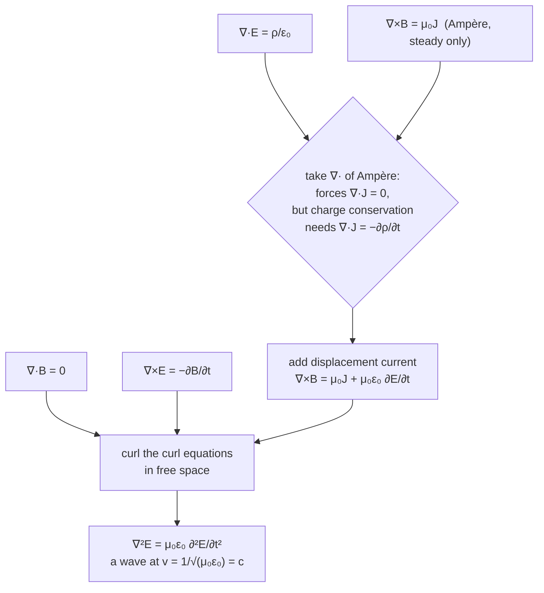

[Electrostatics](/citadel/physics/static-em) and [magnetism](/citadel/physics/magnetism) each describe half of one thing. Maxwell's achievement in the 1860s was to write the whole thing as four equations — and then notice that, as they stood, they were quietly inconsistent with the conservation of charge. The fix was a single extra term, added for bookkeeping reasons with no experiment demanding it. That term turned the four equations into a set that *predicts waves*, travelling at a speed built from two constants measured on a laboratory bench in entirely electrical and magnetic experiments — a speed that came out equal, to the digits then known, to the measured speed of light.

That is the payoff and it is worth keeping in view through the algebra: light is not *like* an electromagnetic disturbance, it *is* one, and the term that makes it exist was put in to balance an equation. This post is the derivation chain end to end — the vector calculus it needs, the four equations, the displacement-current fix, the potentials, the wave equation, and the energy accounting.

## The vector-calculus toolbox

The fields $\vec{E}$ and $\vec{B}$ are vector fields — a vector at every point — and three operations built from the **del operator**
$$ \nabla = \hat{x}\,\frac{\partial}{\partial x} + \hat{y}\,\frac{\partial}{\partial y} + \hat{z}\,\frac{\partial}{\partial z} $$
describe how they vary.

- **Gradient** $\nabla\varphi$ acts on a scalar field and returns the vector pointing along its steepest increase, with magnitude equal to that slope.
- **Divergence** $\nabla\cdot\vec{A} = \partial_x A_x + \partial_y A_y + \partial_z A_z$ returns a scalar: the net outflow per unit volume at a point. Positive at a source, negative at a sink, zero where field lines only pass through.
- **Curl** $\nabla\times\vec{A}$ returns a vector measuring circulation — how a tiny paddlewheel dropped in the field would spin, and about which axis:
$$ \nabla\times\vec{A} = \left(\partial_y A_z - \partial_z A_y\right)\hat{x} + \left(\partial_z A_x - \partial_x A_z\right)\hat{y} + \left(\partial_x A_y - \partial_y A_x\right)\hat{z} $$

Four identities do most of the work later:

$$ \nabla\cdot(\nabla\varphi) = \nabla^2\varphi, \qquad \nabla\times(\nabla\varphi) = 0, \qquad \nabla\cdot(\nabla\times\vec{A}) = 0 $$
$$ \nabla\times(\nabla\times\vec{A}) = \nabla(\nabla\cdot\vec{A}) - \nabla^2\vec{A} $$

The first defines the **Laplacian**. The second says a field that is a gradient has no curl (it is *conservative*); the third says a field that is a curl has no divergence (it is *solenoidal*); the fourth is the identity that turns Maxwell's equations into wave equations.

Three integral theorems connect a region to its boundary:

$$ \oint_S \vec{A}\cdot d\vec{a} = \int_V (\nabla\cdot\vec{A})\,dV \qquad \text{(divergence theorem)} $$
$$ \oint_C \vec{A}\cdot d\vec{l} = \int_S (\nabla\times\vec{A})\cdot d\vec{a} \qquad \text{(Stokes' theorem)} $$
$$ \int_C (\nabla\varphi)\cdot d\vec{l} = \varphi(\vec{r}_2) - \varphi(\vec{r}_1) \qquad \text{(gradient theorem)} $$

The divergence theorem trades a closed-surface flux for the divergence in the volume inside; Stokes' theorem trades a loop circulation for the curl over any surface spanning the loop; the gradient theorem says the line integral of a gradient depends only on the endpoints, so around a closed loop it vanishes — the statement that $\nabla\times(\nabla\varphi)=0$, seen through Stokes. Applying the first two to a law written for arbitrary regions is exactly how the integral forms below become differential forms: if $\oint_S \vec{F}\cdot d\vec{A}$ equals something for *every* surface, the integrands must match pointwise.

## Maxwell's equations

**1. Gauss's law for $\vec{E}$** — charge is the source of the electric field. The flux out of any closed surface is the enclosed charge over $\epsilon_0$:
$$ \oint_S \vec{E}\cdot d\vec{A} = \frac{Q_{\text{enc}}}{\epsilon_0} $$
Write $Q_{\text{enc}} = \int_V \rho\,dV$, turn the left side into $\int_V (\nabla\cdot\vec{E})\,dV$ with the divergence theorem, and demand it hold for every volume:
$$ \nabla\cdot\vec{E} = \frac{\rho}{\epsilon_0} $$

**2. Gauss's law for $\vec{B}$** — no magnetic monopoles. Magnetic field lines close on themselves, so the flux through any closed surface is zero:
$$ \oint_S \vec{B}\cdot d\vec{A} = 0 \qquad\Longrightarrow\qquad \nabla\cdot\vec{B} = 0 $$

**3. Faraday's law** — a changing magnetic flux drives a circulating electric field. Around any fixed loop,
$$ \oint_C \vec{E}\cdot d\vec{l} = -\frac{d}{dt}\int_S \vec{B}\cdot d\vec{A} = -\int_S \frac{\partial\vec{B}}{\partial t}\cdot d\vec{A} $$
Stokes' theorem on the left, valid for every surface:
$$ \nabla\times\vec{E} = -\frac{\partial\vec{B}}{\partial t} $$
The minus sign is Lenz's law — the induced field opposes the change that makes it. This is the generator.

**4. Ampère's law**, in its pre-Maxwell form — current is a source of circulating magnetic field:
$$ \oint_C \vec{B}\cdot d\vec{l} = \mu_0 I_{\text{enc}} \qquad\Longrightarrow\qquad \nabla\times\vec{B} = \mu_0\vec{J} $$

### Charge conservation forces a fifth term

Charge is locally conserved: if the charge in a volume drops, a current must have carried it out through the surface. That is the **continuity equation**,
$$ \oint_S \vec{J}\cdot d\vec{A} = -\frac{d}{dt}\int_V \rho\,dV \qquad\Longrightarrow\qquad \nabla\cdot\vec{J} + \frac{\partial\rho}{\partial t} = 0 $$

Now take the divergence of Ampère's law. The left side, $\nabla\cdot(\nabla\times\vec{B})$, is identically zero, so Ampère's law demands $\nabla\cdot\vec{J} = 0$ — but continuity says $\nabla\cdot\vec{J} = -\partial\rho/\partial t$, which is *not* zero while a capacitor is charging. Ampère's law as written is only true for steady currents.

Maxwell's fix: use Gauss's law to write $\rho = \epsilon_0\,\nabla\cdot\vec{E}$, so
$$ \frac{\partial\rho}{\partial t} = \epsilon_0\,\nabla\cdot\frac{\partial\vec{E}}{\partial t} \quad\Longrightarrow\quad \nabla\cdot\left(\vec{J} + \epsilon_0\frac{\partial\vec{E}}{\partial t}\right) = 0 $$
The combination $\vec{J} + \epsilon_0\,\partial\vec{E}/\partial t$ is divergence-free always, so it, not $\vec{J}$ alone, belongs in Ampère's law:
$$ \nabla\times\vec{B} = \mu_0\vec{J} + \mu_0\epsilon_0\frac{\partial\vec{E}}{\partial t} $$
The new piece $\epsilon_0\,\partial\vec{E}/\partial t$ is the **displacement current density**: a changing electric field sources a magnetic field just as a real current does. The classic picture is a charging capacitor: take an Ampèrian loop around the feed wire and span it with a surface that bulges out to pass *between* the plates, where no conduction current flows. The original law gives different answers for a flat surface (current $I$) and the bulging one (current $0$), which is nonsense. Between the plates $\vec{E}$ is ramping up, and $\epsilon_0\,\partial\vec{E}/\partial t$ integrated over the plate area comes out to exactly $I$ — the two surfaces agree again. This term is what closes the loop between the two fields and makes waves possible.

### The complete set

$$
\begin{aligned}
\nabla\cdot\vec{E} &= \frac{\rho}{\epsilon_0} & \oint_S \vec{E}\cdot d\vec{A} &= \frac{Q_{\text{enc}}}{\epsilon_0} \\[4pt]
\nabla\cdot\vec{B} &= 0 & \oint_S \vec{B}\cdot d\vec{A} &= 0 \\[4pt]
\nabla\times\vec{E} &= -\frac{\partial\vec{B}}{\partial t} & \oint_C \vec{E}\cdot d\vec{l} &= -\frac{d\Phi_B}{dt} \\[4pt]
\nabla\times\vec{B} &= \mu_0\vec{J} + \mu_0\epsilon_0\frac{\partial\vec{E}}{\partial t} & \oint_C \vec{B}\cdot d\vec{l} &= \mu_0 I_{\text{enc}} + \mu_0\epsilon_0\frac{d\Phi_E}{dt}
\end{aligned}
$$

In free space ($\rho = 0$, $\vec{J} = 0$) all four become homogeneous — which is what lets them support waves with no charges present.

## Scalar and vector potentials

Because $\nabla\cdot\vec{B} = 0$ and the divergence of a curl vanishes, $\vec{B}$ can always be written as the curl of a **vector potential** $\vec{A}$:
$$ \vec{B} = \nabla\times\vec{A} $$
Put that into Faraday's law:
$$ \nabla\times\vec{E} = -\frac{\partial}{\partial t}(\nabla\times\vec{A}) \quad\Longrightarrow\quad \nabla\times\left(\vec{E} + \frac{\partial\vec{A}}{\partial t}\right) = 0 $$
A curl-free field is a gradient, so $\vec{E} + \partial\vec{A}/\partial t = -\nabla\varphi$ for a **scalar potential** $\varphi$:
$$ \vec{E} = -\nabla\varphi - \frac{\partial\vec{A}}{\partial t} $$
In statics the second term drops and this is the electrostatic $\vec{E} = -\nabla\varphi$.

**Gauge freedom.** $\vec{A}$ and $\varphi$ are not unique: the transformation $\vec{A} \to \vec{A} + \nabla\chi$, $\varphi \to \varphi - \partial\chi/\partial t$ leaves $\vec{E}$ and $\vec{B}$ unchanged for any scalar $\chi$. Fixing that freedom with a **gauge condition** simplifies the equations. Two standard choices:

- **Lorenz gauge** $\displaystyle \nabla\cdot\vec{A} + \frac{1}{c^2}\frac{\partial\varphi}{\partial t} = 0$, with $c^2 = 1/\mu_0\epsilon_0$. It decouples the potentials.
- **Coulomb gauge** $\nabla\cdot\vec{A} = 0$, convenient in magnetostatics and non-relativistic quantum mechanics.

Substitute $\vec{E} = -\nabla\varphi - \partial_t\vec{A}$ and $\vec{B} = \nabla\times\vec{A}$ into the two source equations and you get a tangle in which $\varphi$ and $\vec{A}$ are cross-coupled. The Lorenz condition is chosen precisely to kill the cross terms — $\nabla(\nabla\cdot\vec{A} + c^{-2}\partial_t\varphi)$ is exactly what has to vanish — leaving one clean wave equation for each potential with its own source:
$$ \nabla^2\varphi - \frac{1}{c^2}\frac{\partial^2\varphi}{\partial t^2} = -\frac{\rho}{\epsilon_0}, \qquad \nabla^2\vec{A} - \frac{1}{c^2}\frac{\partial^2\vec{A}}{\partial t^2} = -\mu_0\vec{J} $$
often written $\Box^2\varphi = -\rho/\epsilon_0$ and $\Box^2\vec{A} = -\mu_0\vec{J}$ with the d'Alembertian $\Box^2 = \nabla^2 - c^{-2}\partial_t^2$. With no sources the right sides are zero and both potentials obey the same homogeneous wave equation as the fields. Charges and currents radiate potential waves, which carry the field waves.

## The wave equation and the speed of light

In free space, take the curl of Faraday's law:
$$ \nabla\times(\nabla\times\vec{E}) = -\frac{\partial}{\partial t}(\nabla\times\vec{B}) $$
Use the curl-curl identity on the left with $\nabla\cdot\vec{E} = 0$, and the Ampère–Maxwell law on the right with $\vec{J} = 0$:
$$ -\nabla^2\vec{E} = -\mu_0\epsilon_0\frac{\partial^2\vec{E}}{\partial t^2} \quad\Longrightarrow\quad \nabla^2\vec{E} = \mu_0\epsilon_0\frac{\partial^2\vec{E}}{\partial t^2} $$
The identical steps from the Ampère–Maxwell law give the same equation for $\vec{B}$. Both match the [general wave equation](/citadel/physics/waves) $\nabla^2\psi = v^{-2}\,\partial_t^2\psi$ with
$$ v = \frac{1}{\sqrt{\mu_0\epsilon_0}} \approx \frac{1}{\sqrt{(4\pi\times10^{-7})(8.854\times10^{-12})}} \approx 2.998\times10^{8}\ \text{m/s} $$
which is $c$, the measured speed of light. Two constants from bench experiments in electricity and magnetism combine into the speed of light — that is the result that identified light as an electromagnetic wave and folded optics into electromagnetism.

The physical mechanism is the two curl equations feeding each other. A changing $\vec{B}$ at one place induces a curling $\vec{E}$ around it (Faraday); that $\vec{E}$ is itself changing, so through the displacement-current term it induces a curling $\vec{B}$ a little further on (Ampère–Maxwell); that $\vec{B}$ is changing, and the disturbance propagates. Neither field can exist alone in the wave — remove the displacement current and the chain breaks, which is why Maxwell's extra term is what makes light.

## Properties of a plane EM wave

Try a plane wave $\vec{E} = \vec{E}_0\,e^{i(\vec{k}\cdot\vec{r} - \omega t)}$, $\vec{B} = \vec{B}_0\,e^{i(\vec{k}\cdot\vec{r} - \omega t)}$, for which $\nabla \to i\vec{k}$ and $\partial_t \to -i\omega$, with $k = 2\pi/\lambda$ and $\omega = ck$.

- **Transverse.** $\nabla\cdot\vec{E} = 0$ gives $\vec{k}\cdot\vec{E} = 0$, and likewise $\vec{k}\cdot\vec{B} = 0$: both fields are perpendicular to the propagation direction.
- **Orthogonal, right-handed.** Faraday's law becomes $\vec{k}\times\vec{E} = \omega\vec{B}$, so $\vec{B}\perp\vec{E}$ and $(\vec{E},\vec{B},\vec{k})$ form a right-handed triad.
- **Amplitude ratio.** Magnitudes of $\vec{k}\times\vec{E} = \omega\vec{B}$ give $kE_0 = \omega B_0$, and with $\omega = ck$,
$$ E_0 = c\,B_0 $$
- **Impedance of free space.** With $\vec{H} = \vec{B}/\mu_0$,
$$ Z_0 = \frac{E}{H} = \frac{cB}{B/\mu_0} = c\mu_0 = \sqrt{\frac{\mu_0}{\epsilon_0}} \approx 376.7\ \Omega $$
the number antenna and transmission-line matching is done against.

## Poynting's theorem

The fields carry energy; Poynting's theorem is the bookkeeping. Start from the vector identity
$$ \nabla\cdot(\vec{E}\times\vec{B}) = \vec{B}\cdot(\nabla\times\vec{E}) - \vec{E}\cdot(\nabla\times\vec{B}) $$
and substitute the two curl equations. Faraday's law gives $\vec{B}\cdot(\nabla\times\vec{E}) = -\vec{B}\cdot\partial_t\vec{B} = -\tfrac{1}{2}\partial_t B^2$. The Ampère–Maxwell law gives
$$ \vec{E}\cdot(\nabla\times\vec{B}) = \mu_0\,\vec{E}\cdot\vec{J} + \mu_0\epsilon_0\,\vec{E}\cdot\partial_t\vec{E} = \mu_0\,\vec{E}\cdot\vec{J} + \tfrac{1}{2}\mu_0\epsilon_0\,\partial_t E^2 $$
Put both back, divide by $\mu_0$, and rearrange for $\vec{E}\cdot\vec{J}$:
$$ \vec{E}\cdot\vec{J} = -\frac{\partial}{\partial t}\left(\tfrac{1}{2}\epsilon_0 E^2 + \frac{1}{2\mu_0}B^2\right) - \frac{1}{\mu_0}\nabla\cdot(\vec{E}\times\vec{B}) $$
Integrate over a volume $V$ with boundary $S$ and apply the divergence theorem to the last term:
$$ \underbrace{\int_V \vec{E}\cdot\vec{J}\,dV}_{\text{power to charges}} = -\frac{d}{dt}\int_V \underbrace{\left(\tfrac{1}{2}\epsilon_0 E^2 + \frac{1}{2\mu_0}B^2\right)}_{u_{EM}}\,dV \;-\; \oint_S \underbrace{\frac{1}{\mu_0}(\vec{E}\times\vec{B})}_{\vec{S}}\cdot d\vec{A} $$

Read term by term: the work the field does on charges in $V$ (Joule heating, or kinetic energy) equals the rate the field energy in $V$ falls, minus what flows out through the surface. The **energy density** is
$$ u_{EM} = \tfrac{1}{2}\epsilon_0 E^2 + \frac{1}{2\mu_0}B^2 $$
— the electrostatic $\tfrac{1}{2}\epsilon_0 E^2$ plus its magnetic twin — and the **Poynting vector**
$$ \vec{S} = \frac{1}{\mu_0}\,\vec{E}\times\vec{B} $$
points along the energy flow with magnitude equal to the power crossing unit area.

**For a plane wave**, $E = cB$ and $\vec{E}\perp\vec{B}$, so
$$ |\vec{S}| = \frac{EB}{\mu_0} = \frac{E^2}{\mu_0 c} $$
Time-averaging the sinusoid ($\langle E^2\rangle = E_{\text{rms}}^2 = E_0^2/2$),
$$ \langle S\rangle = \frac{E_{\text{rms}}^2}{\mu_0 c} $$
The average energy density works out symmetrically between the two fields ($B_{\text{rms}} = E_{\text{rms}}/c$ and $c^2 = 1/\mu_0\epsilon_0$ make the magnetic and electric halves equal):
$$ \langle u_{EM}\rangle = \tfrac{1}{2}\epsilon_0 E_{\text{rms}}^2 + \frac{1}{2\mu_0}\frac{E_{\text{rms}}^2}{c^2} = \epsilon_0 E_{\text{rms}}^2 $$
and the two combine to
$$ \langle S\rangle = c\,\langle u_{EM}\rangle $$
Intensity is energy density moving at $c$ — a slab of field energy $u\,A\,c\,dt$ crossing area $A$ in time $dt$ delivers power $u\,A\,c$. The wave also carries momentum density $\vec{S}/c^2$, which is what lets light exert radiation pressure.

## Where classical electromagnetism stops

Maxwell's equations are one of the most complete theories in physics, and two of their limits point directly at what came next.

- **They were already relativistic.** The equations are invariant under Lorentz transformations, not Galilean ones — the speed $c$ is the same in every frame, built in. That clashed with Newtonian mechanics, and the resolution was to change mechanics: [special relativity](/citadel/physics/relative-mech) grew out of taking Maxwell's equations seriously in every frame. Written in four-vector form, all four collapse to $\partial_\mu F^{\mu\nu} = \mu_0 J^\nu$ and $\partial_{[\alpha} F_{\beta\gamma]} = 0$.
- **They need quantising.** Classical EM has no photon: it cannot explain the photoelectric effect, blackbody radiation, or why an atom's electron does not spiral into the nucleus radiating continuously. Promoting the field to a quantum object gives **quantum electrodynamics** — see [quantum field theory](/citadel/physics/quantum-field-theory) — the most precisely tested theory known.
- **The point charge misbehaves.** The field energy of a point charge diverges ($\int \tfrac12\epsilon_0 E^2\,dV \to \infty$ as $r \to 0$), and the back-reaction of a charge's own radiation on its motion (the Abraham–Lorentz force) has unphysical runaway solutions. These are signs that "point charge" is an idealisation the classical theory cannot fully support.

## The one idea to keep

Four field equations, plus one term Maxwell added so charge would be conserved, imply that a changing electric field makes a magnetic field and vice versa — a self-sustaining disturbance that propagates at $1/\sqrt{\mu_0\epsilon_0}$, which is $c$. That single deduction merged optics into electromagnetism and, because the equations pick out one universal speed, forced the rebuild of mechanics that became special relativity. The potentials $\varphi$ and $\vec A$ carry gauge freedom; the Poynting vector $\vec E \times \vec B / \mu_0$ tracks where the field's energy flows.
