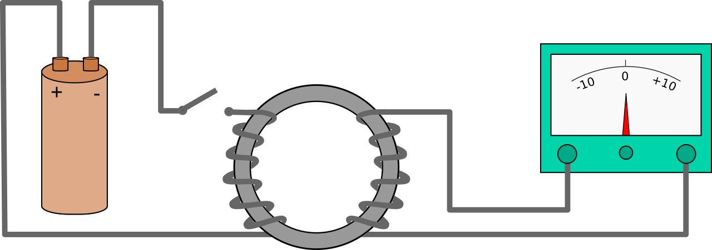
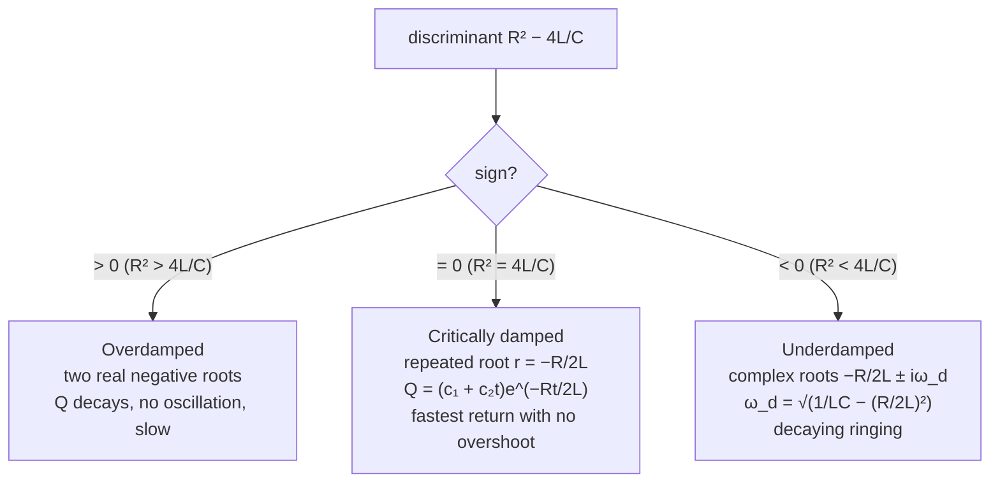

By 1830 the first half of the electromagnetic story was settled. Oersted had shown a current deflects a compass; Ampère had worked out the force between current-carrying wires; [magnetism](/citadel/physics/magnetism) was understood as something moving charges produce. The obvious question was whether the reverse held: if a current makes a magnetic field, can a magnetic field make a current?

Michael Faraday chased that question for the better part of a decade, and most of what he tried did not work. A strong permanent magnet held next to a coil wired to a galvanometer: nothing. A steady current in one coil, looking for an induced current in a neighbouring one: nothing. The breakthrough in 1831 was noticing *when* the needle moved — and it is the timing, not the field, that this whole subject turns on. This post covers Faraday's law and the Lenz sign, the inductor as a circuit element and the energy it stores, and the LR, LC, and RLC circuits that resistors, inductors, and capacitors build. Steady sinusoidal drive and resonance are the separate topic of [AC circuits](/citadel/physics/ac-circuits).

## The puzzle: why the steady field does nothing

Faraday's decisive apparatus was an iron ring with two separate coils wound on it. One coil went to a battery through a switch; the other went to a galvanometer. If a current in the first coil magnetises the ring, and the ring's field threads the second coil, surely the second coil should carry a current for as long as the battery is connected.

It does not. With the switch held closed and a strong steady current flowing, the galvanometer reads exactly zero. The needle kicks only at the *instant* the switch closes — then falls back to zero — and kicks the *other way* at the instant the switch opens. A steady magnetic field, no matter how strong, induces nothing. What induces an EMF is the field *changing*.

That is the fact everyone's intuition gets wrong, and once you have it, the rest is consequences.

## Faraday's law and the Lenz sign

Define the **magnetic flux** through a loop as the field integrated over any surface the loop bounds:

$$ \Phi_B = \int_S \vec B \cdot d\vec A $$

Faraday's law says the EMF induced around the loop equals the rate at which that flux changes:

$$ \mathcal E = -\frac{d\Phi_B}{dt} $$

The flux can change three ways, and all three are used in practice:

- **$\vec B$ changes** — the ring experiment; the primary of a transformer.
- **The loop's area changes** — a sliding bar on rails sweeping through a fixed field, giving a *motional EMF* $\mathcal E = B\ell v$.
- **The loop's orientation changes** — a coil rotating in a fixed field, sweeping $\Phi_B = BA\cos\omega t$, which is exactly how every rotating generator works and why grid power comes out sinusoidal.

The minus sign is **Lenz's law**, and it is not a bookkeeping detail — it is energy conservation wearing a disguise. The induced current flows in whatever direction makes *its own* magnetic field oppose the change that created it. Push a magnet toward a loop and the loop's induced field pushes back; pull it away and the loop pulls it back. You always do work against that opposition, and that work is exactly the electrical energy the loop dissipates. If the induced current reinforced the change instead, a tiny disturbance would drive an ever-growing current with no energy source — a free-energy machine. The universe declines, and the minus sign is how it says so.

### Motional EMF, seen two ways

Slide a conducting bar of length $\ell$ along rails at speed $v$ through a field $B$ perpendicular to the plane. In the bar's frame the free charges feel a magnetic force $qvB$ that piles them up at one end until the electric field of that pile-up balances it; the resulting potential difference is $\mathcal E = B\ell v$. In the lab frame the loop's area is growing at $\ell v$, so $d\Phi_B/dt = B\ell v$ and Faraday's law gives the same answer. That the two frames agree — one invoking a magnetic force on moving charges, the other a changing flux — is a hint that $\vec E$ and $\vec B$ are frame-dependent aspects of one field, which [special relativity](/citadel/physics/relative-mech) makes precise.

. Every radius of the spinning disk is a bar sweeping through the field, so it produces a steady DC EMF between axle and rim — the first electric generator. Source: Wikimedia Commons.")

## Self- and mutual inductance

A coil's own current produces flux through its own turns. Change that current and the changing self-flux induces a back-EMF in the coil that fights the change. This is **self-inductance** $L$, defined by

$$ \Phi_B = LI \quad\Longrightarrow\quad \mathcal E = -L\,\frac{dI}{dt} \qquad [\text{henry} = \text{V·s/A}] $$

$L$ depends only on geometry and the core material — for a long solenoid of $N$ turns, length $\ell$, area $A$: $L = \mu_0 N^2 A / \ell$, quadratic in the turn count because more turns both produce more flux and link more of it.

Two nearby coils have a **mutual inductance** $M$: a changing $I_1$ in the first induces $\mathcal E_2 = -M\,dI_1/dt$ in the second. Reciprocity makes $M_{12} = M_{21}$, and $M \le \sqrt{L_1 L_2}$, with equality only if every field line from one coil threads the other (perfect coupling, the transformer ideal).

Inductors combine like resistors: **series** $L_{\text{eq}} = \sum L_i$ (same $dI/dt$, back-EMFs add); **parallel** $1/L_{\text{eq}} = \sum 1/L_i$ (same EMF, currents add) — assuming no mutual coupling between them.

## Energy stored in the field

Ramping the current from $0$ to $I$ means pushing charge against the back-EMF the whole way. The power delivered is $P = \mathcal E_{\text{back}}\,I = LI\,dI/dt$, so the total work is

$$ U_L = \int_0^I L I'\,dI' = \tfrac12 L I^2 $$

This energy is not stored in the wire; it is stored in the magnetic field filling the space around and inside the coil, at a density $u = B^2/2\mu_0$. It is the exact magnetic counterpart of the $\tfrac12 C V^2$ a capacitor holds in its electric field, and the two together are what oscillate in the circuits below.

## The LR circuit: exponential approach

Put a resistor and an inductor across a battery $V_0$. Kirchhoff's voltage law gives a first-order equation, $V_0 = IR + L\,dI/dt$.

**Growth**, from $I(0) = 0$:

$$ I(t) = \frac{V_0}{R}\left(1 - e^{-t/\tau}\right), \qquad \tau = \frac{L}{R} $$

At the first instant, $dI/dt$ is large and the inductor's back-EMF equals the full battery voltage — the inductor behaves as an *open circuit* to a sudden step, admitting no current. As the current builds, $dI/dt$ falls, the back-EMF fades, and after one **time constant** $\tau$ the current has reached $1 - e^{-1} \approx 63.2\%$ of its final value $V_0/R$; after $5\tau$ it is within $1\%$.

**Decay**, with the battery shorted out and $I(0) = I_0$: $I(t) = I_0\,e^{-t/\tau}$. The field's stored energy drains into the resistor. This is why breaking an inductive circuit — a relay coil, a motor winding — throws a spark: $L\,dI/dt$ spikes to a huge voltage as the current is forced to zero in microseconds, and the energy $\tfrac12 L I_0^2$ has to go somewhere.

## The LC circuit: an oscillator with no moving parts

An inductor and a charged capacitor, no resistance. KVL gives $L\,dI/dt + Q/C = 0$, and with $I = dQ/dt$:

$$ \frac{d^2 Q}{dt^2} + \frac{1}{LC}\,Q = 0 $$

This is the equation of [simple harmonic motion](/citadel/physics/oscillations), letter for letter. With $\omega_0 = 1/\sqrt{LC}$, starting from charge $Q_0$ and zero current:

$$ Q(t) = Q_0\cos\omega_0 t, \qquad I(t) = -Q_0\omega_0\sin\omega_0 t $$

Energy sloshes losslessly between the capacitor's electric field and the inductor's magnetic field, completing the round trip twice per cycle — precisely as kinetic and potential energy trade in a mass on a spring, with $Q \leftrightarrow x$, $I \leftrightarrow v$, $L \leftrightarrow m$, and $1/C \leftrightarrow k$. Drive the same circuit with a battery from $Q(0) = 0$ and the solution is $Q(t) = CV_0(1 - \cos\omega_0 t)$: the charge *overshoots* its steady value $CV_0$ and swings all the way to $2CV_0$ before coming back, because there is no dissipation to settle it.

## The RLC circuit: three regimes

Add resistance and the oscillation bleeds energy. KVL gives a damped harmonic oscillator:

$$ L\,\frac{d^2 Q}{dt^2} + R\,\frac{dQ}{dt} + \frac{1}{C}\,Q = 0 $$

Try $Q \propto e^{rt}$; the characteristic equation $Lr^2 + Rr + 1/C = 0$ has roots

$$ r = \frac{-R \pm \sqrt{R^2 - 4L/C}}{2L} $$

and the sign of the discriminant $R^2 - 4L/C$ picks the behaviour:

For the underdamped case, $Q(t) = e^{-Rt/2L}\big(A\cos\omega_d t + B\sin\omega_d t\big)$ — a sinusoid inside a decaying envelope, the "ringing" you see when any real resonant circuit is kicked. These are the same three regimes as a [damped mechanical oscillator](/citadel/physics/oscillations); a door closer is engineered to sit right at critical damping so the door shuts fast without slamming or bouncing. Driving the RLC with a battery adds a constant particular solution $Q_p = CV_0$ that the transient decays onto.

## Eddy currents: the same law in bulk metal

Faraday's law does not need a wire loop — a changing flux through *any* conductor drives circulating **eddy currents** in it, and Lenz's law still applies: they oppose the change.

- **Useful.** An induction cooktop drives a high-frequency field through the pan's base; the eddy currents dissipate as $I^2R$ heat directly in the metal. Regenerative and eddy-current brakes drag a conductor through a field, and the induced currents produce a retarding force proportional to speed — smooth, contactless, and fade-free, though they cannot hold a stopped vehicle.
- **Wasteful.** The same currents in a transformer or motor core are pure loss and heating. The fix is to break the conduction path: laminate the core from thin insulated sheets, or use a ferrite, so large eddy loops cannot form. This is why a transformer core is a stack of varnished laminations, not a solid block.

A pivoted-coil **galvanometer** relies on the same physics for its damping — the coil former is often a conducting frame whose eddy currents bring the needle to rest without overshoot, giving a *dead-beat* movement.

## The transformer, and why AC won

Two coils on a shared iron core, coupled by mutual induction. With $N_p$ primary turns, $N_s$ secondary turns, and negligible flux leakage, the same changing flux threads every turn, so the induced EMF per turn is identical and

$$ \frac{V_p}{V_s} = \frac{N_p}{N_s} $$

An ideal transformer dissipates nothing, so $V_p I_p = V_s I_s$ and the currents scale inversely: step the voltage up by the turns ratio and the current steps down by the same factor. It only works on AC — a steady current produces a steady flux and induces nothing in the secondary.

That single fact settled the "war of the currents". Transmission loss down a line of resistance $R$ carrying current $I$ is $I^2 R$. To move a given power $P = VI$ across the country, you want the smallest possible $I$, which means the largest possible $V$ — hundreds of kilovolts. But generation and consumption both happen at low voltage. Only AC can be transformed up for the long haul and back down for delivery, with cheap, static, highly efficient transformers at each end. DC distribution, which Edison backed, had no equivalent and lost.

## Where the ideal picture leaks

Real inductors and transformers depart from the equations above in ways that matter:

- **Winding resistance** makes every real inductor an LR pair; its **quality factor** $Q = \omega L / R$ says how many radians it rings before decaying.
- **Core saturation** — push the flux too high and the iron's permeability collapses, $L$ drops, and the current spikes non-linearly.
- **Hysteresis loss** — cycling the core's magnetisation around its [B–H loop](/citadel/physics/magnetic) dissipates energy every cycle, proportional to the loop area, on top of the eddy-current loss.
- **Parasitic capacitance** between adjacent turns gives every real inductor a self-resonant frequency above which it behaves capacitively.
- **Back-EMF in motors** — a spinning motor is also a generator; its back-EMF grows with speed and limits the running current. At startup there is no back-EMF, which is why motors draw a large inrush current and large ones need soft-starters.

## The one idea to keep

Only a *changing* magnetic flux induces an EMF, and the induced current always fights the change that made it — which is energy conservation, not a coincidence. From that one law: motional EMF and every generator, the inductor and the $\tfrac12 L I^2$ it stores, the exponential LR circuit, the LC oscillator that is a mass-on-a-spring in disguise, the RLC's three damping regimes, eddy-current heating and braking, and the transformer that made a continental AC grid possible. In [Maxwell's synthesis](/citadel/physics/electromag) this law becomes $\nabla \times \vec E = -\partial \vec B/\partial t$: a changing magnetic field is itself a source of electric field, wire or no wire — which is half of what lets electromagnetic waves exist.
