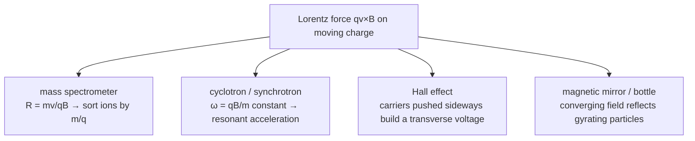

Magnetism is what moving charge does to other moving charge. A static charge makes an [electric field](/citadel/physics/static-em); set it moving and it also makes a magnetic field, and feels a force from any other magnetic field it passes through.

Here is the oddity that runs through the whole subject: the magnetic force on a charge, $q\vec v \times \vec B$, is always perpendicular to the velocity, so it **does no work** — it can bend a trajectory but never speed it up or slow it down. Yet electric motors, which run on this force, plainly deliver work. The resolution (the force only *redirects*; the energy comes from the source driving the current) is worth keeping in mind. A second clean surprise: a charge circling in a magnetic field completes each loop in the *same time* regardless of how fast it is going or how big its circle — the basis of the cyclotron.

This post covers that force on single charges and on wires, the orbits it produces, the law that gives the field of any current distribution, the effects that exploit it, and Earth's own field. The flip side — a *changing* magnetic field driving a current — is [electromagnetic induction](/citadel/physics/electromagnetic-induction); why materials respond to fields as they do is [magnetic materials](/citadel/physics/magnetic).

## The magnetic force

Before moving charges were understood as the source, magnetism was written as a Coulomb-style law between magnetic "poles" $m_1$, $m_2$:
$$ F = \frac{\mu_0}{4\pi}\,\frac{m_1 m_2}{r^2} $$
It is a workable picture for bar magnets but wrong in principle: there are no isolated magnetic poles (no monopoles), and magnetism comes from moving charge and intrinsic spin.

The real law is the magnetic part of the **Lorentz force**: a charge $q$ moving at $\vec{v}$ through a field $\vec{B}$ feels
$$ \vec{F} = q\,\vec{v}\times\vec{B}, \qquad F = qvB\sin\theta $$
Three consequences follow from the cross product:

- it acts only on *moving* charge;
- it is always perpendicular to both $\vec{v}$ and $\vec{B}$ (right-hand rule);
- being perpendicular to $\vec{v}$, it does **no work** — it turns a charge's velocity without changing its speed or kinetic energy.

## A charged particle in a uniform field

Split the velocity into $v_\parallel$ along $\vec{B}$ and $v_\perp$ across it. The parallel part feels no force and coasts; the perpendicular part feels a constant-magnitude force always turned $90°$ from the motion — a centripetal force. The result is a **helix**: uniform drift along the field, circular motion around it.

For the circular part, $qv_\perp B = mv_\perp^2/R$ gives
$$ R = \frac{mv_\perp}{qB}, \qquad \omega = \frac{v_\perp}{R} = \frac{qB}{m}, \qquad T = \frac{2\pi m}{qB} $$
The **cyclotron frequency** $\omega = qB/m$ is independent of speed and radius — faster particles trace bigger circles in the same time, which is what makes a cyclotron work. One turn advances the helix by a **pitch** $v_\parallel T$. With $\vec{B}$ along $x$ and the particle from the origin,
$$ x(t) = v_\parallel t, \qquad y(t) = R\sin\omega t, \qquad z(t) = R(1 - \cos\omega t) $$
Pure circular motion if $v_\parallel = 0$; a straight line if $v_\perp = 0$.

## Combined electric and magnetic fields

With both fields present the full Lorentz force $\vec{F} = q(\vec{E} + \vec{v}\times\vec{B})$ gives three coupled equations,
$$ \frac{d\vec{v}}{dt} = \frac{q}{m}\left(\vec{E} + \vec{v}\times\vec{B}\right) $$
Writing $\omega = qB/m$, three arrangements cover the behaviour.

**Crossed fields, $\vec{E}\perp\vec{B}$.** Take $\vec{E} = E_0\hat{y}$, $\vec{B} = B_0\hat{z}$. The gyration around $\vec{B}$ now rides on a steady sideways **drift**
$$ \vec{v}_{\text{drift}} = \frac{\vec{E}\times\vec{B}}{B^2}, \qquad |\vec{v}_{\text{drift}}| = \frac{E_0}{B_0} $$
the same for every charge regardless of sign or speed. Two special cases:

- **Velocity selector.** Launch a charge along $\hat{x}$ at exactly $v_0 = E_0/B_0$ and the electric and magnetic forces cancel — it goes straight through undeflected, while any other speed is bent away. This filters a beam to one velocity.
- **Cycloid.** Release a charge from rest and it traces the path of a point on a rolling wheel:
$$ x(t) = \frac{E_0}{B_0\omega}\big(\omega t - \sin\omega t\big), \qquad y(t) = \frac{E_0}{B_0\omega}\big(1 - \cos\omega t\big) $$
averaging to the drift speed $E_0/B_0$ along $\hat{x}$.

. C: force-driven drift (sign-dependent). D: gradient drift. Source: Wikimedia Commons.")

**Parallel fields, $\vec{E}\parallel\vec{B}$.** The magnetic force still only bends the perpendicular velocity into a circle, while $\vec{E}$ accelerates the particle uniformly *along* the field. The two are independent: a circular gyration of fixed radius combined with constant acceleration along the axis — an ever-tightening-pitch (actually ever-widening-pitch) helix.

**Everything parallel, $\vec{v}_0\parallel\vec{E}\parallel\vec{B}$.** Then $\vec{v}\times\vec{B} = 0$ for all time and the magnetic field does nothing; the particle just accelerates in a straight line along $\vec{E}$.

## Force on a current-carrying wire

A current is moving charge, so a wire carrying $I$ along a length vector $\vec{l}$ in a field feels
$$ \vec{F} = I\,\vec{l}\times\vec{B} $$
the force that drives every electric motor. A closed loop of area $\vec{A}$ (normal to the loop, magnitude the area) has a **magnetic dipole moment**
$$ \vec{m} = I\vec{A} $$
and in a uniform field feels no net force but a torque
$$ \vec{\tau} = \vec{m}\times\vec{B} $$
that swings the loop until $\vec{m}$ lines up with $\vec{B}$ — the same form as the [electric dipole torque](/citadel/physics/static-em), and the mechanism of the galvanometer.

## Field sources: the Biot–Savart law

Currents make fields. The **Biot–Savart law** gives the contribution of a current element $I\,d\vec{l}$ to the field at displacement $\vec{r}$:
$$ d\vec{B} = \frac{\mu_0}{4\pi}\,\frac{I\,d\vec{l}\times\hat{r}}{r^2} $$
Integrate over the circuit. Where the geometry is symmetric, **Ampère's law** $\oint\vec{B}\cdot d\vec{l} = \mu_0 I_{\text{enc}}$ is the faster route to the same answer.

**Straight wire.** At perpendicular distance $R$, with the wire's ends subtending angles $\phi_1$, $\phi_2$ at the field point,
$$ B = \frac{\mu_0 I}{4\pi R}\left(\sin\phi_1 + \sin\phi_2\right) $$
Infinite wire ($\phi_1 = \phi_2 = \pi/2$): $B = \dfrac{\mu_0 I}{2\pi R}$. Finite wire of length $2L$ on its bisector: $B = \dfrac{\mu_0 I L}{2\pi R\sqrt{R^2 + L^2}}$.

**Circular arc** of radius $R$, angle $\theta$ at the centre: $B = \dfrac{\mu_0 I\theta}{4\pi R}$.

**Circular loop, on the axis.** Every element's off-axis field is cancelled by the element opposite it, leaving only the axial component $dB\cos\alpha = dB\,R/\sqrt{x^2+R^2}$. Integrating $dl$ around the loop,
$$ B = \frac{\mu_0 I R^2}{2\,(x^2 + R^2)^{3/2}} \;\xrightarrow{\,x=0\,}\; \frac{\mu_0 I}{2R} $$

**Other standard shapes:**

| Geometry | Field |
|---|---|
| Solid cylinder, radius $R_c$, uniform $J$ | inside $B = \dfrac{\mu_0 I r}{2\pi R_c^2}$; outside $B = \dfrac{\mu_0 I}{2\pi r}$ |
| Long solenoid, $n$ turns/length | $B = \dfrac{\mu_0 n I}{2}(\sin\alpha_1 + \sin\alpha_2)$; infinite: $B = \mu_0 n I$ |
| Toroid, $N$ turns, mean radius $R$ | inside $B = \dfrac{\mu_0 N I}{2\pi R}$; outside $\approx 0$ |
| $n$-sided polygon, apothem $a$ | $B = \dfrac{\mu_0 n I}{2\pi a}\tan\dfrac{\pi}{n}\sin\dfrac{\pi}{n}$ |

**Magnetic flux** through a surface is $\Phi_B = \int_S \vec{B}\cdot d\vec{A}$, equal to $BA$ for a uniform field normal to a flat area, measured in webers (Wb).

## Effects that use the force

**Mass spectrometer.** Accelerate an ion through a potential $V$ to speed $v = \sqrt{2qV/m}$, send it into a uniform $\vec B$; it curves with radius $R = mv/qB$, so $m/q = B^2 R^2 / 2V$. Different masses land at different positions on a detector — the standard tool for isotope ratios and molecular identification.

**Cyclotron.** Because $\omega = qB/m$ does not depend on speed, an alternating voltage at that fixed frequency kicks a particle every half-turn as it spirals outward through two "dee" electrodes, reaching high energy without needing a high voltage. It breaks down when the particle gets relativistic and $m \to \gamma m$ shifts $\omega$ — the fix is the synchrotron, which ramps $B$ (and the drive frequency) as the particle speeds up.

**Hall effect.** Run a current through a flat conductor in a perpendicular field. The moving carriers are pushed to one edge by $q\vec v \times \vec B$ until the transverse electric field they build up balances the magnetic push. The resulting **Hall voltage** $V_H = IB/(nqt)$ (thickness $t$) reveals the carrier density $n$ *and its sign* — this is how it was confirmed that current in some semiconductors is carried by positive "holes". Hall sensors measure field and current contactlessly, and the quantised version at low temperature is a metrology standard for resistance.

**Magnetic mirrors.** A charge gyrating into a region of stronger field has its pitch angle turned until $v_\parallel$ reverses — it bounces. Two such regions make a magnetic bottle that traps plasma (fusion research), and the same mechanism holds charged particles in Earth's **Van Allen belts**.

## Earth's magnetic field

Earth is very nearly a dipole magnet. The field is generated by the **geodynamo** — convecting molten iron and nickel in the liquid outer core — and its axis is tilted about $10\text{–}11°$ from the rotation axis, so the magnetic poles are not the geographic poles. It steers compasses and, as the **magnetosphere**, deflects most of the solar wind, funnelling some of it to the poles as auroras.

At any point the field $B_E$ is resolved into a horizontal and a vertical component:
$$ B_H = B_E\cos\delta, \qquad B_V = B_E\sin\delta, \qquad B_E = \sqrt{B_H^2 + B_V^2} $$
The **angle of dip** $\delta$ is the tilt of the total field below the horizontal:
$$ \tan\delta = \frac{B_V}{B_H} $$
zero at the magnetic equator, $90°$ at the magnetic poles. If the dip is measured in a vertical plane making an angle $\beta$ with the magnetic meridian, the **apparent dip** $\delta'$ is larger:
$$ \tan\delta' = \frac{\tan\delta}{\cos\beta} $$

## The one idea to keep

The magnetic force $q\vec v \times \vec B$ acts only on moving charge, always at right angles to the motion, so it steers without doing work — circular or helical orbits with a speed-independent period $2\pi m/qB$. Add an electric field and you get drifts (the sign-independent $\vec E \times \vec B/B^2$) and selectors. A current is moving charge, so a wire feels $I\vec l \times \vec B$ (every motor) and a current loop feels a torque toward alignment (every meter). Currents are also the *source* of $\vec B$, through Biot–Savart or, given symmetry, Ampère's law. The force does no work, but the geometry it imposes runs mass spectrometers, particle accelerators, Hall sensors, and the magnetosphere.
