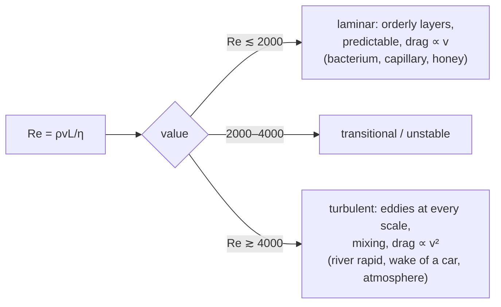
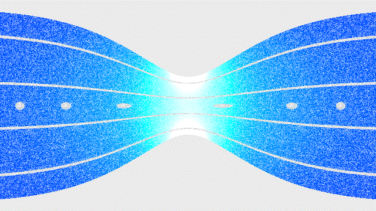

The same water can behave in two completely different ways. Coming out of a tap slowly it forms a smooth glassy column; a little faster and it breaks into a chaotic, noisy tangle. Nothing about the water changed — what changed is a single dimensionless number, the Reynolds number, the ratio of the fluid's inertia to its viscosity. Above a threshold value the smooth flow is unstable and turbulence takes over. That one ratio also means a swimming bacterium and a swimming human live in incompatible worlds: for you, inertia dominates and you glide between strokes; for the bacterium, viscosity dominates so completely that it stops dead the instant it stops pushing.

A fluid is anything that flows — liquid or gas — and it cannot sustain a shear stress at rest, which is what separates it from a solid. That single property, with Newton's laws and energy conservation, gives the pressure in a column, the buoyant force on a submerged object, the drag on a moving one, and the pressure drop where a flow speeds up. This post works through those, then the Navier–Stokes equations that contain them all.

## Pressure in a fluid at rest

The fluid at the bottom of a column supports the weight of everything above it, so pressure rises with depth:
$$ p = \rho g h $$
with $\rho$ the density, $g$ the gravitational acceleration, $h$ the vertical depth below the surface.

*Deriving it:* take a thin horizontal slab of fluid, area $A$, thickness $dh$, at depth $h$. Its weight $\rho A g\,dh$ presses on its lower face, so the pressure increases across it by $dP = \rho g\,dh$. Integrating from the surface (where the fluid contributes no pressure) to depth $h$, with $\rho$ and $g$ effectively constant for a liquid,
$$ P = \int_0^h \rho g\,dh = \rho g h $$
For water, $\rho \approx 1000\ \text{kg/m}^3$, so every metre of depth adds about 10 kPa — meaning roughly 10 m of water equals one atmosphere.

**Tilted containers don't matter.** The $h$ in $p = \rho g h$ is always the *vertical* distance to the free surface, whatever shape the container is or however the path to the surface runs. If a point sits a slant distance $L$ from the surface along a line at angle $\theta$ to the vertical, its depth is $h = L\cos\theta$ and $P = P_0 + \rho g L\cos\theta$. Pressure depends only on the height of fluid directly above and the pressure $P_0$ at the surface.

### Pascal's law

Pressure applied to an enclosed, incompressible fluid is transmitted undiminished to every part of it. A **hydraulic lift** uses this as a force multiplier: push a small piston of area $A_1$ with force $F_1$, creating pressure $F_1/A_1$; that same pressure acts on a large piston of area $A_2$, giving
$$ \frac{F_1}{A_1} = \frac{F_2}{A_2} \implies F_2 = F_1\,\frac{A_2}{A_1} $$
A large area ratio means a large force amplification. It is not free energy — the small piston travels farther by the same ratio, so the work is unchanged. Car brakes work the same way: a small force on the pedal becomes a large clamping force at each wheel.

## Buoyancy

**Archimedes' principle:** an object in a fluid feels an upward **buoyant force** equal to the weight of fluid it displaces:
$$ F_b = \rho_{\text{fluid}}\,V_{\text{displaced}}\,g $$
It comes straight from $p = \rho g h$: the pressure on the object's bottom is greater than on its top by exactly $\rho_{\text{fluid}}\,g \times (\text{height})$, and multiplied by area that is the displaced weight.

The object floats if $F_b$ at full submersion exceeds its weight $\rho_{\text{obj}}V_{\text{obj}}g$, i.e. if $\rho_{\text{obj}} < \rho_{\text{fluid}}$. A floating object sinks just far enough that the displaced weight equals its own weight — which is why a loaded ship rides lower and why ice floats with about 90% of its volume submerged (the density ratio of ice to water). A steel ship floats because its *average* density — hull plus all the enclosed air — is below that of water; melt it into a solid block and the same steel sinks.

## Surface tension

At a liquid's surface, molecules have neighbours below and beside but not above, so the net cohesive pull is inward, and the surface behaves like a stretched elastic skin that resists being enlarged. **Surface tension** $\gamma$ is the force per unit length across any line drawn in the surface:
$$ \gamma = \frac{F}{L} \qquad (\text{N/m}) $$

**Angle of contact.** Where liquid meets solid, the contact angle $\theta$ reports the tug-of-war between cohesion (liquid–liquid) and adhesion (liquid–solid). Adhesion wins for water on clean glass ($\theta < 90°$, the liquid wets and climbs); cohesion wins for mercury on glass or water on wax ($\theta > 90°$, the liquid beads up).

**Excess pressure across a curved surface.** Surface tension squeezes the inside of a curved interface, raising its pressure above the outside:
$$ \Delta P = \frac{2\gamma}{r} \quad (\text{droplet}), \qquad \Delta P = \frac{4\gamma}{r} \quad (\text{soap bubble, two surfaces}) $$
The $4\gamma/r$ is why a half-inflated balloon (or bubble) is *harder* to blow into when small — smaller $r$, higher back-pressure.

**Capillary rise.** In a narrow tube a wetting liquid climbs until the upward pull of surface tension around the rim, $2\pi r\gamma\cos\theta$, balances the weight of the raised column, $\pi r^2 h\rho g$:
$$ h = \frac{2\gamma\cos\theta}{\rho g r} $$
The rise is inversely proportional to the tube radius — thin tubes lift water higher. For $\theta > 90°$, $\cos\theta < 0$ and $h$ is negative: the level is *depressed*, as mercury is in a glass capillary.

## Viscosity

**Viscosity** $\eta$ is a fluid's internal friction — its resistance to layers sliding past each other. For a Newtonian fluid the shear stress between layers is proportional to the velocity gradient across them:
$$ \tau = \eta\,\frac{dv}{dy} $$
Units are Pa·s (or poise, $1\ \text{Pa·s} = 10\ \text{P}$). Honey has a viscosity thousands of times that of water; air's is about 50 times smaller still.

**Stokes' law.** A small sphere of radius $r$ moving slowly at speed $v$ through a fluid of viscosity $\eta$ feels drag
$$ F_{\text{drag}} = 6\pi\eta r v $$
valid only in smooth (low-Reynolds-number) flow.

**Reynolds number.** The dimensionless
$$ Re = \frac{\rho v L}{\eta} $$
compares inertial forces to viscous ones ($L$ a characteristic size).

Below ~2000 the flow is **laminar** (orderly layers sliding smoothly); above ~4000 it is **turbulent** (chaotic eddies at every scale); between is a transition, and the speed at which a given pipe crosses over is its **critical velocity**. The same fluid can be either — water through a tap is laminar, water in a river rapid is turbulent — depending on speed and size. A swimming person lives at $Re \sim 10^6$; a swimming bacterium at $Re \sim 10^{-4}$.

**Terminal velocity.** A sphere falling through a fluid accelerates until drag plus buoyancy balances weight, after which it falls at constant speed. Setting $F_g - F_b = F_{\text{drag}}$ with Stokes drag:
$$ \tfrac{4}{3}\pi r^3(\rho_{\text{obj}} - \rho_{\text{fluid}})g = 6\pi\eta r v_t \implies v_t = \frac{2r^2 g(\rho_{\text{obj}} - \rho_{\text{fluid}})}{9\eta} $$
The $r^2$ dependence is why fine dust settles so slowly and why a mist hangs in the air.

## Bernoulli's principle

For an ideal fluid — incompressible and non-viscous — in steady flow, the quantity
$$ p + \tfrac{1}{2}\rho v^2 + \rho g h = \text{constant} $$
is the same everywhere along a streamline. It is energy conservation per unit volume: $p$ is the work the surrounding fluid can do, $\tfrac{1}{2}\rho v^2$ is kinetic energy density, $\rho g h$ is potential energy density. Where the fluid speeds up, the kinetic term rises, so at fixed height the pressure term must fall — a parcel entering a fast region is pushed in from behind by higher pressure and does work against lower pressure ahead, and that net push is what accelerated it.

*Deriving it (work–energy):* follow a fluid parcel of mass $\Delta m$, volume $\Delta V = \Delta m/\rho$, from point 1 to point 2 along a streamline. The pressure behind pushes it forward doing $p_1\Delta V$; the pressure ahead resists, taking $p_2\Delta V$; gravity does $\Delta m\,g(h_1 - h_2)$. By the [work–energy theorem](/citadel/physics/newtonian-dynamics), the net work equals the change in kinetic energy:
$$ (p_1 - p_2)\frac{\Delta m}{\rho} + \Delta m\,g(h_1 - h_2) = \tfrac{1}{2}\Delta m(v_2^2 - v_1^2) $$
Divide by $\Delta m/\rho$ and regroup:
$$ p_1 + \rho g h_1 + \tfrac{1}{2}\rho v_1^2 = p_2 + \rho g h_2 + \tfrac{1}{2}\rho v_2^2 $$

 and leaves at (A₂, v₂, p₂, h₂). Source: Wikimedia Commons.")

**Continuity** ties speed to cross-section: an incompressible fluid carries the same volume per second past every point, so $A_1 v_1 = A_2 v_2$ — a narrower channel means faster flow.

**Applications.**

- **Venturi effect.** Narrow a pipe and continuity speeds the fluid up; Bernoulli then drops its pressure in the constriction. Carburettors and paint sprayers use that low pressure to draw in fuel or paint.
- **Aerofoil lift.** A wing works by deflecting air downward; by Newton's third law the air pushes the wing up. Bernoulli's relation still holds — the flow *is* faster over the curved upper surface, and its pressure *is* lower — but the popular "the two air parcels must meet at the trailing edge" reasoning for why it's faster is a myth. The real cause is the wing's shape and angle of attack turning the flow.

## The Navier–Stokes equations

Real fluids have viscosity and can be compressible, and the full description is the **Navier–Stokes equations** — coupled non-linear PDEs expressing three conservation laws.

**Mass** (continuity):
$$ \frac{\partial\rho}{\partial t} + \nabla\cdot(\rho\mathbf{v}) = 0 $$

**Momentum** (Newton's second law for a fluid element, with pressure, viscous, and body forces):
$$ \rho\left(\frac{\partial\mathbf{v}}{\partial t} + (\mathbf{v}\cdot\nabla)\mathbf{v}\right) = -\nabla p + \nabla\cdot\boldsymbol{\tau} + \rho\mathbf{g} $$

**Energy** (first law for a fluid element, with heat flux $\mathbf{q}$ and work by pressure and viscous stress):
$$ \rho\left(\frac{\partial e}{\partial t} + \mathbf{v}\cdot\nabla e\right) = \nabla\cdot(-p\mathbf{v} + \boldsymbol{\tau}\cdot\mathbf{v} - \mathbf{q}) + \rho\mathbf{g}\cdot\mathbf{v} + Q_{\text{source}} $$

Here $\boldsymbol{\tau}$ is the viscous (deviatoric) stress tensor and $e$ the specific internal energy. Bernoulli's principle is the special case of the momentum equation with viscosity and time-dependence dropped, integrated along a streamline. These equations model weather, ocean currents, flow over wings, and blood flow, but they are solvable in closed form only for the simplest geometries — everything else needs numerical computational fluid dynamics. Whether smooth solutions always exist in three dimensions is an open question, and one of the Clay Mathematics Institute's Millennium Prize Problems.

## The one idea to keep

A fluid cannot resist shear at rest, and almost everything follows. Pressure rises with the vertical height of fluid above ($p = \rho g h$), which gives Archimedes' buoyant force as the difference between the push on the bottom and the top. Motion adds two effects: viscosity (internal friction, giving Stokes drag and terminal velocity) and the inertia–viscosity balance measured by the Reynolds number, which decides whether flow is smooth or turbulent. For an ideal flow, energy per unit volume is conserved along a streamline ($p + \tfrac12\rho v^2 + \rho g h$ constant), so a fluid that speeds up must drop in pressure — the Venturi effect, and part of how a wing lifts (the wing deflects air down; Newton's third law does the rest). The full Navier–Stokes equations contain all of this and resist exact solution.
