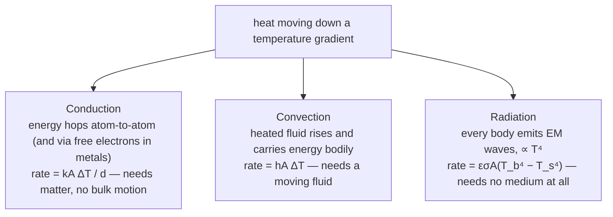

A spark off an angle grinder is at roughly $2000\ \text{K}$; it lands on your arm and does nothing. A bath at $310\ \text{K}$ — barely above body temperature — holds enough energy to scald. "Hotter" and "more thermal energy" are different things, and keeping them apart is the first job of this subject.

Heat is energy in transit because of a temperature difference. This post follows what that energy does once it arrives: it makes materials expand, it is stored at a rate that varies wildly between substances, it can change a material's phase without changing its temperature, and it travels by three distinct mechanisms. The last of those — radiation — ends at the blackbody spectrum, a curve that classical physics could reproduce at long wavelengths *or* at short ones but never both at once, and whose full explanation forced the first quantum hypothesis.

## Heat versus temperature

The two are routinely conflated and are not the same thing.

**Heat** $Q$ is thermal energy being transferred between bodies at different temperatures. It flows spontaneously from hot to cold and stops when they reach **thermal equilibrium** — the same temperature, zero net flow. Its unit is the joule.

**Temperature** $T$ measures how energetic the random motion of a body's particles is — proportional to their average kinetic energy (this is made exact in [kinetic theory](/citadel/physics/kinetics)). Its SI unit is the kelvin. Temperature is intensive; heat content is extensive. A spark from a grinder is at ~2000 K but carries almost no energy; a lukewarm bath is at ~310 K but holds megajoules. Confusing the two is confusing "how fast are the molecules moving" with "how many are there and moving".

## Thermal expansion

Heat a solid and its atoms vibrate harder about their lattice sites; the asymmetry of the interatomic potential means "harder vibration" also means "larger average spacing", so the material grows. Cool it and it shrinks. Bridges get expansion joints and railway lines used to be laid with gaps for exactly this reason.

**Linear expansion.** For a rod, the fractional length change is proportional to the temperature change:
$$ \Delta L = \alpha L_0\,\Delta T $$
with $\alpha$ the **coefficient of linear expansion** (units $\text{K}^{-1}$), a material property. This is really the integrated form of $dL = \alpha L_0\,dT$; for the small $\alpha\,\Delta T$ of everyday temperature swings, $\alpha$ is effectively constant and the linear formula holds.

**Area and volume.** A flat sheet grows in two dimensions and a solid in three:
$$ \Delta A = \beta A_0\,\Delta T, \qquad \Delta V = \gamma V_0\,\Delta T $$
For a material that expands equally in all directions, $\beta \approx 2\alpha$ and $\gamma \approx 3\alpha$ — take $(1 + \alpha\Delta T)^2$ and $(1 + \alpha\Delta T)^3$ and drop the higher-order terms.

**Across the states of matter.** Solids expand modestly. Most liquids expand more. Water is the important exception: between 0 °C and 4 °C it *contracts* on heating, so its density peaks at 4 °C — which is why lakes freeze from the top down (the coldest water rises), leaving liquid water and living things below the ice. Gases expand most of all, their volume tracking $T$ directly through $PV = nRT$.

### Thermal stress

If a material is clamped so it *can't* expand when heated, the expansion it "would have" undergone appears instead as elastic strain, and with it a stress. From Young's modulus $Y$ (see [mechanical properties](/citadel/physics/mechanical)),
$$ Y = \frac{\text{stress}}{\text{strain}} = \frac{F/A}{\Delta L / L_0} $$
a prevented expansion $\Delta L = \alpha L_0\,\Delta T$ corresponds to a strain $\alpha\,\Delta T$, so the stress that develops is
$$ \sigma_{\text{thermal}} = Y\alpha\,\Delta T $$
independent of the length. The elastic **strain energy** stored is the work done against the increasing restoring force $F = (YA/L_0)\,l$:
$$ U = \int_0^{\Delta L} \frac{YA}{L_0}\,l\,dl = \frac{YA}{2L_0}(\Delta L)^2 = \tfrac{1}{2}F_{\text{final}}\,\Delta L $$
and per unit volume this is $\tfrac{1}{2}\times\text{stress}\times\text{strain}$. Steel with $Y \approx 200$ GPa and $\alpha \approx 12\times10^{-6}\ \text{K}^{-1}$ builds roughly 2.4 MPa of stress per kelvin — the reason a constrained pipe or rail can buckle over a hot afternoon.

## Specific heat capacity

The heat needed to warm a substance depends strongly on what it is. The **specific heat capacity** $c$ is the heat per unit mass per degree:
$$ Q = mc\,\Delta T $$
Water's $c \approx 4180\ \text{J/(kg·K)}$ is unusually high — five times that of most rock, ten times that of most metals — which is why the oceans buffer the planet's temperature and why a coastal climate is milder than an inland one.

### Two heat capacities for a gas

Heat a gas at **constant volume** and every joule goes into internal energy (temperature). Heat it at **constant pressure** and it also expands and does work, so it needs more heat for the same rise. Hence $C_p > C_v$, related for an ideal gas by **Mayer's relation**:
$$ C_p - C_v = R \qquad (\text{molar}), \qquad c_p - c_v = R/M \quad (\text{per unit mass}) $$
The size of $C_v$ itself comes from the molecule's degrees of freedom — worked out in [kinetic theory](/citadel/physics/kinetics).

### Calorimetry

Mix substances at different temperatures in an insulated container and energy conservation is just bookkeeping: the heat lost by the hot ones equals the heat gained by the cold ones, $\sum m_i c_i\,\Delta T_i = 0$. Measuring the masses and the final equilibrium temperature then yields any one unknown $c$ or $Q$.

## Phase changes and latent heat

Adding heat does not always raise the temperature. At a melting or boiling point, added heat goes entirely into rearranging molecules — breaking the bonds that hold a solid rigid, or freeing molecules from a liquid — and the temperature holds constant until the change is complete. The heat per unit mass for the transition is the **latent heat**:
$$ Q = mL_f \quad (\text{fusion: melt/freeze}), \qquad Q = mL_v \quad (\text{vaporisation: boil/condense}) $$
Latent heats dwarf sensible heats: melting ice absorbs $L_f \approx 334\ \text{kJ/kg}$ — as much as heating that water through 80 K — and boiling it absorbs $L_v \approx 2260\ \text{kJ/kg}$. This is why ice is an effective coolant and why a steam burn is far worse than a hot-water burn: condensing steam dumps $L_v$ into your skin before the water has even started to cool.

## Heat transfer: three mechanisms

### Conduction

Energy passes from vibrating atom to neighbouring atom (and, in metals, is carried quickly by free electrons). The steady-state rate through a slab is **Fourier's law**:
$$ \frac{dQ}{dt} = \frac{kA\,\Delta T}{d} $$
with $k$ the **thermal conductivity**, $A$ the area, $d$ the thickness. Defining a **thermal resistance** $R_{\text{th}} = d/(kA)$ makes it an exact analogue of Ohm's law,
$$ \frac{dQ}{dt} = \frac{\Delta T}{R_{\text{th}}} $$
so slabs in series add their resistances — the basis of every insulation calculation.

### Convection

A heated fluid expands, becomes less dense, and rises, carrying its energy bodily upward while cooler fluid sinks to replace it. The rate between a surface at $T_s$ and fluid at $T_b$ is written
$$ \frac{dQ}{dt} = hA\,(T_s - T_b) $$
with $h$ the **convective heat transfer coefficient**, which bundles up the fluid properties, the flow speed, and the geometry. For an object of mass $m$ and specific heat $S$ cooling by convection into surroundings held at $T_s$:
$$ -mS\frac{dT_b}{dt} = hA\,(T_b - T_s) \implies T_b(t) = T_s + (T_1 - T_s)\,e^{-hAt/(mS)} $$
an exponential relaxation toward the ambient temperature with time constant $mS/(hA)$.

### Radiation

Every body above absolute zero emits electromagnetic waves, and radiation needs no medium — it is how the Sun's energy crosses empty space. Incident radiation is absorbed, reflected, or transmitted.

Two quantities describe the emission:

- **Spectral emissive power** $E_\lambda$: power radiated per unit surface area per unit wavelength interval, at wavelength $\lambda$. The **total emissive power** is $E = \int_0^\infty E_\lambda\,d\lambda$.
- **Spectral energy density** $u_\lambda$: energy per unit volume per unit wavelength *inside* a radiation field, such as a cavity. Total $u = \int_0^\infty u_\lambda\,d\lambda$. For isotropic radiation the two are linked by $E_\lambda = \tfrac{c}{4}u_\lambda$.

## Radiative exchange

**Prevost's theory** (1791): a body does not "hold" cold — it continuously *emits* radiation set by its own temperature and surface, and *absorbs* radiation from its surroundings. Whichever is larger decides whether it warms or cools; at equilibrium the two rates match.

For a body of emissivity $\epsilon$, area $A$, temperature $T_b$, in surroundings at $T_s$, the emitted and absorbed rates follow the Stefan–Boltzmann law (below), and **Kirchhoff's law** — a good absorber at a wavelength is an equally good emitter, $\epsilon = \alpha$ — makes them combine cleanly:
$$ \left(\frac{dQ}{dt}\right)_{\text{net}} = \epsilon\sigma A\,(T_b^4 - T_s^4) $$

**Newton's law of cooling** is the small-difference limit of this. Factor $T_b^4 - T_s^4 = (T_b - T_s)(T_b + T_s)(T_b^2 + T_s^2)$, and for $T_b \approx T_s$ the last two factors are $\approx 2T_s$ and $\approx 2T_s^2$, so
$$ T_b^4 - T_s^4 \approx 4T_s^3\,(T_b - T_s) $$
Feeding this into $-mS\,dT_b/dt = \epsilon\sigma A\,(T_b^4 - T_s^4)$ gives
$$ \frac{dT_b}{dt} = -k\,(T_b - T_s), \qquad k = \frac{4\epsilon\sigma A T_s^3}{mS} $$
"the rate of cooling is proportional to the temperature difference" — which also describes convective cooling when $h$ is constant, and is why a cup of coffee's cooling curve is a decaying exponential.

## Blackbody radiation

A **blackbody** is an idealised perfect absorber: it takes in all radiation at every wavelength and angle. In equilibrium it is therefore also a perfect emitter, and its emission spectrum depends *only* on its temperature, not on what it is made of. A small hole into a heated cavity is an excellent blackbody, and so, roughly, is a star.

Three laws describe it:

- **Stefan–Boltzmann law** — total power per unit area:
$$ \frac{P}{A} = \sigma T^4, \qquad \sigma = 5.67\times10^{-8}\ \text{W/(m}^2\text{K}^4) $$
(a factor $\epsilon$ in front for a real "grey" body). The fourth power is steep: double the temperature and the radiated power rises sixteenfold.

- **Wien's displacement law** — the wavelength of peak emission:
$$ \lambda_{\max}T = b, \qquad b \approx 2.898\times10^{-3}\ \text{m·K} $$
The Sun at ~5800 K peaks near 500 nm (green-yellow, in the middle of the visible band); a room at 300 K peaks near 10 µm, deep in the infrared. This is why heated metal glows first dull red, then orange, then white as it climbs.

, with the classical Rayleigh–Jeans prediction for 5000 K shown diverging at short wavelength — the ultraviolet catastrophe. Source: Wikimedia Commons.")

- **The spectrum itself.** Classical physics gave two half-answers. The **Rayleigh–Jeans law**,
$$ E_\lambda\,d\lambda = \frac{8\pi k_B T}{\lambda^4}\,d\lambda $$
matched long wavelengths but ran to infinity as $\lambda \to 0$ — the "ultraviolet catastrophe", a clear sign classical physics was incomplete. **Wien's distribution law**,
$$ E_\lambda\,d\lambda = \frac{a}{\lambda^5\,e^{b/\lambda T}}\,d\lambda \qquad (a = 8\pi hc,\; b = hc/k_B) $$
matched short wavelengths but failed at long ones.

- **Planck's law** (1900) fit the whole curve by assuming the cavity's oscillators could only hold energy in discrete packets $h\nu$:
$$ E_\lambda\,d\lambda = \frac{8\pi hc}{\lambda^5}\,\frac{1}{e^{hc/(\lambda k_B T)} - 1}\,d\lambda $$
It reduces to Rayleigh–Jeans for large $\lambda$ and to Wien for small $\lambda$. The quantisation Planck introduced as a mathematical device turned out to be real, and this formula is where [quantum mechanics](/citadel/physics/quantum) begins.

## Where this connects

Specific heat, latent heat, and expansion are the ground floor of materials science and of any study of phase transitions. Radiative transfer plus the blackbody laws are how a star's temperature and composition are read from its light ([stellar astrophysics](/citadel/physics/stellar-astrophysics)). The same absorption-and-emission balance, applied to greenhouse gases in the atmosphere, sets the Earth's surface temperature. And the laws governing how heat converts to work — engines, refrigerators, the arrow of time — are [thermodynamics](/citadel/physics/thermodynamics).

## The one idea to keep

Temperature measures how energetic the random molecular motion is; heat is energy moving because two things have different temperatures — a spark and a bath make the distinction vivid. That energy expands matter (and builds huge stress, $Y\alpha\,\Delta T$, if the expansion is prevented), is stored at a substance-specific rate $mc\,\Delta T$, and stalls the temperature entirely during a phase change while it pays the latent heat. It travels by conduction, convection, and radiation — the last needing no medium and scaling as $T^4$ — and the radiation spectrum of a hot body is the curve that classical physics could not fit, opening the door to quantum mechanics.
