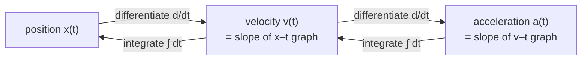

Mechanics has two halves. One explains *why* a motion happens — forces, masses, energy, [Newton's laws](/citadel/physics/newtonian-dynamics). The other just describes the motion itself, exactly, with no mention of what causes it. That second half is **kinematics**, and doing it first is not laziness; it is the only way the "why" has something precise to attach to. "The projectile accelerates downward at $g$" has to be a sharp, unambiguous statement before "gravity is what does that" can mean anything.

This post builds the description: reference frames, the calculus tying position to velocity to acceleration, the constant-acceleration formulas and where they come from, one case of varying acceleration, projectile motion on level ground and on a slope, relative motion between two observers, and — the part most treatments skip — how badly the idealised answers fail once air is in the picture.

## The surprise Galileo had to fight for

Aristotle taught, and everyone believed for nearly two thousand years, that heavier things fall faster and that a moving object needs a continuous push to keep moving. Both are wrong, and Galileo's demolition of them is the foundation this whole subject sits on.

**All bodies fall at the same rate.** Drop a cannonball and a musket ball together (Galileo used inclined planes to slow the motion down enough to time it, not the Leaning Tower) and, air resistance aside, they land together. The acceleration of a falling body — call it $g \approx 9.8\ \text{m/s}^2$ near Earth's surface — does not depend on its mass. On the airless Moon a hammer and a feather released together land together, as Apollo 15 showed on live television.

**Horizontal and vertical motion are independent.** Fire a bullet horizontally off a cliff at the same instant you drop one from your hand, and the two hit the ground *simultaneously*. The fired bullet's forward speed does nothing to delay its fall. Gravity pulls down; nothing pulls back horizontally; the two axes evolve on their own, sharing only the clock.

The sharpest demonstration is the **monkey and the hunter**. A hunter aims a dart gun *directly* at a monkey hanging from a branch. At the instant the dart leaves the barrel, the monkey lets go and drops. Where should the hunter have aimed? The answer is: exactly where they did — straight at the monkey. Both the dart and the monkey fall the same distance $\tfrac12 g t^2$ in the same time, so the dart's shortfall from its straight-line path exactly matches the monkey's drop, and they meet. This works for *any* dart speed; a faster dart simply meets the monkey higher up.

That independence is the single fact that makes projectile motion solvable: it lets you split a hard two-dimensional problem into two easy one-dimensional ones.

## Reference frames

Motion is only defined relative to something. On a smooth-riding train, toss a ball straight up and it comes straight back to your hand. To someone on the platform, that same ball traces a parabola as the train carries it past. Neither observer is wrong — a description of motion is always tied to a **reference frame**, the coordinate system the measurements are made in, and changing frames changes the numbers. Every position, velocity, and acceleration below is implicitly "as measured in some frame". Frames that are not accelerating (**inertial frames**) are the ones in which Newton's laws take their simple form; the transformation between two of them, $x' = x - vt$, is called Galilean relativity, and it is exactly the thing [special relativity](/citadel/physics/relative-mech) has to correct at high speed.

## The calculus of motion

Three quantities, each the time derivative of the one before:

- **Position** $\vec r$ — where the object is.
- **Velocity** $\vec v = d\vec r/dt$ — the rate of change of position, a vector (a speedometer shows only its magnitude).
- **Acceleration** $\vec a = d\vec v/dt = d^2\vec r/dt^2$ — the rate of change of velocity.

The graphical reading is worth holding onto: velocity is the *slope* of the position–time graph, and displacement is the *area* under the velocity–time graph. Acceleration is the slope of the velocity–time graph, and change in velocity is the area under the acceleration–time graph.

One more form, for when position appears but time does not — apply the chain rule:

$$ a = \frac{dv}{dt} = \frac{dv}{dx}\cdot\frac{dx}{dt} = v\,\frac{dv}{dx} $$

**Uniform motion** is constant velocity — constant speed *and* direction — a straight line on the $x$–$t$ graph. **Non-uniform motion** has non-zero acceleration and a curved $x$–$t$ graph.

## Constant acceleration

The important special case is $a$ constant. Free fall with air resistance ignored is the standard example. Write $\vec u$ for the velocity at $t = 0$, $\vec v$ for the velocity at time $t$, and take $\vec x_0 = 0$.

**Velocity–time.** Integrate $a = dv/dt$:

$$ \int_{\vec u}^{\vec v} d\vec v = \int_0^t \vec a\,dt \quad\Longrightarrow\quad \vec v = \vec u + \vec a t $$

**Position–time.** Integrate $\vec v = d\vec x/dt$:

$$ \int_0^{\vec x} d\vec x = \int_0^t (\vec u + \vec a t')\,dt' \quad\Longrightarrow\quad \vec x = \vec u t + \tfrac12 \vec a t^2 $$

**Velocity–position** (one dimension). Eliminate $t$ using $t = (v-u)/a$:

$$ x = u\left(\frac{v-u}{a}\right) + \frac12 a\left(\frac{v-u}{a}\right)^2 = \frac{v^2 - u^2}{2a} \quad\Longrightarrow\quad v^2 = u^2 + 2ax $$

**Distance covered in the $n$th second.** The displacement *during* the $n$th second is $x(n) - x(n-1)$:

$$ s_n = \left(un + \tfrac12 a n^2\right) - \left(u(n-1) + \tfrac12 a(n-1)^2\right) = u + \frac{a}{2}(2n - 1) $$

a distance measured over a one-second window, not an instantaneous speed, even though its units look like one.

## When acceleration varies

The integration still works whenever $a$ is an integrable function of time. Take $a(t) = k t^n$ as a representative case. Integrating $dv/dt = kt^n$ (for $n \ne -1$):

$$ v(t) = u + \frac{k\,t^{n+1}}{n+1} $$

and integrating again (for $n \ne -1, -2$):

$$ x(t) = ut + \frac{k\,t^{n+2}}{(n+1)(n+2)} $$

The constant-acceleration formulas are just the $n = 0$ instance. When $a$ depends on velocity instead — as air drag does — the same idea applies but you separate variables in $m\,dv/dt = F(v)$ and integrate; that is the route to terminal velocity below.

## Projectile motion on level ground

A projectile moves under gravity alone (air resistance ignored). Launch speed $u$ at angle $\theta$ above the horizontal: $u_x = u\cos\theta$, $u_y = u\sin\theta$, with $a_x = 0$ and $a_y = -g$. The two axes run independently, coupled only by the shared $t$:

$$ x = (u\cos\theta)\,t, \qquad y = (u\sin\theta)\,t - \tfrac12 g t^2 $$

**Time of flight** — return to launch height, $y = 0$:

$$ T = \frac{2u\sin\theta}{g} $$

**Maximum height** — at the peak $v_y = 0$, so $t_{\text{peak}} = (u\sin\theta)/g = T/2$, and

$$ H_{\max} = \frac{u^2\sin^2\theta}{2g} $$

**Range** — horizontal distance in time $T$:

$$ R = (u\cos\theta)\,T = \frac{2u^2\sin\theta\cos\theta}{g} = \frac{u^2\sin 2\theta}{g} $$

largest when $\sin 2\theta = 1$, i.e. $\theta = 45°$. The range is also symmetric about $45°$: complementary angles ($30°$ and $60°$, say) give the same range by different trajectories, one flat and fast, one high and slow.

**Trajectory shape** — eliminate $t$ with $t = x/(u\cos\theta)$:

$$ y = x\tan\theta - \frac{g}{2u^2\cos^2\theta}\,x^2 $$

of the form $y = Ax - Bx^2$: a downward parabola. (**Vertical launch**, $\theta = 90°$: $T = 2u/g$, $H_{\max} = u^2/2g$. **Dropped from rest** from height $h$: $t = \sqrt{2h/g}$.)

## Projectile on an inclined plane

Now the landing surface is a slope at angle $\alpha$ to the horizontal, and the launch angle $\beta$ is measured *from the incline*. Rotate the axes to lie along and perpendicular to the slope. In the rotated frame, gravity has components $a_{x'} = -g\sin\alpha$ (down-slope) and $a_{y'} = -g\cos\alpha$ (into the slope), and the launch velocity is $u_{x'} = u\cos\beta$, $u_{y'} = u\sin\beta$.

**Time of flight** — perpendicular displacement returns to zero:

$$ 0 = (u\sin\beta)T - \tfrac12 (g\cos\alpha)T^2 \quad\Longrightarrow\quad T = \frac{2u\sin\beta}{g\cos\alpha} $$

**Maximum height above the incline** — from $v_{y'}^2 = u_{y'}^2 + 2a_{y'}H$ with $v_{y'} = 0$:

$$ H_{\max\perp} = \frac{u^2\sin^2\beta}{2g\cos\alpha} $$

**Range along the incline** — from $x' = u_{x'}T + \tfrac12 a_{x'}T^2$ with that $T$, and using $\cos(\beta+\alpha) = \cos\beta\cos\alpha - \sin\beta\sin\alpha$:

$$ R_{\text{incline}} = \frac{2u^2\sin\beta}{g\cos^2\alpha}\big(\cos\beta\cos\alpha - \sin\beta\sin\alpha\big) = \frac{2u^2\sin\beta\cos(\beta+\alpha)}{g\cos^2\alpha} $$

**Launch angle for maximum range up the slope.** Maximise $\sin\beta\cos(\beta+\alpha)$. The identity $\sin A\cos B = \tfrac12[\sin(A+B) + \sin(A-B)]$ turns it into $\tfrac12[\sin(2\beta+\alpha) - \sin\alpha]$, maximal when $\sin(2\beta+\alpha) = 1$:

$$ \beta_{\max} = \frac{\pi}{4} - \frac{\alpha}{2} $$

— bisecting the angle between the incline and the vertical. Putting this back:

$$ R_{\max,\text{incline}} = \frac{u^2}{g(1 + \sin\alpha)} $$

using $\cos^2\alpha = (1-\sin\alpha)(1+\sin\alpha)$. For $\alpha \to 0$ this reduces to $u^2/g$ and $\beta_{\max} \to 45°$, matching the flat-ground result.

## Relative motion

If A and B have velocities $\vec v_A$ and $\vec v_B$ in a common frame, the velocity of A *as seen from* B is the difference:

$$ \vec v_{AB} = \vec v_A - \vec v_B, \qquad \vec a_{AB} = \vec a_A - \vec a_B $$

Boarding a moving walkway, aiming a boat across a flowing river, closing on a car in the next lane — the quantity that governs the outcome is the relative velocity, not either absolute one. To cross a river of width $w$ with current $v_c$ and boat speed $v_b$ (relative to the water): point straight across and you land downstream by $w v_c / v_b$; to land directly opposite, aim upstream at $\arcsin(v_c/v_b)$ and cross in time $w/\sqrt{v_b^2 - v_c^2}$. At speeds near that of light this simple subtraction fails and is replaced by the [relativistic velocity-addition rule](/citadel/physics/relative-mech).

## Where the clean answers break: air

Every projectile result above assumes a vacuum. Air changes the problem qualitatively, not just quantitatively, because drag depends on velocity — roughly $F_D = \tfrac12 \rho C_D A v^2$ for the speeds of balls and bullets — and it always points opposite the motion.

- **The trajectory is no longer a parabola.** Drag steepens the descent relative to the ascent, so the real path is a lopsided curve (a "ballistic curve") with the descending branch shorter and steeper than the rising one.
- **The optimal launch angle drops well below $45°$.** For a batted baseball it is around $35°$–$40°$; for a long-range artillery shell, lower still. A flatter shot spends less time exposed to drag.
- **Terminal velocity.** In free fall, drag grows with speed until it balances gravity: $mg = \tfrac12\rho C_D A v_t^2$, after which the fall is at constant $v_t$ — about $55\ \text{m/s}$ for a skydiver belly-down, $5\ \text{m/s}$ for a raindrop, near zero for dust. Solving $m\,dv/dt = mg - kv^2$ gives $v(t) = v_t\tanh(gt/v_t)$: the approach to terminal speed, an integrable varying-acceleration problem.
- **Non-inertial frames.** Describe motion in a rotating frame — the spinning Earth — and extra apparent accelerations appear: the centrifugal term and the **Coriolis** term $-2\vec\omega \times \vec v$, which deflects long-range projectiles and steers weather systems. They are artefacts of the frame, not forces, but inside that frame you must include them.

## The one idea to keep

Kinematics is the exact language of motion with the causes stripped out, and its two load-bearing facts both come from Galileo: every body accelerates the same under gravity regardless of mass, and the components of motion along perpendicular axes evolve independently, sharing only time. That independence is why a hard 2D problem splits into two easy 1D ones, and why the monkey always gets hit. Supplying the *reason* a motion is the one that occurs — the force that sets $a$ — is the job of [dynamics](/citadel/physics/newtonian-dynamics).
