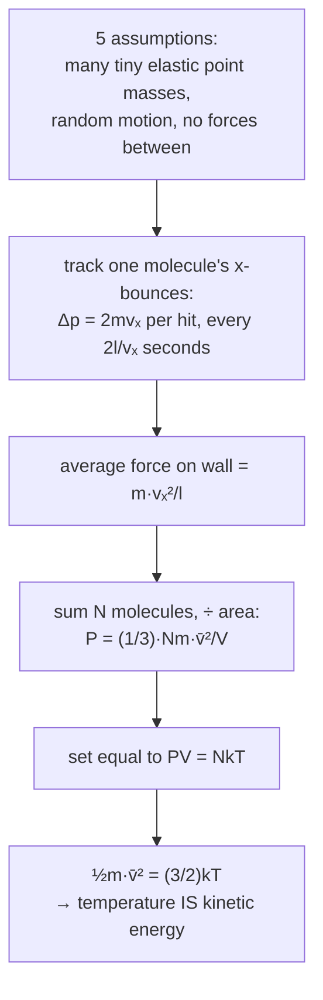
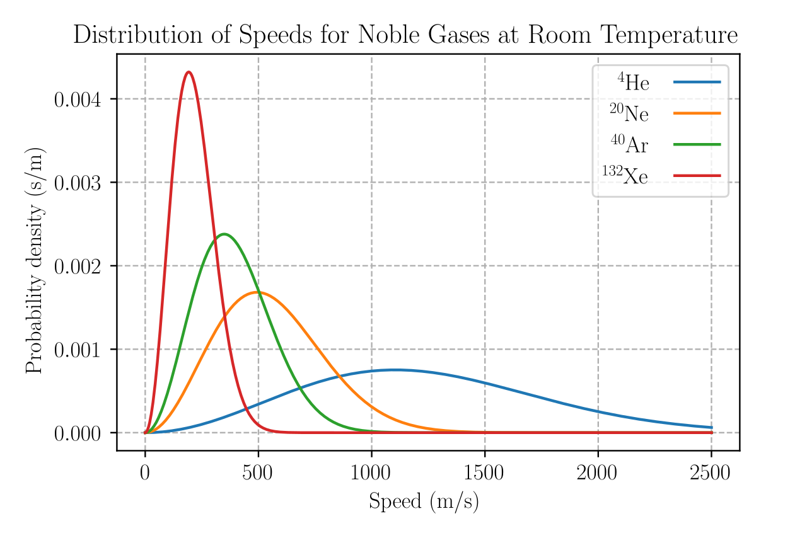

The ideal gas law $PV = nRT$ was assembled from bench experiments over 150 years — Boyle squeezing air in a J-tube, Charles and Gay-Lussac heating sealed flasks — with no idea what a gas actually *was*. Then in the 1850s Clausius, Maxwell, and Boltzmann asked a different question: suppose a gas is nothing but an enormous swarm of tiny hard balls in random flight, bouncing off the walls. What pressure would that produce?

The answer is $PV = NkT$ — the same law, now *derived* rather than measured. And the derivation throws off something the experiments never could: it says exactly what temperature is. Not "degree of hotness" but, to within a fixed constant, the average kinetic energy of one molecule. A second surprise falls out of the same algebra — the typical molecular speed in room-temperature air comes to about $500\ \text{m/s}$, essentially the speed of sound, which is no coincidence at all: sound is a pressure ripple carried by exactly those moving molecules. This post builds that derivation, uses it to pin down molecular speeds and heat capacities, then adds the corrections real gases need.

## The ideal gas law

For a gas that is neither very compressed nor very cold,
$$ PV = nRT $$
with $P$ the absolute pressure, $V$ the volume, $n$ the number of moles, $T$ the absolute temperature, and $R \approx 8.314\ \text{J/(mol·K)}$ the universal gas constant. This one relation contains the older single-variable laws:

- **Boyle's law**: at fixed $T$ and $n$, $P \propto 1/V$ — squeeze it and the pressure rises.
- **Charles's law**: at fixed $P$ and $n$, $V \propto T$ — heat it and it expands.
- **Gay-Lussac's law**: at fixed $V$ and $n$, $P \propto T$ — heat a sealed container and the pressure builds.

## Work done on a gas

When a gas changes volume against a pressure it exchanges mechanical work:
$$ dW = -P\,dV \implies W = -\int_{V_i}^{V_f} P\,dV $$
The sign convention: $W$ is the work done *on* the gas, so compression ($dV < 0$) makes $W > 0$. At constant pressure (isobaric),
$$ W = -P\,\Delta V $$
The integral is the area under the process curve on a $P$–$V$ diagram, and its value depends on the path, not just the endpoints — the point that leads into the first law of [thermodynamics](/citadel/physics/thermodynamics).

## The kinetic model

Kinetic theory rests on five assumptions about an ideal gas:

1. A gas is a very large number of identical molecules, on average far apart compared with their size — effectively point masses.
2. They are in constant, rapid, random motion.
3. Collisions (molecule–molecule and molecule–wall) are perfectly elastic — kinetic energy is conserved.
4. Between collisions the molecules exert no forces on each other — no long-range attraction or repulsion.
5. The average translational kinetic energy is proportional to the absolute temperature.

### Pressure from collisions

Pressure is the accumulated force of molecules hammering the walls, averaged over the countless impacts per second onto every square metre. To turn that into a formula, follow one molecule of mass $m$ in a cubic box of side $l$, and track only its $x$-velocity component $v_x$ (the $y$ and $z$ components carry it toward the other walls and don't matter here).

1. Each time it strikes the wall perpendicular to $x$ it rebounds elastically, reversing $v_x$: its momentum changes by $\Delta p_x = -2mv_x$, and by Newton's third law it delivers $+2mv_x$ to the wall.
2. After bouncing off that wall it crosses to the far wall and back before returning, a round trip of $2l$ at speed $v_x$, so the time between its hits on that wall is $\Delta t = 2l/v_x$.
3. Its time-averaged force on the wall is the momentum delivered per hit over the interval between hits: $\dfrac{2mv_x}{2l/v_x} = \dfrac{mv_x^2}{l}$.
4. Adding the contributions of all $N$ molecules replaces $v_x^2$ with the average $\overline{v_x^2}$, giving a wall force $\dfrac{Nm\,\overline{v_x^2}}{l}$; dividing by the wall area $l^2$ gives the pressure $P = \dfrac{Nm\,\overline{v_x^2}}{l^3} = \dfrac{Nm\,\overline{v_x^2}}{V}$.
5. Nothing distinguishes the three axes, so $\overline{v_x^2} = \overline{v_y^2} = \overline{v_z^2}$, and since $v^2 = v_x^2 + v_y^2 + v_z^2$, the mean square speed is $\overline{v^2} = 3\overline{v_x^2}$.

Putting $\overline{v_x^2} = \tfrac{1}{3}\overline{v^2}$ back in:
$$ P = \frac{1}{3}\frac{Nm\,\overline{v^2}}{V} = \frac{1}{3}\rho\,\overline{v^2} $$
where $\rho = Nm/V$ is the density and $\overline{v^2}$ is the **mean square speed** (its square root is the root-mean-square speed $v_{\text{rms}}$). Pressure comes out proportional to the *number* of molecules and to their *mean square speed* — density and agitation, exactly the two knobs you would expect.

### Temperature is kinetic energy

The macroscopic law $PV = nRT$ counts gas in moles; the kinetic result counts individual molecules. Bridge them with $n = N/N_A$ and $R = N_A k_B$, where $N_A$ is Avogadro's number and $k_B = R/N_A \approx 1.38\times10^{-23}\ \text{J/K}$ is the Boltzmann constant — the gas constant "per molecule". Then
$$ PV = nRT = \frac{N}{N_A}(N_A k_B)T = N k_B T $$
Now rewrite the kinetic pressure result the same way: $PV = \tfrac{1}{3}Nm\,\overline{v^2} = \tfrac{2}{3}N\left(\tfrac{1}{2}m\,\overline{v^2}\right)$. Setting the two expressions for $PV$ equal,
$$ \overline{KE}_{\text{trans}} = \tfrac{1}{2}m\,\overline{v^2} = \tfrac{3}{2}k_B T $$
Temperature is not a separate quality called "hotness" — it is, up to the constant $\tfrac{3}{2}k_B$, the average translational kinetic energy of a molecule. A gas at 600 K has molecules with twice the mean translational energy of the same gas at 300 K. Solving for the speed:
$$ v_{\text{rms}} = \sqrt{\frac{3k_B T}{m}} = \sqrt{\frac{3RT}{M}} $$
with $M = mN_A$ the molar mass. For nitrogen at room temperature this is about 500 m/s — comparable to the speed of sound in air, which is no accident, since sound is a disturbance carried by those same moving molecules.

## Degrees of freedom and heat capacity

A molecule can also store energy in rotation and vibration. Each independent way its energy depends quadratically on a coordinate or velocity — $\tfrac{1}{2}mv_x^2$, a rotational $\tfrac{1}{2}I\omega^2$, a vibrational $\tfrac{1}{2}kx^2$ — is a **degree of freedom** $f$. The **equipartition theorem** says every such quadratic term holds the same average energy $\tfrac{1}{2}k_B T$ in thermal equilibrium (it comes from doing the Gaussian average of a quadratic term against the Boltzmann factor $e^{-E/k_BT}$). Translational motion alone is the $\tfrac{3}{2}k_B T$ from the previous section — three quadratic terms $\tfrac{1}{2}m v_x^2 + \tfrac{1}{2}m v_y^2 + \tfrac{1}{2}m v_z^2$.

- **Monatomic** gas (He, Ne, Ar): 3 translational degrees of freedom only, so $\overline{KE} = \tfrac{3}{2}k_B T$ — matching the result above.
- **Diatomic** gas (O₂, N₂): 3 translational + 2 rotational (about the two axes across the bond; spin about the bond axis is frozen out quantum-mechanically) + 2 vibrational (bond stretch, kinetic and potential) that switch on only at higher temperature. So $f$ is 3, 5, or 7 depending on $T$.

The molar internal energy is $U_m = \tfrac{f}{2}RT$, so the molar heat capacity at constant volume is
$$ C_v = \frac{dU_m}{dT} = \frac{f}{2}R $$
($\tfrac{3}{2}R$ for a monatomic gas). At constant pressure the gas also does expansion work, adding $R$ (Mayer's relation):
$$ C_p = C_v + R $$
so a monatomic gas has $C_p = \tfrac{5}{2}R$ and a heat-capacity ratio $\gamma = C_p/C_v = 5/3$. The temperature dependence of $f$ is why $\gamma$ for air drifts from $7/5$ toward $9/7$ as it is heated.

## Mean free path

Between collisions a molecule travels, on average, the **mean free path**
$$ \lambda = \frac{1}{\sqrt{2}\,\pi d^2 n} $$
with $d$ the collision diameter and $n = N/V$ the number density. (The $\sqrt{2}$ accounts for the other molecules also moving.) Denser gas or bigger molecules mean shorter $\lambda$ and more frequent collisions. In air at atmospheric pressure $\lambda \approx 70$ nm — hundreds of molecular diameters, but far smaller than any container, which is why a gas behaves as a continuous fluid at normal pressures and only shows its molecular graininess in a good vacuum.

## Real gases

The ideal model fails at **high pressure** (molecules are close enough that their own volume is no longer negligible against the container) and **low temperature** (they move slowly enough that the weak attraction between them — ignored in assumption 4 — noticeably slows a molecule approaching the wall). The **van der Waals equation** patches both, for one mole:
$$ \left(P + \frac{a}{V_m^2}\right)(V_m - b) = RT $$
The $b$ term subtracts the volume the molecules themselves occupy, leaving $V_m - b$ as the space actually available to move in. The $a/V_m^2$ term adds back to $P$ the pressure "lost" because molecules near the wall are tugged inward by those behind them; it scales as density squared ($1/V_m^2$) because it takes one molecule near the wall *and* a bulk density pulling on it. Both $a$ and $b$ are fitted per gas.

### Compressibility factor

The single number that captures the deviation is
$$ Z = \frac{PV_m}{RT} $$
$Z = 1$ for an ideal gas at all conditions. For a real gas:

- **Low pressure**: $Z \to 1$.
- **Moderate pressure / low temperature**, attraction dominant: keeping the $a$ term of van der Waals, $Z \approx 1 - \dfrac{a}{V_m RT} < 1$.
- **High pressure**, finite molecular volume dominant: keeping the $b$ term, $Z \approx 1 + \dfrac{Pb}{RT} > 1$.

Measured $Z$ curves show exactly this: a dip below 1 at intermediate pressures, rising above 1 as pressure climbs.

### The critical point

Thomas Andrews's 1869 measurements of CO₂ isotherms on a $P$–$V$ diagram showed that above a certain **critical temperature** $T_c$ no amount of pressure will liquefy the gas; below $T_c$ it will, with a flat coexistence region where liquid and vapour sit together. At $T_c$ that region shrinks to a single **critical point** $(P_c, V_c)$ where the two phases become identical. Setting the first and second $P$-derivatives of the van der Waals isotherm to zero there gives the critical constants in terms of $a$ and $b$:
$$ V_c = 3b, \qquad P_c = \frac{a}{27b^2}, \qquad T_c = \frac{8a}{27Rb} $$

## The distribution of speeds

Molecules don't share one speed; they have a spread, given in equilibrium by the **Maxwell–Boltzmann distribution** — the probability density for speed $v$:
$$ f(v) = 4\pi\left(\frac{m}{2\pi k_B T}\right)^{3/2} v^2\,e^{-mv^2/(2k_B T)} $$
The $v^2$ factor (more directions available at higher speed) pushes the peak away from zero; the exponential pulls the tail down.

Three summary speeds fall out of it:
$$ v_{\text{p}} = \sqrt{\frac{2k_B T}{m}}, \quad \overline{v} = \sqrt{\frac{8k_B T}{\pi m}}, \quad v_{\text{rms}} = \sqrt{\frac{3k_B T}{m}} $$
the most-probable, mean, and root-mean-square speeds, always in the ratio $1 : 1.128 : 1.225$.

When speeds approach $c$, the Maxwell–Boltzmann form is replaced by the relativistic **Maxwell–Jüttner distribution**, cleanest in momentum:
$$ f(p) \propto p^2\,\exp\!\left(-\frac{\sqrt{m^2c^4 + p^2c^2}}{k_B T}\right) $$
The exponent is $-E/k_B T$ with $E$ the full relativistic energy (see [special relativity](/citadel/physics/relative-mech)); in the non-relativistic limit $\sqrt{m^2c^4 + p^2c^2} \approx mc^2 + p^2/2m$, and dropping the constant rest-energy term recovers Maxwell–Boltzmann. The normalisation involves a modified Bessel function $K_2(mc^2/k_B T)$.

## The one idea to keep

Model a gas as nothing but a crowd of tiny elastic balls in random flight, and the empirical ideal gas law drops out — with a bonus the experiments could never give: temperature is the average translational kinetic energy per molecule, $\tfrac12 m\overline{v^2} = \tfrac32 k_B T$. Every quadratic way a molecule can store energy holds $\tfrac12 k_B T$ (equipartition), which fixes heat capacities and the ratio $\gamma$. The model's four idealisations — point size, no forces, elastic collisions, classical mechanics — each fail somewhere: finite size and weak attraction at high pressure and low temperature (van der Waals, the critical point), and quantum level-spacing freezing out vibration and rotation at low $T$.
