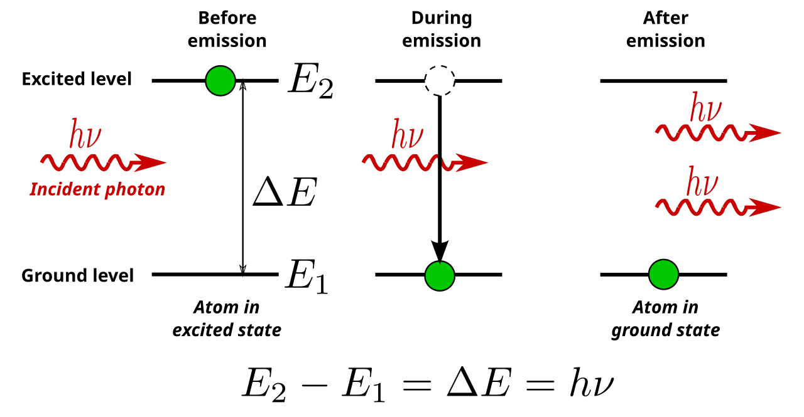
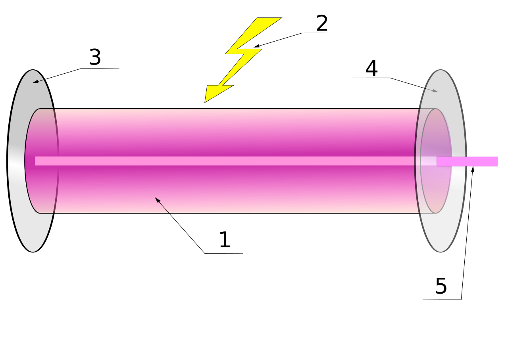
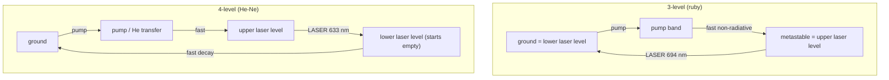

Every ordinary light source — a filament, the Sun, a white LED, a fluorescent tube — works by **spontaneous emission**: excited atoms drop to a lower state whenever they happen to, each emitting one photon in a random direction, at a random moment, with a random phase, across a spread of wavelengths. That randomness has consequences. You cannot focus a light bulb to a spot fine enough to cut metal; you cannot send its light a hundred kilometres down a glass fibre without it smearing into noise; you cannot make it interfere with itself in any stable way.

A laser produces the opposite kind of light: one wavelength, one direction, and every wave crest in step with every other. The word is an acronym — **L**ight **A**mplification by **S**timulated **E**mission of **R**adiation — and the whole device is built to make one quantum process, which Einstein identified in 1917, win a fight it normally loses.

## The three ways light and matter trade energy

Between two [atomic energy levels](/citadel/physics/atoms) $E_1 < E_2$ separated by $\Delta E = h\nu$, three processes are possible, and Einstein showed that a consistent picture of thermal radiation *requires* all three:

- **Absorption.** A photon of energy exactly $\Delta E$ meets a lower-state atom and is absorbed; the atom jumps to $E_2$. Rate $\propto B_{12}\,\rho(\nu)\,N_1$.
- **Spontaneous emission.** An excited atom drops to $E_1$ on its own after a random delay $\sim 1/A_{21}$, emitting a photon in a random direction with random phase. Rate $\propto A_{21}\,N_2$. This is every ordinary light source.
- **Stimulated emission.** A photon of energy $\Delta E$ passes an *already-excited* atom and induces it to drop *now* — and the emitted photon is a copy of the trigger: same frequency, same direction, same phase, same polarisation. One photon in, two identical photons out. Rate $\propto B_{21}\,\rho(\nu)\,N_2$.

The Einstein coefficients are related by $A_{21}/B_{21} = 8\pi h\nu^3/c^3$ and $B_{12} = B_{21}$ (for equal level degeneracies), which is why a valid derivation of the [blackbody spectrum](/citadel/physics/heat) needs the stimulated term.

## Why cloning gives a laser its properties

Because each stimulated photon is a copy of its trigger:

- **Coherence** — every emitted wave is in step with the one that stimulated it, so the beam is nearly monochromatic and can form stable [interference patterns](/citadel/physics/wave-optics). Its *coherence length* (the distance over which the phase stays predictable) can be metres to kilometres, against micrometres for a bulb.
- **Directionality** — each new photon travels parallel to its trigger, so a beam that starts collimated stays collimated. It still spreads, but only by the [diffraction limit](/citadel/physics/wave-optics) set by the beam width, not by the source geometry.
- **Amplification** — one photon stimulates two, those two stimulate four: a cascade, exponential gain along the medium. That is the "light amplification" in the name.

## The problem: population inversion

For the cascade to grow rather than die, stimulated emission must outpace absorption — which means more atoms in the upper level than the lower one, $N_2 > N_1$. In thermal equilibrium this is impossible. The **Boltzmann distribution**

$$ \frac{N_2}{N_1} = \frac{g_2}{g_1}\,e^{-\Delta E/k_B T} $$

is always $< 1$ for $E_2 > E_1$ at any positive temperature; a passing photon is far more likely to meet a ground-state atom and be absorbed. A **population inversion**, $N_2 > N_1$, corresponds formally to a *negative* temperature and never occurs on its own. Producing and holding one is the central engineering problem of a laser, and it needs two ingredients.

**Metastable states.** A typical excited state decays spontaneously in nanoseconds — far too fast for atoms to accumulate. A **metastable** state, one whose spontaneous decay is quantum-mechanically suppressed (a "forbidden" transition), lasts microseconds to milliseconds. Atoms pumped into it pile up faster than they leak, and the inversion builds.

**Pumping.** Energy must be fed in continuously to keep lifting atoms back up:

- **Optical** — flood the medium with light from a flash lamp or another laser (solid-state and dye lasers).
- **Electrical** — run a current through a gas or semiconductor; electron collisions excite the atoms (gas lasers, laser diodes).
- **Chemical** — an exothermic reaction leaves its products excited (very high power).

## The cavity: turning a gain medium into an oscillator

A pumped, inverted medium *amplifies* light passing through it, but a single pass gives only modest gain. Put the medium between two mirrors — a **Fabry–Pérot resonator** — and light bounces back and forth, gaining a little each pass, until it is a intense standing beam. One mirror is a near-perfect reflector; the other (the **output coupler**) transmits a few per cent, and that leakage is the beam.

Two conditions define laser action:

- **Threshold** — the round-trip gain must at least equal the round-trip loss (mirror transmission, scattering, absorption). Below the pump level that achieves this, the device is just a bright lamp; above it, output power rises steeply and linearly with pump power.
- **Resonance** — only wavelengths for which the cavity length is a whole number of half-wavelengths, $L = m\lambda/2$, build up. These are the **longitudinal modes**, spaced in frequency by $c/2L$. The gain medium's linewidth usually spans several of them, so an unmodified laser runs multi-mode; extra optics (an etalon) pick out one for a truly single-frequency beam.

## Three-level and four-level schemes

**Ruby laser** — Maiman's 1960 device, the first to work. The gain medium is $\text{Cr}^{3+}$ ions in synthetic sapphire; a helical xenon flash lamp pumps them into broad absorption bands, from which they decay non-radiatively into a metastable level. Inversion builds between that level and the **ground state** — a **three-level system** — and a spontaneous 694.3 nm (deep red) photon starts the cascade. Three-level schemes are inefficient: the lower laser level is the heavily populated ground state, so more than half of *all* the active atoms must be pumped up before the population even inverts.

**Helium–neon laser** — helium and neon at about 10:1, pumped by a DC discharge. Neon does the lasing, but is excited indirectly: discharge electrons drive helium into a metastable state whose energy nearly matches a neon excited level, and a helium–neon collision transfers the energy resonantly. Inversion forms between that neon level and a *lower excited* level — a **four-level system**. This is far more efficient, because the lower laser level starts essentially empty and drains fast (neon relaxes to ground on the tube walls), so even a small pump inverts it. Output is the familiar 632.8 nm red.

Other media span the spectrum: $\text{CO}_2$ (infrared, kilowatts, cutting and welding), Nd:YAG (solid-state, frequency-doubled to green), Ti:sapphire (broadly tunable, ultrafast), semiconductor diodes (millimetre-scale, in every fibre link and barcode scanner), excimer (ultraviolet, corneal surgery and photolithography).

## Making pulses

A continuous beam is not always what you want; two tricks concentrate the energy in time.

- **Q-switching.** Spoil the cavity's feedback (its "quality factor" $Q$) while pumping, so the inversion builds far past the normal threshold without lasing. Then restore $Q$ suddenly: the stored energy dumps in one giant pulse, nanoseconds long, megawatts peak. Used for laser rangefinding, marking, and driving fusion pellets.
- **Mode-locking.** Force the many longitudinal modes to oscillate with a fixed phase relationship. They then interfere to a train of ultrashort pulses — femtoseconds ($10^{-15}$ s), short enough to photograph a chemical reaction — spaced by the cavity round-trip time. The basis of the frequency comb, an optical ruler precise enough to redefine the second.

## The beam is still diffraction-limited

A laser beam is not a perfect ray. It is a Gaussian mode with a minimum waist radius $w_0$, and it diverges at a half-angle

$$ \theta \approx \frac{\lambda}{\pi w_0} $$

— the same $\lambda/D$ diffraction limit that constrains every telescope. A narrow beam spreads fast; a beam kept parallel over a long distance must start wide. This is why a laser pointer's dot grows across a lecture hall, and why laser links to satellites use beam-expanding telescopes. Real beams also carry **speckle** (random bright/dark grain from interference off any rough surface) and, at high power, distort the very medium they pass through (thermal lensing, self-focusing).

## The one idea to keep

Stimulated emission clones photons — one in, two out, identical in frequency, phase, and direction — so a medium in which it dominates *amplifies* light coherently. It dominates only when the upper level is more populated than the lower, a population inversion that thermal equilibrium forbids and that pumping into a long-lived metastable level achieves. Wrap the inverted medium in a mirrored cavity and it becomes an oscillator: above a threshold where gain beats loss, it emits a beam that is monochromatic, coherent over long distances, and collimated to the diffraction limit. Everything a laser does — cutting, fibre communications, surgery, atomic clocks, gravitational-wave detection — traces back to those two facts.
