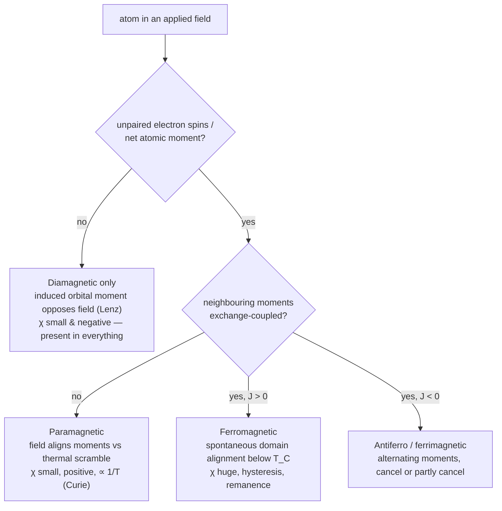

Put a rod of bismuth, aluminium, and iron into the same magnetic field and they do three different things: bismuth is pushed out, aluminium is drawn in weakly, iron is yanked in hard and stays magnetised after the field is gone. The difference is what the material's own electrons do in response, and the full explanation runs from classical statistical mechanics down to a purely quantum effect with no classical analogue. This post covers the fields used to describe magnetic matter, the three main responses, the classical theories of Langevin and Weiss, and where quantum mechanics takes over. The force on a moving charge and the field of a current are the subject of the [magnetism](/citadel/physics/magnetism) post.

## Three fields: H, B, and M

Describing magnetism inside matter takes three vector fields, not one.

- **Magnetic field strength $\vec{H}$** — the field attributed to *free* currents (current in a wire, a solenoid winding), the "applied effort". Units A/m.
- **Magnetic flux density $\vec{B}$** — the total field actually present, applied field plus the material's contribution. This is what a probe measures and what appears in the Lorentz force. Units tesla ($1\ \text{T} = 10^4\ \text{gauss}$).
- **Magnetization $\vec{M}$** — the material's own net magnetic dipole moment per unit volume, the response. Units A/m.

They are tied together by
$$ \vec{B} = \mu_0\left(\vec{H} + \vec{M}\right) $$
with $\mu_0 = 4\pi \times 10^{-7}\ \text{T}\,\text{m/A}$ the permeability of free space. The total field inside a sample is the applied $\vec{H}$ plus whatever magnetization it induces.

## Susceptibility and permeability

For a linear material the induced magnetization tracks the applied field:
$$ \vec{M} = \chi\,\vec{H} $$
The dimensionless **susceptibility** $\chi$ is the whole story of the response. $\chi > 0$ means $\vec{M}$ adds to the field (paramagnetic, ferromagnetic); $\chi < 0$ means it opposes (diamagnetic); $\chi = 0$ is a vacuum-like non-response.

**Permeability** $\mu$ relates $\vec{B}$ to $\vec{H}$ directly,
$$ \vec{B} = \mu\vec{H}, \qquad \mu_r = \frac{\mu}{\mu_0} $$
with the relative permeability $\mu_r$ measuring the material against vacuum ($\mu_r > 1$ concentrates flux, $\mu_r < 1$ excludes it). Substituting $\vec{M} = \chi\vec{H}$ into $\vec{B} = \mu_0(\vec{H} + \vec{M})$ gives $\vec{B} = \mu_0(1 + \chi)\vec{H}$, so
$$ \mu_r = 1 + \chi $$

## The three responses

| Class | $\chi$ | $\mu_r$ | Behaviour |
|---|---|---|---|
| Diamagnetic | small, $< 0$ | $\lesssim 1$ | weakly repelled |
| Paramagnetic | small, $> 0$ | $\gtrsim 1$ | weakly attracted, $\chi \propto 1/T$ |
| Ferromagnetic | $\gg 0$ | up to $10^3$–$10^5$ | strongly attracted, retains magnetization |

**Diamagnetism** is present in *every* material: an applied field changes the orbital motion of the electrons, and by Lenz's law the induced moment opposes the change. It is tiny, and shows only when there is no paramagnetic or ferromagnetic response to bury it. Water, wood, most organic matter, bismuth, copper, silver, gold, helium. A superconductor is a perfect diamagnet, $\chi = -1$, expelling the field entirely.

**Paramagnetism** needs atoms that already carry a permanent magnetic moment — from unpaired electron spins or orbital motion. With no field these moments point every which way and cancel; a field aligns them slightly, against the scrambling of thermal motion, for a net $\vec{M}$ along the field. Aluminium, platinum, oxygen, manganese, transition-metal salts.

**Ferromagnetism** goes further: the atomic moments align with their neighbours *spontaneously*, with no applied field, over regions called **domains**. An unmagnetised piece of iron has its domains pointing in random directions so they cancel; an applied field grows the favourably-oriented domains at the expense of the others. Because domain walls do not slide back freely, the magnetization lags the field and traces a **hysteresis loop**: cycle the field and the material retains a **remanence** $M_r$ at zero field, and needs a reverse **coercive field** $H_c$ to bring it back to zero. A *soft* ferromagnet (silicon steel, ferrite) has a thin loop and low $H_c$ — easy to magnetise and demagnetise, wanted for transformer and motor cores; a *hard* one (alnico, neodymium–iron–boron) has a fat loop and large $H_c$, and makes a permanent magnet. Iron, nickel, cobalt, their alloys, and some rare-earth compounds.

; $H_C$ is the coercivity (reverse field needed to zero it). Source: Wikimedia Commons.")

## Langevin's theory of paramagnetism

Langevin (1905) treated a paramagnet as a gas of independent classical dipoles of moment $\mu_{\text{atom}}$. Each has orientation energy $U = -\mu_{\text{atom}} B\cos\theta$ in the field; thermal motion of energy scale $k_B T$ works to randomise $\theta$. Averaging $\cos\theta$ over the Boltzmann distribution of orientations — the same statistical-mechanics machinery as the [kinetic theory of gases](/citadel/physics/kinetics) — gives $M = N\mu_{\text{atom}}\,\mathcal{L}(x)$ with $x = \mu_{\text{atom}} B/k_B T$ and the **Langevin function** $\mathcal{L}(x) = \coth x - 1/x$. In any ordinary field $x \ll 1$, where $\mathcal{L}(x) \approx x/3$, and the magnetization comes out proportional to $H$ and inversely proportional to $T$:
$$ \chi_L = \frac{N\mu_{\text{atom}}^2}{3 k_B T} = \frac{C}{T} \qquad \text{(Curie's law)} $$
with $N$ the number of moments per unit volume and $C = N\mu_{\text{atom}}^2/3k_B$ the **Curie constant**; the factor of 3 is the $x/3$ from the expansion. The $1/T$ falloff — hotter means harder to align — is the experimental signature of paramagnetism at high temperature. (At very large $x$, $\mathcal{L} \to 1$: every dipole aligned, magnetization saturated.)

## Weiss's theory of ferromagnetism

Langevin's dipoles are independent, so they can never align on their own. Weiss (1907) added a **molecular field**: each moment feels, on top of any applied field, an internal field proportional to the material's own magnetization,
$$ \vec{H}_{\text{eff}} = \vec{H}_{\text{app}} + \lambda\vec{M} $$
with $\lambda$ the Weiss constant. Putting $H_{\text{eff}}$ back into the Langevin result makes the magnetization appear on both sides,
$$ M = N\mu_{\text{atom}}\,\mathcal{L}\!\left(\frac{\mu_{\text{atom}}\,\mu_0\lambda M}{k_B T}\right) $$
a self-consistent equation. Below a certain temperature it has a non-zero solution even with $H_{\text{app}} = 0$ — a **spontaneous magnetization** $M_S$, held up by the alignment it itself creates; above that temperature only $M = 0$ solves it.

Raise the temperature and thermal agitation eventually wins. At the **Curie temperature** $T_C$ the spontaneous magnetization vanishes and the material reverts to a paramagnet. Above $T_C$ the susceptibility follows the **Curie–Weiss law**
$$ \chi = \frac{C}{T - T_C}, \qquad T_C = C\lambda $$
which diverges as $T \to T_C^{+}$ — the response becomes infinitely sensitive at the transition. More generally $\chi \propto (T - T_C)^{-\gamma}$ near the critical point, with **critical exponent** $\gamma = 1$ in Weiss mean-field theory and $\gamma \approx 1.33$ measured for real three-dimensional ferromagnets, a discrepancy that mean-field theory cannot fix and that modern critical-phenomena theory exists to explain.

## The quantum origin

The classical theories assume the atomic moment and the aligning "molecular field"; quantum mechanics is what actually supplies them.

**The moment.** An atom's magnetic moment comes from its electrons' orbital angular momentum (electrons as current loops) and, usually dominantly, their intrinsic **spin**. Spin angular momentum is quantized, $|\vec{S}| = \sqrt{s(s+1)}\,\hbar$ with $s = \tfrac{1}{2}$ for an electron and $\hbar = h/2\pi$ — there is no classical picture of it, and it is [covered in the quantum-mechanics post](/citadel/physics/quantum). The natural unit of atomic moment is the **Bohr magneton** $\mu_B = e\hbar/2m_e \approx 9.27\times 10^{-24}\ \text{J/T}$; a free electron's spin moment is very nearly $1\,\mu_B$, and measured atomic moments come out at a few $\mu_B$, which is what $\mu_{\text{atom}}$ stands for in the Curie constant above.

**The alignment.** The Weiss field is not magnetic at all — it is the **exchange interaction**, a consequence of the Pauli exclusion principle acting together with the electrostatic repulsion between electrons. Because two electrons with parallel spins are forbidden from occupying the same state, their spatial wavefunction keeps them apart, changing the Coulomb energy; depending on the sign of that energy shift, neighbouring spins prefer to be parallel or antiparallel. The standard model is the **Heisenberg Hamiltonian**
$$ H_{\text{ex}} = -2J\sum_{i<j}\vec{S}_i\cdot\vec{S}_j $$
with $J$ the exchange integral: $J > 0$ favours parallel spins (ferromagnetism), $J < 0$ favours antiparallel (antiferromagnetism). Restricting the sum to nearest neighbours, $H = -J\sum_{\langle i,j\rangle}\vec{S}_i\cdot\vec{S}_j$, is the usual working form. The **Hubbard model** (adding electron hopping and on-site repulsion) and band-structure calculations extend this to metallic magnets.

## Beyond ferromagnetism

- **Antiferromagnetism.** Neighbouring moments are equal and antiparallel, so the net magnetization is zero below an ordering temperature, the **Néel temperature** $T_N$. Detectable by neutron scattering, and useful in spintronics through exchange bias. MnO, chromium.
- **Ferrimagnetism.** Antiparallel moments again, but on two sublattices of *unequal* size, so they do not cancel and a net spontaneous magnetization survives below $T_C$. The **ferrites** — magnetite $\text{Fe}_3\text{O}_4$, yttrium iron garnet — are ferrimagnetic, and being electrical insulators they are the material of choice for high-frequency cores where eddy currents would ruin a metal.
- **Multiferroics.** Materials with two ferroic orders at once, typically ferroelectric *and* magnetic. The prize is magnetoelectric coupling — switching magnetization with an electric field, or polarization with a magnetic one — for low-power memory and sensors.

## The one idea to keep

Three fields, not one, are needed inside matter: the applied $\vec H$, the material's response $\vec M$, and the total $\vec B = \mu_0(\vec H + \vec M)$, with the susceptibility $\chi = M/H$ carrying the whole story. Diamagnetism (a weak $\chi < 0$) is universal but usually buried; paramagnetism needs pre-existing atomic moments and follows Curie's $\chi \propto 1/T$; ferromagnetism needs those moments to talk to each other. That coupling — the Weiss "molecular field" of the classical theory — is not magnetic at all but the **exchange interaction**, a purely quantum effect from Pauli exclusion plus Coulomb repulsion, with no classical analogue. Mean-field theory gets the existence of the Curie transition right and its critical exponents wrong.
