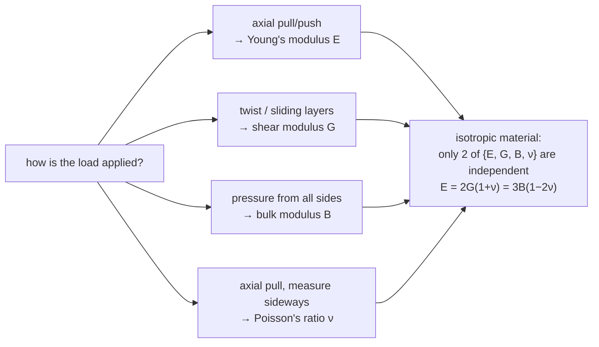

"Strong" and "tough" sound like synonyms and are nearly opposites in materials science. Glass has a higher tensile strength than mild steel, yet a dropped wine glass shatters while a dropped steel spanner bounces. The difference is not the *peak* stress each survives but the *area under its stress–strain curve* — the energy it can soak up before breaking. Glass yields and fractures almost at the same instant; steel yields early and then stretches a long way, absorbing energy the whole time. A hammer handle, a car bumper, and an aircraft skin are all chosen for that area, not for the peak.

This post is about how a loaded material deforms, how much load it carries before the deformation turns permanent, and how much energy it stores or absorbs along the way. Four elastic constants cover the small-deformation regime, a handful of strength limits mark where it ends, and the same spring-like restoring force turns up again in a torsional pendulum and a loaded beam.

## Stress and strain

**Stress** is internal force per unit area. Pull a bar with force $F$ across a cross-section of area $A$ and the material carries
$$ \sigma = \frac{F}{A} $$
measured in pascals ($1\ \text{Pa} = 1\ \text{N/m}^2$); engineering values run to MPa or GPa. Normal stress acts perpendicular to the section (tension or compression); shear stress acts parallel to it.

**Strain** is the deformation that stress produces, as a fraction of the original size. For stretching or compression, with original length $L_0$ and change $\Delta L$,
$$ \varepsilon = \frac{\Delta L}{L_0} $$
a pure number. For shear — layers sliding over one another, as when you push the top of a thick book sideways — the strain is the sideways displacement $\Delta x$ of a layer at height $L$ divided by that height:
$$ \gamma = \frac{\Delta x}{L} \approx \tan\phi $$
with $\phi$ the tilt angle, the approximation good for the small angles that elastic behaviour is confined to.

## Elastic response: Hooke's law and the moduli

For small enough strain, stress is proportional to strain and the material springs back completely when unloaded. That is **Hooke's law**, and the constant of proportionality is an **elastic modulus**. Which modulus applies depends on how the load is applied.

**Young's modulus** $E$, for tension or compression:
$$ \sigma = E\varepsilon $$
$E$ is a stiffness: steel ($E \approx 200\ \text{GPa}$) needs a large stress for a small strain; rubber ($E \sim 0.01\text{–}0.1\ \text{GPa}$) stretches easily. The same modulus fixes the speed of a compression pulse along a thin rod, $\sqrt{E/\rho}$.

**Shear modulus** $G$ (the modulus of rigidity), for shear:
$$ \tau = G\gamma $$
It is the resistance to twisting and to layers sliding — a shaft under torque, scissors cutting. For a given material $G$ is smaller than $E$, roughly $E/3$ for metals.

**Bulk modulus** $B$, for uniform pressure from every side:
$$ P = -B\,\frac{\Delta V}{V_0} $$
The minus sign records that raising the pressure shrinks the volume. $B$ is large for liquids and solids (water $\approx 2.2\ \text{GPa}$, steel $\approx 160\ \text{GPa}$) and small for gases — which is why only gases are noticeably compressible.

**Poisson's ratio** $\nu$ ties the sideways response to the axial one. Stretch most materials and they thin crosswise; $\nu$ says how much, as a ratio of strains:
$$ \nu = -\frac{\varepsilon_{\text{transverse}}}{\varepsilon_{\text{axial}}} $$
The minus sign makes $\nu$ positive for ordinary materials, where a positive axial strain comes with a negative transverse one. Metals sit near $0.25\text{–}0.35$; rubber approaches $0.5$, the incompressible limit, where volume barely changes on stretching; cork is close to $0$, which is why a cork slides into a bottle instead of fattening against the neck. **Auxetic** materials — some foams and certain crystal cuts — have $\nu < 0$ and grow fatter when pulled.

**For an isotropic material** (the same properties in every direction) only two of these four constants are independent. Poisson's ratio links them:
$$ E = 2G(1 + \nu), \qquad E = 3B(1 - 2\nu) $$
The second relation shows why $\nu = 0.5$ is the incompressible limit ($B \to \infty$) and why $\nu > 0.5$ is impossible: it would make $B$ negative, a material that expands under pressure.

## The stress–strain curve and the strength limits

Load a ductile metal bar steadily and plot stress against strain:

; B is true stress (load / actual area). Source: Wikimedia Commons.")

- **Proportional limit** — up to here $\sigma = E\varepsilon$ holds exactly and the curve is a straight line.
- **Elastic limit** — up to here the bar still returns to its original length when unloaded, though the curve has begun to bend. In practice it sits just past the proportional limit.
- **Yield strength** $\sigma_y$ — beyond it the bar deforms **plastically**: remove the load and a permanent stretch remains. Because the elastic and yield points are hard to read off exactly, $\sigma_y$ is usually quoted at a **0.2% offset** — the stress that leaves $0.002$ of permanent strain.
- **Ultimate tensile strength** (UTS) — the highest stress the bar carries. Past it the bar **necks**, thinning locally, and the load it bears falls even as it keeps stretching.
- **Fracture point** — where it breaks.

Below $\sigma_y$ the deformation is elastic and fully recoverable; between $\sigma_y$ and fracture it is permanent. Engineers keep working stresses well below $\sigma_y$, with a safety factor, so a structure never takes a permanent set; the UTS is the further margin before it parts.

## Energy: resilience and toughness

Area under the stress–strain curve is energy per unit volume: $\sigma$ already has the units of energy density, and $\varepsilon$ is dimensionless. Two areas matter.

**Resilience** is the elastic part — energy stored and then handed back in full. The **modulus of resilience** is the area up to yield:
$$ U_r = \int_0^{\varepsilon_y}\sigma\,d\varepsilon = \tfrac{1}{2}\sigma_y\varepsilon_y = \frac{\sigma_y^2}{2E} $$
Spring materials want this large — a high yield strength paired with a modest stiffness.

**Toughness** is the whole area, up to fracture:
$$ U_t = \int_0^{\varepsilon_f}\sigma\,d\varepsilon $$
the energy absorbed per unit volume before breaking, elastic plus plastic. A car bumper or a hammer handle wants this large. Ductile materials usually win on toughness even where a brittle material beats them on strength, because the long plastic stretch contributes most of the area.

## Stored elastic energy, derived

Take a bar of length $L_0$ and cross-section $A$, stretched slowly by a force that grows with the extension. When the current extension is $l$, Hooke's law fixes the force:
$$ F = \sigma A = E\varepsilon A = \frac{EA}{L_0}\,l $$
so extending it a further $dl$ does work $dW = F\,dl$. Integrate to the final extension $\Delta L$:
$$ U = \int_0^{\Delta L}\frac{EA}{L_0}\,l\,dl = \frac{EA(\Delta L)^2}{2L_0} $$
Rewrite with $\sigma = E\,\Delta L/L_0$, $\varepsilon = \Delta L/L_0$, and volume $V = AL_0$:
$$ U = \tfrac{1}{2}\sigma\varepsilon\,V \qquad\Longrightarrow\qquad u = \frac{U}{V} = \tfrac{1}{2}\sigma\varepsilon = \frac{\sigma^2}{2E} $$
the elastic energy density — the $\tfrac{1}{2}kx^2$ of a spring, written for a continuous body. One place it bites is **thermal stress**: a bar clamped so it cannot expand when heated by $\Delta T$ carries $\sigma = E\alpha\,\Delta T$ and stores $\sigma^2/2E$ per unit volume, [worked through in the thermal-properties post](/citadel/physics/heat).

## The torsional pendulum

Twisting a wire is shear, so a **torsional pendulum** measures the shear modulus. Hang a body of known moment of inertia $I$ from a wire of the test material, twist it by a small angle $\theta$, and release. The twisted wire supplies a restoring torque proportional to the twist:
$$ \tau_{\text{restore}} = -\kappa\theta $$
where $\kappa$, the torsional constant, follows from integrating the shear stress over the wire's cross-section. For a cylinder of length $L$ and radius $r$,
$$ \kappa = \frac{\pi G r^4}{2L} $$
The $r^4$ makes the wire's thickness the dominant lever — double the radius and the wire is sixteen times as stiff to twist. Newton's second law for rotation, $I\,\ddot\theta = -\kappa\theta$, is the [simple-harmonic equation](/citadel/physics/oscillations), with angular frequency $\omega = \sqrt{\kappa/I}$ and period
$$ T = 2\pi\sqrt{\frac{I}{\kappa}} = 2\pi\sqrt{\frac{2IL}{\pi G r^4}} $$
Time the swing, and with $I$, $L$, and $r$ known you have $G$. The same torsion-fibre trick, run as a static balance rather than an oscillator, is how Cavendish weighed the Earth.

## Bending: the cantilever beam

Load a beam sideways and it bends; the internal stresses that resist the bend are summarised by the **bending moment** $M$ at a cross-section — the net moment, about an axis in that section, of all the external forces on one side of it.

A **cantilever** is fixed at one end with the other end free. Put a point load $P$ on the free end; at a distance $x$ measured back from that end, only $P$ itself lies beyond the cut, at lever arm $x$, so
$$ M(x) = Px $$
The bending moment is zero at the free end and largest, $PL$, at the wall. That is where a diving board cracks, and why a cantilever is thickest at its root. Plotting $M(x)$ along the beam tells an engineer where the material is working hardest.

## Why the constants matter

Every one of these numbers feeds a design decision. Known loads give the stresses a part will see; the **moduli** turn those into deflections, which have to stay within tolerance; the **yield strength** sets the load ceiling for no permanent damage, and the **UTS** the margin beyond it; **toughness** says whether a flawed or shock-loaded part fails gracefully or shatters. Choosing a material is matching that profile — stiff enough, strong enough, tough enough — at the lowest weight and cost, putting material where the bending moment is large and trimming it where the stress is low.

## Beyond the elastic picture

The linear, instantaneous, one-load story above is the first approximation. Real service conditions add:

- **Fracture toughness** $K_{Ic}$ — resistance to a crack *spreading*. A high-strength part with a tiny flaw can still fail below its yield stress if $K_{Ic}$ is low; this governs brittle fracture in anything that might carry a defect.
- **Fatigue** — repeated loading well below $\sigma_y$ accumulates microscopic damage that eventually cracks the part. Most in-service metal failures are fatigue failures.
- **Creep** — slow, continuous deformation under a constant load held for a long time, significant at high temperature. It sets the life of turbine blades and pressure piping.
- **Viscoelasticity** — polymers and biological tissue respond partly like a spring and partly like a viscous fluid, so their stiffness depends on how fast you load them and their deformation lags the stress.

Each is a regime where "$\sigma = E\varepsilon$ until $\sigma_y$" is no longer enough, and the design has to reckon with time, cycles, and temperature as well as peak load.

## The one idea to keep

For small strains a solid is a spring: stress is proportional to strain, and the constant of proportionality is a modulus — $E$ for stretching, $G$ for shear, $B$ for uniform pressure, with Poisson's ratio $\nu$ linking them so only two are independent. That regime ends at the yield strength, past which deformation is permanent; it ends for good at fracture. The *area* under the stress–strain curve is energy per unit volume: up to yield it is resilience (given back on unloading, what a spring wants), all the way to fracture it is toughness (absorbed for good, what a bumper wants). Strong is a high peak; tough is a large area; a material can have either without the other. Real parts also fail by crack growth, fatigue, and creep — none captured by the peak-load picture.
