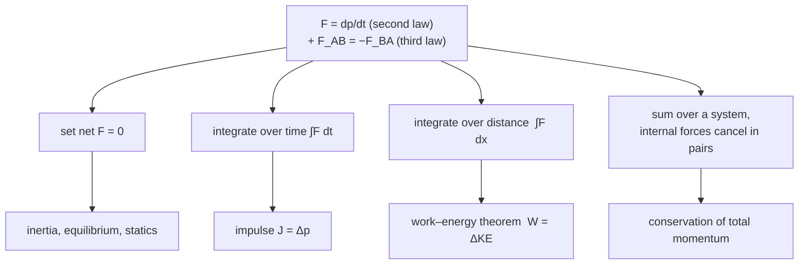

[Kinematics](/citadel/physics/kinematics) describes how something moves but takes the motion as given: "the projectile accelerates downward at $g$" is an input, not a result. Dynamics supplies the reason. A **force** — a push or a pull — is what changes a body's state of motion, and Newton's three laws pin down exactly how. Almost every result in this post is a consequence of one equation, the second law written as $\vec F = d\vec p/dt$.

## The inversion

For two thousand years the physics of motion was Aristotle's, and it matched daily experience: to keep a cart moving you have to keep pushing it; stop pushing and it stops. Force, in that picture, is what sustains *velocity*.

Newton's correction is the entire foundation of classical mechanics: force sustains *acceleration*, not velocity. A body with no net force on it does not slow down — it coasts forever at constant velocity. The cart stops because friction is a force, not because the absence of a push is. Nothing in ordinary life is truly free of friction, which is why the wrong idea survived so long, but a puck on an air table or a probe in deep space makes it obvious: left alone, motion simply continues.

Covered here: the three laws and conservation of momentum, equilibrium and friction, the force bookkeeping for circular motion, work–energy–power, collisions, and rocket propulsion.

## Newton's three laws

**First law (inertia).** If $\sum\vec F = 0$, then $\vec a = 0$: a body's velocity — magnitude and direction, possibly zero — stays constant unless a net external force acts. The tendency to resist that change is **inertia**, measured by mass. The first law is not a special case of the second; it is the assertion that **inertial frames exist** — frames in which a force-free body moves in a straight line at constant speed. The second law only holds in such a frame.

**Second law.** The net force equals the rate of change of momentum $\vec p = m\vec v$:

$$ \sum\vec F = \frac{d\vec p}{dt} $$

For constant mass this is the familiar $\sum\vec F = m\vec a$. The momentum form is the more fundamental one: it survives when mass changes (the rocket, below) and, with $\vec p = \gamma m\vec v$, it carries over unchanged into [special relativity](/citadel/physics/relative-mech).

**Third law.** If A pushes on B, B pushes back on A with equal magnitude and opposite direction: $\vec F_{AB} = -\vec F_{BA}$. The two forces act on **different objects**, which is exactly why they do not cancel — the force on B accelerates B; the reaction acts on A. A rocket goes up because it pushes gas down; you walk because you push the Earth backward and it pushes you forward.

**Impulse.** Integrate the second law over time:

$$ \vec J = \int \vec F\,dt = \Delta\vec p $$

A short hard hit and a long gentle push can deliver the same $\Delta\vec p$. This is why airbags, crumple zones, and bending your knees on landing all work: they stretch out $\Delta t$, lowering the peak force for a fixed change in momentum.

**Conservation of linear momentum.** Sum the second law over every particle in a system. By the third law the internal forces cancel in pairs, leaving only external forces:

$$ \sum\vec F_{\text{ext}} = 0 \quad\Longrightarrow\quad \vec p_{\text{total}} = \text{constant} $$

This is the workhorse for collisions and explosions: during the brief violent interaction the internal forces are enormous and unknown, but the external forces (gravity, friction) are negligible by comparison, so total momentum before equals total momentum after. Deeper still, momentum conservation is not an accident of Newton's laws — it is the consequence of space being the same everywhere (translational symmetry), by Noether's theorem, which is why it outlives Newtonian mechanics entirely.

## Equilibrium and friction

A body is in **equilibrium** when $\sum\vec F = 0$ — at rest (static) or moving at constant velocity (dynamic), the same condition on the forces either way.

**Friction** opposes relative sliding, or the tendency to slide, between surfaces in contact.

- **Static friction** takes whatever value is needed to prevent sliding, up to a maximum $f_{s,\max} = \mu_s N$, with $N$ the normal force.
- **Kinetic friction** acts once sliding starts, is roughly constant, and is usually a little less than $f_{s,\max}$: $f_k = \mu_k N$.

### Push versus pull

Apply a force $F$ at angle $\theta$ to the horizontal to a block of mass $m$ ($\mu_s$ static). Pushing down-and-forward adds to the normal force, $N = mg + F\sin\theta$; pulling up-and-forward reduces it, $N = mg - F\sin\theta$. Setting $F\cos\theta = \mu_s N$ for the onset of motion:

$$ F_{\text{push}} = \frac{\mu_s mg}{\cos\theta - \mu_s\sin\theta}, \qquad F_{\text{pull}} = \frac{\mu_s mg}{\cos\theta + \mu_s\sin\theta} $$

Pulling always needs less force (larger denominator), and it is lightest when $\dfrac{d}{d\theta}(\cos\theta + \mu_s\sin\theta) = 0$, i.e. $\tan\theta = \mu_s$, so $\theta = \arctan\mu_s$ — the reason a suitcase handle is angled, not horizontal.

### Where the friction model breaks

$f = \mu N$ is a useful fiction. Real friction comes from microscopic contact between asperities, so it depends on the *true* contact area (which grows with load, giving the linear-in-$N$ behaviour approximately), and also on sliding speed, temperature, surface films, and history. Because $\mu_s > \mu_k$, a slowly loaded joint sticks, then slips suddenly, then sticks again — **stick-slip** — which is a violin string speaking, a door hinge squealing, and the mechanism of earthquakes on a locked fault.

## Circular motion

An object circling at constant speed still accelerates, because its velocity vector keeps turning. That acceleration points to the centre, $a_c = v^2/r$, so it needs a net inward force:

$$ F_c = \frac{mv^2}{r} $$

"Centripetal" names a *role*, not a new force — tension, gravity, friction, or a normal force plays the part. There is no outward "centrifugal force" in an inertial frame; the outward feeling is your inertia resisting the inward pull. (In a rotating frame a centrifugal term does appear, as a frame artefact, alongside the Coriolis term.)

**Banked curve.** A car rounds a frictionless curve banked at $\theta$. Vertical: $N\cos\theta = mg$. Horizontal: $N\sin\theta = mv^2/r$. Dividing:

$$ \tan\theta = \frac{v^2}{rg} $$

the one speed at which the banking alone holds the car. **Conical pendulum:** a bob on a string of length $L$ circling at radius $r = L\sin\theta$ gives the same relation, $\tan\theta = v^2/(rg)$. (For torque, moment of inertia, and angular momentum, see [rotational dynamics](/citadel/physics/rotations).)

## Work, energy, and power

**Work** done by a force over a displacement: $W = \vec F \cdot \vec d = Fd\cos\theta$.

**Work–energy theorem.** The net work on a body equals its change in kinetic energy. With a variable force in one dimension, use $F = mv\,dv/dx$:

$$ W_{\text{net}} = \int_{x_1}^{x_2} F\,dx = \int_u^v mv\,dv = \tfrac12 mv^2 - \tfrac12 mu^2 = \Delta KE $$

**Conservation of mechanical energy.** If only conservative forces (gravity, an ideal spring) do work — nothing removing energy to heat — then $KE_i + PE_i = KE_f + PE_f$.

**Power** is the rate of doing work: $P = dW/dt = \vec F \cdot \vec v$. **Efficiency** $\eta$ is useful output over total input, always below 100% for a real machine, the shortfall going mostly to heat — a statement that [thermodynamics](/citadel/physics/thermodynamics) makes into a law.

## Collisions

Momentum is conserved in every collision of an isolated system. Kinetic energy may or may not be.

**Elastic** collisions conserve both. In one dimension the two conservation equations combine into a single clean statement — the relative speed of approach equals the relative speed of separation:

$$ u_1 - u_2 = v_2 - v_1 $$

**Inelastic** collisions conserve momentum only; the lost kinetic energy goes to heat, sound, and permanent deformation. In a **perfectly inelastic** collision the bodies stick, $m_1 u_1 + m_2 u_2 = (m_1 + m_2)v_f$, and the kinetic energy lost is

$$ \Delta KE_{\text{lost}} = \tfrac12\,\frac{m_1 m_2}{m_1 + m_2}\,(u_1 - u_2)^2 $$

which depends only on the *relative* speed — a collision looks equally violent from every inertial frame.

**Coefficient of restitution** $e$ measures bounciness along the line of impact:

$$ e = \frac{\text{relative speed of separation}}{\text{relative speed of approach}} $$

$e = 1$ elastic, $e = 0$ perfectly inelastic; roughly $0.6$ for steel spheres, above $0.9$ for a superball. **Oblique collisions** of smooth bodies: the impulsive force acts only along the normal, so tangential velocity components pass through unchanged and only the normal components transform (by the 1D formulas with $e$).

**Newton's cradle** is the demonstration piece: near-elastic steel balls, so both momentum and kinetic energy are conserved, and the only way to satisfy *both* is for the same number of balls to leave as entered, at the same speed. Momentum alone would permit two balls leaving at half speed; energy conservation forbids it.

**Bouncing ball.** Drop a ball from height $h_0$: it strikes at $u = \sqrt{2gh_0}$, leaves at $eu$, rises to $h_1 = e^2 h_0$, and reaches $h_n = e^{2n}h_0$ after the $n$th bounce. Summing the geometric series over infinitely many bounces, the total path length is

$$ D = h_0\left(1 + \frac{2e^2}{1 - e^2}\right) = h_0\,\frac{1 + e^2}{1 - e^2} $$

and the total time, with $t_0 = \sqrt{2h_0/g}$ for the first fall,

$$ T_{\text{total}} = t_0\,\frac{1 + e}{1 - e} $$

Both are finite for $e < 1$: infinitely many bounces, in a finite time, over a finite distance — the ball comes fully to rest at a definite moment despite bouncing forever, a small paradox that the convergent series resolves.

## Rocket propulsion

A rocket carries its own reaction mass and throws it backward at speed $v_e$ (relative to itself), getting pushed forward — the third law, continuously. If mass leaves at rate $\dot m_{\text{fuel}}$, the **thrust** is $T = v_e\,\dot m_{\text{fuel}}$.

**Tsiolkovsky equation.** Work in momentum. In time $dt$ the rocket (mass $m$, velocity $v$) ejects $dm_{\text{ex}}$ of exhaust at ground-frame velocity $v - v_e$ and speeds up to $v + dv$. With $dm = -dm_{\text{ex}}$ for the rocket's own mass change, momentum conservation gives

$$ (m + dm)(v + dv) - dm\,(v - v_e) - mv = 0 $$

Expand, drop the second-order $dm\,dv$:

$$ m\,dv + v_e\,dm = 0 \quad\Longrightarrow\quad dv = -v_e\,\frac{dm}{m} $$

Integrate from $(v_0, m_0)$ to $(v_f, m_f)$:

$$ \Delta v = v_e \ln\!\left(\frac{m_0}{m_f}\right) $$

The velocity gain scales with the exhaust speed but only with the **logarithm** of the mass ratio. Chemical exhaust tops out near $3$–$4.5\ \text{km/s}$, while low Earth orbit needs $\Delta v \approx 9.4\ \text{km/s}$ including losses — a mass ratio of 10 to 20, a vehicle that is almost entirely propellant. That brutal logarithm is the whole argument for **staging**: shed the empty tankage so later burns are not accelerating dead weight.

## The through-line

One equation, $\vec F = d\vec p/dt$, with the third law's pairing, generates everything above: set the net force to zero for inertia and equilibrium; integrate over time for impulse and momentum conservation; integrate over distance for the work–energy theorem; sum over a system for total-momentum conservation; apply it to a body losing mass for the rocket equation. The [Lagrangian and Hamiltonian reformulations](/citadel/maths/applied-maths) repackage the same physical content in a form that generalises better — to fields, to constrained systems, to quantum mechanics — but the content is Newton's. The [particular force behind falling and orbiting](/citadel/physics/gravitation) is the next piece.
