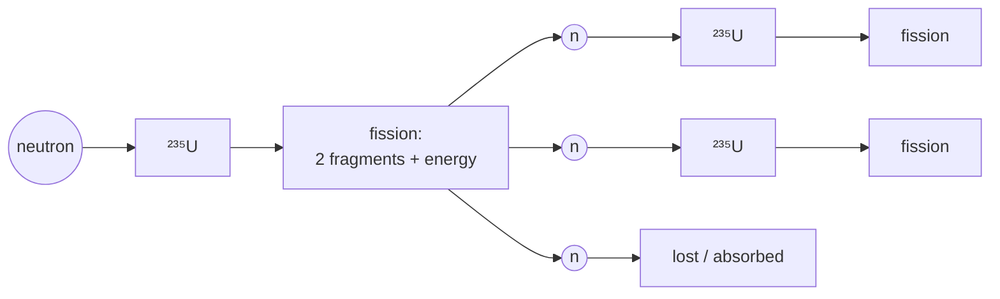

[The atom](/citadel/physics/atoms) is mostly empty space around a tiny nucleus that carries almost all the mass. This post is about that nucleus, and it starts from a measurement that breaks a rule you have relied on since school: **a nucleus weighs less than the protons and neutrons that make it up.** Add the masses of 2 protons and 2 neutrons, weigh a helium-4 nucleus, and roughly $0.7\%$ of the mass is simply gone. It has not gone anywhere — by $E = mc^2$ that missing mass *is* the energy released when the nucleus came together, and it is the energy you have to put back to pull it apart.

Track that binding energy per nucleon across the periodic table and it rises to a peak at iron, then falls. So there are two ways to release nuclear energy: fuse light nuclei up toward iron, or split heavy ones down toward it. This post covers what binds the nucleus, the shape of that binding-energy curve and the formula that reproduces it, why both fission and fusion work, the decay modes, and the exponential law that turns unstable isotopes into clocks.

## Nucleons and nuclear size

The nucleus is built from **protons** (charge $+e$, mass $1.6726\times10^{-27}$ kg; the proton number $Z$ fixes the element) and **neutrons** (uncharged, mass $1.6749\times10^{-27}$ kg, marginally heavier). Collectively they are **nucleons**, and the total count $A = Z + N$ is the **mass number**.

Nuclear radius grows as the cube root of the nucleon count:
$$ R = R_0\,A^{1/3}, \qquad R_0 \approx 1.2\ \text{fm} $$
so the volume $\tfrac{4}{3}\pi R_0^3 A$ is proportional to $A$ — every nucleus has about the **same density**, $\sim 2\times10^{17}\ \text{kg/m}^3$. Nucleons pack like touching, incompressible spheres.

## The strong nuclear force

Protons crammed a femtometre apart repel electrostatically with enormous force, yet nuclei hold. The **strong nuclear force** overcomes it: attractive, roughly charge-independent (it acts between $pp$, $nn$, and $pn$ alike), far stronger than the Coulomb force at $\lesssim 1$ fm, and effectively zero beyond a few fm. Its short range is why nuclear density is fixed — a nucleon is only bound by its immediate neighbours — and why very large nuclei, where every proton still feels every other proton's Coulomb push but each nucleon feels only nearby strong attraction, become unstable.

## Rutherford scattering

Firing a charged particle of kinetic energy $K$ and momentum $p$ at a nucleus of charge $Ze$, the Coulomb deflection through small angles is
$$ \theta = 2\arctan\!\left(\frac{Ze^2}{4\pi\epsilon_0\,K p}\right) $$
Closer approaches (higher $K$, smaller impact parameter) scatter through larger angles; departures from this pure-Coulomb prediction at high energy are what first revealed the finite size of the nucleus.

## Mass defect and binding energy

Weigh a nucleus and it comes out *lighter* than its constituent nucleons weighed separately. The difference is the **mass defect**
$$ \Delta m = \big(Z m_p + N m_n\big) - M_{\text{nucleus}} $$
and by $E = mc^2$ it is the energy released when the nucleus assembles — the **binding energy** holding it together:
$$ E_b = \Delta m\,c^2 $$
The useful measure of stability is the **binding energy per nucleon**, $E_b/A$.

## The binding-energy curve

Plot $E_b/A$ against $A$: it climbs steeply for light nuclei, peaks near iron ($A \approx 56$) at about 8.8 MeV per nucleon, and declines slowly for heavy nuclei. Two consequences:

- **Fusion** of light nuclei climbs the steep left side — combining them into something nearer iron releases energy.
- **Fission** of a heavy nucleus into two mid-weight fragments climbs the gentle right side — also releasing energy.

Iron is the ash at the bottom of the well; energy can be extracted moving toward it from either side, and not past it.

## The semi-empirical mass formula

The binding-energy curve's shape is reproduced by a five-term model of the nucleus as a charged liquid drop (Weizsäcker, 1935):

$$ E_b = a_V A \;-\; a_S A^{2/3} \;-\; a_C \frac{Z(Z-1)}{A^{1/3}} \;-\; a_A \frac{(A-2Z)^2}{A} \;+\; \delta(A,Z) $$

Each term is a physical effect:

- **Volume** $a_V A$ — every nucleon binds to its neighbours, and the short-range strong force means each has about the same number of neighbours, so binding scales with the count. This alone would give a flat $E_b/A$.
- **Surface** $-a_S A^{2/3}$ — nucleons at the surface have fewer neighbours; the correction scales with surface area. It is why light nuclei (mostly surface) sit low on the curve.
- **Coulomb** $-a_C Z(Z-1)/A^{1/3}$ — every proton repels every other, long-range, so this grows faster than the volume term and eventually wins. It is why the curve falls off for heavy nuclei and why they are fissile.
- **Asymmetry** $-a_A(A-2Z)^2/A$ — a quantum effect (Pauli): filling proton and neutron energy levels unequally costs energy, so nuclei prefer $N \approx Z$ (light) drifting to $N > Z$ (heavy, to dilute the Coulomb cost).
- **Pairing** $\delta$ — nucleons pair up spin-antiparallel; even-even nuclei get a bonus, odd-odd a penalty. It is why there are far more stable even-even isotopes.

Typical fitted values (MeV): $a_V \approx 15.8$, $a_S \approx 18.3$, $a_C \approx 0.71$, $a_A \approx 23.2$. The formula predicts the most stable $Z$ for each $A$ and the energy release of fission and fusion to within a per cent, though it misses the **magic numbers** ($Z$ or $N = 2, 8, 20, 28, 50, 82, 126$) where an independent-particle **shell model** — nucleons in quantised orbitals, like electrons in an atom — shows closed shells of extra stability.

## Fission

A heavy nucleus absorbs a neutron, becomes unstable enough to overcome the strong force's hold, and splits into two lighter nuclei plus a few spare neutrons and a large energy release:
$$ {}^{1}_{0}n + {}^{235}_{92}\text{U} \longrightarrow {}^{236}_{92}\text{U}^{*} \longrightarrow {}^{141}_{56}\text{Ba} + {}^{92}_{36}\text{Kr} + 3\,{}^{1}_{0}n + \text{energy} $$
If each fission's spare neutrons trigger further fissions, the result is a **chain reaction** — controlled in a reactor, deliberately prompt-supercritical in a weapon.

Each fission releases ~2–3 neutrons; if on average more than one goes on to split another nucleus (the multiplication factor $k > 1$), the rate grows exponentially.

## Fusion

Light nuclei merge into a heavier one, releasing more energy per nucleon than fission:
$$ {}^{2}_{1}\text{H} + {}^{3}_{1}\text{H} \longrightarrow {}^{4}_{2}\text{He} + {}^{1}_{0}n + \text{energy} $$
The barrier is the Coulomb repulsion between the positive nuclei, which needs temperatures of tens of millions of kelvin to breach — and even then, the Sun's core relies on [quantum tunnelling](/citadel/physics/quantum) through the residual barrier. Sustained controlled fusion on Earth (tokamaks, stellarators, inertial confinement) remains unsolved.

## Radioactive decay

An unstable nucleus transforms spontaneously toward stability, emitting radiation. The $Q$-value is the energy released, the mass lost times $c^2$.

- **Alpha ($\alpha$).** Ejects a ${}^{4}_{2}\text{He}$ nucleus. ${}^{A}_{Z}X \to {}^{A-4}_{Z-2}Y + {}^{4}_{2}\text{He}$, with $Q = (m_X - m_Y - m_\alpha)c^2$. Favoured by heavy nuclei shedding both mass and charge; it proceeds by tunnelling, which is why $\alpha$ half-lives span twenty orders of magnitude.
- **Beta-minus ($\beta^-$).** A neutron turns into a proton: ${}^{A}_{Z}X \to {}^{A}_{Z+1}Y + e^- + \bar\nu_e$. $A$ unchanged, $Z \to Z+1$. In atomic masses, $Q = (M_X - M_Y)c^2$.
- **Beta-plus ($\beta^+$).** A proton turns into a neutron: ${}^{A}_{Z}X \to {}^{A}_{Z-1}Y + e^+ + \nu_e$. $Z \to Z-1$. $Q = (M_X - M_Y - 2m_e)c^2$.
- **Electron capture.** The nucleus swallows an inner electron, $p + e^- \to n + \nu_e$; same daughter as $\beta^+$, $Q = (M_X - M_Y)c^2$, followed by X-rays as the vacancy fills.
- **Gamma ($\gamma$).** An excited nucleus drops to its ground state emitting a high-energy photon; $A$ and $Z$ unchanged.

## The decay law

Decay of any single nucleus is random, but for a large sample the number decaying per unit time is proportional to the number present:
$$ \frac{dN}{dt} = -\lambda N \quad\Longrightarrow\quad N(t) = N_0\,e^{-\lambda t} $$
with $\lambda$ the isotope's **decay constant**. The **half-life** is the time to fall to $N_0/2$:
$$ \tfrac{1}{2} = e^{-\lambda T_{1/2}} \quad\Longrightarrow\quad T_{1/2} = \frac{\ln 2}{\lambda} \approx \frac{0.693}{\lambda} $$
so equivalently $N(t) = N_0\,(1/2)^{t/T_{1/2}}$. The **mean lifetime** is $\tau = 1/\lambda = T_{1/2}/\ln 2$. Half-lives range from microseconds to billions of years, which is what makes isotopes like $^{14}$C and $^{238}$U into clocks.

## The one idea to keep

A nucleus weighs less than its parts, and the deficit times $c^2$ is the binding energy holding it together. Plotted per nucleon, that binding rises to a maximum at iron because two effects fight: the short-range strong force binds each nucleon to its neighbours (scaling with the count), while long-range Coulomb repulsion between protons scales faster and eventually dominates. Everything follows — fusion releases energy climbing the steep light side, fission climbs the gentle heavy side, and neither goes past iron. Individual decays are random but a large population thins exactly exponentially, $N = N_0 e^{-\lambda t}$, with a half-life that is a fixed property of the isotope.
