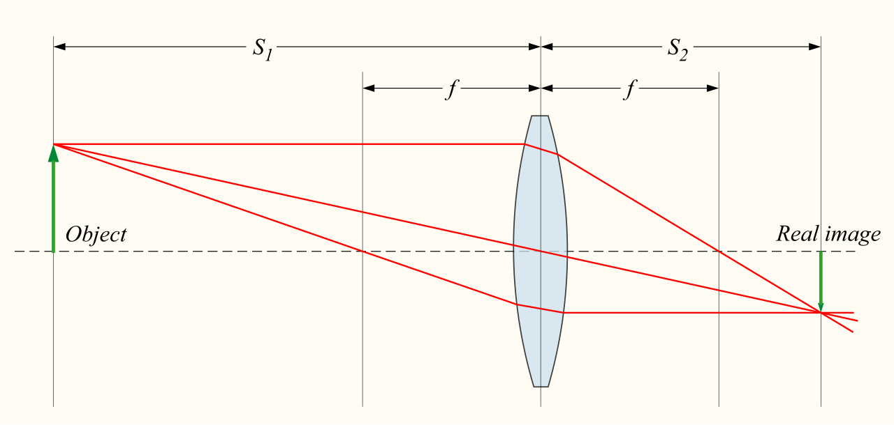
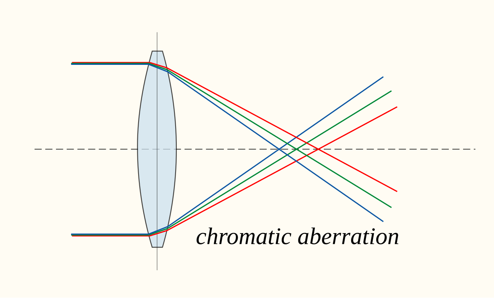

When the things light interacts with are much larger than its wavelength, light behaves as straight rays that bounce and bend by a handful of rules — enough to design every mirror, lens, telescope, and pair of spectacles. The organising idea, and the one worth carrying through the geometry, is **Fermat's principle**: of all the paths light *could* take between two points, it takes the one that costs the least time. Reflection's equal-angles rule and refraction's Snell's law both drop out of that single minimisation, and it is the same variational idea that reappears as the [principle of least action](/citadel/maths/applied-maths) in mechanics.

This post is geometrical optics — mirrors, lenses, prisms, instruments, and where the ideal breaks down as *aberrations*. The wave effects (interference, diffraction, gratings) are the companion post on [wave optics](/citadel/physics/wave-optics), and the fact that [light is an electromagnetic wave](/citadel/physics/electromag) travelling at $c$ sits behind both.

## Reflection

At a smooth surface, light obeys three rules: the incident ray, reflected ray, and the **normal** lie in one plane; the angle of incidence equals the angle of reflection, $\theta_i = \theta_r$ (both measured from the normal); and the two rays sit on opposite sides of the normal.

For a **spherical mirror** of radius $R$, rays near the axis converge through a **focal point** a distance
$$ f = \frac{R}{2} $$
from the pole — positive for a concave mirror, negative for a convex one.

### The mirror equation

Take a concave mirror, object at distance $u$, image at $v$, centre of curvature at $R$. A ray from the object meets the mirror at height $h$ and reflects; the normal there is the radius. Let $\alpha$, $\beta$, $\gamma$ be the angles the object ray, image ray, and radius make with the axis. The exterior-angle theorem on the two triangles gives $\gamma = \alpha + \theta$ and $\beta = \gamma + \theta$, so
$$ 2\gamma = \alpha + \beta $$
For **paraxial** rays the angles are small, $\alpha \approx h/u$, $\beta \approx h/v$, $\gamma \approx h/R$. Substituting and cancelling $h$:
$$ \frac{2}{R} = \frac{1}{u} + \frac{1}{v} \quad\Longrightarrow\quad \frac{1}{f} = \frac{1}{u} + \frac{1}{v} $$

The derivation used magnitudes; applying the formula needs a consistent **Cartesian sign convention** — distances measured from the pole, positive along the incident light, so a real object has $u < 0$, a concave mirror has $f < 0$, and a real image forms at $v < 0$. (Other textbooks flip the signs; pick one and hold it.)

### Images and magnification

A **real image** forms where rays actually cross — it lands on a screen. A **virtual image** is where diverging rays only *appear* to originate, behind the mirror. **Magnification** is
$$ M = \frac{h_i}{h_o} = -\frac{v}{u} $$
$|M| > 1$ enlarges; positive $M$ is an upright virtual image, negative $M$ an inverted real one.

- **Plane mirror** ($f = \infty$): virtual, upright, same size ($M = +1$), as far behind as the object is in front, left–right reversed.
- **Concave (converging):** real inverted images for an object beyond $f$; a virtual enlarged upright image for an object inside $f$ (the shaving mirror). Telescopes, headlights.
- **Convex (diverging):** always a virtual, upright, diminished image — the wide-angle car mirror.

Four rays locate any image: parallel-to-axis reflects through $F$; through-$F$ reflects parallel; through $C$ retraces itself; to the pole reflects symmetrically about the axis.

| Object (concave) | Image | Nature | Size |
|---|---|---|---|
| At infinity | At $F$ | real, inverted | point |
| Beyond $C$ | Between $F$ and $C$ | real, inverted | diminished |
| At $C$ | At $C$ | real, inverted | same |
| Between $C$ and $F$ | Beyond $C$ | real, inverted | enlarged |
| At $F$ | At infinity | — | — |
| Between $F$ and pole | Behind mirror | virtual, upright | enlarged |

A convex mirror has just one row: object anywhere → image behind the mirror, between pole and $F$, virtual, upright, diminished.

## Refraction and lenses

Light bends at a boundary because its **speed changes**: slowing down, it turns toward the normal; speeding up, away. The rule is **Snell's law**,
$$ n_1\sin\theta_1 = n_2\sin\theta_2, \qquad \frac{\sin\theta_1}{\sin\theta_2} = \frac{n_2}{n_1} = \frac{v_1}{v_2} $$
with the **refractive index** $n = c/v$.

 medium. Source: Wikimedia Commons.")

### Snell's law from Fermat's principle

Light takes the path of least time. For a ray from $A = (0, y_A)$ in medium 1 to $B = (x_B, y_B)$ in medium 2, crossing the interface at $(x, 0)$, the travel time is
$$ t(x) = \frac{\sqrt{x^2 + y_A^2}}{v_1} + \frac{\sqrt{(x_B - x)^2 + y_B^2}}{v_2} $$
Setting $dt/dx = 0$:
$$ \frac{1}{v_1}\frac{x}{\sqrt{x^2 + y_A^2}} = \frac{1}{v_2}\frac{x_B - x}{\sqrt{(x_B - x)^2 + y_B^2}} \quad\Longrightarrow\quad \frac{\sin\theta_1}{v_1} = \frac{\sin\theta_2}{v_2} $$
which is Snell's law once $v = c/n$ is substituted.

### Total internal reflection

Going from dense to rare ($n_1 > n_2$), the ray bends away from the normal, and at the **critical angle** the refracted ray grazes the surface ($\theta_2 = 90°$):
$$ \sin\theta_c = \frac{n_2}{n_1} $$
Beyond $\theta_c$ there is no transmitted ray at all — the light is totally reflected back. This is what pipes light down an optical fibre, makes a cut diamond sparkle, and floats a mirage above hot tarmac.

### From one surface to the lens-maker's formula

 lens. Its two surface radii $R_1$, $R_2$ and the index set the focal length $f$. Source: Wikimedia Commons.")

Refraction at a single spherical surface of radius $R$ between media $n_1$ and $n_2$ gives (paraxial)
$$ \frac{n_2}{v} - \frac{n_1}{u} = \frac{n_2 - n_1}{R} $$
A thin lens is two such surfaces, $R_1$ then $R_2$, with the image from the first acting as object for the second. Adding the two equations, with lens material $n_\ell$ in surrounding media $n_1$, $n_2$:
$$ \frac{n_2}{v} - \frac{n_1}{u} = \frac{n_\ell - n_1}{R_1} + \frac{n_2 - n_\ell}{R_2} $$
For a **thin lens in air** ($n_1 = n_2 = 1$, $n_\ell = n$) this collapses to the **lens-maker's formula**
$$ \frac{1}{f} = (n - 1)\left(\frac{1}{R_1} - \frac{1}{R_2}\right) $$
and the **thin-lens equation**
$$ \frac{1}{f} = \frac{1}{v} - \frac{1}{u} $$
A **convex** lens (thicker in the middle) converges — magnifier, camera, long-sight correction; a **concave** lens diverges — always a virtual, diminished, upright image, used for short-sight correction. Three rays locate the image: parallel-to-axis through the far $F$; through the near $F$ emerges parallel; through the optical centre, undeviated.

**Power** of a lens is $P = 1/f$ in dioptres (m⁻¹); thin lenses in contact add powers, $P = P_1 + P_2 + \cdots$, which is how a prescription combines a base lens and a correction.

## Optical instruments

The eye focuses a real image on the retina; its **near point** (closest sharp focus) is conventionally $D = 25\ \text{cm}$. Instruments are rated by **angular magnification** $M = \theta_{\text{aided}}/\theta_{\text{unaided}}$ — how much larger an object *subtends* — not by linear size.

- **Magnifying glass** (single convex lens): with the image at infinity, $M = D/f$; with it at the near point, $M = 1 + D/f$. A 5 cm lens gives about 5–6×.
- **Compound microscope**: an objective of short focal length $f_o$ forms a real magnified image, which an eyepiece $f_e$ then views as a magnifier. Total $M \approx -\dfrac{L}{f_o}\cdot\dfrac{D}{f_e}$, with $L$ the tube length — hundreds of times.
- **Refracting telescope**: objective and eyepiece share a focal point, so $M = -f_o/f_e$. High magnification wants a long objective focal length and a short eyepiece; light-gathering wants a wide objective, which is why research telescopes are large mirrors (no chromatic aberration, and easier to make big) rather than lenses.

## Where the paraxial ideal breaks: aberrations

Every equation above assumed **paraxial** rays — close to the axis, small angles, $\sin\theta \approx \theta$. Real optics use wider cones and finite bandwidth, and the departures are called aberrations.

- **Spherical aberration.** A spherical surface does not focus wide-angle rays to the same point as near-axis rays; the focus smears along the axis. Fixed with an aspheric (parabolic) surface, or by stopping the aperture down.
- **Chromatic aberration.** $n$ depends on wavelength, so $f$ does too — blue light focuses closer than red, fringing edges with colour. An **achromatic doublet** cements a converging crown-glass lens to a diverging flint-glass lens so their dispersions cancel while their focusing powers do not.

- **Coma, astigmatism, field curvature, distortion.** Off-axis object points give comet-shaped blurs, different focal lengths in two planes, a curved image surface, and barrel or pincushion warping. A real camera lens is a stack of six to twenty elements balancing all of these against each other.

## Slabs and prisms

**Parallel-sided slab.** The emergent ray is parallel to the incident one but shifted sideways by
$$ d = \frac{t\,\sin(i - r)}{\cos r} $$
for slab thickness $t$, incidence $i$, internal angle $r$. At small angles this is $d \approx t\,i\left(1 - 1/n\right)$.

**Prism.** With apex angle $A$, first-face angles $i_1, r_1$ and second-face angles $r_2, i_2$, the geometry gives $A = r_1 + r_2$ and the **deviation**
$$ \delta = i_1 + i_2 - A $$
$\delta$ is least when the path is symmetric, $i_1 = i_2$ and $r_1 = r_2 = A/2$, giving $D_m = 2i_1 - A$ and
$$ n = \frac{\sin\!\big(\frac{A + D_m}{2}\big)}{\sin\!\big(\frac{A}{2}\big)} $$
the standard bench measurement of refractive index. For a **thin prism** this reduces to $D_m \approx (n - 1)A$. Because $n$ varies with wavelength, $D_m$ does too — the prism spreads white light into a spectrum, which is [dispersion](/citadel/physics/wave-optics).

## The one idea to keep

Fermat's least-time principle generates both laws that geometrical optics needs: equal angles for reflection, $n_1\sin\theta_1 = n_2\sin\theta_2$ for refraction. From those, one paraxial relation — $1/f = 1/v + 1/u$ with a consistent sign convention — handles every mirror and, via refraction at two surfaces, every thin lens; magnification is $-v/u$. The formulae are exact only for narrow ray cones and one wavelength; widen either and the image degrades in the specific, catalogued ways called aberrations, which real lens design exists to balance. Where the aperture itself approaches the wavelength, rays fail entirely and you need [wave optics](/citadel/physics/wave-optics).

