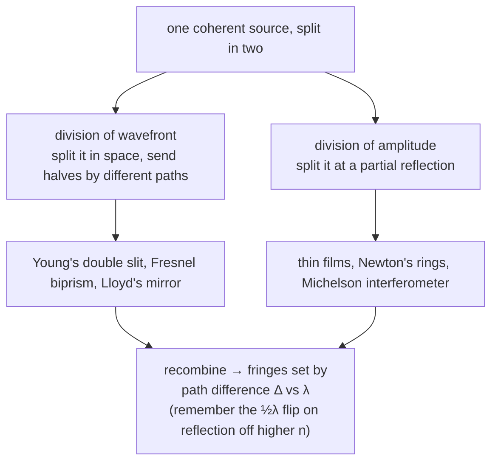

[Ray optics](/citadel/physics/optics) treats light as straight lines, and it is astonishingly good — until it meets something the size of a wavelength. Then it fails, and the failures are the useful part: adding two beams of light can produce *darkness*, a single narrow slit smears a point into a fringed blob, and a ruled plate of fine lines throws white light into a razor-sharp spectrum. Every one of these needs light to be a wave that can add out of phase with itself.

This post covers thin-film interference (soap-bubble colour, anti-reflection coatings), the Michelson interferometer, diffraction from slits and gratings, the resolution limit that diffraction imposes on every optical instrument, and polarisation by reflection. The wave equation and the two-source and single-slit basics are in the [waves](/citadel/physics/waves) post.

## Interference and the phase flip on reflection

Two coherent light waves that meet add amplitude to amplitude: in step (path difference $m\lambda$) they reinforce, half a cycle out ($ (m + \tfrac{1}{2})\lambda$) they cancel. One extra rule matters for reflected light: **a wave reflecting off a medium of higher refractive index flips by $180°$** — an extra half-wavelength of path. Reflection off a lower-index medium does not flip.

## Thin-film interference

A film of index $n$ and thickness $t$ reflects light from both its surfaces, and the two reflected waves interfere. Their optical path difference for a ray at internal angle $r$ is $2nt\cos r$. When exactly one of the two reflections undergoes the half-wave flip — the common case of a film in air, or an air-to-film-to-glass stack — the flip adds $\lambda/2$, so in **reflected** light:
$$ 2nt\cos r = \left(m + \tfrac{1}{2}\right)\lambda \quad \text{(bright)}, \qquad 2nt\cos r = m\lambda \quad \text{(dark)} $$
Because the condition depends on $\lambda$, white light gives different colours at different thicknesses — the moving bands on a soap bubble, the sheen on an oil slick. **Transmitted** light shows the complementary pattern, since neither or both of the internal reflections flip. Choosing $t$ so a target wavelength cancels in reflection is how a lens gets its anti-reflection coating.

## Newton's rings

Rest a plano-convex lens curved-side-down on a flat glass plate; the gap between them is a thin air wedge, zero at the contact point and growing outward. Monochromatic light from above interferes between the reflection off the bottom of the lens and the top of the plate, giving concentric rings. With $n = 1$ for air and the half-wave flip at the glass plate, dark rings satisfy $2t = m\lambda$. The wedge geometry gives $r_m^2 = 2R_{\text{lens}}t - t^2 \approx 2R_{\text{lens}}t$ for a lens of radius of curvature $R_{\text{lens}}$, so
$$ r_m = \sqrt{m\lambda R_{\text{lens}}} $$
The centre is dark (zero thickness, but the flip), and the rings crowd together outward as $\sqrt{m}$. Measuring the radii gives $\lambda$, or $R_{\text{lens}}$, or the flatness of the plate.

## The Michelson interferometer

A beam splitter sends light down two perpendicular arms to mirrors and back, recombining the two returns onto a detector. The fringe pattern depends on the difference in arm length; moving one mirror by $\lambda/2$ changes the round-trip path by $\lambda$ and sweeps the pattern through one full fringe. Counting fringes as the mirror moves measures displacement to a fraction of a wavelength, or measures a wavelength against a known displacement. Its most famous run, the **Michelson–Morley experiment**, found no shift as the apparatus was rotated — no "aether wind" — a null result that [special relativity](/citadel/physics/relative-mech) later explained by making $c$ the same in every frame.

## Single-slit diffraction

A slit of width $a$ spreads light into a broad central bright band with weaker side fringes. The intensity at angle $\theta$ is
$$ I(\theta) = I_0\left(\frac{\sin\alpha}{\alpha}\right)^2, \qquad \alpha = \frac{\pi a\sin\theta}{\lambda} $$
with minima where $\sin\alpha = 0$ (but $\alpha \neq 0$), i.e.
$$ a\sin\theta = m\lambda, \qquad m = \pm 1, \pm 2, \dots $$
The [derivation, by phasor summation across the slit](/citadel/physics/waves), is in the waves post; what matters here is that a single aperture already imposes an envelope on any finer pattern built inside it.

## The diffraction grating

A grating is $N$ equally spaced slits, spacing $d$, width $a$. Each slit diffracts, and the $N$ beams interfere; the intensity is the single-slit envelope times an $N$-slit interference factor:
$$ I(\theta) = I_0\left(\frac{\sin\alpha}{\alpha}\right)^2\left(\frac{\sin N\beta}{\sin\beta}\right)^2, \qquad \alpha = \frac{\pi a\sin\theta}{\lambda}, \quad \beta = \frac{\pi d\sin\theta}{\lambda} $$

**Principal maxima** occur when every slit is in phase with its neighbour, $\beta = m\pi$:
$$ d\sin\theta = m\lambda \qquad \text{(grating equation)} $$
with $m$ the order. Between two principal maxima there are $N - 1$ points of zero intensity and $N - 2$ faint secondary maxima; the more slits, the sharper the principal lines stand out.

**Missing orders.** A principal maximum vanishes if its angle also satisfies a single-slit minimum, $a\sin\theta = p\lambda$. Dividing the two conditions, the order $m = (d/a)\,p$ is absent. If the opaque strip equals the slit width, $d = 2a$, then every even order ($m = 2, 4, 6, \dots$) is missing.

## Dispersive and resolving power

**Dispersive power** — how far apart two wavelengths land. Differentiating $d\sin\theta = m\lambda$ at fixed $m$:
$$ \frac{d\theta}{d\lambda} = \frac{m}{d\cos\theta} $$
Higher order and finer spacing spread the spectrum more.

**Resolving power** — whether two close wavelengths are seen as separate. Defined as $R = \lambda/\Delta\lambda_{\min}$, a grating achieves
$$ R = Nm $$
the total number of illuminated lines times the order. A wide grating used in high order separates spectral lines a small fraction of a nanometre apart — the basis of optical spectroscopy.

## The diffraction limit

Diffraction is not only a curiosity of slits — it sets a hard floor on how finely *any* optical instrument can resolve detail. Light through a circular aperture of diameter $D$ spreads into an **Airy pattern**: a central disk ringed by faint haloes, with the first dark ring at angular radius

$$ \theta_{\min} \approx 1.22\,\frac{\lambda}{D} $$

Two point sources (two stars, two specks under a microscope) are just barely resolved when the centre of one Airy disk falls on the first dark ring of the other — the **Rayleigh criterion**. Any closer and they merge into one blob no amount of focus can separate.

, marginally resolved with the peak of one over the first null of the other (b), or unresolved (c). Source: Wikimedia Commons.")

This is why telescopes are built ever larger (bigger $D$, finer $\theta_{\min}$), why electron microscopes beat light microscopes (electrons have a far shorter $\lambda$), and why a camera stopped down too far goes soft — past a point, shrinking the aperture trades lens aberrations for diffraction blur.

## Polarisation by reflection

Light reflecting off a dielectric is partially polarised, and at one special angle — **Brewster's angle** $\theta_B$, where the reflected and refracted rays are exactly $90°$ apart — the reflected light is *completely* polarised, with its electric field parallel to the surface. From that geometry and Snell's law,

$$ \tan\theta_B = \frac{n_2}{n_1} $$

For an air–glass surface $\theta_B \approx 56°$. Polarising sunglasses have their axis vertical to block the horizontally-polarised glare bouncing off roads and water; a laser cavity uses Brewster windows to pick out one polarisation with no reflective loss.

## The one idea to keep

Ray optics fails wherever a length scale drops to the wavelength, and the wave picture takes over: two coherent beams add amplitude-to-amplitude, so path differences of $\lambda/2$ turn brightness into darkness — thin-film colour, Newton's rings, and interferometry all read a distance off a fringe count (with the half-wave flip on reflection off a denser medium thrown in). A single aperture diffracts, imposing the envelope $(\sin\alpha/\alpha)^2$ on everything finer, and through the Rayleigh criterion $\theta_{\min} \approx 1.22\lambda/D$ it puts an unbreakable floor under the resolution of every telescope, microscope, and camera.
