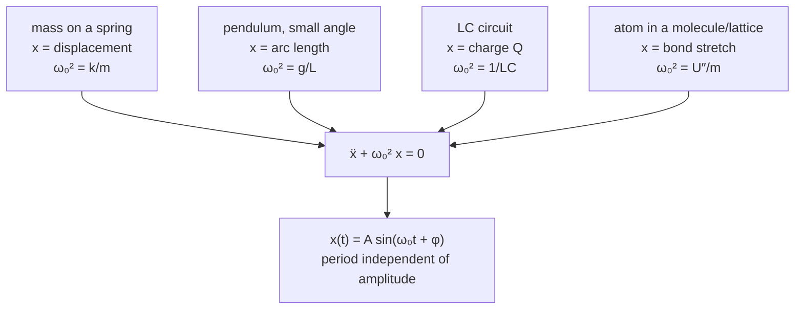

A mass on a spring, a pendulum through a small arc, charge sloshing in an [LC circuit](/citadel/physics/current), a carbon atom vibrating against its neighbours in a diamond — these have nothing physically in common, yet they all move according to the *same* differential equation, $\ddot x + \omega_0^2 x = 0$, and so they all trace the same sine wave in time. That is not a coincidence, and the reason it happens is worth stating up front: near any stable equilibrium, whatever the system, the potential energy curve looks like a parabola, and a parabolic potential gives a restoring force proportional to displacement. Simple harmonic motion is what *every* stable system does when nudged gently.

This post starts from that equation, adds friction (damped oscillations), adds a periodic push (driven oscillations and resonance, where a small force can build a huge response), and ends with oscillators coupled to each other. Travelling disturbances — the wave an oscillation radiates — are the companion post on [waves](/citadel/physics/waves).

## Simple harmonic motion

The defining feature of **simple harmonic motion** (SHM) is a restoring force proportional to the displacement and directed back toward equilibrium. For a mass on a spring that is Hooke's law:
$$ F = -kx $$
where $k$ is the spring constant (stiffness) and the minus sign makes the force oppose the displacement. Newton's second law, $F = m\ddot{x}$, turns this into
$$ m\ddot{x} + kx = 0 \implies \ddot{x} + \frac{k}{m}x = 0 $$
Defining the **natural angular frequency** $\omega_0 = \sqrt{k/m}$, this is
$$ \ddot{x} + \omega_0^2 x = 0 $$
Any system whose equation of motion reduces to this form is an SHM oscillator, whatever the physical meaning of $x$ and $\omega_0$. This is why SHM is everywhere: near any stable equilibrium, a potential energy curve $U(x)$ looks parabolic (its Taylor expansion is $U \approx U_{\min} + \tfrac{1}{2}U''x^2$), so the restoring force is linear and small oscillations about *any* such minimum are simple harmonic, with $\omega_0^2 = U''/m$.

**Solving it.** Try $x(t) = e^{\lambda t}$: substituting gives $\lambda^2 + \omega_0^2 = 0$, so $\lambda = \pm i\omega_0$, and the general solution is $x = C_1 e^{i\omega_0 t} + C_2 e^{-i\omega_0 t}$. Applying Euler's formula and collecting real constants,
$$ x(t) = A_1\cos\omega_0 t + A_2\sin\omega_0 t $$
and writing $A_1 = A\sin\phi$, $A_2 = A\cos\phi$ folds the two terms into one using $\sin(X+Y) = \sin X\cos Y + \cos X\sin Y$:
$$ x(t) = A\sin(\omega_0 t + \phi) $$
Here $A$ is the **amplitude** (maximum displacement), $\omega_0 t + \phi$ is the **phase**, and the **phase constant** $\phi$ is set by where in the cycle the motion is at $t = 0$. The frequency and period follow from $\omega_0$:
$$ f_0 = \frac{\omega_0}{2\pi} = \frac{1}{2\pi}\sqrt{\frac{k}{m}}, \qquad T_0 = \frac{1}{f_0} = \frac{2\pi}{\omega_0} $$
Notice neither depends on the amplitude — a large swing and a small swing take the same time.

**Velocity and acceleration** come from differentiating:
$$ v(t) = A\omega_0\cos(\omega_0 t + \phi), \qquad a(t) = -A\omega_0^2\sin(\omega_0 t + \phi) = -\omega_0^2 x(t) $$
The last equality recovers the starting equation. Using $\sin^2 + \cos^2 = 1$ to eliminate time gives the velocity directly in terms of position:
$$ v = \pm\omega_0\sqrt{A^2 - x^2} $$
so the speed is greatest ($A\omega_0$) at the equilibrium point and zero at the turning points $x = \pm A$.

### Energy

With no friction, the total mechanical energy is conserved and simply shuttles between kinetic and potential. The spring's potential energy is
$$ U(x) = \int_0^x kx'\,dx' = \tfrac{1}{2}kx^2 $$
Substituting the solution, and using $k = m\omega_0^2$,
$$ U(t) = \tfrac{1}{2}kA^2\sin^2(\omega_0 t + \phi), \qquad K(t) = \tfrac{1}{2}mv^2 = \tfrac{1}{2}kA^2\cos^2(\omega_0 t + \phi) $$
$$ E = K + U = \tfrac{1}{2}kA^2 $$
constant, and proportional to the square of the amplitude. At the turning points all of it is potential; at equilibrium all of it is kinetic.

## Damped oscillations

Real oscillations lose energy. Model the loss with a force proportional to velocity and opposing it, $F_{\text{damp}} = -c\dot{x}$, and the equation of motion becomes
$$ m\ddot{x} + c\dot{x} + kx = 0 $$
Dividing by $m$ and introducing the **damping ratio** $\zeta$ through $2\zeta\omega_0 = c/m$ (so $\zeta = c/2\sqrt{km}$):
$$ \ddot{x} + 2\zeta\omega_0\dot{x} + \omega_0^2 x = 0 $$
The dimensionless $\zeta$ measures the damping against the stiffness and mass: $\zeta = 1$ is the exact balance point where the restoring pull and the drag settle the system without a single overshoot. The trial $x = e^{\alpha t}$ gives the characteristic equation $\alpha^2 + 2\zeta\omega_0\alpha + \omega_0^2 = 0$, with roots
$$ \alpha = -\zeta\omega_0 \pm \omega_0\sqrt{\zeta^2 - 1} $$
The sign of $\zeta^2 - 1$ — whether the roots are complex or real — decides everything.

**Underdamped, $\zeta < 1$.** The root's square is negative; write $\sqrt{\zeta^2 - 1} = i\sqrt{1 - \zeta^2}$ and define the **damped frequency**
$$ \omega_d = \omega_0\sqrt{1 - \zeta^2} $$
The roots are $-\zeta\omega_0 \pm i\omega_d$, and the solution is an oscillation inside a shrinking envelope:
$$ x(t) = A'\,e^{-\zeta\omega_0 t}\sin(\omega_d t + \phi') $$
A playground swing left alone: still swinging, amplitude decaying exponentially, at a frequency slightly below the undamped $\omega_0$.

**Critically damped, $\zeta = 1$.** The roots coincide at $-\omega_0$, $\omega_d = 0$, and
$$ x(t) = (C_1 + C_2 t)\,e^{-\omega_0 t} $$
The system returns to equilibrium as fast as possible without overshooting — the target behaviour for a car's shock absorbers or a door closer.

**Overdamped, $\zeta > 1$.** Two distinct real negative roots,
$$ x(t) = C_1 e^{\alpha_1 t} + C_2 e^{\alpha_2 t}, \qquad \alpha_{1,2} = -\zeta\omega_0 \pm \omega_0\sqrt{\zeta^2 - 1} $$
Non-oscillating again, but slower than critical — a hand pushed through honey. (This can equally be written with $\cosh$ and $\sinh$ of $\omega_0 t\sqrt{\zeta^2 - 1}$, since those are just sums of the two exponentials.)

### Measuring the decay

For the underdamped case the amplitude envelope is $A(t) = A_0 e^{-\zeta\omega_0 t}$, and since energy goes as amplitude squared,
$$ E(t) = E_0\,e^{-2\zeta\omega_0 t} $$

- **Relaxation time.** The energy falls to $1/e$ of its value after
$$ \tau_{\text{energy}} = \frac{1}{2\zeta\omega_0} $$
(The amplitude relaxation time is twice this, $\tau_{\text{amp}} = 1/\zeta\omega_0$.)
- **Power dissipated** is $P(t) = -dE/dt = E(t)/\tau_{\text{energy}}$.
- **Logarithmic decrement** compares successive peaks one damped period $T_d = 2\pi/\omega_d$ apart:
$$ \delta = \ln\frac{A(t)}{A(t + T_d)} = \zeta\omega_0 T_d \approx 2\pi\zeta \quad (\text{light damping}) $$
- **Quality factor** $Q$ is $2\pi$ times the energy stored over the energy lost per cycle. For light damping,
$$ Q = \frac{1}{2\zeta} \approx \omega_0\,\tau_{\text{energy}} $$
A high-$Q$ oscillator (a quartz crystal, $Q \sim 10^4$–$10^6$) rings for many thousands of cycles; a low-$Q$ one dies in a few.

## Driven oscillations and resonance

Now push the damped oscillator with a periodic force $F_0\cos\omega t$ at drive frequency $\omega$:
$$ m\ddot{x} + c\dot{x} + kx = F_0\cos\omega t $$
The transient (the natural damped oscillation) dies away, leaving a **steady state** at the *drive* frequency:
$$ x(t) = A(\omega)\cos(\omega t - \phi) $$
Substituting and solving (phasors are the tidy route) gives the amplitude and phase lag:
$$ A(\omega) = \frac{F_0/m}{\sqrt{(\omega_0^2 - \omega^2)^2 + (2\zeta\omega_0\omega)^2}}, \qquad \tan\phi = \frac{2\zeta\omega_0\omega}{\omega_0^2 - \omega^2} $$

The amplitude has three regimes:

- **Slow drive** ($\omega \ll \omega_0$): $A \to F_0/k$. The spring stiffness sets the response; the mass barely matters. Phase lag $\phi \to 0$: the mass moves with the force.
- **Near $\omega_0$**: the first term in the denominator collapses and $A$ peaks. Phase lag passes through $\pi/2$.
- **Fast drive** ($\omega \gg \omega_0$): $A \to (F_0/m)/\omega^2 \to 0$. The mass's inertia dominates and it can't keep up. Phase lag $\to \pi$: the mass moves opposite the force.

**Resonance.** $A(\omega)$ is largest where the denominator is smallest. Minimising $(\omega_0^2 - \omega^2)^2 + (2\zeta\omega_0\omega)^2$ with respect to $\omega$ gives $4\omega(\omega^2 - \omega_0^2 + 2\zeta^2\omega_0^2) = 0$, so the amplitude-resonance frequency is
$$ \omega_r = \omega_0\sqrt{1 - 2\zeta^2} $$
which only exists when $\zeta < 1/\sqrt{2} \approx 0.707$. For light damping $\omega_r \approx \omega_0$ and the peak amplitude is
$$ A_{\text{res}} \approx \frac{F_0/m}{2\zeta\omega_0^2} = \frac{F_0/k}{2\zeta} = Q\,\frac{F_0}{k} $$
The static response $F_0/k$ is multiplied by $Q$. The phase is why: at $\omega_0$ the displacement lags the force by exactly $90°$, putting the *velocity* in phase with the force, so the drive does positive work on every part of every cycle. Away from resonance the force opposes the motion part of each cycle and the amplitude settles lower. Damping caps the growth — in steady state, the energy fed in per cycle equals what damping removes. A lightly damped system driven at resonance can swing with tens or hundreds of times its static amplitude: a singer cracking a wine glass at its natural frequency, a radio's tuned circuit picking one station from the band. The 1940 Tacoma Narrows collapse is the usual dramatic example — strictly aeroelastic flutter (wind and deck feeding each other) rather than a fixed drive, but the lesson is the same.

## Coupled oscillations

### The pendulum first

A mass $m$ on a string of length $L$: for small angles $\sin\theta \approx \theta$, the tangential restoring force is $-mg\theta$, and with arc length $s = L\theta$,
$$ m\ddot{s} = -mg\frac{s}{L} \implies \ddot{s} + \frac{g}{L}s = 0 $$
SHM again, with
$$ \omega = \sqrt{\frac{g}{L}}, \qquad T = 2\pi\sqrt{\frac{L}{g}} $$
independent of the mass and (to this approximation) of the amplitude.

### Normal modes

Connect two oscillators — two spring-mass systems joined by a third spring, or two pendulums linked by a light spring — and each one's motion drives the other. Such a system has **normal modes**: patterns in which every part oscillates at one frequency with fixed phase relationships. For two identical pendulums there are two: the in-phase mode (both swing together, the coupling spring never stretches, frequency $\omega_0$) and the out-of-phase mode (they swing oppositely, frequency slightly higher because the spring now resists). Any motion is a superposition of the two, and starting one pendulum at rest while the other swings excites both modes equally — they then beat against each other, so the energy drains completely from one pendulum into the other and back, over and over. This same structure — modes, and energy exchange between them — is the entry point to molecular vibrations, lattice dynamics, and coupled electrical circuits.

### Superposing two SHMs

**Same line, same frequency.** Adding $x_1 = A_1\sin\omega t$ and $x_2 = A_2\sin(\omega t + \phi)$:
$$ x = (A_1 + A_2\cos\phi)\sin\omega t + (A_2\sin\phi)\cos\omega t = R\sin(\omega t + \delta) $$
with $R = \sqrt{(A_1 + A_2\cos\phi)^2 + (A_2\sin\phi)^2}$ and $\tan\delta = \dfrac{A_2\sin\phi}{A_1 + A_2\cos\phi}$ — still SHM, just with a new amplitude and phase.

**Perpendicular, same frequency.** With $x = A_1\sin\omega t$ and $y = A_2\sin(\omega t + \phi)$, eliminate $t$: from the first, $\sin\omega t = x/A_1$ and $\cos\omega t = \pm\sqrt{1 - (x/A_1)^2}$; substituting into $y$ and squaring gives the general **Lissajous figure**, an ellipse:
$$ \frac{x^2}{A_1^2} + \frac{y^2}{A_2^2} - \frac{2xy}{A_1 A_2}\cos\phi = \sin^2\phi $$

- $\phi = 0$ or $\pi$: the right side vanishes and it degenerates to a straight line $y = \pm(A_2/A_1)x$.
- $\phi = \pi/2$: the cross term vanishes, leaving $x^2/A_1^2 + y^2/A_2^2 = 1$, an axis-aligned ellipse (a circle if $A_1 = A_2$).

When the two frequencies differ by a simple ratio the figure becomes a stable closed curve with more lobes — the classic oscilloscope patterns. The ratio sets the number of lobes; the phase difference sets the tilt.

 sets the lobe count; phase difference (columns) shears a line into an ellipse and back. A 1:1 ratio at pi/2 is a circle. Source: Wikimedia Commons.")

### Where coupled oscillations show up

- **Molecular vibrations.** Atoms are masses on spring-like bonds; the normal-mode frequencies determine which infrared wavelengths a molecule absorbs, which is the basis of infrared spectroscopy and of why CO₂ and methane are greenhouse gases.
- **Crystal lattices.** The coupled vibrations of a solid's atoms are quantised as **phonons**, which carry heat and scatter electrons.
- **Instruments.** A guitar's string and body are coupled oscillators; the coupling shapes the timbre.
- **Radio.** Coupled LC circuits transfer signal between stages and set the tuning bandwidth.

## Where the linear picture breaks: anharmonicity

Every result above rests on the restoring force being *exactly* proportional to displacement. That is only the leading term of the Taylor expansion of $U(x)$, and once the amplitude is large enough for the next term to matter, the behaviour changes qualitatively.

- **The period stops being amplitude-independent.** A real pendulum swung through a wide angle takes longer than $2\pi\sqrt{L/g}$; the exact period involves an elliptic integral, and to first correction $T \approx 2\pi\sqrt{L/g}\,\big(1 + \theta_0^2/16 + \cdots\big)$. The famous "amplitude does not affect the period" is a small-angle statement.
- **The resonance peak bends.** In a system with a stiffening spring ($F = -kx - \beta x^3$, the **Duffing oscillator**), the resonant frequency rises with amplitude, so the response curve leans over and can become multi-valued — sweep the drive frequency up and down and the amplitude *jumps* at different points (hysteresis).
- **Parametric resonance.** Modulating a parameter of the oscillator — a child pumping a swing by raising and lowering their centre of mass twice per period — feeds energy in without an external driving force, and can grow the amplitude exponentially.
- **Chaos.** A driven, damped, sufficiently nonlinear oscillator can settle into motion that never repeats and depends sensitively on initial conditions — the simplest route from clean physics to genuinely unpredictable behaviour.

## The one idea to keep

Any system sitting in a stable equilibrium is, for small enough disturbances, a simple harmonic oscillator — because the bottom of any potential well is a parabola. That single equation, $\ddot x + \omega_0^2 x = 0$, plus a damping term and a driving term, covers pendulums, circuits, molecules, and bridges. Resonance is the payoff and the hazard: drive an oscillator at its natural frequency and, if damping is light, the steady amplitude is $Q$ times what the same force would produce statically. The linearity that makes all this tractable is itself an approximation, and large amplitudes bend the period, tilt the resonance, and eventually reach chaos.
