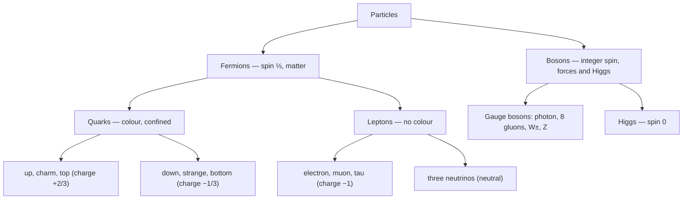

Every stable object you have ever touched is built from exactly three particles: up quarks, down quarks, and electrons. The other fourteen elementary particles in the **Standard Model** are either heavier copies that decay in fractions of a second, or the carriers of the forces. That such a short list, with a handful of symmetry rules, reproduces the results of every particle accelerator ever run — to twelve significant figures in the best-measured case — is the achievement. That it says nothing about gravity, dark matter, or why the list has the masses it does is the reason physics is not finished.

The Standard Model is a [quantum field theory](/citadel/physics/quantum-field-theory) — quantum mechanics joined to special relativity — built on gauge symmetry and renormalizable. This post is the catalogue: the particles, the quantum rules they obey, and how they combine into everything else. The field-theory machinery behind it — the Lagrangian, QCD, electroweak unification, the Higgs mechanism — is the [companion post](/citadel/physics/quantum-field-theory).

## The three forces it covers

| Force | Theory | Carrier |
|---|---|---|
| Electromagnetic | Quantum electrodynamics (QED) | photon $\gamma$ |
| Weak | electroweak theory | $W^+$, $W^-$, $Z$ |
| Strong | quantum chromodynamics (QCD) | 8 gluons $g$ |

Gravity is not in the Standard Model. The electromagnetic force acts between charges; the weak force drives flavour-changing processes like beta decay and all neutrino interactions; the strong force binds quarks into protons and neutrons and, as a residual effect, protons and neutrons into nuclei.

## Matter: three generations

The matter particles are all spin-$\tfrac{1}{2}$ **fermions**, arranged in three **generations** — each a heavier copy of the one before. Every generation has two **quarks** and two **leptons**:

| | Gen 1 | Gen 2 | Gen 3 | Charge |
|---|---|---|---|---|
| up-type quark | up | charm | top | $+\tfrac{2}{3}e$ |
| down-type quark | down | strange | bottom | $-\tfrac{1}{3}e$ |
| charged lepton | electron | muon | tau | $-e$ |
| neutrino | $\nu_e$ | $\nu_\mu$ | $\nu_\tau$ | $0$ |

Ordinary matter is entirely first-generation: protons are $uud$, neutrons $udd$, and the electron completes the atom. Quarks feel the strong force and carry **colour charge**; leptons do not. Neutrinos feel only the weak force (and gravity), which is why they pass through the Earth almost unimpeded.

Standing apart from the fermions is the **Higgs boson** $H^0$, a spin-0 particle whose associated field fills all space and gives the other particles their masses.

, four force-carrying gauge bosons, and the Higgs. Source: Wikimedia Commons.")

## Spin and statistics

Spin is intrinsic angular momentum, quantized in units of $\hbar/2$. The **spin–statistics theorem** ties the spin value to collective behaviour:

- **Fermions** — half-integer spin (quarks, leptons, and composite particles like the proton). Their joint wave function is antisymmetric under exchange, $\psi(x_1, x_2) = -\psi(x_2, x_1)$, which forces the **Pauli exclusion principle**: no two identical fermions in the same quantum state. This is why electrons stack into shells and matter takes up space.
- **Bosons** — integer spin (photon, gluon, $W$/$Z$, Higgs). Their joint wave function is symmetric, and any number can share a state — the physics of the laser and of Bose–Einstein condensation.

## Parity and charge conjugation

Two discrete symmetries matter for the weak force.

**Parity $P$** reflects all spatial coordinates, $\vec{x} \to -\vec{x}$. Electromagnetism and the strong force are parity-symmetric — their processes look the same in a mirror. The **weak force is not**: the 1957 Wu experiment found that electrons from cobalt-60 beta decay come out preferentially against the nuclear spin, a mirror-asymmetric result.

**Charge conjugation $C$** swaps every particle for its antiparticle, flipping charge and the other internal quantum numbers while leaving mass, momentum, and spin alone. Again EM and strong conserve it; the weak force violates it. Even the combined $CP$ — mirror *and* antiparticle swap — is violated, slightly, first seen in neutral kaon decays in 1964. That small $CP$ violation is part of why the universe ended up with more matter than antimatter.

## The particle zoo

**Elementary fermions** are the six quarks and six leptons above. Quarks have fractional charge, carry one of three colour charges (labelled red, green, blue), and are never seen alone — always **confined** inside composite particles. The top quark is the heaviest, at about 173 GeV/$c^2$, and decays before it can bind.

**Elementary bosons:**

- **Photon** — massless, carries electromagnetism, infinite range.
- **Gluon** — eight types, massless, but confined; carries the strong force.
- **$W^\pm$, $Z$** — heavy (80–91 GeV/$c^2$), which makes the weak force short-ranged.
- **Higgs** — spin 0, mass ≈ 125 GeV/$c^2$, discovered at CERN in 2012.
- **Graviton** — the hypothetical spin-2 carrier of gravity; not part of the Standard Model and not detected.

**Antiparticles.** Every fermion has an antiparticle of equal mass and spin but opposite charge and quantum numbers; the [Dirac equation](/citadel/physics/quantum-field-theory) predicted them before they were found. A particle meeting its antiparticle annihilates to energy.

**Quasiparticles** are not fundamental at all — they are collective excitations in a many-body system that behave like particles: **phonons** (lattice vibrations), **magnons** (spin waves), plus excitons, polarons, plasmons. They are indispensable in condensed-matter physics.

| Particle | Spin | Charge ($e$) | Mass |
|---|---|---|---|
| up / charm / top | $\tfrac12$ | $+\tfrac23$ | 2.2 MeV / 1.27 GeV / 173 GeV |
| down / strange / bottom | $\tfrac12$ | $-\tfrac13$ | 4.7 MeV / 95 MeV / 4.18 GeV |
| electron / muon / tau | $\tfrac12$ | $-1$ | 0.511 MeV / 105.7 MeV / 1.777 GeV |
| $\nu_e$ / $\nu_\mu$ / $\nu_\tau$ | $\tfrac12$ | $0$ | tiny, non-zero |
| photon | $1$ | $0$ | $0$ |
| gluon (×8) | $1$ | $0$ | $0$ |
| $W^\pm$ / $Z$ | $1$ | $\pm1$ / $0$ | 80.4 / 91.2 GeV |
| Higgs | $0$ | $0$ | 125 GeV |

Quark masses are effective (they are never free); the electron is stable, the muon decays to $e^- \bar\nu_e \nu_\mu$, the tau to hadrons or lighter leptons.

## Hadrons: quarks bound together

Because of **colour confinement**, quarks appear only inside colour-neutral bound states, **hadrons**, held together by gluons. Hadrons carry conserved quantum numbers — electric charge, baryon number $B$, the lepton numbers, strangeness, charm, isospin — that bookkeep which reactions are allowed.

- **Baryons** — three quarks ($qqq$), fermions. Proton $= uud$, neutron $= udd$. The colour part of a baryon's wave function is totally antisymmetric, $\psi_{\text{colour}} \propto \epsilon_{ijk}\,q_i q_j q_k$, which lets the space–spin–flavour part be symmetric for the ground-state proton and neutron.
- **Mesons** — a quark–antiquark pair ($q\bar q$), bosons. Pions: $\pi^+ = u\bar d$, $\pi^- = d\bar u$, $\pi^0$ a mix of $u\bar u$ and $d\bar d$; kaons contain a strange quark. The colour state is the singlet $(r\bar r + g\bar g + b\bar b)/\sqrt{3}$.

**Decays.** Most hadrons, and the muon and tau, are unstable. The free neutron decays weakly, $n \to p + e^- + \bar\nu_e$, mediated by a virtual $W^-$. The decay rate follows **Fermi's golden rule**,
$$ \Gamma = \frac{2\pi}{\hbar}\,|M_{fi}|^2\,\rho_f $$
with $M_{fi}$ the transition amplitude and $\rho_f$ the density of final states.

## The four forces, compared

| Force | Rel. strength | Range | Mediator | Acts on |
|---|---|---|---|---|
| Strong | $1$ | $\sim10^{-15}$ m | gluons | colour charge |
| Electromagnetic | $\sim10^{-2}$ | $\infty$ | photon | electric charge |
| Weak | $\sim10^{-6}$ | $\sim10^{-18}$ m | $W^\pm$, $Z$ | quarks, leptons (flavour) |
| Gravitational | $\sim10^{-39}$ | $\infty$ | graviton (hypoth.) | mass–energy |

Strengths are order-of-magnitude and shift with energy scale.

## What the Standard Model cannot do

- **No gravity.** It has no quantum description of the fourth force.
- **Hierarchy problem.** The Higgs mass (125 GeV) is sixteen orders of magnitude below the Planck scale ($10^{19}$ GeV) with nothing protecting it there.
- **Strong $CP$ problem.** A QCD parameter $\theta$ that could produce strong-interaction $CP$ violation is measured to be essentially zero, with no explanation.
- **Neutrino mass.** The original model made neutrinos massless; oscillation experiments show they are not.
- **Dark matter and dark energy.** Most of the universe's content is nothing in the Standard Model.
- **Nineteen free parameters.** Masses and couplings are measured and inserted by hand, not predicted.

Each gap is a pointer to physics beyond the model — [grand unification, supersymmetry, string theory, quantum gravity](/citadel/physics/quantum-field-theory).

## The one idea to keep

Seventeen elementary particles: twelve spin-½ fermions (six quarks, six leptons, in three generations of increasing mass), four spin-1 gauge bosons carrying the electromagnetic, weak, and strong forces, and the spin-0 Higgs whose field gives the rest their mass. Fermions obey Pauli exclusion, which is why matter is rigid and takes up space; bosons pile into the same state, which is why lasers work. Quarks are permanently confined into colour-neutral hadrons — three-quark baryons and quark–antiquark mesons. The whole structure is spectacularly well-tested and just as spectacularly incomplete: no gravity, no dark matter, nineteen numbers put in by hand.
