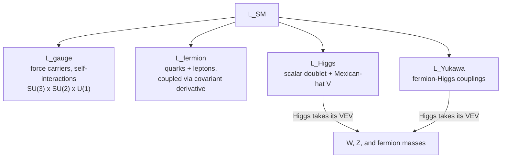

Ask what an electron *is*, and quantum field theory gives an answer that sounds evasive but is the whole point: an electron is not a thing, it is a **ripple in a field that fills all of space**. There is one electron field, one photon field, one field per quark flavour; a particle is a quantised unit of excitation in one of them, and *identical* particles are identical because they are excitations of the same underlying field. This one move — fields are fundamental, particles are their quanta — is what lets the theory create and destroy particles (every high-energy collision does), explain antimatter, and reach the twelve-significant-figure agreement with experiment that no other physical theory approaches.

The [Standard Model](/citadel/physics/particle) catalogues the particles; QFT is the framework that produces them. This post covers the QFT toolkit — Lagrangians, Noether's theorem, gauge symmetry, renormalization — then the Standard Model Lagrangian term by term, the strong and electroweak sectors, and the routes beyond.

## Relativistic wave equations

Combining $E^2 = p^2c^2 + m^2c^4$ with the quantum substitutions $E \to i\hbar\,\partial_t$, $\vec{p} \to -i\hbar\vec{\nabla}$ gives the **Klein–Gordon equation** for a spin-0 field,
$$ (\Box + m^2)\phi = 0, \qquad \Box = \frac{1}{c^2}\partial_t^2 - \nabla^2 $$
Applied to a single particle it gives negative probability densities — the sign that it must be read as a *field* equation, not a one-particle one.

Dirac wanted an equation **linear** in time and space derivatives, like Schrödinger's but Lorentz-covariant:
$$ i\hbar\,\partial_t\psi = \big(c\,\vec\alpha\cdot\hat{\vec p} + \beta mc^2\big)\psi $$
Squaring this must reproduce $E^2 = p^2c^2 + m^2c^4$, which forces $\alpha_i$ and $\beta$ to be $4\times4$ **matrices** — with $\{\alpha_i,\alpha_j\} = 2\delta_{ij}$, $\{\alpha_i,\beta\} = 0$, $\beta^2 = I$ — and $\psi$ to be a four-component **spinor**. Setting $\gamma^0 = \beta$, $\gamma^i = \beta\alpha_i$ gives the compact form
$$ (i\gamma^\mu\partial_\mu - m)\psi = 0, \qquad \{\gamma^\mu,\gamma^\nu\} = 2g^{\mu\nu} $$
the last being the Clifford algebra with the Minkowski metric. The **Dirac equation** got the electron's spin and magnetic moment right for free, and its negative-energy solutions forced the prediction of **antiparticles**. Charge conjugation acts as $C\psi C^{-1} = \eta_C\,i\gamma^2\psi^*$.

For a massless spin-1 field the free Lagrangian is $\mathcal{L} = -\tfrac{1}{4}F_{\mu\nu}F^{\mu\nu}$ with $F_{\mu\nu} = \partial_\mu A_\nu - \partial_\nu A_\mu$, and the Euler–Lagrange equation gives $\Box A_\nu = 0$ in Lorenz gauge — the [electromagnetic wave equation](/citadel/physics/electromag).

## The QFT toolkit

**Lagrangian formalism.** Each field's dynamics come from a **Lagrangian density** $\mathcal{L}$, through the action $S = \int \mathcal{L}\,d^4x$ and the Euler–Lagrange equation
$$ \frac{\partial\mathcal{L}}{\partial\phi} - \partial_\mu\!\left(\frac{\partial\mathcal{L}}{\partial(\partial_\mu\phi)}\right) = 0 $$
Split $\mathcal{L} = \mathcal{L}_{\text{free}} + \mathcal{L}_{\text{int}}$: the free part gives propagating particles, the interaction part gives the vertices where they couple.

**Symmetry and Noether.** Every continuous symmetry of $\mathcal{L}$ yields a conserved quantity: time-translation → energy, space-translation → momentum, the $U(1)$ phase symmetry of QED → electric charge. **Gauge symmetry** is the deep case: demand that a *local* phase rotation of the fields leave $\mathcal{L}$ invariant, and you are forced to introduce a gauge field — a force carrier — with exactly the couplings that describe the interaction.

**Renormalization.** Loop diagrams produce divergent integrals over virtual-particle momenta. The cure: **regularize** by cutting the integral off at a momentum $\Lambda$, then **absorb** the $\Lambda$-dependent pieces into redefinitions of the bare masses, couplings, and field normalizations, leaving finite measured values. A by-product is that couplings **run** with energy scale $\mu$ — quantum screening makes the QED coupling grow at high energy,
$$ \alpha(\mu) = \frac{\alpha_0}{1 - \dfrac{\alpha_0}{3\pi}\ln(\mu/\Lambda)} $$
while the QCD coupling shrinks (asymptotic freedom).

**Scattering.** The $S$-matrix connects initial to final states, $S_{fi} = \langle f|S|i\rangle$, with the perturbative expansion $S = T\exp\!\big(-i\int H_{\text{int}}\,dt\big)$. **Feynman diagrams** organize the terms — external lines for real particles, internal lines for virtual ones, vertices for interactions weighted by coupling constants — and each diagram translates to a contribution to the amplitude $M_{fi}$. The measured **cross-section** is $\sigma \propto |M_{fi}|^2$ integrated over final-state phase space.

## The Standard Model Lagrangian

$$ \mathcal{L}_{\text{SM}} = \mathcal{L}_{\text{gauge}} + \mathcal{L}_{\text{fermion}} + \mathcal{L}_{\text{Higgs}} + \mathcal{L}_{\text{Yukawa}} $$

**Gauge sector** — kinetic terms and self-interactions of the force carriers, one for each factor of the gauge group $SU(3)_C \times SU(2)_L \times U(1)_Y$:
$$ \mathcal{L}_{\text{gauge}} = -\tfrac{1}{4}F^a_{\mu\nu}F^{a\mu\nu} $$
For the non-Abelian groups $SU(2)$ and $SU(3)$, $F^a_{\mu\nu}$ contains terms cubic and quartic in the fields — the gauge bosons interact with *each other*.

**Fermion sector** — quarks and leptons and their coupling to the forces:
$$ \mathcal{L}_{\text{fermion}} = \sum_\psi \bar\psi\,(i\gamma^\mu D_\mu - m_\psi)\,\psi $$
The **covariant derivative** $D_\mu = \partial_\mu - igA_\mu$ replaces the ordinary derivative; the $A_\mu$ term it carries *is* the interaction between a fermion and a force carrier.

**Higgs sector** — a complex scalar doublet $\phi$ with
$$ \mathcal{L}_{\text{Higgs}} = (D_\mu\phi)^\dagger(D^\mu\phi) - V(\phi), \qquad V(\phi) = \mu^2\phi^\dagger\phi + \lambda(\phi^\dagger\phi)^2 $$
If $\mu^2 < 0$, the potential is a "Mexican hat": the lowest-energy state is not $\phi = 0$ but a ring at $|\phi| = v/\sqrt{2}$, a non-zero **vacuum expectation value**.

**Yukawa sector** — the fermion–Higgs couplings:
$$ \mathcal{L}_{\text{Yukawa}} = -y_u\,\bar Q_L\tilde\phi\,u_R - y_d\,\bar Q_L\phi\,d_R - y_e\,\bar L_L\phi\,e_R + \text{h.c.} $$
When $\phi$ takes its VEV, each term becomes a mass term $m_f\bar f f$ with $m_f = y_f v/\sqrt{2}$ — the spread of fermion masses is just the spread of the (unexplained) Yukawa couplings $y_f$.

## The strong sector: QCD

**Quantum chromodynamics** is the non-Abelian gauge theory of $SU(3)_C$ colour symmetry:
$$ \mathcal{L}_{\text{QCD}} = -\tfrac{1}{4}G^a_{\mu\nu}G^{a\mu\nu} + \sum_f \bar\psi_f\,(i\gamma^\mu D_\mu - m_f)\,\psi_f, \qquad D_\mu = \partial_\mu - ig_s T^a A^a_\mu $$
with $T^a$ the eight $SU(3)$ generators and $A^a_\mu$ the eight gluon fields. Because gluons carry colour themselves, $G^a_{\mu\nu}$ has gluon self-interaction terms, and QCD behaves nothing like QED:

- **Colour confinement.** Only colour-neutral states propagate freely. Pull two quarks apart and the gluon field between them forms a flux tube whose energy grows with separation, until it is cheaper to create a fresh $q\bar q$ pair from the vacuum — so you get more hadrons, never a bare quark.
- **Asymptotic freedom.** $\alpha_s = g_s^2/4\pi$ *decreases* at high energy, so quarks probed at short distance act nearly free; at low energy the coupling is large and confining.
- **Lattice QCD.** Being non-perturbative at low energy, QCD is solved numerically on a discrete spacetime lattice — the route to computed hadron masses.
- **Chiral symmetry breaking.** With massless quarks QCD has a chiral symmetry that the vacuum breaks spontaneously, forming a quark condensate $\langle\bar q q\rangle \neq 0$. This, not the quark masses, supplies most of a proton's mass, and it makes the pions light — they are the approximate Goldstone bosons of the broken symmetry.

## The electroweak sector

**QED** is the Abelian $U(1)_{\text{EM}}$ warm-up:
$$ \mathcal{L}_{\text{QED}} = -\tfrac{1}{4}F_{\mu\nu}F^{\mu\nu} + \sum_f \bar\psi_f\,(i\gamma^\mu D_\mu - m_f)\,\psi_f, \qquad D_\mu = \partial_\mu + iq_f A_\mu $$
tested to twelve significant figures in the electron's magnetic moment.

**Fermi's theory** was the first weak model — a point-like four-fermion contact interaction, e.g. for muon decay
$$ \mathcal{L}_{\text{Fermi}} = \frac{G_F}{\sqrt{2}}\,[\bar\psi_{\nu_\mu}\gamma^\lambda(1-\gamma^5)\psi_\mu]\,[\bar\psi_e\gamma_\lambda(1-\gamma^5)\psi_{\nu_e}] $$
The $(1-\gamma^5)$ is the **V–A** structure: the weak current couples only to left-handed fields, which is parity violation written into the Lagrangian.

**Electroweak unification** (Glashow, Salam, Weinberg) makes electromagnetism and the weak force two faces of one gauge theory with symmetry $SU(2)_L \times U(1)_Y$. $SU(2)_L$ acts only on left-handed fermions (three bosons $W^1, W^2, W^3$); $U(1)_Y$ acts on weak hypercharge (one boson $B^0$). All four bosons start massless.

**The Higgs mechanism** then breaks the symmetry. The Higgs doublet's VEV $\langle\phi\rangle = (0,\ v/\sqrt{2})$ breaks $SU(2)_L \times U(1)_Y$ down to the $U(1)_{\text{EM}}$ of electromagnetism. Three of the four Higgs components are absorbed by three gauge bosons, which become massive:
$$ W^\pm = \frac{W^1 \mp iW^2}{\sqrt{2}}, \qquad Z^0 = \text{(a mix of }W^3\text{ and }B^0) $$
The orthogonal mix of $W^3$ and $B^0$ is the massless **photon**, carrier of the unbroken $U(1)_{\text{EM}}$. The one remaining Higgs component is the physical **Higgs boson**.

**Neutrino oscillations.** Neutrinos are made in weak interactions as flavour states $\nu_e, \nu_\mu, \nu_\tau$, but these are quantum superpositions of states of definite mass. As a neutrino propagates, the mass components go out of phase, and the flavour measured downstream differs from the one produced. Oscillation is only possible if the neutrino masses are non-zero and unequal — which the original Standard Model did not allow, making this the first confirmed physics beyond it.

## Beyond the Standard Model

Quantizing gravity in the same way fails: general relativity is non-renormalizable, its divergences not absorbable into finitely many parameters. The main directions:

- **Grand Unified Theories.** Embed $SU(3)\times SU(2)\times U(1)$ in a single larger group ($SU(5)$, $SO(10)$) broken at $\sim 10^{16}$ GeV. Generic prediction: proton decay — searched for, not yet seen — plus magnetic monopoles and quark–lepton relations.
- **Supersymmetry.** A symmetry pairing every fermion with a boson superpartner (selectron, squark, gluino). It can stabilize the Higgs mass (the hierarchy problem), supply a dark-matter candidate in the lightest superpartner, and make the three gauge couplings meet at one scale. No superpartners have shown up at the LHC.
- **String / M-theory.** Replace point particles with vibrating one-dimensional strings (and higher branes); different vibrational modes are different particles, and one mode of the closed string *is* the graviton, so gravity is included automatically. The price is 10 or 11 spacetime dimensions, most curled up small, and a vast "landscape" of vacua with — so far — no sharp testable prediction.
- **Other quantum gravity.** Loop quantum gravity quantizes spacetime itself into a discrete, background-independent structure (spin networks and foams); asymptotic safety and causal dynamical triangulations are further approaches.

None is confirmed. The Standard Model's unexplained parameters and missing gravity are the clearest evidence that it is an effective theory sitting below something deeper.

## The one idea to keep

Fields are primary; particles are their quantised excitations, which is why particles of a kind are perfectly identical and why they can be made and destroyed. The dynamics of every field come from a Lagrangian density, and two principles do the heavy lifting: **Noether's theorem** turns each continuous symmetry into a conservation law, and **local gauge symmetry** — demanding invariance under position-dependent phase rotations — *forces* the existence of force carriers with exactly the right couplings. Renormalization tames the infinities from virtual particles and, as a bonus, makes coupling strengths run with energy (QED grows, QCD shrinks into asymptotic freedom). The Higgs field's non-zero vacuum value breaks the electroweak symmetry and hands mass to the $W$, $Z$, and fermions. Gravity is the one force this machine cannot digest.
