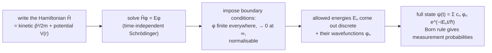

The [conceptual side of quantum mechanics](/citadel/physics/quantum) — duality, uncertainty, the probability interpretation — says what the theory claims about the world. This post is the apparatus that turns those claims into numbers.

The surprising thing about that apparatus is how little it contains. There is one equation, $\hat H\psi = E\psi$; you write down the energy operator for your system, impose the physical requirement that $\psi$ be finite and normalisable, and *that requirement alone* forces the energy to take discrete values. Quantisation is not an extra assumption bolted on, the way Bohr bolted it on — it falls out of demanding a sensible wave. This post covers the postulates, observables as Hermitian operators, the Schrödinger equation and where it comes from, and three problems solved end to end.

## The postulates

1. **State.** A system's state is fully described by a wave function $|\psi(t)\rangle$; it holds everything knowable about the system.
2. **Observables.** Each measurable quantity $A$ is represented by a Hermitian operator $\hat{A}$. The only possible measurement outcomes are its eigenvalues, $\hat{A}|a_n\rangle = a_n|a_n\rangle$.
3. **Born rule.** Measuring $A$ on $|\psi\rangle$ yields $a_n$ with probability $|\langle a_n|\psi\rangle|^2$. For position this is the familiar $P(x) = |\psi(x)|^2$.
4. **Collapse.** Immediately after a measurement returning $a_n$, the state is $|a_n\rangle$. Repeating the measurement gives $a_n$ again.
5. **Evolution.** Between measurements an isolated state evolves by the Schrödinger equation,
$$ i\hbar\,\frac{\partial}{\partial t}|\psi(t)\rangle = \hat{H}|\psi(t)\rangle $$
with $\hat{H}$ the Hamiltonian (total-energy) operator.

Postulate 3 combined with postulate 1 gives **superposition**: if $|\psi_1\rangle$ and $|\psi_2\rangle$ are allowed states, so is $c_1|\psi_1\rangle + c_2|\psi_2\rangle$, and the system carries all of its components until a measurement forces a choice — Schrödinger's cat.

## Operators and observables

An **operator** acts on a wave function to return information about an observable. The basic ones for a particle:
$$ \hat{x} = x \quad(\text{multiply by } x), \qquad \hat{p}_x = -i\hbar\,\frac{\partial}{\partial x}, \qquad \hat{H} = -\frac{\hbar^2}{2m}\nabla^2 + V(\vec{r},t) $$
the Hamiltonian being kinetic ($\hat{p}^2/2m$) plus potential.

Operators for real measurable quantities must be **Hermitian**, $\langle\phi|\hat{A}\psi\rangle = \langle\hat{A}\phi|\psi\rangle$, which guarantees real eigenvalues — measurements return real numbers. When $\hat{A}$ acts on one of its **eigenstates** it simply scales it,
$$ \hat{A}|\psi_a\rangle = a|\psi_a\rangle $$
and that eigenvalue $a$ is the value a measurement would return with certainty. A state that is not an eigenstate has no definite value of $A$, only a probability distribution over the eigenvalues.

## The Schrödinger equation

**Where it comes from.** Take a free-particle plane wave $\psi = A\,e^{i(kx - \omega t)}$ and the two quantum relations $E = \hbar\omega$, $p = \hbar k$. Differentiating,
$$ i\hbar\,\frac{\partial\psi}{\partial t} = \hbar\omega\,\psi = E\psi, \qquad -\hbar^2\,\frac{\partial^2\psi}{\partial x^2} = \hbar^2 k^2\,\psi = p^2\psi $$
Insert these into the non-relativistic energy relation $E = p^2/2m + V$ multiplied through by $\psi$:
$$ i\hbar\,\frac{\partial\psi}{\partial t} = -\frac{\hbar^2}{2m}\,\frac{\partial^2\psi}{\partial x^2} + V(x,t)\,\psi $$
which in three dimensions is the **time-dependent Schrödinger equation**
$$ i\hbar\,\frac{\partial\psi}{\partial t} = \left(-\frac{\hbar^2}{2m}\nabla^2 + V(\vec{r},t)\right)\psi $$
It is not derived from deeper laws — it is a postulate, justified by its results — but the plane-wave route shows it is the simplest wave equation consistent with $E = \hbar\omega$, $p = \hbar k$, and non-relativistic energy.

**Time-independent form.** If $V = V(\vec{r})$ has no explicit time dependence, separate $\psi(\vec{r},t) = \phi(\vec{r})\,f(t)$. The equation splits into a time part with solution $f(t) = e^{-iEt/\hbar}$ and a space part,
$$ \hat{H}\phi(\vec{r}) = E\phi(\vec{r}) \qquad\Longleftrightarrow\qquad -\frac{\hbar^2}{2m}\nabla^2\phi + V\phi = E\phi $$
the **time-independent Schrödinger equation**. Its solutions are the **stationary states**: fixed energy $E$, and a probability density $|\phi|^2$ that does not move (the time factor has modulus 1). Solving it for a given $V$ is the central computational task of the theory — it returns the allowed energies and their wave functions.

## Particle in a box

The simplest bound problem: a particle free inside $0 < x < L$ and walled in by $V = \infty$ outside. Inside, the equation is
$$ \frac{d^2\psi}{dx^2} + k^2\psi = 0, \qquad k^2 = \frac{2mE}{\hbar^2} $$
with general solution $\psi = A\sin kx + B\cos kx$. The wave function must vanish at the walls (it cannot penetrate an infinite potential):

- $\psi(0) = 0$ kills the cosine, $B = 0$.
- $\psi(L) = 0$ needs $\sin kL = 0$, so $kL = n\pi$ with $n = 1, 2, 3, \dots$ ($n = 0$ gives $\psi \equiv 0$, no particle).

So $k_n = n\pi/L$, and since $E = \hbar^2 k^2/2m$,
$$ E_n = \frac{n^2\pi^2\hbar^2}{2mL^2} $$
Energy is quantized purely by the boundary conditions — the same mathematics that gives a guitar string its harmonics, and indeed $\lambda_n = 2\pi/k_n = 2L/n$, an integer number of half-wavelengths across the box. Normalising,
$$ \int_0^L A^2\sin^2\!\frac{n\pi x}{L}\,dx = A^2\,\frac{L}{2} = 1 \quad\Longrightarrow\quad A = \sqrt{\frac{2}{L}} $$
$$ \psi_n(x) = \sqrt{\frac{2}{L}}\,\sin\frac{n\pi x}{L} $$
Note $E_1 > 0$: a confined quantum particle cannot be at rest, a direct consequence of the [uncertainty principle](/citadel/physics/quantum) — pinning it to width $L$ forces a minimum momentum spread.

## The harmonic oscillator

Any potential near a stable minimum is parabolic, $V(x) = \tfrac12 m\omega^2 x^2$ (the same [small-oscillation](/citadel/physics/oscillations) fact that makes classical SHM universal), so this is the second-most-used solved problem after the box. The time-independent equation

$$ -\frac{\hbar^2}{2m}\,\phi'' + \tfrac12 m\omega^2 x^2\,\phi = E\phi $$

has normalisable solutions only for the discrete energies

$$ E_n = \left(n + \tfrac12\right)\hbar\omega, \qquad n = 0, 1, 2, \dots $$

Three features carry over to the whole of physics. The levels are **evenly spaced** by $\hbar\omega$ — which is why a vibrational mode of frequency $\omega$ absorbs and emits light only in packets of that energy, and why Planck's quantised oscillators were right. The ground state has **zero-point energy** $\tfrac12\hbar\omega$, not zero — the oscillator can never stop, again from uncertainty. And the wavefunctions are a Gaussian times Hermite polynomials, $\phi_n(x) \propto H_n(x/x_0)\,e^{-x^2/2x_0^2}$ with $x_0 = \sqrt{\hbar/m\omega}$, with tails leaking into the classically forbidden region $|x| > \sqrt{2E_n/m\omega^2}$. Promote this oscillator's excitations to particles and you have a quantum field: each "quantum of the field" is one step up the ladder, which is how [quantum field theory](/citadel/physics/quantum-field-theory) counts photons and every other particle.

## The hydrogen atom

One electron in the proton's Coulomb well, $V(r) = -e^2/4\pi\epsilon_0 r$. The 3D time-independent equation in spherical coordinates separates into a radial and an angular factor:
$$ \psi_{n\ell m_\ell}(r,\theta,\varphi) = R_{n\ell}(r)\,Y_{\ell m_\ell}(\theta,\varphi) $$
The angular factors $Y_{\ell m_\ell}$ are the **spherical harmonics**, fixing the shape of the orbital. The radial factor is
$$ R_{n\ell}(r) = \sqrt{\left(\frac{2}{na_0}\right)^{3}\frac{(n-\ell-1)!}{2n\,[(n+\ell)!]^{3}}}\; e^{-r/na_0}\left(\frac{2r}{na_0}\right)^{\ell} L_{n-\ell-1}^{2\ell+1}\!\left(\frac{2r}{na_0}\right) $$
with $a_0$ the Bohr radius, an exponential envelope, and an associated Laguerre polynomial $L$. Requiring $R$ to be finite at the origin and to decay at infinity forces three integer **quantum numbers**:

- $n = 1, 2, 3, \dots$ — principal; sets the energy, $E_n = -13.6\ \text{eV}/n^2$, matching Bohr.
- $\ell = 0, 1, \dots, n-1$ — orbital angular momentum; the $s, p, d, f$ shells.
- $m_\ell = -\ell, \dots, 0, \dots, +\ell$ — its projection on a chosen axis.

Electron **spin** $m_s = \pm\tfrac{1}{2}$ is a fourth number, not from this equation but from relativistic quantum mechanics. The chance of finding the electron in a shell between $r$ and $r + dr$ is the **radial probability density**
$$ P(r)\,dr = r^2\,|R_{n\ell}(r)|^2\,dr $$
— the $r^2$ from the growing surface area of the shell, which is why the $1s$ maximum sits at $a_0$ rather than at $r = 0$ where $|R|^2$ is largest. This replaces Bohr's orbits with a stationary cloud, and the [Bohr model's hits and misses](/citadel/physics/atoms) are where the story starts.

## The one idea to keep

The formalism is five postulates and one equation. States are vectors $|\psi\rangle$; observables are Hermitian operators whose eigenvalues are the only possible measurement outcomes; the Born rule turns overlaps into probabilities; measurement collapses the state; and between measurements $\hat H$ drives the evolution. Quantisation is not put in by hand — solve $\hat H\phi = E\phi$ and demand a finite, normalisable $\phi$, and the discrete spectrum is forced. The box gives $E_n \propto n^2$, the oscillator gives evenly spaced $E_n = (n+\tfrac12)\hbar\omega$ with an irreducible zero-point energy, and the Coulomb well gives Bohr's levels plus the three quantum numbers $(n, \ell, m_\ell)$ that organise the periodic table.
