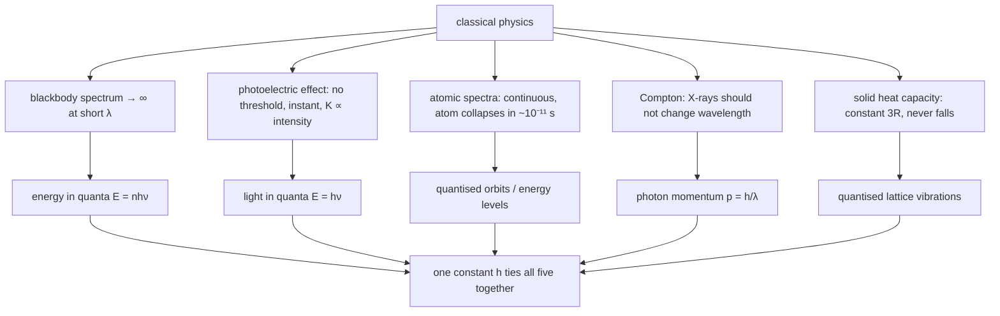

Classical mechanics describes falling apples and orbiting planets exactly. Point it at an atom and it fails outright — and not in one way that might be patched, but in **five separate measured phenomena**, each of which classical physics gets qualitatively wrong. What is striking is that the same fix works for all five: energy, and later momentum and angular momentum, come in discrete lumps set by one new constant of nature, $h \approx 6.6 \times 10^{-34}\ \text{J s}$.

The theory built on that says a particle is described by a complex wave whose square is a probability, that certain pairs of quantities can never both be sharp, and that two particles can share a single state across any distance. This post covers the conceptual core; the [computational machinery](/citadel/physics/quantum-formalism) — postulates, operators, the Schrödinger equation, and its worked solutions — is the companion post.

## Where classical physics breaks

**Blackbody radiation.** Classical statistical mechanics gives every electromagnetic mode $k_B T$ of energy, so a hot body should radiate infinite power at short wavelengths — the "ultraviolet catastrophe". Planck (1900) fixed it by allowing a mode of frequency $\nu$ to hold energy only in integer multiples of a quantum:
$$ E = nh\nu, \qquad h \approx 6.626\times10^{-34}\ \text{J s} $$
The exponential cost of populating high-frequency modes cuts the spectrum off, and the fitted constant $h$ launched the theory.

**Photoelectric effect.** Light on a metal ejects electrons, but only above a threshold frequency (regardless of intensity), with kinetic energy set by frequency not brightness, and with no time lag. Wave theory predicts none of that. Einstein (1905): light arrives in quanta of energy $h\nu$, one absorbed per electron, and
$$ K_{\max} = h\nu - \phi $$
where the **work function** $\phi$ is the binding energy holding the electron in the metal.

**Atomic spectra.** Excited gases emit only at discrete wavelengths, a fingerprint per element. A classical orbiting electron could have any energy — and, radiating, should spiral into the nucleus in nanoseconds. Bohr (1913) postulated stationary orbits at quantized energies, with photons emitted on jumps between them:
$$ E_n = -\frac{R_H Z^2}{n^2}, \qquad n = 1, 2, 3, \dots $$

**Compton effect.** X-rays scattered off electrons come out with *longer* wavelength, shifted by an angle-dependent amount. Treating the photon as a particle of momentum $p = h/\lambda$ in an elastic collision gives it exactly:
$$ \Delta\lambda = \frac{h}{m_e c}\,(1 - \cos\theta) $$

**Specific heat of solids.** Equipartition predicts a temperature-independent molar heat capacity $C_V = 3R$ (Dulong–Petit). Measured $C_V$ falls to zero as $T \to 0$. Quantizing the lattice vibrations as oscillators — Einstein (1907), then Debye (1912) — reproduces the falloff; the Debye model gives
$$ C_V = 9R\left(\frac{T}{\Theta_D}\right)^3 \int_0^{\Theta_D/T} \frac{x^4 e^x}{(e^x - 1)^2}\,dx $$
with $\Theta_D$ the material's Debye temperature.

## Matter waves

If light waves carry particle-like momentum, de Broglie (1924) argued, particles should carry a wavelength:
$$ \lambda = \frac{h}{p} = \frac{h}{mv} $$
For a baseball $\lambda$ is $\sim 10^{-34}$ m and irrelevant; for an electron it is comparable to atomic spacing, and electrons duly diffract off crystals (Davisson–Germer, 1927). It also explains Bohr's orbits: a stable orbit is one whose circumference holds a whole number of wavelengths, $2\pi r = n\lambda$, a standing wave that does not interfere itself away. For a non-relativistic particle of kinetic energy $E$, $p = \sqrt{2mE}$ and
$$ \lambda = \frac{h}{\sqrt{2mE}} $$

This **wave–particle duality** is not a statement that a thing is sometimes one and sometimes the other; it is one object whose wave and particle aspects show up in different measurements.

### A wave packet has two speeds

A localised particle is a **wave packet** — many plane waves of nearby wavelength added so they reinforce in one region and cancel elsewhere. Two velocities describe it.

The **phase velocity** is how fast a single crest moves:
$$ v_p = \frac{\omega}{k} = \frac{E}{p} $$
Non-relativistically, $E = p^2/2m$ gives $v_p = p/2m = v/2$ — half the particle's speed. Relativistically, $E = \gamma m_0 c^2$ and $p = \gamma m_0 v$ give
$$ v_p = \frac{E}{p} = \frac{c^2}{v} > c $$
faster than light. That is allowed only because a single infinite plane wave carries no information.

The **group velocity** is how fast the envelope — the actual lump of probability, energy, and information — moves:
$$ v_g = \frac{d\omega}{dk} = \frac{dE}{dp} $$
Non-relativistically $v_g = d(p^2/2m)/dp = p/m = v$. Relativistically, differentiating $E^2 = p^2c^2 + m_0^2c^4$ gives $v_g = pc^2/E = v$. Either way the packet travels at the particle's speed, always $\le c$, so nothing physical outruns light.

The two are linked by
$$ v_g = v_p - \lambda\,\frac{dv_p}{d\lambda} $$
In a **non-dispersive** medium $v_p$ is wavelength-independent and $v_g = v_p$; in **normal dispersion** ($v_p$ rising with $\lambda$, as for light in glass) $v_g < v_p$.

## The uncertainty principle

Heisenberg (1927): position and momentum along one axis cannot both be sharp. Their spreads obey
$$ \Delta x\,\Delta p_x \ge \frac{\hbar}{2}, \qquad \hbar = \frac{h}{2\pi} $$
This is not a limit of instruments — it follows from the packet picture, where a narrow spatial lump requires a broad spread of wavenumbers (a Fourier fact), and $p = \hbar k$.

**Derivation.** Shift coordinates so $\langle x\rangle = \langle p\rangle = 0$, and set $f = x\psi$, $g = \hat{p}\psi = -i\hbar\,\psi'$. Then $\Delta x^2 = \langle f|f\rangle$ and $\Delta p^2 = \langle g|g\rangle$. The Cauchy–Schwarz inequality gives
$$ \Delta x^2\,\Delta p^2 = \langle f|f\rangle\langle g|g\rangle \ge |\langle f|g\rangle|^2 \ge \left(\operatorname{Im}\langle f|g\rangle\right)^2 = \left(\frac{\langle f|g\rangle - \langle g|f\rangle}{2i}\right)^2 $$
The numerator is the expectation of the commutator:
$$ \langle f|g\rangle - \langle g|f\rangle = \int \psi^*\big[x(-i\hbar\partial_x) - (-i\hbar\partial_x)x\big]\psi\,dx = \int \psi^*\,(i\hbar)\,\psi\,dx = i\hbar $$
using $[\,x,\hat{p}\,] = i\hbar$ and normalisation. Hence $\Delta x^2\,\Delta p^2 \ge (i\hbar/2i)^2 = \hbar^2/4$. The same argument on any non-commuting pair gives a matching bound; for energy and time it reads $\Delta E\,\Delta t \ge \hbar/2$.

## The wave function

If a particle is a wave, what waves is the **wave function** $\psi(x,t)$, a complex-valued field. It is not a trajectory and does not say where the particle *is*. By Born's rule, its modulus squared is a probability density:
$$ P(x,t)\,dx = |\psi(x,t)|^2\,dx $$
the probability of finding the particle between $x$ and $x + dx$ on measurement. For that to be a probability, $\psi$ must be **normalised**:
$$ \int_{-\infty}^{\infty} |\psi(x,t)|^2\,dx = 1 $$
What $\psi$ *is* between measurements — and what "collapse" on measurement means — is still argued over (Copenhagen, many-worlds, and others). Its predictive record is not in dispute.

## Quantum tunnelling

A particle of energy $E$ meeting a barrier of height $U_0 > E$ is classically trapped: it must turn back. Quantum-mechanically its wave function does not stop at the wall — inside the barrier it decays exponentially rather than oscillating, and if the barrier is thin enough, a non-zero amplitude emerges on the far side. Splitting space into before ($k_1 = \sqrt{2mE}/\hbar$), inside ($K = \sqrt{2m(U_0 - E)}/\hbar$), and after, and matching $\psi$ and $\psi'$ at both walls, the transmission probability for a barrier of width $d$ with $Kd \gg 1$ is
$$ T \approx G\,e^{-2Kd}, \qquad G = 16\,\frac{E}{U_0}\!\left(1 - \frac{E}{U_0}\right) $$
Exponentially small, but decisive:

- **Stellar fusion** — protons in the Sun's core tunnel through their mutual Coulomb repulsion; without tunnelling the core is far too cool to fuse.
- **Alpha decay** — an alpha particle tunnels out through the nuclear potential barrier, and the barrier thickness sets [half-lives](/citadel/physics/nuclear-physics) spanning twenty orders of magnitude.
- **Scanning tunnelling microscopy** — the tunnelling current between a tip and a surface varies so steeply with gap that single atoms are resolved.

## Entanglement

Two particles are **entangled** when their joint state cannot be written as one state for each — the wave function does not factor. A standard two-qubit example is
$$ |\Psi\rangle = \frac{1}{\sqrt{2}}\big(|0\rangle_A|1\rangle_B - |1\rangle_A|0\rangle_B\big) $$
Neither qubit has a definite value, but the two are perfectly anti-correlated: measure $A$ and get $|0\rangle$, and $B$ is instantly $|1\rangle$, at any separation. No signal passes — the outcome of $A$'s measurement is random, so nothing is transmitted by choosing to measure it — but the correlations are stronger than any pre-arranged classical values allow, which is what Bell-inequality experiments have confirmed repeatedly. Einstein's "spooky action at a distance" is now the working resource of quantum computing, cryptography, and teleportation.

## The one idea to keep

Five independent experiments broke classical physics, and one idea repaired all of them: physical quantities that classical theory let vary continuously actually come in discrete units set by $h$. Build on that and a particle becomes a complex wave $\psi$ whose $|\psi|^2$ is a probability, obeying a Fourier trade-off — $\Delta x\,\Delta p \ge \hbar/2$ — that is a theorem about wave packets, not a limit of instruments. The wave has amplitude where classical mechanics forbids it (tunnelling, which lights the Sun) and can be shared, unfactored, between distant particles (entanglement). What $\psi$ *is* between measurements remains contested; what it predicts has never failed a test.
