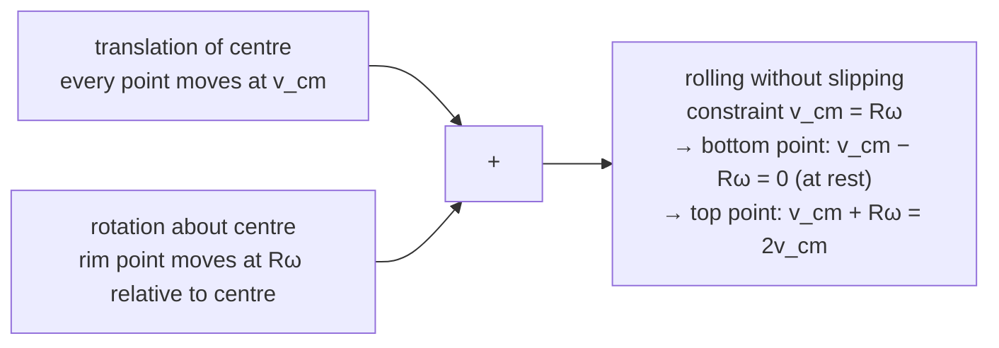
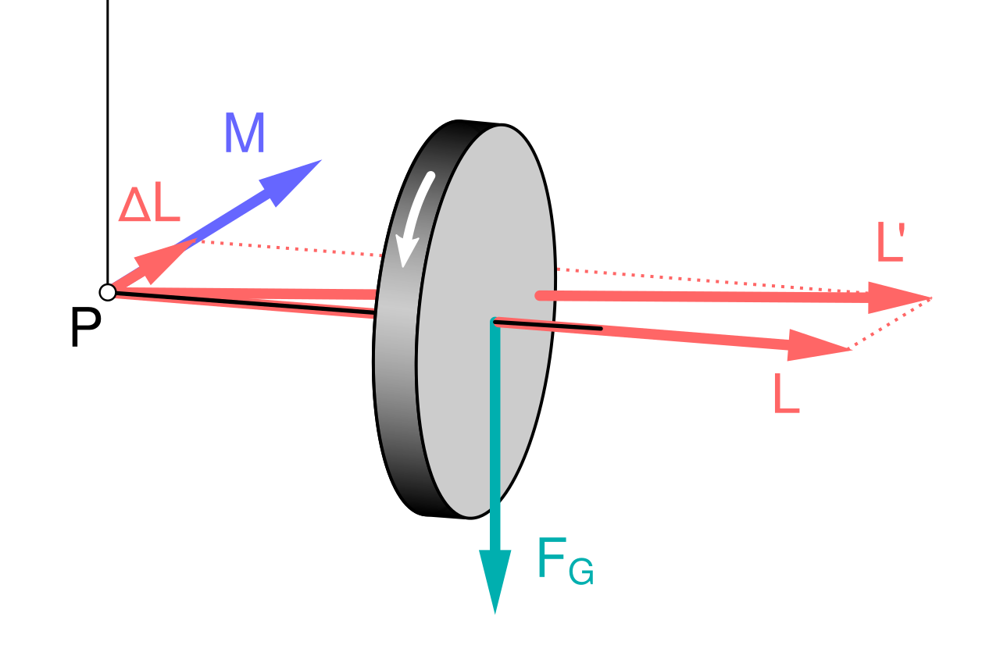

Here is a fact that should be more unsettling than it usually seems: an ice skater, arms out, spinning slowly, pulls her arms in and speeds up — a lot, maybe threefold — without pushing off anything. No torque, no floor contact that could spin her up, and yet her rotation rate jumps. Where did the extra spin come from?

It came from the *same* conserved quantity that was there all along, redistributed. That is the theme of rotational dynamics, and it is [Newtonian dynamics](/citadel/physics/newtonian-dynamics) with every quantity swapped for its angular counterpart. Because the equations keep the same shape — $\vec{\tau} = I\vec{\alpha}$ mirrors $\vec{F} = m\vec{a}$ line for line — much of the work is learning the dictionary. But two things are genuinely new. **Rotational inertia is not a fixed number:** the same rod resists being spun about its middle four times less than about its end, because what resists angular acceleration is *where* the mass sits, not how much there is. And **angular momentum points somewhere** — it is a vector along the spin axis — so changing a spinning object's orientation takes a sideways push, which is why a gyroscope does not fall over. The skater, the rolling race, and the wobbling top below are all consequences.

## The linear–rotational dictionary

| Linear | Rotational |
| :-- | :-- |
| displacement $x$, velocity $v$, acceleration $a$ | angle $\theta$, angular velocity $\omega$, angular acceleration $\alpha$ |
| mass $m$ | moment of inertia $I = \sum m_i r_i^2$ |
| force $\vec{F}$ | torque $\vec{\tau}$ |
| $\vec{F} = m\vec{a} = d\vec{p}/dt$ | $\vec{\tau} = I\vec{\alpha} = d\vec{L}/dt$ |
| momentum $\vec{p} = m\vec{v}$ | angular momentum $\vec{L} = I\vec{\omega}$ (rigid body), $\vec{r}\times\vec{p}$ (particle) |
| work $\int \vec{F}\cdot d\vec{x}$ | work $\int \vec{\tau}\cdot d\vec{\theta}$ |
| $KE = \tfrac{1}{2}mv^2$ | $KE = \tfrac{1}{2}I\omega^2$ |

## Circular motion

Take a particle on a circle of fixed radius $r$ at angle $\theta(t)$, with $\dot\theta = \omega$, $\ddot\theta = \alpha$. Even at constant speed the velocity vector turns, so there is always an acceleration; differentiate the position in rotating unit vectors to see its structure:
$$ \vec{e}_r = \cos\theta\,\hat{i} + \sin\theta\,\hat{j}, \qquad \vec{e}_t = -\sin\theta\,\hat{i} + \cos\theta\,\hat{j} $$
These rotate into each other: $d\vec{e}_r/dt = \omega\,\vec{e}_t$ and $d\vec{e}_t/dt = -\omega\,\vec{e}_r$. The position is $\vec{r}_{\text{pos}} = r\,\vec{e}_r$, so
$$ \vec{v} = \frac{d}{dt}\big(r\,\vec{e}_r\big) = r\omega\,\vec{e}_t $$
$$ \vec{a} = \frac{d}{dt}\big(r\omega\,\vec{e}_t\big) = r\alpha\,\vec{e}_t + r\omega\,(-\omega\,\vec{e}_r) = r\alpha\,\vec{e}_t \;-\; r\omega^2\,\vec{e}_r $$

The acceleration splits into two perpendicular pieces:

- **Tangential**, $a_t = r\alpha$, lies along the velocity and changes the *speed*. It vanishes whenever $\omega$ is constant (uniform circular motion).
- **Radial (centripetal)**, $a_r = r\omega^2 = v^2/r$, points at the centre and changes the velocity's *direction*, bending the path into a circle.

Their combined magnitude is
$$ a_{\text{net}} = \sqrt{(r\alpha)^2 + (r\omega^2)^2} = r\sqrt{\alpha^2 + \omega^4} $$

Whatever real force supplies the inward $a_r$ — tension, gravity, friction, a normal force, or a mix — is the **centripetal force** in that role:
$$ F_c = m a_r = mr\omega^2 = \frac{mv^2}{r} $$
It is the net of the forces already present, resolved toward the centre, not an extra entry in the free-body diagram.

### Vertical circle

Whirl a mass on a string in a vertical circle; gravity helps or fights the tension depending on position. Measure $\theta$ from the downward vertical ($\theta = 0$ at the bottom). Resolving along the string toward the centre,
$$ T - mg\cos\theta = \frac{mv^2}{r} \implies T = m\left(\frac{v^2}{r} + g\cos\theta\right) $$
At the bottom ($\cos\theta = 1$) gravity pulls *away* from the centre, so the string carries the centripetal load plus the weight; at the top ($\cos\theta = -1$) gravity points inward and does part of the job.

**Minimum speed at the top.** A string pulls but cannot push, so $T \ge 0$; the limiting case $T = 0$ has gravity alone supplying the centripetal force:
$$ mg = \frac{mv_{\text{top}}^2}{r} \implies v_{\text{top,min}} = \sqrt{rg} $$
Any slower and the mass leaves the circular path before reaching the top.

**Minimum speed at the bottom.** Energy conservation between the bottom and the top, a height $2r$ higher:
$$ \tfrac{1}{2}mv_{\text{bottom}}^2 = \tfrac{1}{2}m v_{\text{top,min}}^2 + mg(2r) = \tfrac{1}{2}m(rg) + 2mgr = \tfrac{5}{2}mgr $$
$$ v_{\text{bottom,min}} = \sqrt{5rg} $$

## Moment of inertia

For linear motion, $m$ is the whole story of inertia. For rotation, the analogous quantity is
$$ I = \sum_i m_i r_i^2 \quad\longrightarrow\quad I = \int r^2\,dm $$
where $r$ is each mass element's perpendicular distance from the axis (units kg·m²). The $r^2$ weighting is the crux: mass twice as far out contributes four times as much — why a skater's outstretched arms outweigh their core, and why flywheels put their mass in the rim.

**Standard bodies**, each about the stated axis, with the one-line derivation:

- **Hoop / ring**, axis through the centre ⊥ to its plane: every mass element sits at $r = R$, so $I = \int R^2\,dm = MR^2$.
- **Disk / solid cylinder**, same axis: with surface density $\sigma = M/\pi R^2$ and thin rings $dm = \sigma\,(2\pi r)\,dr$,
$$ I = \int_0^R r^2\,\sigma\,(2\pi r)\,dr = 2\pi\sigma\,\frac{R^4}{4} = \tfrac{1}{2}MR^2 $$
- **Thin spherical shell**, axis through the centre: in spherical coordinates $dm = \sigma R^2\sin\phi\,d\phi\,d\theta$ and the distance from the axis is $R\sin\phi$, so $I = \int (R\sin\phi)^2\,dm = \tfrac{2}{3}MR^2$.
- **Solid sphere**, axis through the centre: stack shells, $dI = \tfrac{2}{3}r^2\,dm$ with $dm = 4\pi r^2\rho\,dr$, and integrate from $0$ to $R$ to get $\tfrac{2}{5}MR^2$.
- **Solid cone**, axis along its height through the base centre: stack disks whose radius grows linearly with height; the integral gives $\tfrac{3}{10}MR^2$.
- **Thin rod**, axis ⊥ through the centre: with $dm = (M/L)\,dx$,
$$ I = \int_{-L/2}^{L/2} x^2\,\frac{M}{L}\,dx = \frac{M}{L}\cdot\frac{L^3}{12} = \tfrac{1}{12}ML^2 $$
About the *end* instead, the same integral from $0$ to $L$ gives $\tfrac{1}{3}ML^2$ — four times larger, the price of moving the axis to where none of the mass is nearby.

**Radius of gyration** $k$ collapses the mass distribution to one number: the radius at which a point mass $M$ would have the same $I$,
$$ I = Mk^2 \implies k = \sqrt{I/M} $$

**Two theorems save most of the integration:**

- **Parallel axis theorem.** If $I_{\text{cm}}$ is known about an axis through the centre of mass, then about any parallel axis a distance $d$ away,
$$ I = I_{\text{cm}} + Md^2 $$
- **Perpendicular axis theorem** (flat bodies only). For a lamina in the $xy$-plane, with axes meeting at one point,
$$ I_z = I_x + I_y $$

## Centre of mass and centre of gravity

**Centre of mass** is the mass-weighted average position:
$$ \vec{R}_{\text{cm}} = \frac{1}{M}\sum_i m_i\vec{r}_i \quad\longrightarrow\quad \frac{1}{M}\int \vec{r}\,dm $$
Its use: the centre of mass moves exactly as if all the mass sat there and every external force acted there, however complicated the internal motion.

**Centre of gravity** is the point where the total weight can be taken to act — defined so the gravitational torque about it is zero:
$$ \vec{R}_{\text{cg}} = \frac{\sum_i m_i\,\vec{g}_i\,\vec{r}_i}{\sum_i m_i\,\vec{g}_i} $$
In a uniform field $\vec{g}_i$ is the same everywhere and this reduces to $\vec{R}_{\text{cm}}$; the two points separate only when $g$ varies noticeably across the body — tall structures, or a strong tidal field.

## Angular kinematics

For constant $\alpha$, the three equations are the linear ones with symbols swapped, derived the same way (integrate $\alpha = d\omega/dt$):
$$ \omega = \omega_i + \alpha t, \qquad \theta = \omega_i t + \tfrac{1}{2}\alpha t^2, \qquad \omega_f^2 = \omega_i^2 + 2\alpha\theta $$

## Rolling

Rolling is rotation about the centre of mass plus translation of the centre of mass, locked together. **Rolling without slipping** means the contact point is instantaneously at rest relative to the ground, which forces
$$ v_{\text{cm}} = R\omega $$
and, differentiating, $a_{\text{cm}} = R\alpha$.

**Path of a point on the rim.** With the wheel rolling along $x$ and the marked point starting at the origin, it traces a **cycloid**:
$$ x(t) = R(\omega t - \sin\omega t), \qquad y(t) = R(1 - \cos\omega t) $$
Its velocity is
$$ \vec{v}_{\text{point}} = R\omega(1 - \cos\omega t)\,\hat{i} + R\omega\sin\omega t\,\hat{j} $$
with magnitude
$$ v_{\text{point}} = R\omega\sqrt{(1-\cos\omega t)^2 + \sin^2\omega t} = R\omega\sqrt{2(1 - \cos\omega t)} = 2R\omega\left|\sin\tfrac{\omega t}{2}\right| $$
using $1 - \cos\omega t = 2\sin^2(\omega t/2)$. The point is momentarily *stationary* at the bottom of each turn and moves at $2R\omega$ — twice the hub speed — at the top. Integrating speed over one revolution:
$$ S = \int_0^{2\pi/\omega} 2R\omega\sin\tfrac{\omega t}{2}\,dt = 4R\left[1 - \cos\tfrac{\omega t}{2}\right]_0^{2\pi/\omega} = 8R $$
The rim point travels eight radii while the hub advances only $2\pi R \approx 6.28R$.

**Kinetic energy** of a rolling body is translational plus rotational:
$$ KE = \tfrac{1}{2}Mv_{\text{cm}}^2 + \tfrac{1}{2}I_{\text{cm}}\omega^2 = \tfrac{1}{2}\big(MR^2 + I_{\text{cm}}\big)\omega^2 = \tfrac{1}{2}I_{\text{contact}}\,\omega^2 $$
the last step using the parallel axis theorem, $I_{\text{contact}} = I_{\text{cm}} + MR^2$. Equivalently, rolling is pure rotation about the instantaneous contact point.

**Angular momentum** about the contact point is spin plus the centre-of-mass orbital term:
$$ L_{\text{contact}} = I_{\text{cm}}\omega + MRv_{\text{cm}} = (I_{\text{cm}} + MR^2)\omega = I_{\text{contact}}\,\omega $$

### Sliding versus rolling friction

Kinetic friction while *sliding* is $f_k = \mu_k N$, opposing the slide. Rolling friction — from body and surface deforming at the contact — is much smaller and usually dropped. What matters for rolling *without slipping* is **static** friction: it supplies the torque that angularly accelerates the body, adjusting itself up to $f_{s,\max} = \mu_s N$ to keep $a_{\text{cm}} = R\alpha$.

For a round body released down an incline of angle $\theta$, combine $Mg\sin\theta - f_s = Ma_{\text{cm}}$, the torque equation $f_s R = I_{\text{cm}}\alpha$, and $a_{\text{cm}} = R\alpha$:
$$ a_{\text{cm}} = \frac{g\sin\theta}{1 + I_{\text{cm}}/(MR^2)} $$
The bracketed factor is $1$ for a hoop, $\tfrac{1}{2}$ for a disk, $\tfrac{2}{5}$ for a solid sphere — so released together the sphere wins and the hoop trails, independent of mass and radius, because the hoop keeps the largest energy fraction in rotation. It stays a pure roll while the required $f_s < \mu_s N$; past that angle it slips.

## Torque

Torque is the rotational counterpart of force: the turning effect of a force applied off-axis.
$$ \vec{\tau} = \vec{r} \times \vec{F}, \qquad |\vec{\tau}| = rF\sin\theta $$
Here $\vec{r}$ runs from the axis to the force's point of application and $\theta$ is the angle between $\vec{r}$ and $\vec{F}$. The **lever arm** $r\sin\theta$ is the perpendicular distance from the axis to the force's line of action — why pushing a door near its hinge does little, and a longer wrench frees a tighter bolt.

## Equilibrium of a rigid body

A rigid body stays unaccelerated in both translation and rotation only when both nets vanish:
$$ \sum \vec{F}_{\text{ext}} = 0 \qquad\text{and}\qquad \sum \vec{\tau}_{\text{ext}} = 0 $$
giving $\vec{a}_{\text{cm}} = 0$ and $\vec{\alpha} = 0$. Once the force condition holds, the torque sum is the same about *every* axis, so take torques about whichever point kills the most unknowns — usually a support or a hinge.

## Angular momentum and its conservation

For a particle, $\vec{L} = \vec{r} \times \vec{p} = \vec{r} \times m\vec{v}$. For a rigid body spinning about a symmetry axis, $\vec{L} = I\vec{\omega}$.

Because $\vec{\tau} = d\vec{L}/dt$, a system with **no net external torque** keeps its angular momentum fixed:
$$ \sum \vec{\tau}_{\text{ext}} = 0 \implies \vec{L}_{\text{initial}} = \vec{L}_{\text{final}} $$
A skater pulling her arms in cuts $I$, so $\omega$ rises to hold $I\omega$ fixed; a diver tucks to spin faster; a neutron star from a collapsed core spins hundreds of times a second because a slow rotation was concentrated into a tiny radius. It is also Kepler's equal-areas law — a planet feels no torque about the Sun (see [orbital mechanics](/citadel/physics/astrodynamics)).

## Rotational kinetic energy, work, and power

A spinning body carries $KE_{\text{rot}} = \tfrac{1}{2}I\omega^2$, parallel to $\tfrac{1}{2}mv^2$; one that translates and rotates carries the sum. A torque through an angular displacement does work and delivers power,
$$ W = \int \tau\,d\theta \;\;(=\tau\theta \text{ for constant } \tau), \qquad P = \tau\omega $$
the analogues of $W = \int F\,dx$, $P = Fv$. The work–energy theorem and energy conservation carry over unchanged.

## Gyroscopic precession

Balance a spinning bicycle wheel on a pivot at one end of its axle. It does not topple. Instead the axle swings slowly around horizontally — it **precesses** — and the reason is the vector nature of $\vec L$.

Gravity exerts a torque $\vec\tau = \vec r \times m\vec g$ about the pivot, of magnitude $\tau = mgr$, pointing *horizontally* and perpendicular to the axle. Since $\vec\tau = d\vec L/dt$, in a time $dt$ the angular momentum changes by $d\vec L = \vec\tau\,dt$ — a small horizontal vector at right angles to $\vec L$. That does not lengthen $\vec L$ (which would speed the spin) or lift it (which would be toppling); it swings $\vec L$ sideways. The axle chases its own angular momentum around a circle.

The **precession rate** follows from the geometry: in time $dt$, $\vec L$ (magnitude $L = I\omega$) sweeps through angle $d\phi = |d\vec L|/L = \tau\,dt / (I\omega)$, so

$$ \Omega_{\text{prec}} = \frac{d\phi}{dt} = \frac{\tau}{I\omega} = \frac{mgr}{I\omega} $$

Faster spin means *slower* precession — a rapidly spinning top stands nearly upright and precesses lazily; as friction bleeds off $\omega$, the precession quickens and the top starts to nod (**nutation**) and finally falls. The same physics holds a gyrocompass on its axis, makes a football thrown with spin hold its nose forward, and drives the 26,000-year precession of Earth's own axis under the Sun's and Moon's tidal torque on its equatorial bulge.

## Where rigid-body rotation gets strange

The clean formula $\vec L = I\vec\omega$ holds only when the object spins about a **principal axis** — an axis of symmetry. Off a principal axis, $\vec L$ and $\vec\omega$ are not parallel: $I$ is really a tensor, and the spin axis and the angular-momentum axis point different ways. Consequences:

- **Wobble.** An unbalanced wheel or an off-axis-spun object has $\vec L$ fixed (no torque) but $\vec\omega$ tracing a cone — the axle wobbles, hammering its bearings. Balancing a wheel means shifting mass until a spin axis becomes a principal axis.
- **The intermediate-axis theorem.** A rigid body has three principal axes with three moments of inertia. Spin about the largest or smallest and the motion is stable; spin about the *middle* one and it is not — the object periodically flips end over end. Toss a phone or a tennis racket spinning about its intermediate axis and watch it tumble. Astronauts have filmed it with a wing nut on the ISS (the "Dzhanibekov effect").
- **Rolling breaks down** when the required static friction $f_s = I_{\text{cm}}\,a_{\text{cm}}/R^2$ exceeds $\mu_s N$ — on a steep enough incline or under hard enough braking the wheel slips and skids.

## The one idea to keep

Every linear law has a rotational twin obtained by the swap $m \to I$, $\vec F \to \vec\tau$, $\vec p \to \vec L$ — so equilibrium, the work–energy theorem, and conservation all carry straight over. The two things with no linear analogue are that $I$ depends on the axis (mass far from the axis costs $r^2$), and that $\vec L$ is a *direction*: torque perpendicular to it turns it rather than growing it, which is why the skater speeds up, the sphere beats the hoop downhill, and the spinning top refuses to fall.
