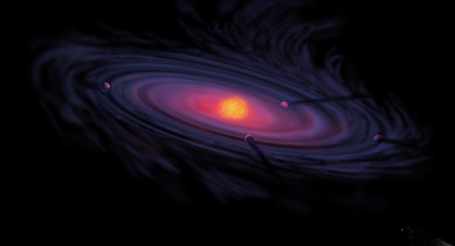

The Solar System has a striking split: four small rocky planets crowded near the Sun, four giants far out, and almost nothing in between. That is not an accident of where material happened to land — it is the signature of a single temperature boundary in the disk the planets grew from, the **frost line**, inside which only rock and metal could condense (a few tenths of a per cent of the available mass) and outside which ice was abundant enough to build cores massive enough to seize hydrogen from the nebula before it blew away.

[Stars](/citadel/physics/stellar-astrophysics) form with disks of leftover material around them, and those disks make planets. This post is the Solar System as a worked example: how it condensed from a cloud, how dust grew into worlds, why that rocky/giant split exists, how the early system rearranged itself, and where Earth sits in the larger structure.

## From cloud to disk

The Solar System formed about **4.6 billion years ago** from the gravitational collapse of a fragment of a cold, dense molecular cloud — the presolar nebula — probably triggered by a nearby supernova shockwave or a passing star. The Sun likely formed in a cluster of thousands of stars that has since dispersed.

As the fragment collapsed it spun faster, by [conservation of angular momentum](/citadel/physics/rotations), and gravity plus rotation flattened it into a **protoplanetary disk** — perhaps 200 AU across — with a growing protostar at the centre. After about 100,000 years of contraction the core reached fusion temperature and the Sun switched on.

## Accretion: dust to planets

The planets, asteroids, and comets all grew from the disk material by **accretion**:

1. **Dust to pebbles** — grains stick together electrostatically into clumps, then pebble-sized aggregates.
2. **Pebbles to planetesimals** — collisions build kilometre-sized bodies, large enough for their own gravity to matter.
3. **Planetesimals to protoplanets** — gravity drives mergers; the largest bodies grow fastest, sweeping up the rest, reaching Moon-to-Mars size.
4. **Protoplanets to planets** — a final ~$10$–$100$ Myr of giant impacts between protoplanets sculpts the planets we have.

## The frost line

The disk was hot near the Sun and cold far out. The **frost line**, between the present orbits of Mars and Jupiter, marks where it was cool enough for water, ammonia, and methane to freeze:

- **Inside the frost line** — only rock and metal could condense, and those made up only ~0.6% of the nebula's mass, so the inner bodies stayed small: the rocky **terrestrial planets** Mercury, Venus, Earth, Mars.
- **Outside the frost line** — abundant ice let protoplanets grow large and fast. Jupiter and Saturn grew massive enough to capture huge hydrogen–helium atmospheres from the nebula (**gas giants**); Uranus and Neptune formed later and further out, after most gas was gone, so they are ice-rich with thinner envelopes (**ice giants**).

Jupiter's gravity stirred the planetesimals between Mars and Jupiter so violently that no planet could form there — the **asteroid belt**. After a few to ten million years, the young Sun's wind and radiation swept the remaining gas and dust away, ending planet growth.

## A turbulent youth

- **Planetary migration.** The giant planets probably did not form in their present orbits; interaction with the gas disk and with each other moved them substantially. The **Nice model** proposes a resonance crossing that scattered them outward and flung small bodies everywhere.
- **Late Heavy Bombardment.** Around 4.1–3.8 billion years ago the inner Solar System was pounded by asteroids and comets, likely a consequence of that giant-planet migration. The Moon's saturated cratering records it.
- **The Moon.** The **giant-impact hypothesis**: a Mars-sized protoplanet, **Theia**, struck the early Earth; the debris ejected into orbit coalesced into the Moon. This accounts for the Moon's Earth-like composition and its small iron core.

## Earth's cosmic address

| Scale | Size | What it is |
|---|---|---|
| Earth | 12,742 km | third planet from the Sun |
| Solar System | ~40 AU to Neptune | Sun, planets, moons, small bodies; heliosphere far beyond |
| Local Interstellar Cloud | ~30 ly | the gas cloud the Sun is currently passing through |
| Local Bubble | 300–800 ly | a hot, low-density cavity carved by ancient supernovae |
| Gould Belt | ~3,000 ly | a tilted ring of young massive stars; the Sun sits near its edge |
| Orion Arm | ~10,000 ly long | the minor spiral arm we live in |
| Milky Way | ~100,000 ly | barred spiral, 100–400 billion stars; the Sun is ~27,000 ly from Sagittarius A\* |
| Local Group | ~10 Mly | 80+ galaxies, dominated by the Milky Way and Andromeda (on a collision course) |
| Virgo Supercluster | ~110 Mly | thousands of galaxies; the Local Group is on its outskirts |
| Laniakea Supercluster | ~520 Mly | defined by galaxy flows toward the Great Attractor; contains Virgo |
| Observable universe | ~93 Gly across | everything whose light has had time to reach us |
| Universe | possibly infinite | the observable part is only what we can see |

## The one idea to keep

The Solar System is a collapsed, spun-up, flattened fragment of a molecular cloud: angular-momentum conservation turned the cloud into a disk, and the disk turned dust into planets through hierarchical accretion (grains → pebbles → planetesimals → protoplanets → planets). The one temperature boundary in that disk, the frost line, explains the system's basic architecture — small rocky worlds inside it, ice-cored giants outside — and the leftovers (the asteroid belt stirred by Jupiter, the comets flung outward) plus a few catastrophes (the Moon-forming impact, the Late Heavy Bombardment) fill in the rest. Earth sits on the third orbit of one ordinary star, itself far out on one arm of one galaxy in a supercluster of many.
