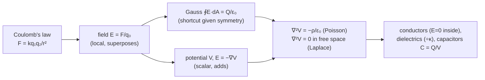
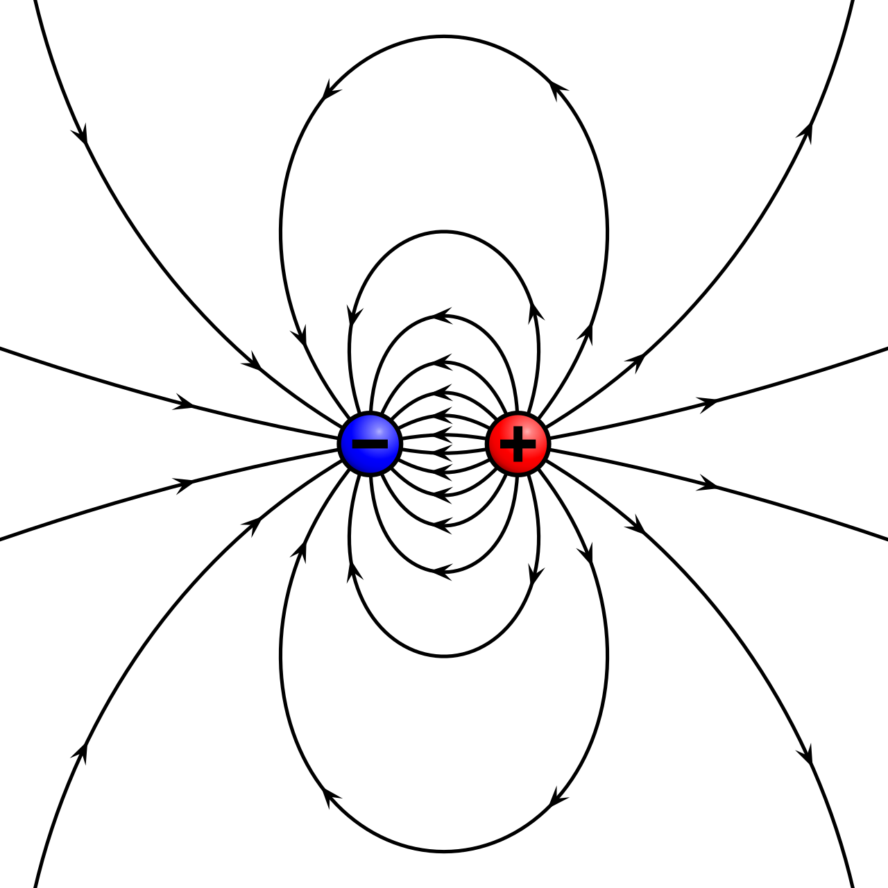

The shock off a doorknob, hair lifting under a comb, a lightning stroke — all of it is stationary or slowly moving charge and the forces it exerts. The whole of electrostatics unrolls from a single experimental fact, Coulomb's inverse-square law between two point charges, by a sequence of re-packagings: the **field** replaces action-at-a-distance with something local; the scalar **potential** replaces a vector field with a single number you can add; **Gauss's law** turns a hard integral into a one-line answer wherever there is symmetry. Along the way the field stops being a bookkeeping fiction — it holds energy at density $\tfrac12\epsilon_0 E^2$, and once it varies in time it carries that energy off as radiation. This post runs that chain from Coulomb's law up to the capacitor and the RC time constant. Set the charges moving and you get [current and circuits](/citadel/physics/current); let the fields vary in time and you get [electromagnetism](/citadel/physics/electromag).

## Electric charge

Charge is a property of matter, like mass, but it comes in two signs. **Like charges repel, opposite charges attract.** Three more facts pin it down:

- **Quantization.** Free charge comes in integer multiples of the elementary charge $e \approx 1.602 \times 10^{-19}\ \text{C}$, carried by one proton ($+$) or electron ($-$) — Millikan's oil-drop experiment, 1909. No free half-$e$ is seen (quarks carry $\pm e/3$, $\pm 2e/3$ but are never isolated).
- **Conservation.** The net charge of an isolated system never changes. You can separate $+$ from $-$ or move charge between bodies, but the total is fixed.
- **Mobility.** In **conductors** (metals) some electrons roam freely; in **insulators** (glass, dry air, rubber) every electron is bound to its atom; **semiconductors** (silicon, germanium) sit between, their conductivity tunable by doping or an applied field — the basis of all electronics.

An object gains net charge three ways. **Friction** (the triboelectric effect) transfers electrons between two unlike materials in contact — one ends up positive, the other negative. **Conduction** shares charge when a charged body touches a conductor. **Induction** charges a conductor without contact: hold a positive rod near a neutral sphere so its electrons crowd toward the rod, briefly ground the far side to drain the repelled positive charge, then remove the ground and the rod — the sphere keeps a net negative charge.

## Coulomb's law

The force between two point charges, measured by Coulomb in the 1780s, is proportional to each charge and falls as the inverse square of the separation:
$$ F = k\,\frac{|q_1 q_2|}{r^2}, \qquad k = \frac{1}{4\pi\epsilon_0} \approx 8.988 \times 10^{9}\ \text{N}\,\text{m}^2/\text{C}^2 $$
with $\epsilon_0 \approx 8.854 \times 10^{-12}\ \text{C}^2/(\text{N}\,\text{m}^2)$ the permittivity of free space. In vector form, the force on $q_2$ from $q_1$ is
$$ \vec{F}_{12} = \frac{1}{4\pi\epsilon_0}\,\frac{q_1 q_2}{|\vec{r}_2 - \vec{r}_1|^3}\,(\vec{r}_2 - \vec{r}_1) $$
directed along the line joining them: away for like charges ($q_1 q_2 > 0$), toward for unlike. Same inverse-square form as [Newton's gravitation](/citadel/physics/gravitation), but $\sim 10^{36}$ times stronger between two protons — and it comes in both signs.

**Superposition** does the rest: the force on one charge from many is the vector sum of the separate pair forces, each computed as if the others were absent. For a continuous distribution, split into elements $dq$ and integrate.

## The electric field

Rather than have charges reach across space, say each charge fills the space around it with a **field** that pushes on any charge placed in it. The electric field is the force per unit positive test charge:
$$ \vec{E} = \frac{\vec{F}}{q_0} \qquad [\text{N/C} = \text{V/m}] $$
For a point charge $q$, Coulomb's law gives
$$ \vec{E}(\vec{r}) = \frac{1}{4\pi\epsilon_0}\,\frac{q}{|\vec{r} - \vec{r}_0|^3}\,(\vec{r} - \vec{r}_0), \qquad E = \frac{k|q|}{r^2} $$
pointing away from a positive source, toward a negative one. Fields superpose like forces, $\vec{E}_{\text{total}} = \sum_i \vec{E}_i$, and for spread-out charge you integrate the contributions
$$ d\vec{E} = \frac{1}{4\pi\epsilon_0}\,\frac{dq}{r^2}\,\hat{r} $$
using linear, surface, or volume charge density $\lambda = dq/dl$, $\sigma = dq/dA$, $\rho = dq/dV$ as the geometry demands.

**Field lines** make it visual: the tangent gives $\vec{E}$'s direction; lines start on positive and end on negative charge (or run to infinity); their density tracks field strength; they never cross, since that would give $\vec{E}$ two directions at a point.

## Electric flux and Gauss's law

**Electric flux** through a surface counts the field lines crossing it. For a uniform field through a flat patch, $\Phi_E = \vec{E}\cdot\vec{A} = EA\cos\theta$; in general,
$$ \Phi_E = \int_S \vec{E}\cdot d\vec{A} $$
**Gauss's law** — one of Maxwell's four equations — says the flux through any *closed* surface depends only on the charge it encloses:
$$ \oint_S \vec{E}\cdot d\vec{A} = \frac{Q_{\text{enc}}}{\epsilon_0} $$
Charge *outside* the surface drops out because each of its field lines that enters also leaves, contributing equal and opposite flux; only lines starting or stopping on enclosed charge give a net count. Gauss's law holds for any surface, but it becomes a *calculation* only with enough symmetry — spherical, cylindrical, or planar — that $\vec{E}$ is constant and either parallel or perpendicular to a well-chosen surface, coming straight out of the integral. That gives the field of a charged sphere, an infinite line ($E = \lambda/2\pi\epsilon_0 r$), and an infinite sheet ($E = \sigma/2\epsilon_0$) in a line or two each.

## Electric potential

Moving a charge through a field takes work, so it has potential energy. The **electric potential** is that energy per unit charge — a scalar, in volts ($1\ \text{V} = 1\ \text{J/C}$):
$$ V = \frac{U}{q_0} $$
For a point charge, with $V \to 0$ at infinity,
$$ V = \frac{1}{4\pi\epsilon_0}\,\frac{q}{r}, \qquad V = \frac{1}{4\pi\epsilon_0}\int\frac{dq}{r}\ \text{(continuous)} $$
Field and potential are two views of the same thing; $\vec{E}$ points down the steepest potential drop:
$$ \vec{E} = -\nabla V, \qquad V_B - V_A = -\int_A^B \vec{E}\cdot d\vec{l} $$
On an **equipotential surface** $V$ is constant, so moving a charge along it costs no work and field lines cross it at right angles — the electrostatic version of a contour map.

## Potential energy of a charge system

The potential energy of a set of charges is the work to assemble them from infinity. For two,
$$ U = \frac{1}{4\pi\epsilon_0}\,\frac{q_1 q_2}{r} $$
positive if they share a sign, negative if opposite. For more, sum over every distinct pair:
$$ U_{\text{total}} = \frac{1}{4\pi\epsilon_0}\left(\frac{q_1 q_2}{r_{12}} + \frac{q_1 q_3}{r_{13}} + \frac{q_2 q_3}{r_{23}} + \cdots\right) $$
Moving a charge $q$ between potentials $V_A$ and $V_B$ at constant kinetic energy takes external work
$$ W_{\text{ext}} = q(V_B - V_A) = \Delta U $$

## The electric dipole

A **dipole** is $+q$ and $-q$ a small distance $d$ apart, characterised by the dipole moment
$$ \vec{p} = q\vec{d} $$
a vector pointing from the negative to the positive charge, magnitude $p = qd$.

**Far-field potential.** Put $\pm q$ at $z = \pm a$ (so $p = 2aq$); a field point at distance $r \gg a$ and angle $\theta$ to the axis sits at $r_1 \approx r - a\cos\theta$ and $r_2 \approx r + a\cos\theta$, so
$$ V = \frac{q}{4\pi\epsilon_0}\left(\frac{1}{r_1} - \frac{1}{r_2}\right) = \frac{q}{4\pi\epsilon_0}\,\frac{2a\cos\theta}{r^2 - a^2\cos^2\theta} \xrightarrow{\,r \gg a\,} \frac{1}{4\pi\epsilon_0}\,\frac{p\cos\theta}{r^2} $$
The dipole potential falls as $1/r^2$, faster than a point charge's $1/r$, because the charges nearly cancel.

**Far-field $\vec{E}$.** Take $-\nabla V$ in spherical coordinates:
$$ E_r = -\frac{\partial V}{\partial r} = \frac{2p\cos\theta}{4\pi\epsilon_0 r^3}, \qquad E_\theta = -\frac{1}{r}\frac{\partial V}{\partial\theta} = \frac{p\sin\theta}{4\pi\epsilon_0 r^3} $$
$$ E = \sqrt{E_r^2 + E_\theta^2} = \frac{p}{4\pi\epsilon_0 r^3}\sqrt{4\cos^2\theta + \sin^2\theta} = \frac{p}{4\pi\epsilon_0 r^3}\sqrt{1 + 3\cos^2\theta} $$
falling as $1/r^3$.

**In a uniform external field** the two charges feel equal and opposite forces — no net force, but a couple that tries to align the dipole with the field:
$$ \vec{\tau} = \vec{p}\times\vec{E}_{\text{ext}}, \qquad \tau = pE_{\text{ext}}\sin\theta $$
with orientation energy
$$ U = -\vec{p}\cdot\vec{E}_{\text{ext}} = -pE_{\text{ext}}\cos\theta $$
lowest when $\vec{p}$ is aligned with the field, highest when anti-aligned.

## Poisson's and Laplace's equations

Combine the differential form of Gauss's law, $\nabla\cdot\vec{E} = \rho/\epsilon_0$, with $\vec{E} = -\nabla V$:
$$ \nabla^2 V = -\frac{\rho}{\epsilon_0} \qquad \text{(Poisson's equation)} $$
It fixes $V$ everywhere once $\rho$ and the boundary values are given. With no charge it reduces to
$$ \nabla^2 V = 0 \qquad \text{(Laplace's equation)} $$
whose solutions (harmonic functions) have no interior maxima or minima: the potential in a charge-free region is set entirely by its boundary — the workhorse for fields around charged conductors.

## Energy stored in the field

The work spent assembling a configuration is recoverable, and it is natural to picture it stored *in the field*, with density
$$ u_E = \tfrac{1}{2}\epsilon_0 E^2, \qquad U = \int_V \tfrac{1}{2}\epsilon_0 E^2\,dV $$
Wherever there is field, there is this much energy per unit volume — bookkeeping that pays off the moment fields carry energy away as radiation.

## Conductors and dielectrics in a field

**Conductors.** In static equilibrium the field inside a conductor is zero — any interior field would push its free charges until they cancelled it. So net charge sits entirely on the surface, the whole conductor is one equipotential, and just outside, $\vec{E}$ is perpendicular with magnitude $\sigma/\epsilon_0$. A hollow conductor shields its interior from outside static fields — a **Faraday cage**.

**Dielectrics.** In an insulator charge cannot travel, but each molecule's positive and negative centres shift slightly apart, or existing dipoles rotate toward the field. This **polarization** sets up an internal field opposing the applied one, cutting the net field inside by a factor $\kappa$, the dielectric constant.

## Capacitors

A **capacitor** stores charge, and with it energy, as two conductors carrying $+Q$ and $-Q$ with a voltage $V$ between them. Its **capacitance** is
$$ C = \frac{Q}{V} \qquad [\text{farad},\ 1\ \text{F} = 1\ \text{C/V}] $$
a farad being enormous — real parts run in $\mu$F and pF.

**Parallel plates.** Area $A$, separation $d$, charge density $\sigma = Q/A$. Ignoring fringing, the field between them is $E = \sigma/\epsilon_0$, so $V = Ed = Qd/(A\epsilon_0)$ and
$$ C = \frac{Q}{V} = \frac{\epsilon_0 A}{d} $$
Filling the gap with a dielectric multiplies this by $\kappa$: $C = \kappa\epsilon_0 A/d$.

**Force between the plates.** Each plate sits in the field of the *other* one alone, $\sigma/2\epsilon_0$, so the attractive force on a plate of charge $Q$ is
$$ F = Q\,\frac{\sigma}{2\epsilon_0} = \frac{Q^2}{2A\epsilon_0} $$

**Stored energy.** Charging from $0$ to $Q$, each increment $dQ'$ is carried across the current voltage $Q'/C$:
$$ U_C = \int_0^Q \frac{Q'}{C}\,dQ' = \frac{Q^2}{2C} = \tfrac{1}{2}CV^2 = \tfrac{1}{2}QV $$
Substituting $C = \epsilon_0 A/d$ and $V = Ed$ turns $\tfrac{1}{2}CV^2$ into $\tfrac{1}{2}\epsilon_0 E^2 \cdot (Ad)$ — energy density $\tfrac{1}{2}\epsilon_0 E^2$ times the gap volume, recovering the field-energy formula by another route.

**Combinations.** In **series** every capacitor carries the same $Q$ and the voltages add, so reciprocals add:
$$ \frac{1}{C_{\text{eq}}} = \sum_i \frac{1}{C_i} \qquad (\text{smaller than the smallest}) $$
In **parallel** every capacitor sees the same $V$ and the charges add:
$$ C_{\text{eq}} = \sum_i C_i \qquad (\text{larger than the largest}) $$

## RC circuits

A resistor $R$ in series with a capacitor $C$ and an emf $\mathcal{E}$. Kirchhoff's voltage law with $I = dQ/dt$ gives a first-order equation.

**Charging** ($Q(0) = 0$), with final charge $Q_f = \mathcal{E}C$:
$$ \mathcal{E} - R\frac{dQ}{dt} - \frac{Q}{C} = 0 \;\Longrightarrow\; Q(t) = \mathcal{E}C\left(1 - e^{-t/RC}\right) $$
$$ V_C(t) = \mathcal{E}\left(1 - e^{-t/RC}\right), \qquad I(t) = \frac{\mathcal{E}}{R}\,e^{-t/RC} $$
The current starts at $\mathcal{E}/R$, as if the capacitor were a short, and decays to zero as it fills.

**Discharging** ($Q(0) = Q_0$, no source):
$$ R\frac{dQ}{dt} + \frac{Q}{C} = 0 \;\Longrightarrow\; Q(t) = Q_0\,e^{-t/RC}, \qquad V_C(t) = \frac{Q_0}{C}\,e^{-t/RC} $$

The product $\tau = RC$ is the **time constant**: in one $\tau$ the capacitor charges to $1 - e^{-1} \approx 63.2\%$ of its final charge, or discharges to $e^{-1} \approx 36.8\%$ of its initial. The same exponential approach to equilibrium governs current in an [inductor–resistor circuit](/citadel/physics/electromagnetic-induction), and becomes ringing oscillation once an inductor and capacitor are combined.

## Where electrostatics stops

The "static" is load-bearing. Everything here assumes charges at rest or drifting slowly enough that the field at every point is the instantaneous Coulomb sum. Three things break that:

- **Moving charge makes a magnetic field** and feels a force from other magnetic fields — [magnetism](/citadel/physics/magnetism), the other half of one theory.
- **Time-varying fields radiate.** An accelerating charge sheds energy as an electromagnetic wave; the near-field Coulomb picture is only the leading term of a fuller expansion.
- **The point charge's self-energy diverges.** $\int \tfrac12\epsilon_0 E^2\,dV$ around a true point charge is infinite, a sign that "point charge" is an idealisation classical field theory cannot fully carry — resolved only in quantum electrodynamics.

## The one idea to keep

One inverse-square force law, re-expressed three times for convenience: as a field (local, and it superposes), as a scalar potential (one number, and it adds), and — where symmetry allows — as Gauss's law, which turns the field of a sphere, a line, or a sheet into a one-line calculation. The field is not just bookkeeping: it stores energy at $\tfrac12\epsilon_0 E^2$ per unit volume, which is exactly the $\tfrac12 CV^2$ in a charged capacitor seen from the other side.
