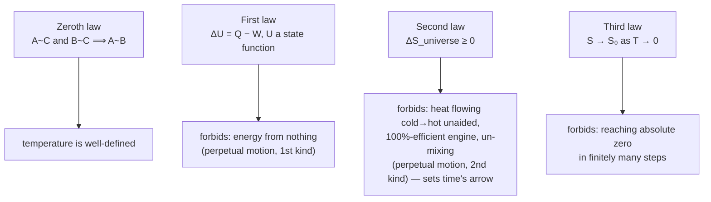

Drop an ice cube in warm water and it melts; the water cools. Every physical law you have met so far — Newton's, Maxwell's — would run just as happily *backwards*: a puddle spontaneously assembling an ice cube while the surrounding water heats up violates no conservation law, no force equation. Yet it never happens. Thermodynamics is the part of physics that explains why, and it does so by adding one quantity, entropy, whose changes are only allowed to point one way in time.

At heart it is an accounting system for energy — what forms it takes, how it moves between a system and its surroundings — with the extra rule about direction bolted on. Its four laws are often summarised as: there is a game (zeroth law), you can't win (first), you can't break even (second), you can't quit (third). This post states each, then works through the processes an ideal gas can undergo, their entropy and free-energy changes, and the Carnot cycle that ceilings every heat engine ever built or buildable.

**Sign conventions used throughout:** $Q > 0$ when heat flows *into* the system; $W > 0$ when work is done *by* the system on its surroundings (a gas expanding). With these, the first law reads $\Delta U = Q - W$.

## Zeroth law: temperature exists

If two systems are each in **thermal equilibrium** with a third, they are in thermal equilibrium with each other:
$$ A \leftrightarrow C \ \text{ and }\ B \leftrightarrow C \implies A \leftrightarrow B $$
It sounds trivial, but it licenses the whole idea of temperature: a thermometer (system $C$) that reads the same against the coffee and the soup guarantees they are at the same temperature without ever contacting each other. Temperature is the property all mutually-equilibrated systems share.

The **Kelvin** scale is the one used in every equation below: $T(\text{K}) = T(°\text{C}) + 273.15$, with $0$ K = absolute zero, where classical thermal motion would cease. (Celsius and Fahrenheit relate by $T(°\text{F}) = \tfrac{9}{5}T(°\text{C}) + 32$.)

## First law: energy is conserved

Energy transferred as heat plus energy transferred as work equals the change in a system's **internal energy** $U$ — the total microscopic kinetic and potential energy of its molecules. $U$ is a **state function**: it depends only on the current state (say $T$, $P$, $V$), not on the path taken to reach it. For an ideal gas it depends on temperature alone.
$$ \Delta U = Q - W \qquad (\text{differential form: } dU = dQ - dW) $$
Heat and work individually are *not* state functions — how much of each you use depends on the path — but their combination $\Delta U$ is fixed. No process, however cleverly arranged, returns to its starting state having produced net energy: no perpetual motion machine of the first kind.

## Second law: entropy never decreases

The first law permits many processes that never actually happen — a warm room spontaneously freezing an ice cube while heating itself, say. The second law rules them out, through **entropy** $S$, a measure of how many microscopic arrangements are consistent with a system's macroscopic state (equivalently, how spread-out its energy is).

It has several equivalent statements:

- **Clausius:** heat cannot flow from a colder body to a hotter one with no other effect.
- **Kelvin–Planck:** no cyclic device can take heat from a single reservoir and turn *all* of it into work. A 100%-efficient heat engine is impossible.
- **Entropy:** the total entropy of an isolated system (and of the universe) cannot decrease.

For a reversible cycle the **Clausius inequality** $\oint dQ/T \le 0$ becomes an equality, which is exactly what lets $dS = dQ_{\text{rev}}/T$ be a well-defined state function. For any real process,
$$ \Delta S_{\text{universe}} = \Delta S_{\text{system}} + \Delta S_{\text{surroundings}} \ge 0 $$
with equality only for a reversible (idealised) process and strict inequality for every spontaneous one. This asymmetry — future states have higher entropy than past ones — is the physical basis of the arrow of time.

## Third law: absolute zero is out of reach

As $T \to 0$, a system's entropy approaches a constant:
$$ \lim_{T \to 0}\,S(T) = S_0 $$
and for a perfect crystal $S_0 = 0$ (one microstate, zero disorder). A consequence: no finite sequence of steps can cool anything to exactly $0$ K. Each stage of a cooling scheme removes a smaller fraction of the remaining entropy, and the target recedes as you approach it.

## Processes of an ideal gas

A gas in a cylinder can change state along different paths. For each, the first law $\Delta U = Q - W$ plus $\Delta U = nC_v\,\Delta T$ (true for an ideal gas on *any* path, since $U$ depends only on $T$) fixes the energetics.

### Isothermal ($T$ constant)

The gas stays in contact with a reservoir. $\Delta U = 0$, so $Q = W$: all the heat absorbed comes back out as work. For a reversible expansion from $V_1$ to $V_2$, using $P = nRT/V$:
$$ W = \int_{V_1}^{V_2}\frac{nRT}{V}\,dV = nRT\ln\frac{V_2}{V_1} $$

### Isochoric ($V$ constant)

Rigid container, so $W = \int P\,dV = 0$ and $Q = \Delta U = nC_v\,\Delta T$. Every joule of heat goes into internal energy.

### Isobaric ($P$ constant)

Free piston. The gas does $W = P\,\Delta V$, and $Q = \Delta U + P\,\Delta V = nC_p\,\Delta T$. Comparing the two expressions for $Q$ and using $P\,\Delta V = nR\,\Delta T$ (from $PV = nRT$ at constant $P$) gives **Mayer's relation**:
$$ nC_p\,dT = nC_v\,dT + nR\,dT \implies C_p - C_v = R $$

### Adiabatic ($Q = 0$)

Perfectly insulated, or fast enough that no heat has time to move. Then $\Delta U = -W$: work done by the gas comes straight out of its internal energy, so it cools as it expands. For a reversible adiabatic process,
$$ PV^\gamma = \text{const}, \qquad TV^{\gamma-1} = \text{const}, \qquad P^{1-\gamma}T^\gamma = \text{const}, \qquad \gamma = \frac{C_p}{C_v} $$

*Deriving $PV^\gamma = \text{const}$:* start from $nC_v\,dT = -P\,dV$. Differentiate $PV = nRT$ to get $P\,dV + V\,dP = nR\,dT$, substitute for $dT$, and use $C_v + R = C_p$:
$$ C_p\,P\,dV + C_v\,V\,dP = 0 \implies \gamma\,\frac{dV}{V} + \frac{dP}{P} = 0 $$
Integrating gives $\ln(PV^\gamma) = \text{const}$. The work done by the gas is
$$ W = \int_{V_1}^{V_2}\frac{\text{const}}{V^\gamma}\,dV = \frac{P_2V_2 - P_1V_1}{1-\gamma} = \frac{nR(T_2 - T_1)}{1-\gamma} $$

### Cyclic and polytropic

In a **cyclic** process the system returns to its start, so $\Delta U_{\text{cycle}} = 0$ and $Q_{\text{cycle}} = W_{\text{cycle}}$ — the net heat absorbed equals the net work done, which is how an engine runs.

A **polytropic** process generalises all of the above as $PV^x = \text{const}$ for some index $x$ ($x = 0$ isobaric, $x = 1$ isothermal, $x = \gamma$ adiabatic, $x \to \infty$ isochoric). The work is $W = nR(T_2 - T_1)/(1-x)$, and the effective molar heat capacity is
$$ C_x = C_v + \frac{R}{1-x} $$

## Entropy changes

From $dS = dQ_{\text{rev}}/T$, integrate along any reversible path between the two states — the answer is path-independent because $S$ is a state function, so a convenient reversible path works even if the real process was irreversible.

- **Isothermal:** $\Delta S = \dfrac{Q_{\text{rev}}}{T} = nR\ln\dfrac{V_2}{V_1}$.
- **Isochoric:** $\Delta S = \displaystyle\int_{T_1}^{T_2}\frac{nC_v}{T}\,dT = nC_v\ln\dfrac{T_2}{T_1}$; since $T_2/T_1 = P_2/P_1$ at constant $V$, also $nC_v\ln(P_2/P_1)$.
- **Isobaric:** $\Delta S = nC_p\ln\dfrac{T_2}{T_1} = nC_p\ln\dfrac{V_2}{V_1}$.
- **Reversible adiabatic:** $dQ_{\text{rev}} = 0$, so $\Delta S = 0$ — a reversible adiabat is an **isentrope**.

For a general change of an ideal gas, splitting $dQ_{\text{rev}} = nC_v\,dT + (nRT/V)\,dV$:
$$ \Delta S = nC_v\ln\frac{T_2}{T_1} + nR\ln\frac{V_2}{V_1} = nC_p\ln\frac{T_2}{T_1} - nR\ln\frac{P_2}{P_1} $$

## Free energy: predicting spontaneity

$\Delta S_{\text{universe}} \ge 0$ is the true criterion for spontaneity, but tracking the surroundings' entropy is inconvenient. Two **thermodynamic potentials** repackage it in terms of the system alone, for the conditions chemistry usually cares about.

**Gibbs free energy**, for constant temperature *and* pressure, with enthalpy $H = U + PV$:
$$ G = H - TS, \qquad \Delta G = \Delta H - T\Delta S $$

- $\Delta G < 0$: spontaneous. $\Delta G > 0$: the reverse is spontaneous. $\Delta G = 0$: equilibrium.

For a reaction, $\Delta G° = -RT\ln K_{\text{eq}}$, which combined with $\Delta G° = \Delta H° - T\Delta S°$ gives the **van 't Hoff equation**,
$$ \ln K = -\frac{\Delta H°}{RT} + \frac{\Delta S°}{R} \implies \ln\frac{K_2}{K_1} = -\frac{\Delta H°}{R}\left(\frac{1}{T_2} - \frac{1}{T_1}\right) $$
(taking $\Delta H°$, $\Delta S°$ constant over the range) — the quantitative statement of how an equilibrium shifts with temperature.

**Helmholtz free energy**, for constant temperature and *volume*:
$$ A = U - TS, \qquad \Delta A = \Delta U - T\Delta S $$
Spontaneous when $\Delta A < 0$; $-\Delta A$ is the maximum work extractable from the system in a reversible isothermal process.

## Equipartition and heat capacities

The **equipartition theorem** (from statistical mechanics; the microscopic side is in [kinetic theory](/citadel/physics/kinetics)) gives average energy $\tfrac{1}{2}k_B T$ per molecule per quadratic degree of freedom. That fixes $U$, hence $C_v = (f/2)R$, $C_p = C_v + R$, and $\gamma$:

| Molecule | Degrees of freedom $f$ | $C_v$ | $C_p$ | $\gamma = C_p/C_v$ |
| :-- | :-- | :-- | :-- | :-- |
| Monatomic (He, Ar) | 3 translational | $\tfrac{3}{2}R$ | $\tfrac{5}{2}R$ | $5/3 \approx 1.67$ |
| Diatomic (O₂, N₂), moderate $T$ | 3 trans + 2 rotational | $\tfrac{5}{2}R$ | $\tfrac{7}{2}R$ | $7/5 = 1.40$ |
| Linear polyatomic (CO₂), moderate $T$ | 3 trans + 2 rot | $\tfrac{5}{2}R$ | $\tfrac{7}{2}R$ | $7/5 = 1.40$ |
| Non-linear polyatomic (H₂O), moderate $T$ | 3 trans + 3 rot | $3R$ | $4R$ | $4/3 \approx 1.33$ |
| Diatomic, high $T$ | + 2 vibrational | $\tfrac{7}{2}R$ | $\tfrac{9}{2}R$ | $9/7 \approx 1.29$ |

Vibrational modes contribute only above a threshold temperature — they are "frozen out" at low $T$ by quantum energy-level spacing, an early hint that classical statistical mechanics was incomplete.

## The Carnot cycle

Sadi Carnot's cycle is the most efficient possible exchange of heat and work between a hot reservoir at $T_H$ and a cold one at $T_L$. It is four reversible steps on an ideal gas:

 joined by two adiabats. Heat Q₁ enters along the hot isotherm, Q₂ leaves along the cold one, and the enclosed area is the net work per cycle. Source: Wikimedia Commons.")

1. **Isothermal expansion at $T_H$:** absorbs $Q_H = nRT_H\ln(V_2/V_1)$ from the hot reservoir, doing that much work.
2. **Adiabatic expansion:** temperature falls $T_H \to T_L$, work $W = nR(T_H - T_L)/(\gamma - 1)$ done by the gas, no heat exchanged.
3. **Isothermal compression at $T_L$:** the surroundings do work on the gas, which rejects $|Q_L| = nRT_L\ln(V_3/V_4)$ to the cold reservoir.
4. **Adiabatic compression:** work $nR(T_L - T_H)/(\gamma - 1)$ done on the gas, temperature rises $T_L \to T_H$, closing the cycle. The two adiabatic works cancel in the net.

Net work per cycle is $W_{\text{net}} = Q_H - |Q_L|$, and the **thermal efficiency** is
$$ \eta = \frac{W_{\text{net}}}{Q_H} = 1 - \frac{|Q_L|}{Q_H} $$
Applying $TV^{\gamma-1} = \text{const}$ to the two adiabatic steps shows $V_2/V_1 = V_3/V_4$, so the two logarithms cancel and $|Q_L|/Q_H = T_L/T_H$. Hence
$$ \boxed{\ \eta_{\text{Carnot}} = 1 - \frac{T_L}{T_H}\ } $$
No engine operating between $T_H$ and $T_L$ can beat this, whatever its working substance: a better one, run in reverse, would move heat from cold to hot with net work left over, violating the second law. A steam plant with $T_H \approx 800$ K, $T_L \approx 300$ K has $\eta_{\text{Carnot}} \approx 62\%$; real plants reach ~40%, the gap being the irreversibilities the ideal cycle assumes away.

## Where this reaches

The same laws run refrigerators and heat pumps (a Carnot cycle in reverse), fix the direction of every chemical reaction, and — through the entropy–information connection — link to the theory of computation and communication. Statistical mechanics supplies the microscopic derivation of all of it (entropy as $k_B \ln \Omega$, the count of microstates), and thermodynamics governs stellar structure, the cooling of the cosmic microwave background, and the long-term fate of the universe.

## The one idea to keep

The first law says you cannot create energy; the second says you cannot even convert it freely — heat spontaneously spreads out, never concentrates, and that one-way tendency (rising entropy) is the only thing in physics that distinguishes past from future. Every heat engine converts heat to work at an efficiency capped by $1 - T_L/T_H$, no matter its design or working fluid, because beating that cap would let you build a device that moves heat from cold to hot for free. Free energies ($G$ at constant $T,P$; $A$ at constant $T,V$) repackage "the entropy of the whole universe increased" into a test you can run on the system alone.
