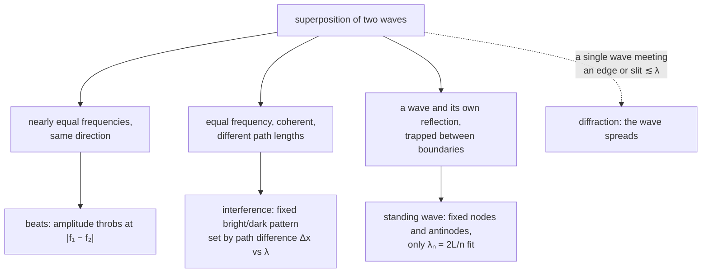
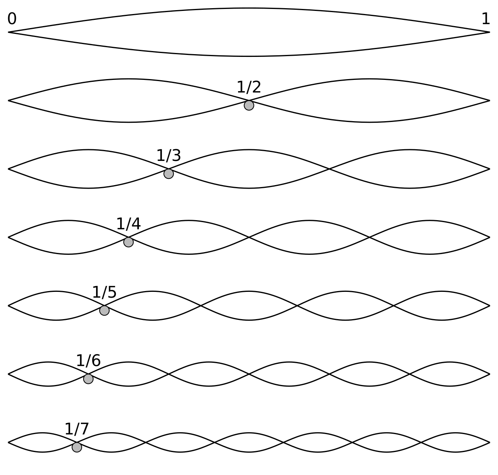

A wave carries energy and information across a room without carrying any matter across the room — the water bobs, the air molecules jiggle in place, but the disturbance travels. Two things about that are worth being surprised by. First, a single equation, the wave equation, describes a plucked string, a sound in air, light in vacuum, a seismic wave through rock, and a ripple on a pond — five media with nothing physically in common — and *any* shape that keeps its form while moving is a solution. Second, waves pass straight through each other: two sound waves crossing a room do not scatter or collide, they add where they overlap and emerge unchanged. Every phenomenon in the second half of this post — interference, beats, standing waves, diffraction — is that adding-up, applied to a specific pair of waves.

A **harmonic wave** is the clean case: each point of the medium runs through [simple harmonic motion](/citadel/physics/oscillations), with a phase that shifts steadily along the direction of travel. This post starts from the equation harmonic waves satisfy, works out the wave speed for strings and for sound, then covers what happens when waves overlap, reflect, are confined, or move relative to an observer.

## The harmonic wave and the wave equation

A harmonic wave is set by a few quantities: **amplitude** $A$ (maximum displacement), **wavelength** $\lambda$ (the distance between points in the same phase), **frequency** $f$ (cycles per second at a fixed point), **period** $T = 1/f$, and **wave speed** $v = \lambda f$ (how fast the pattern advances). A one-dimensional wave travelling in $+x$ is
$$ y(x, t) = A\sin(kx - \omega t + \phi) $$
with the **wave number** $k = 2\pi/\lambda$, the **angular frequency** $\omega = 2\pi f = 2\pi/T$, and a phase constant $\phi$. The combination $kx - \omega t$ is what makes it travel: hold the phase fixed and $x$ must grow as $t$ grows, at rate $v = \omega/k$.

Differentiating twice in space and twice in time,
$$ \frac{\partial^2 y}{\partial x^2} = -k^2 y, \qquad \frac{\partial^2 y}{\partial t^2} = -\omega^2 y $$
so their ratio is $k^2/\omega^2 = 1/v^2$, and
$$ \boxed{\;\frac{\partial^2 y}{\partial x^2} = \frac{1}{v^2}\frac{\partial^2 y}{\partial t^2}\;} $$
This is the **classical wave equation**. It is linear (so solutions add — the basis of superposition below) and it is satisfied not just by the sine above but by *any* function of the form $f(x - vt)$ or $f(x + vt)$ — any shape that moves rigidly at speed $v$. What sets $v$ is the physics of the medium.

## Wave speed on a string

For a transverse wave — particles oscillating perpendicular to the travel direction — on a string of tension $T$ and linear mass density $\mu$ (mass per length):
$$ v = \sqrt{\frac{T}{\mu}} $$
*Where it comes from:* take a short element $dx$ near the crest of a pulse, curved with radius $r$. The two tension vectors at its ends point slightly inward and their vertical components sum to $T\,(dx/r)$. That force provides the centripetal acceleration $v^2/r$ for the element's mass $\mu\,dx$:
$$ T\frac{dx}{r} = (\mu\,dx)\frac{v^2}{r} \implies T = \mu v^2 $$
Tighter string, faster wave; heavier string, slower — which is why a guitar's low strings are the thick ones.

### Energy and power on a string

Every element of the string is in SHM, so its average kinetic energy over a cycle is $\tfrac{1}{4}(\mu\,dx)A^2\omega^2$, and the average potential energy matches it. The total energy per unit length is
$$ \frac{dE}{dx} = \tfrac{1}{2}\mu A^2\omega^2 $$
and the power carried past a point is that energy density times the speed it moves at:
$$ P = \frac{dE}{dx}\,v = \tfrac{1}{2}\mu\,\omega^2 A^2 v $$
Power scales with the *square* of both amplitude and frequency. For a wave spreading through three dimensions, the analogous quantity is **intensity** (power per unit area), $I = \tfrac{1}{2}\rho v\,\omega^2 A^2$ with $\rho$ the volume density.

## Wave speed of sound

A longitudinal wave — particles oscillating along the travel direction, making compressions and rarefactions — travels through a fluid at
$$ v = \sqrt{\frac{B}{\rho}} $$
where $B$ is the bulk modulus (resistance to compression) and $\rho$ the density.

*Where it comes from:* for a fluid element of area $S$, thickness $dx$, displacement $u(x,t)$, Newton's second law reads $S\,dP = (\rho S\,dx)\,\partial^2 u/\partial t^2$, i.e. $\partial P/\partial x = \rho\,\partial^2 u/\partial t^2$. The bulk modulus links the pressure change to the strain, $dP = -B\,\partial u/\partial x$, so $\partial P/\partial x = -B\,\partial^2 u/\partial x^2$. Equating:
$$ \frac{\partial^2 u}{\partial x^2} = \frac{\rho}{B}\frac{\partial^2 u}{\partial t^2} \implies v^2 = \frac{B}{\rho} $$

For a **gas**, the compressions in a sound wave happen too fast to exchange heat, so the process is adiabatic and $B = \gamma P$ with $\gamma = C_p/C_v$ the adiabatic index. Then
$$ v = \sqrt{\frac{\gamma P}{\rho}} = \sqrt{\frac{\gamma R T}{M_w}} $$
using $P/\rho = RT/M_w$ from the ideal gas law ($M_w$ = molar mass). Two consequences: the speed of sound depends on temperature (as $\sqrt{T}$) but *not* on pressure, and for air at 20 °C it works out to about 343 m/s.

**Pressure amplitude.** With displacement $s(x,t) = s_m\cos(kx - \omega t)$, the pressure variation is $\Delta P = -B\,\partial s/\partial x = Bk\,s_m\sin(kx - \omega t)$, so the pressure amplitude is
$$ P_0 = Bk\,s_m = \rho v\omega\,s_m $$
a quarter-cycle out of step with the displacement (pressure peaks where displacement is zero). The intensity in terms of either amplitude:
$$ I = \tfrac{1}{2}\rho v\,\omega^2 s_m^2 = \frac{P_0^2}{2\rho v} $$

## Superposition

Because the wave equation is linear, when two waves occupy the same place the total displacement is just the sum of what each would produce alone:
$$ y_{\text{total}}(x, t) = \sum_i y_i(x, t) $$
The waves pass through each other unchanged. Everything in the rest of this post is superposition applied to a particular pair of waves, sorted by *what* the two waves are:

## Reflection

At a boundary between two media, part of a wave reflects. For rays meeting a flat surface, the **law of reflection** holds: the angle of incidence equals the angle of reflection, and incident ray, reflected ray, and surface normal lie in one plane.

Whether the reflection flips the wave depends on the boundary:

- **String, fixed end** (attached to something heavier): the reflected pulse is inverted — a $\pi$ phase shift. **Free end** (attached to something lighter): no inversion.
- **Sound, rigid wall**: the displacement inverts (a displacement node, forced by the wall), but the pressure does not (a pressure antinode). **Open end of a pipe**: the reverse — displacement antinode, pressure node.

The rule of thumb: reflecting off the "denser" side flips the wave; off the "rarer" side it doesn't.

## Interference

When two **coherent** waves (a fixed phase relationship, usually from one source split in two) meet, their phase difference at a point decides the outcome. If they reach the point by paths differing in length by $\Delta x$, that is a phase difference $\Delta\phi = k\,\Delta x = (2\pi/\lambda)\,\Delta x$. Adding the two sinusoids (phasor addition, exactly as for two SHMs along the same line) gives a resultant amplitude between $|A_1 - A_2|$ and $A_1 + A_2$, and the intensity goes as its square.

- **Constructive** — crest on crest — when $\Delta\phi$ is a multiple of $2\pi$, i.e.
$$ \Delta x = m\lambda \qquad (m = 0, 1, 2, \dots) $$
- **Destructive** — crest on trough — when $\Delta\phi$ is an odd multiple of $\pi$, i.e.
$$ \Delta x = \left(m + \tfrac{1}{2}\right)\lambda $$

### Interference of light

Light interferes too, and the standard framework is **Huygens' principle**: every point of a wavefront acts as a source of secondary spherical wavelets, and the next wavefront is their envelope. To see steady light fringes you need coherent sources (constant phase difference, so split one source), near-monochromatic light (one wavelength), matched polarization, comparable amplitudes (for contrast), and small enough source separation with a far enough screen (for resolvable fringes).

Two ways to make the coherent pair:

- **Division of wavefront** — split the wavefront in space and send the halves by different paths: Young's double slit, the Fresnel biprism, Lloyd's mirror.
- **Division of amplitude** — split the wave at a partial reflection: thin films (soap bubbles, oil on water), Newton's rings, the Michelson interferometer.

These setups and their fringe formulae are worked in [wave optics](/citadel/physics/wave-optics).

## Beats

Two waves of nearly equal frequencies $f_1$ and $f_2$ superpose to a tone at the average frequency whose amplitude swells and fades at the **beat frequency**
$$ f_{\text{beat}} = |f_1 - f_2| $$
Musicians tune by ear to this: adjust a string until the beats against a reference slow to a stop.

## Diffraction

**Diffraction** is the spreading of a wave as it passes an edge or an opening. It matters when the aperture or obstacle is comparable to $\lambda$ or smaller — which is why sound (wavelengths of metres) bends around a doorway easily and light (sub-micron) does not, noticeably.

- **Fraunhofer** diffraction is the far-field case: source and screen effectively at infinity (parallel light in, a lens to focus the pattern), plane wavefronts, a clean pattern. **Fresnel** diffraction is the near-field case, with curved wavefronts and a more complex pattern.
- **Single slit** (Fraunhofer), width $a$: a broad bright central maximum with weaker maxima either side. The **minima** sit at
$$ a\sin\theta = m\lambda \qquad (m = \pm 1, \pm 2, \dots) $$
and the full intensity profile is
$$ I(\theta) = I_0\left(\frac{\sin\alpha}{\alpha}\right)^2, \qquad \alpha = \frac{\pi a\sin\theta}{\lambda} $$

## Polarization

For a transverse wave — light is the important case, an electromagnetic wave with $\vec{E}$ perpendicular to the travel direction — **polarization** is the orientation of that transverse oscillation. Write the two transverse components as
$$ \vec{E}(z, t) = E_{0x}\cos(kz - \omega t + \phi_x)\,\hat{i} + E_{0y}\cos(kz - \omega t + \phi_y)\,\hat{j} $$
and let $\delta = \phi_y - \phi_x$ be the relative phase.

- **Linear**: $\delta = 0$ or $\pi$ (or one component zero) — $\vec{E}$ stays on one line. A polarizer (Polaroid film) turns unpolarized light, whose $\vec{E}$ points every which way, into linear.
- **Circular**: equal amplitudes and $\delta = \pm\pi/2$ — the tip of $\vec{E}$ traces a circle, handed left or right by the sign.
- **Elliptical**: the general case, tracing an ellipse.

Polarized sunglasses, LCD screens, and 3D-cinema glasses all exploit this.

## Standing waves

Confine a wave — a string clamped at both ends, air in a pipe — and it reflects back and forth; the forward and returning waves interfere into a **standing wave**, a fixed pattern of **nodes** (permanently still) and **antinodes** (maximum swing) that does not travel. The boundary conditions quantise which wavelengths fit.

- **String fixed at both ends** (nodes at each end), length $L$:
$$ \lambda_n = \frac{2L}{n}, \qquad f_n = \frac{nv}{2L} = n f_1 \qquad (n = 1, 2, 3, \dots) $$
all integer harmonics of the fundamental $f_1$.

- **Pipe open at both ends** (antinodes at each end): same as the string, $f_n = nv/2L$, all harmonics present.
- **Pipe closed at one end** (node at the closed end, antinode at the open end):
$$ \lambda_n = \frac{4L}{2n - 1}, \qquad f_n = \frac{(2n-1)v}{4L} = (2n-1)f_1 $$
only the *odd* harmonics — which is a large part of why a clarinet (closed-pipe-like) sounds different from a flute (open-pipe-like).

**Resonance** is driving such a system at one of its $f_n$; the amplitude then builds far above what an off-resonance drive of the same strength would give.

## Doppler effect

When source and observer move relative to each other, the observed frequency shifts — a siren rises in pitch approaching and drops receding. For sound, with $v$ the speed of sound, $v_o$ the observer's speed and $v_s$ the source's:
$$ f' = f\left(\frac{v \pm v_o}{v \mp v_s}\right) $$
Top signs for motion *toward*: use $+v_o$ if the observer moves toward the source, $-v_s$ if the source moves toward the observer (and the opposite signs for moving apart).

Light shows a Doppler shift too, but its formula is set by special relativity rather than by motion through a medium — see [special relativity](/citadel/physics/relative-mech). The astronomical version, redshift and blueshift, is how we measure the motion of stars and the expansion of the universe.

## Where the clean wave picture bends

The harmonic-wave results above assume a linear, non-dispersive medium. Real media break both assumptions.

- **Dispersion.** In most media the wave speed depends on frequency, $v = v(\omega)$. A pulse is a superposition of many frequencies, so its components travel at different speeds and it *spreads out* as it goes — which is why a lightning flash miles away arrives as a long rumble, and why optical fibres limit their data rate. When $v$ depends on $\omega$, two speeds matter: the **phase velocity** $v_p = \omega/k$ of a single crest, and the **group velocity** $v_g = d\omega/dk$ of the pulse envelope and the energy. They are equal only in a non-dispersive medium.
- **Nonlinearity.** If the medium's response is not proportional to the disturbance (large-amplitude sound, water waves as they shoal), superposition fails: crests travel faster than troughs, the wave steepens, and it can break into a **shock** (a sonic boom, a hydraulic jump). In a few special systems the steepening exactly balances the dispersion and a **soliton** results — a lone pulse that propagates without changing shape, seen in canals, optical fibres, and plasma.
- **Amplitude limits.** A "wave that carries no matter" is the small-amplitude idealisation. Real water waves carry a slow net drift (Stokes drift); real sound in a tube pushes a steady streaming flow.
- **No medium needed.** Every mechanical result here needs a medium with inertia and restoring stiffness. Light needs neither — the [electromagnetic field itself](/citadel/physics/electromag) is the thing that oscillates — which is exactly the puzzle that killed the luminiferous aether and led to special relativity.

## The one idea to keep

One linear equation, $\partial_x^2 y = v^{-2}\,\partial_t^2 y$, governs every small-amplitude wave, with $v$ set by the medium's stiffness over its inertia ($\sqrt{T/\mu}$, $\sqrt{B/\rho}$). Because it is linear, waves superpose and pass through each other untouched, and interference, beats, standing waves, and diffraction are all that superposition seen in different setups. The idealisation fails where the medium is dispersive (pulses spread, phase and group velocity split) or nonlinear (waves steepen into shocks, or balance into solitons).
